# [📈 Live Status](https://searx-instances.tiekoetter.com): <!--live status--> **🟧 Partial outage**

This repository contains the open-source uptime monitor and status page for [Tiekötter.com](https://www.tiekoetter.com), powered by [Upptime](https://github.com/upptime/upptime).

With [Upptime](https://upptime.js.org), you can get your own unlimited and free uptime monitor and status page, powered entirely by a GitHub repository. We use [Issues](https://github.com/tiekoettercom/searx-instances-uptime/issues) as incident reports, [Actions](https://github.com/tiekoettercom/searx-instances-uptime/actions) as uptime monitors, and [Pages](https://searx-instances.tiekoetter.com) for the status page.

<!--start: status pages-->
<!-- This summary is generated by Upptime (https://github.com/upptime/upptime) -->
<!-- Do not edit this manually, your changes will be overwritten -->
<!-- prettier-ignore -->
| URL | Status | History | Response Time | Uptime |
| --- | ------ | ------- | ------------- | ------ |
|  [searx.tiekoetter.com](https://searx.tiekoetter.com/) | 🟩 Up | [searx-tiekoetter-com.yml](https://github.com/tiekoettercom/searx-instances-uptime/commits/HEAD/history/searx-tiekoetter-com.yml) | 

 746ms
     
 | 

<a href="https://searx-instances.tiekoetter.com/history/searx-tiekoetter-com">99.95%</a>
    

|  [darmarit.org/searx](https://darmarit.org/searx/) | 🟩 Up | [darmarit-org-searx.yml](https://github.com/tiekoettercom/searx-instances-uptime/commits/HEAD/history/darmarit-org-searx.yml) | 

 740ms
     
 | 

<a href="https://searx-instances.tiekoetter.com/history/darmarit-org-searx">100.00%</a>
    

|  [paulgo.io](https://paulgo.io/) | 🟩 Up | [paulgo-io.yml](https://github.com/tiekoettercom/searx-instances-uptime/commits/HEAD/history/paulgo-io.yml) | 

 597ms
     
 | 

<a href="https://searx-instances.tiekoetter.com/history/paulgo-io">100.00%</a>
    

|  [searx.be](https://searx.be/) | 🟩 Up | [searx-be.yml](https://github.com/tiekoettercom/searx-instances-uptime/commits/HEAD/history/searx-be.yml) | 

 775ms
     
 | 

<a href="https://searx-instances.tiekoetter.com/history/searx-be">100.00%</a>
    

|  [anon.sx](https://anon.sx/) | 🟩 Up | [anon-sx.yml](https://github.com/tiekoettercom/searx-instances-uptime/commits/HEAD/history/anon-sx.yml) | 

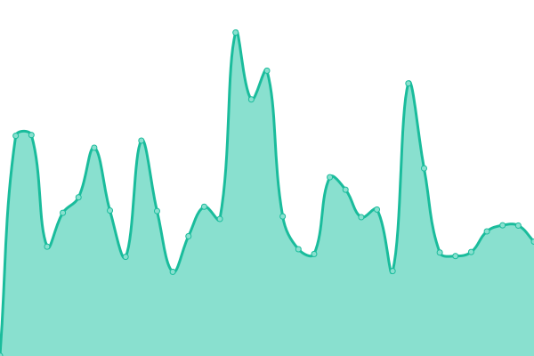 548ms
     
 | 

<a href="https://searx-instances.tiekoetter.com/history/anon-sx">100.00%</a>
    

|  [de.xcxc.ml](https://de.xcxc.ml/) | 🟩 Up | [de-xcxc-ml.yml](https://github.com/tiekoettercom/searx-instances-uptime/commits/HEAD/history/de-xcxc-ml.yml) | 

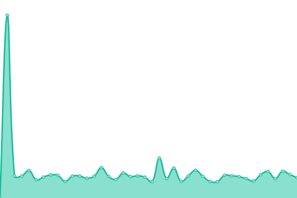 730ms
     
 | 

<a href="https://searx-instances.tiekoetter.com/history/de-xcxc-ml">100.00%</a>
    

|  [dynabyte.ca](https://dynabyte.ca/) | 🟩 Up | [dynabyte-ca.yml](https://github.com/tiekoettercom/searx-instances-uptime/commits/HEAD/history/dynabyte-ca.yml) | 

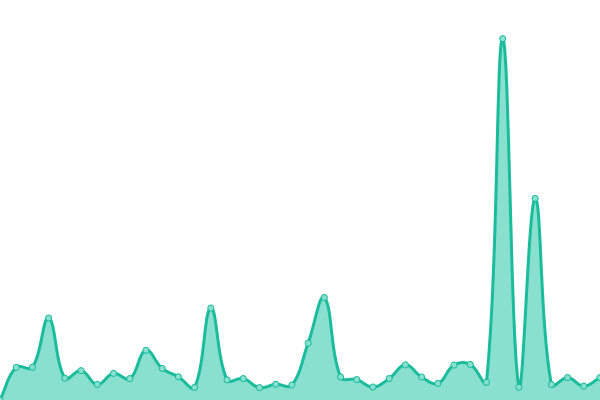 587ms
     
 | 

<a href="https://searx-instances.tiekoetter.com/history/dynabyte-ca">99.95%</a>
    

|  [etsi.me](https://etsi.me/) | 🟩 Up | [etsi-me.yml](https://github.com/tiekoettercom/searx-instances-uptime/commits/HEAD/history/etsi-me.yml) | 

 306ms
     
 | 

<a href="https://searx-instances.tiekoetter.com/history/etsi-me">100.00%</a>
    

|  [icanfindit.online](https://icanfindit.online/) | 🟩 Up | [icanfindit-online.yml](https://github.com/tiekoettercom/searx-instances-uptime/commits/HEAD/history/icanfindit-online.yml) | 

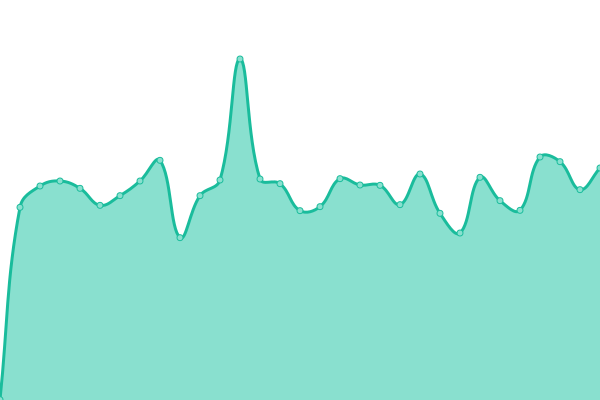 191ms
     
 | 

<a href="https://searx-instances.tiekoetter.com/history/icanfindit-online">99.39%</a>
    

|  [jsearch.pw](https://jsearch.pw/) | 🟩 Up | [jsearch-pw.yml](https://github.com/tiekoettercom/searx-instances-uptime/commits/HEAD/history/jsearch-pw.yml) | 

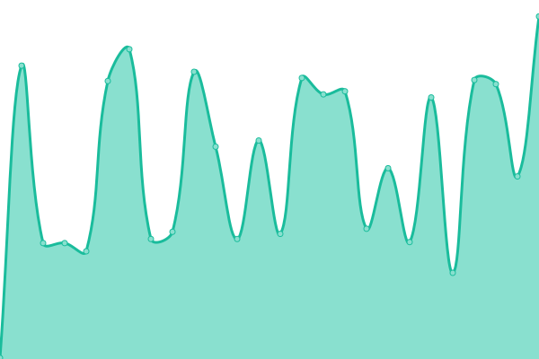 196ms
     
 | 

<a href="https://searx-instances.tiekoetter.com/history/jsearch-pw">100.00%</a>
    

|  [northboot.xyz](https://northboot.xyz/) | 🟩 Up | [northboot-xyz.yml](https://github.com/tiekoettercom/searx-instances-uptime/commits/HEAD/history/northboot-xyz.yml) | 

 700ms
     
 | 

<a href="https://searx-instances.tiekoetter.com/history/northboot-xyz">99.96%</a>
    

|  [notgoogle.win](https://notgoogle.win/) | 🟥 Down | [notgoogle-win.yml](https://github.com/tiekoettercom/searx-instances-uptime/commits/HEAD/history/notgoogle-win.yml) | 

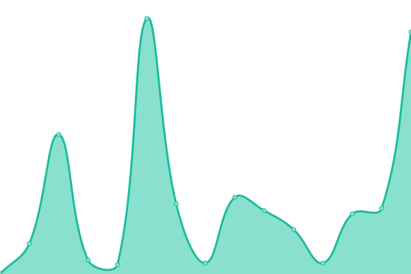 233ms
     
 | 

<a href="https://searx-instances.tiekoetter.com/history/notgoogle-win">98.95%</a>
    

|  [opnxng.com](https://opnxng.com/) | 🟩 Up | [opnxng-com.yml](https://github.com/tiekoettercom/searx-instances-uptime/commits/HEAD/history/opnxng-com.yml) | 

 614ms
     
 | 

<a href="https://searx-instances.tiekoetter.com/history/opnxng-com">95.76%</a>
    

|  [private-searx.ml](https://private-searx.ml/) | 🟩 Up | [private-searx-ml.yml](https://github.com/tiekoettercom/searx-instances-uptime/commits/HEAD/history/private-searx-ml.yml) | 

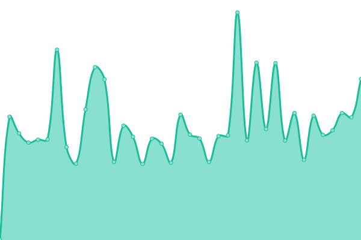 479ms
     
 | 

<a href="https://searx-instances.tiekoetter.com/history/private-searx-ml">100.00%</a>
    

|  [privatus.live](https://privatus.live/) | 🟩 Up | [privatus-live.yml](https://github.com/tiekoettercom/searx-instances-uptime/commits/HEAD/history/privatus-live.yml) | 

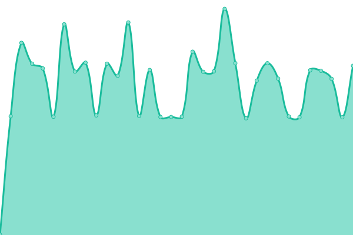 629ms
     
 | 

<a href="https://searx-instances.tiekoetter.com/history/privatus-live">99.72%</a>
    

|  [s.frlt.one](https://s.frlt.one/) | 🟩 Up | [s-frlt-one.yml](https://github.com/tiekoettercom/searx-instances-uptime/commits/HEAD/history/s-frlt-one.yml) | 

 713ms
     
 | 

<a href="https://searx-instances.tiekoetter.com/history/s-frlt-one">99.92%</a>
    

|  [s.zhaocloud.net](https://s.zhaocloud.net/) | 🟩 Up | [s-zhaocloud-net.yml](https://github.com/tiekoettercom/searx-instances-uptime/commits/HEAD/history/s-zhaocloud-net.yml) | 

 739ms
     
 | 

<a href="https://searx-instances.tiekoetter.com/history/s-zhaocloud-net">100.00%</a>
    

|  [search.ashs.club](https://search.ashs.club/) | 🟩 Up | [search-ashs-club.yml](https://github.com/tiekoettercom/searx-instances-uptime/commits/HEAD/history/search-ashs-club.yml) | 

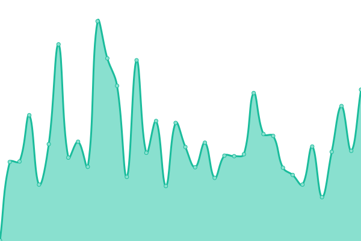 182ms
     
 | 

<a href="https://searx-instances.tiekoetter.com/history/search-ashs-club">100.00%</a>
    

|  [search.bingowaves.xyz](https://search.bingowaves.xyz/) | 🟩 Up | [search-bingowaves-xyz.yml](https://github.com/tiekoettercom/searx-instances-uptime/commits/HEAD/history/search-bingowaves-xyz.yml) | 

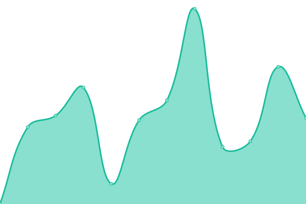 460ms
     
 | 

<a href="https://searx-instances.tiekoetter.com/history/search-bingowaves-xyz">100.00%</a>
    

|  [search.bus-hit.me](https://search.bus-hit.me/) | 🟩 Up | [search-bus-hit-me.yml](https://github.com/tiekoettercom/searx-instances-uptime/commits/HEAD/history/search-bus-hit-me.yml) | 

 296ms
     
 | 

<a href="https://searx-instances.tiekoetter.com/history/search-bus-hit-me">100.00%</a>
    

|  [search.chemicals-in-the-water.eu](https://search.chemicals-in-the-water.eu/) | 🟩 Up | [search-chemicals-in-the-water-eu.yml](https://github.com/tiekoettercom/searx-instances-uptime/commits/HEAD/history/search-chemicals-in-the-water-eu.yml) | 

 880ms
     
 | 

<a href="https://searx-instances.tiekoetter.com/history/search-chemicals-in-the-water-eu">99.80%</a>
    

|  [search.disroot.org](https://search.disroot.org/) | 🟩 Up | [search-disroot-org.yml](https://github.com/tiekoettercom/searx-instances-uptime/commits/HEAD/history/search-disroot-org.yml) | 

 846ms
     
 | 

<a href="https://searx-instances.tiekoetter.com/history/search-disroot-org">100.00%</a>
    

|  [search.ethibox.fr](https://search.ethibox.fr/) | 🟩 Up | [search-ethibox-fr.yml](https://github.com/tiekoettercom/searx-instances-uptime/commits/HEAD/history/search-ethibox-fr.yml) | 

 857ms
     
 | 

<a href="https://searx-instances.tiekoetter.com/history/search-ethibox-fr">100.00%</a>
    

|  [search.gcomm.ch](https://search.gcomm.ch/) | 🟩 Up | [search-gcomm-ch.yml](https://github.com/tiekoettercom/searx-instances-uptime/commits/HEAD/history/search-gcomm-ch.yml) | 

 526ms
     
 | 

<a href="https://searx-instances.tiekoetter.com/history/search-gcomm-ch">98.84%</a>
    

|  [search.kiwitalk.de](https://search.kiwitalk.de/) | 🟩 Up | [search-kiwitalk-de.yml](https://github.com/tiekoettercom/searx-instances-uptime/commits/HEAD/history/search-kiwitalk-de.yml) | 

 734ms
     
 | 

<a href="https://searx-instances.tiekoetter.com/history/search-kiwitalk-de">99.95%</a>
    

|  [search.mdosch.de](https://search.mdosch.de/) | 🟩 Up | [search-mdosch-de.yml](https://github.com/tiekoettercom/searx-instances-uptime/commits/HEAD/history/search-mdosch-de.yml) | 

 608ms
     
 | 

<a href="https://searx-instances.tiekoetter.com/history/search-mdosch-de">99.95%</a>
    

|  [search.neet.works](https://search.neet.works/) | 🟩 Up | [search-neet-works.yml](https://github.com/tiekoettercom/searx-instances-uptime/commits/HEAD/history/search-neet-works.yml) | 

 449ms
     
 | 

<a href="https://searx-instances.tiekoetter.com/history/search-neet-works">98.88%</a>
    

|  [search.ononoki.org](https://search.ononoki.org/) | 🟩 Up | [search-ononoki-org.yml](https://github.com/tiekoettercom/searx-instances-uptime/commits/HEAD/history/search-ononoki-org.yml) | 

 366ms
     
 | 

<a href="https://searx-instances.tiekoetter.com/history/search-ononoki-org">100.00%</a>
    

|  [search.privacyguides.net](https://search.privacyguides.net/) | 🟩 Up | [search-privacyguides-net.yml](https://github.com/tiekoettercom/searx-instances-uptime/commits/HEAD/history/search-privacyguides-net.yml) | 

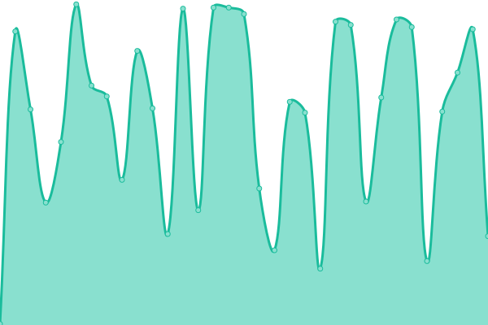 157ms
     
 | 

<a href="https://searx-instances.tiekoetter.com/history/search-privacyguides-net">100.00%</a>
    

|  [search.rabbit-company.com](https://search.rabbit-company.com/) | 🟩 Up | [search-rabbit-company-com.yml](https://github.com/tiekoettercom/searx-instances-uptime/commits/HEAD/history/search-rabbit-company-com.yml) | 

 415ms
     
 | 

<a href="https://searx-instances.tiekoetter.com/history/search-rabbit-company-com">100.00%</a>
    

|  [search.sapti.me](https://search.sapti.me/) | 🟩 Up | [search-sapti-me.yml](https://github.com/tiekoettercom/searx-instances-uptime/commits/HEAD/history/search-sapti-me.yml) | 

 612ms
     
 | 

<a href="https://searx-instances.tiekoetter.com/history/search-sapti-me">97.14%</a>
    

|  [search.snopyta.org](https://search.snopyta.org/) | 🟩 Up | [search-snopyta-org.yml](https://github.com/tiekoettercom/searx-instances-uptime/commits/HEAD/history/search-snopyta-org.yml) | 

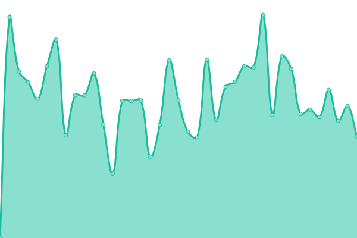 796ms
     
 | 

<a href="https://searx-instances.tiekoetter.com/history/search-snopyta-org">100.00%</a>
    

|  [search.stinpriza.org](https://search.stinpriza.org/) | 🟩 Up | [search-stinpriza-org.yml](https://github.com/tiekoettercom/searx-instances-uptime/commits/HEAD/history/search-stinpriza-org.yml) | 

 1082ms
     
 | 

<a href="https://searx-instances.tiekoetter.com/history/search-stinpriza-org">100.00%</a>
    

|  [search.teamriverbubbles.com](https://search.teamriverbubbles.com/) | 🟩 Up | [search-teamriverbubbles-com.yml](https://github.com/tiekoettercom/searx-instances-uptime/commits/HEAD/history/search-teamriverbubbles-com.yml) | 

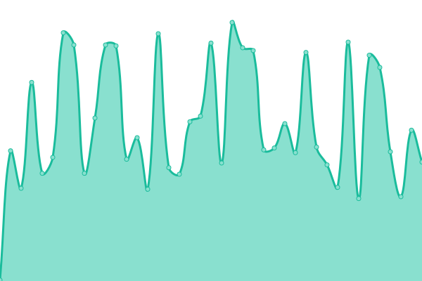 150ms
     
 | 

<a href="https://searx-instances.tiekoetter.com/history/search-teamriverbubbles-com">100.00%</a>
    

|  [search.trom.tf](https://search.trom.tf/) | 🟩 Up | [search-trom-tf.yml](https://github.com/tiekoettercom/searx-instances-uptime/commits/HEAD/history/search-trom-tf.yml) | 

 694ms
     
 | 

<a href="https://searx-instances.tiekoetter.com/history/search-trom-tf">100.00%</a>
    

|  [search.unlocked.link](https://search.unlocked.link/) | 🟩 Up | [search-unlocked-link.yml](https://github.com/tiekoettercom/searx-instances-uptime/commits/HEAD/history/search-unlocked-link.yml) | 

 630ms
     
 | 

<a href="https://searx-instances.tiekoetter.com/history/search-unlocked-link">99.61%</a>
    

|  [search.vojkovic.xyz](https://search.vojkovic.xyz/) | 🟩 Up | [search-vojkovic-xyz.yml](https://github.com/tiekoettercom/searx-instances-uptime/commits/HEAD/history/search-vojkovic-xyz.yml) | 

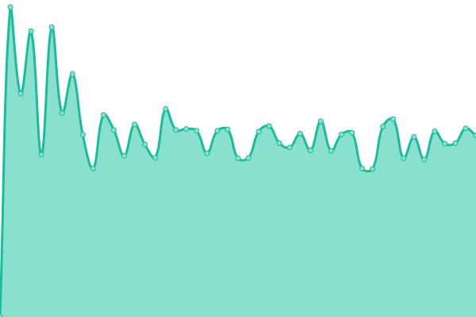 661ms
     
 | 

<a href="https://searx-instances.tiekoetter.com/history/search-vojkovic-xyz">99.95%</a>
    

|  [search.zzls.xyz](https://search.zzls.xyz/) | 🟩 Up | [search-zzls-xyz.yml](https://github.com/tiekoettercom/searx-instances-uptime/commits/HEAD/history/search-zzls-xyz.yml) | 

 1391ms
     
 | 

<a href="https://searx-instances.tiekoetter.com/history/search-zzls-xyz">99.56%</a>
    

|  [searx.becomesovran.com](https://searx.becomesovran.com/) | 🟩 Up | [searx-becomesovran-com.yml](https://github.com/tiekoettercom/searx-instances-uptime/commits/HEAD/history/searx-becomesovran-com.yml) | 

 284ms
     
 | 

<a href="https://searx-instances.tiekoetter.com/history/searx-becomesovran-com">100.00%</a>
    

|  [searx.bissisoft.com](https://searx.bissisoft.com/) | 🟩 Up | [searx-bissisoft-com.yml](https://github.com/tiekoettercom/searx-instances-uptime/commits/HEAD/history/searx-bissisoft-com.yml) | 

 582ms
     
 | 

<a href="https://searx-instances.tiekoetter.com/history/searx-bissisoft-com">100.00%</a>
    

|  [searx.chocoflan.net](https://searx.chocoflan.net/) | 🟩 Up | [searx-chocoflan-net.yml](https://github.com/tiekoettercom/searx-instances-uptime/commits/HEAD/history/searx-chocoflan-net.yml) | 

 893ms
     
 | 

<a href="https://searx-instances.tiekoetter.com/history/searx-chocoflan-net">97.56%</a>
    

|  [searx.divided-by-zero.eu](https://searx.divided-by-zero.eu/) | 🟩 Up | [searx-divided-by-zero-eu.yml](https://github.com/tiekoettercom/searx-instances-uptime/commits/HEAD/history/searx-divided-by-zero-eu.yml) | 

 712ms
     
 | 

<a href="https://searx-instances.tiekoetter.com/history/searx-divided-by-zero-eu">100.00%</a>
    

|  [searx.dresden.network](https://searx.dresden.network/) | 🟩 Up | [searx-dresden-network.yml](https://github.com/tiekoettercom/searx-instances-uptime/commits/HEAD/history/searx-dresden-network.yml) | 

 783ms
     
 | 

<a href="https://searx-instances.tiekoetter.com/history/searx-dresden-network">99.95%</a>
    

|  [searx.ebnar.xyz](https://searx.ebnar.xyz/) | 🟩 Up | [searx-ebnar-xyz.yml](https://github.com/tiekoettercom/searx-instances-uptime/commits/HEAD/history/searx-ebnar-xyz.yml) | 

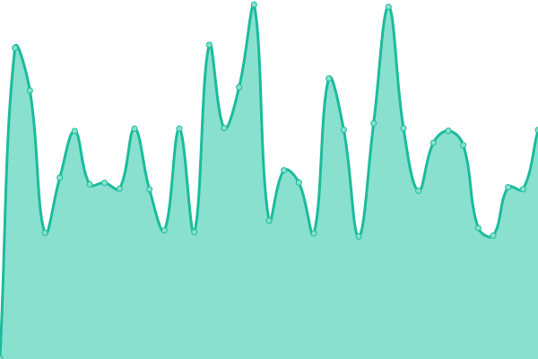 593ms
     
 | 

<a href="https://searx-instances.tiekoetter.com/history/searx-ebnar-xyz">99.95%</a>
    

|  [searx.ericaftereric.top](https://searx.ericaftereric.top/) | 🟩 Up | [searx-ericaftereric-top.yml](https://github.com/tiekoettercom/searx-instances-uptime/commits/HEAD/history/searx-ericaftereric-top.yml) | 

 843ms
     
 | 

<a href="https://searx-instances.tiekoetter.com/history/searx-ericaftereric-top">100.00%</a>
    

|  [searx.esmailelbob.xyz](https://searx.esmailelbob.xyz/) | 🟩 Up | [searx-esmailelbob-xyz.yml](https://github.com/tiekoettercom/searx-instances-uptime/commits/HEAD/history/searx-esmailelbob-xyz.yml) | 

 329ms
     
 | 

<a href="https://searx-instances.tiekoetter.com/history/searx-esmailelbob-xyz">100.00%</a>
    

|  [searx.fi](https://searx.fi/) | 🟩 Up | [searx-fi.yml](https://github.com/tiekoettercom/searx-instances-uptime/commits/HEAD/history/searx-fi.yml) | 

 697ms
     
 | 

<a href="https://searx-instances.tiekoetter.com/history/searx-fi">100.00%</a>
    

|  [searx.fmac.xyz](https://searx.fmac.xyz/) | 🟩 Up | [searx-fmac-xyz.yml](https://github.com/tiekoettercom/searx-instances-uptime/commits/HEAD/history/searx-fmac-xyz.yml) | 

 597ms
     
 | 

<a href="https://searx-instances.tiekoetter.com/history/searx-fmac-xyz">99.82%</a>
    

|  [searx.fossencdi.org](https://searx.fossencdi.org/) | 🟩 Up | [searx-fossencdi-org.yml](https://github.com/tiekoettercom/searx-instances-uptime/commits/HEAD/history/searx-fossencdi-org.yml) | 

 697ms
     
 | 

<a href="https://searx-instances.tiekoetter.com/history/searx-fossencdi-org">99.95%</a>
    

|  [searx.gnous.eu](https://searx.gnous.eu/) | 🟩 Up | [searx-gnous-eu.yml](https://github.com/tiekoettercom/searx-instances-uptime/commits/HEAD/history/searx-gnous-eu.yml) | 

 794ms
     
 | 

<a href="https://searx-instances.tiekoetter.com/history/searx-gnous-eu">100.00%</a>
    

|  [searx.gnu.style](https://searx.gnu.style/) | 🟩 Up | [searx-gnu-style.yml](https://github.com/tiekoettercom/searx-instances-uptime/commits/HEAD/history/searx-gnu-style.yml) | 

 907ms
     
 | 

<a href="https://searx-instances.tiekoetter.com/history/searx-gnu-style">100.00%</a>
    

|  [searx.kujonello.cf](https://searx.kujonello.cf/) | 🟩 Up | [searx-kujonello-cf.yml](https://github.com/tiekoettercom/searx-instances-uptime/commits/HEAD/history/searx-kujonello-cf.yml) | 

 1411ms
     
 | 

<a href="https://searx-instances.tiekoetter.com/history/searx-kujonello-cf">96.65%</a>
    

|  [searx.loafland.xyz](https://searx.loafland.xyz/) | 🟩 Up | [searx-loafland-xyz.yml](https://github.com/tiekoettercom/searx-instances-uptime/commits/HEAD/history/searx-loafland-xyz.yml) | 

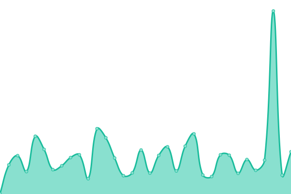 152ms
     
 | 

<a href="https://searx-instances.tiekoetter.com/history/searx-loafland-xyz">100.00%</a>
    

|  [searx.mastodontech.de](https://searx.mastodontech.de/) | 🟩 Up | [searx-mastodontech-de.yml](https://github.com/tiekoettercom/searx-instances-uptime/commits/HEAD/history/searx-mastodontech-de.yml) | 

 835ms
     
 | 

<a href="https://searx-instances.tiekoetter.com/history/searx-mastodontech-de">100.00%</a>
    

|  [searx.mha.fi](https://searx.mha.fi/) | 🟩 Up | [searx-mha-fi.yml](https://github.com/tiekoettercom/searx-instances-uptime/commits/HEAD/history/searx-mha-fi.yml) | 

 557ms
     
 | 

<a href="https://searx-instances.tiekoetter.com/history/searx-mha-fi">99.86%</a>
    

|  [searx.mistli.net](https://searx.mistli.net/) | 🟩 Up | [searx-mistli-net.yml](https://github.com/tiekoettercom/searx-instances-uptime/commits/HEAD/history/searx-mistli-net.yml) | 

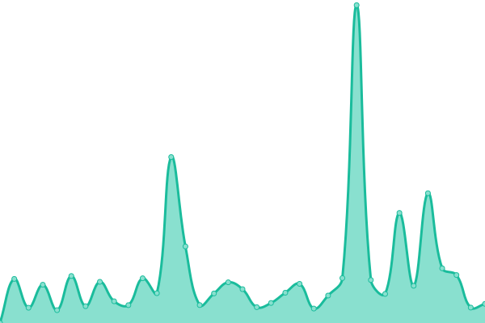 250ms
     
 | 

<a href="https://searx-instances.tiekoetter.com/history/searx-mistli-net">100.00%</a>
    

|  [searx.mxchange.org](https://searx.mxchange.org/) | 🟩 Up | [searx-mxchange-org.yml](https://github.com/tiekoettercom/searx-instances-uptime/commits/HEAD/history/searx-mxchange-org.yml) | 

 758ms
     
 | 

<a href="https://searx-instances.tiekoetter.com/history/searx-mxchange-org">100.00%</a>
    

|  [searx.nakhan.net](https://searx.nakhan.net/) | 🟩 Up | [searx-nakhan-net.yml](https://github.com/tiekoettercom/searx-instances-uptime/commits/HEAD/history/searx-nakhan-net.yml) | 

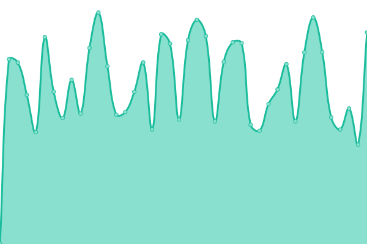 951ms
     
 | 

<a href="https://searx-instances.tiekoetter.com/history/searx-nakhan-net">100.00%</a>
    

|  [searx.namejeff.xyz](https://searx.namejeff.xyz/) | 🟩 Up | [searx-namejeff-xyz.yml](https://github.com/tiekoettercom/searx-instances-uptime/commits/HEAD/history/searx-namejeff-xyz.yml) | 

 430ms
     
 | 

<a href="https://searx-instances.tiekoetter.com/history/searx-namejeff-xyz">100.00%</a>
    

|  [searx.netzspielplatz.de](https://searx.netzspielplatz.de/) | 🟩 Up | [searx-netzspielplatz-de.yml](https://github.com/tiekoettercom/searx-instances-uptime/commits/HEAD/history/searx-netzspielplatz-de.yml) | 

 671ms
     
 | 

<a href="https://searx-instances.tiekoetter.com/history/searx-netzspielplatz-de">100.00%</a>
    

|  [searx.nixnet.services](https://searx.nixnet.services/) | 🟩 Up | [searx-nixnet-services.yml](https://github.com/tiekoettercom/searx-instances-uptime/commits/HEAD/history/searx-nixnet-services.yml) | 

 784ms
     
 | 

<a href="https://searx-instances.tiekoetter.com/history/searx-nixnet-services">100.00%</a>
    

|  [searx.openhoofd.nl](https://searx.openhoofd.nl/) | 🟩 Up | [searx-openhoofd-nl.yml](https://github.com/tiekoettercom/searx-instances-uptime/commits/HEAD/history/searx-openhoofd-nl.yml) | 

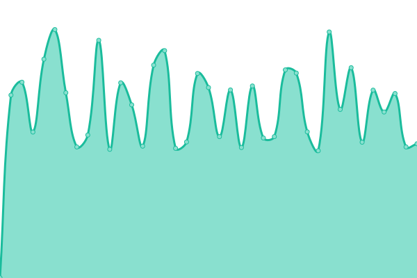 927ms
     
 | 

<a href="https://searx-instances.tiekoetter.com/history/searx-openhoofd-nl">52.78%</a>
    

|  [searx.org](https://searx.org/) | 🟩 Up | [searx-org.yml](https://github.com/tiekoettercom/searx-instances-uptime/commits/HEAD/history/searx-org.yml) | 

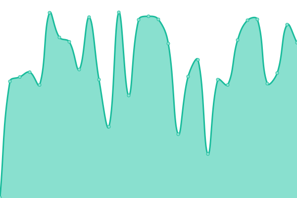 693ms
     
 | 

<a href="https://searx-instances.tiekoetter.com/history/searx-org">100.00%</a>
    

|  [searx.orion-hub.fr](https://searx.orion-hub.fr/) | 🟩 Up | [searx-orion-hub-fr.yml](https://github.com/tiekoettercom/searx-instances-uptime/commits/HEAD/history/searx-orion-hub-fr.yml) | 

 718ms
     
 | 

<a href="https://searx-instances.tiekoetter.com/history/searx-orion-hub-fr">99.95%</a>
    

|  [searx.priv.pw](https://searx.priv.pw/) | 🟩 Up | [searx-priv-pw.yml](https://github.com/tiekoettercom/searx-instances-uptime/commits/HEAD/history/searx-priv-pw.yml) | 

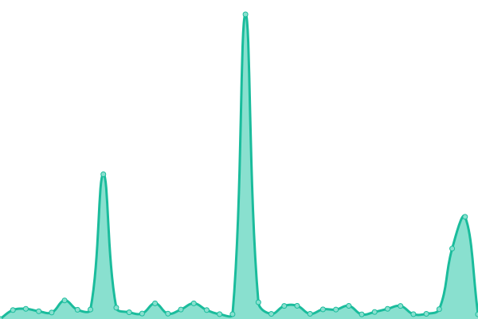 456ms
     
 | 

<a href="https://searx-instances.tiekoetter.com/history/searx-priv-pw">100.00%</a>
    

|  [searx.prvcy.eu](https://searx.prvcy.eu/) | 🟩 Up | [searx-prvcy-eu.yml](https://github.com/tiekoettercom/searx-instances-uptime/commits/HEAD/history/searx-prvcy-eu.yml) | 

 743ms
     
 | 

<a href="https://searx-instances.tiekoetter.com/history/searx-prvcy-eu">89.90%</a>
    

|  [searx.pwoss.org](https://searx.pwoss.org/) | 🟩 Up | [searx-pwoss-org.yml](https://github.com/tiekoettercom/searx-instances-uptime/commits/HEAD/history/searx-pwoss-org.yml) | 

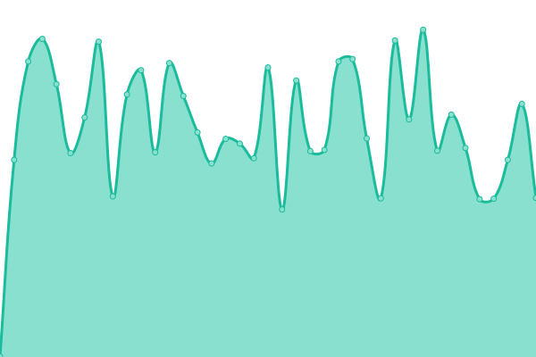 581ms
     
 | 

<a href="https://searx-instances.tiekoetter.com/history/searx-pwoss-org">99.95%</a>
    

|  [searx.rasp.fr](https://searx.rasp.fr/) | 🟩 Up | [searx-rasp-fr.yml](https://github.com/tiekoettercom/searx-instances-uptime/commits/HEAD/history/searx-rasp-fr.yml) | 

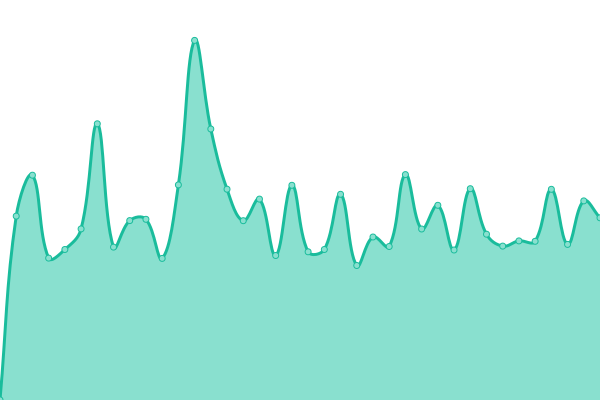 2267ms
     
 | 

<a href="https://searx-instances.tiekoetter.com/history/searx-rasp-fr">99.95%</a>
    

|  [searx.ru](https://searx.ru/) | 🟩 Up | [searx-ru.yml](https://github.com/tiekoettercom/searx-instances-uptime/commits/HEAD/history/searx-ru.yml) | 

 1034ms
     
 | 

<a href="https://searx-instances.tiekoetter.com/history/searx-ru">100.00%</a>
    

|  [searx.run](https://searx.run/) | 🟩 Up | [searx-run.yml](https://github.com/tiekoettercom/searx-instances-uptime/commits/HEAD/history/searx-run.yml) | 

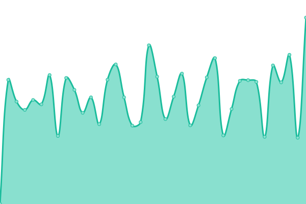 591ms
     
 | 

<a href="https://searx-instances.tiekoetter.com/history/searx-run">100.00%</a>
    

|  [searx.semipvt.com](https://searx.semipvt.com/) | 🟩 Up | [searx-semipvt-com.yml](https://github.com/tiekoettercom/searx-instances-uptime/commits/HEAD/history/searx-semipvt-com.yml) | 

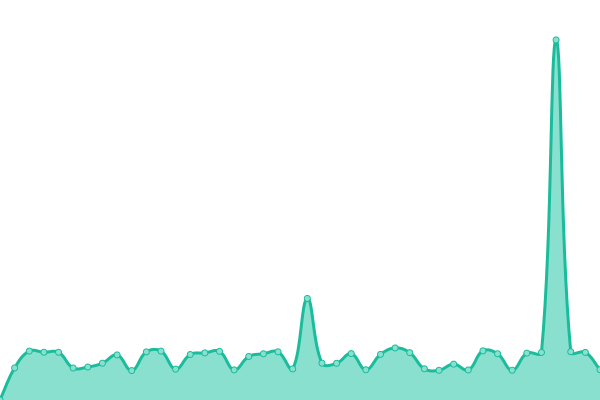 657ms
     
 | 

<a href="https://searx-instances.tiekoetter.com/history/searx-semipvt-com">99.91%</a>
    

|  [searx.sethforprivacy.com](https://searx.sethforprivacy.com/) | 🟩 Up | [searx-sethforprivacy-com.yml](https://github.com/tiekoettercom/searx-instances-uptime/commits/HEAD/history/searx-sethforprivacy-com.yml) | 

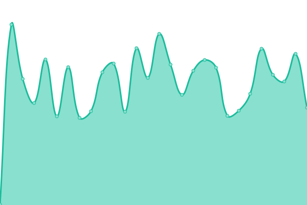 446ms
     
 | 

<a href="https://searx-instances.tiekoetter.com/history/searx-sethforprivacy-com">100.00%</a>
    

|  [searx.sev.monster](https://searx.sev.monster/) | 🟩 Up | [searx-sev-monster.yml](https://github.com/tiekoettercom/searx-instances-uptime/commits/HEAD/history/searx-sev-monster.yml) | 

 418ms
     
 | 

<a href="https://searx-instances.tiekoetter.com/history/searx-sev-monster">99.90%</a>
    

|  [searx.slipfox.xyz/searx](https://searx.slipfox.xyz/searx/) | 🟩 Up | [searx-slipfox-xyz-searx.yml](https://github.com/tiekoettercom/searx-instances-uptime/commits/HEAD/history/searx-slipfox-xyz-searx.yml) | 

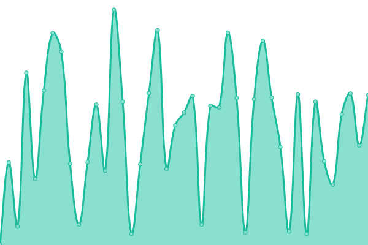 235ms
     
 | 

<a href="https://searx-instances.tiekoetter.com/history/searx-slipfox-xyz-searx">100.00%</a>
    

|  [searx.sp-codes.de](https://searx.sp-codes.de/) | 🟩 Up | [searx-sp-codes-de.yml](https://github.com/tiekoettercom/searx-instances-uptime/commits/HEAD/history/searx-sp-codes-de.yml) | 

 1136ms
     
 | 

<a href="https://searx-instances.tiekoetter.com/history/searx-sp-codes-de">87.95%</a>
    

|  [searx.stuehieyr.com](https://searx.stuehieyr.com/) | 🟩 Up | [searx-stuehieyr-com.yml](https://github.com/tiekoettercom/searx-instances-uptime/commits/HEAD/history/searx-stuehieyr-com.yml) | 

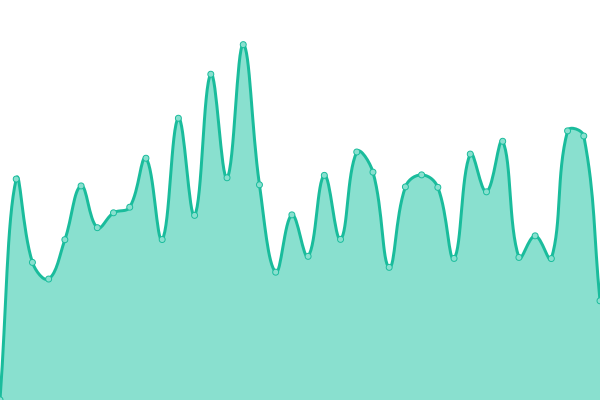 1051ms
     
 | 

<a href="https://searx-instances.tiekoetter.com/history/searx-stuehieyr-com">100.00%</a>
    

|  [searx.tuxcloud.net](https://searx.tuxcloud.net/) | 🟩 Up | [searx-tuxcloud-net.yml](https://github.com/tiekoettercom/searx-instances-uptime/commits/HEAD/history/searx-tuxcloud-net.yml) | 

 709ms
     
 | 

<a href="https://searx-instances.tiekoetter.com/history/searx-tuxcloud-net">100.00%</a>
    

|  [searx.tyil.nl](https://searx.tyil.nl/) | 🟩 Up | [searx-tyil-nl.yml](https://github.com/tiekoettercom/searx-instances-uptime/commits/HEAD/history/searx-tyil-nl.yml) | 

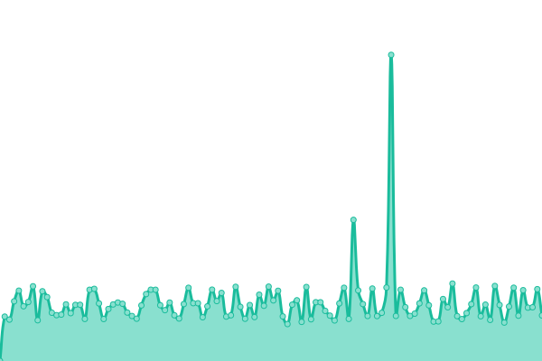 1028ms
     
 | 

<a href="https://searx-instances.tiekoetter.com/history/searx-tyil-nl">96.05%</a>
    

|  [searx.vanwa.tech](https://searx.vanwa.tech/) | 🟩 Up | [searx-vanwa-tech.yml](https://github.com/tiekoettercom/searx-instances-uptime/commits/HEAD/history/searx-vanwa-tech.yml) | 

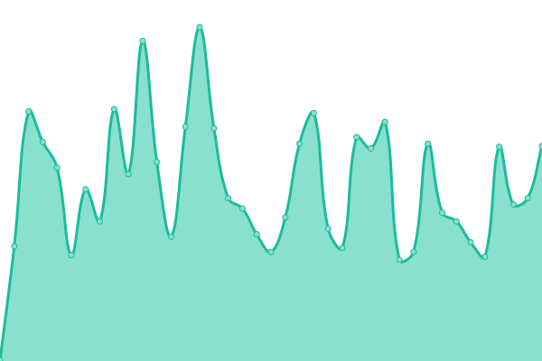 389ms
     
 | 

<a href="https://searx-instances.tiekoetter.com/history/searx-vanwa-tech">74.78%</a>
    

|  [searx.vimproved.me](https://searx.vimproved.me/) | 🟩 Up | [searx-vimproved-me.yml](https://github.com/tiekoettercom/searx-instances-uptime/commits/HEAD/history/searx-vimproved-me.yml) | 

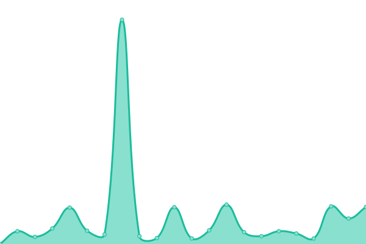 432ms
     
 | 

<a href="https://searx-instances.tiekoetter.com/history/searx-vimproved-me">99.75%</a>
    

|  [searx.webheberg.info](https://searx.webheberg.info/) | 🟩 Up | [searx-webheberg-info.yml](https://github.com/tiekoettercom/searx-instances-uptime/commits/HEAD/history/searx-webheberg-info.yml) | 

 837ms
     
 | 

<a href="https://searx-instances.tiekoetter.com/history/searx-webheberg-info">100.00%</a>
    

|  [searx.xyz](https://searx.xyz/) | 🟩 Up | [searx-xyz.yml](https://github.com/tiekoettercom/searx-instances-uptime/commits/HEAD/history/searx-xyz.yml) | 

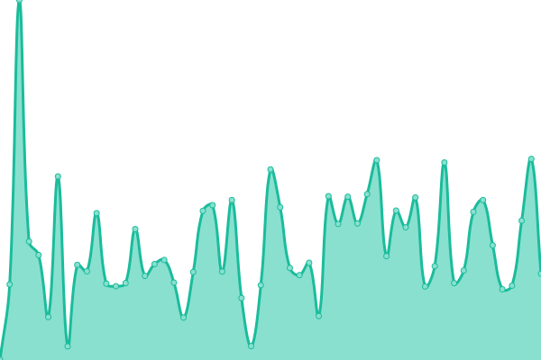 728ms
     
 | 

<a href="https://searx-instances.tiekoetter.com/history/searx-xyz">99.95%</a>
    

|  [searx.youshitsune.me](https://searx.youshitsune.me/) | 🟩 Up | [searx-youshitsune-me.yml](https://github.com/tiekoettercom/searx-instances-uptime/commits/HEAD/history/searx-youshitsune-me.yml) | 

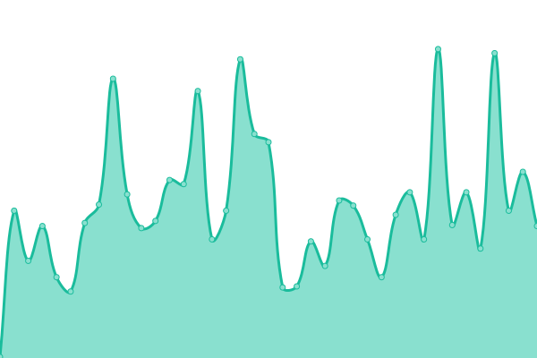 141ms
     
 | 

<a href="https://searx-instances.tiekoetter.com/history/searx-youshitsune-me">100.00%</a>
    

|  [searx.zapashcanon.fr](https://searx.zapashcanon.fr/) | 🟩 Up | [searx-zapashcanon-fr.yml](https://github.com/tiekoettercom/searx-instances-uptime/commits/HEAD/history/searx-zapashcanon-fr.yml) | 

 747ms
     
 | 

<a href="https://searx-instances.tiekoetter.com/history/searx-zapashcanon-fr">90.56%</a>
    

|  [searx.zcyph.cc](https://searx.zcyph.cc/) | 🟩 Up | [searx-zcyph-cc.yml](https://github.com/tiekoettercom/searx-instances-uptime/commits/HEAD/history/searx-zcyph-cc.yml) | 

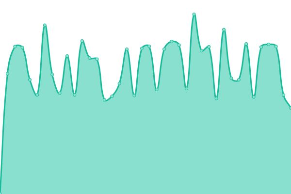 492ms
     
 | 

<a href="https://searx-instances.tiekoetter.com/history/searx-zcyph-cc">99.92%</a>
    

|  [searxng.au/searx](https://searxng.au/searx/) | 🟩 Up | [searxng-au-searx.yml](https://github.com/tiekoettercom/searx-instances-uptime/commits/HEAD/history/searxng-au-searx.yml) | 

 702ms
     
 | 

<a href="https://searx-instances.tiekoetter.com/history/searxng-au-searx">100.00%</a>
    

|  [searxng.ir](https://searxng.ir/) | 🟩 Up | [searxng-ir.yml](https://github.com/tiekoettercom/searx-instances-uptime/commits/HEAD/history/searxng-ir.yml) | 

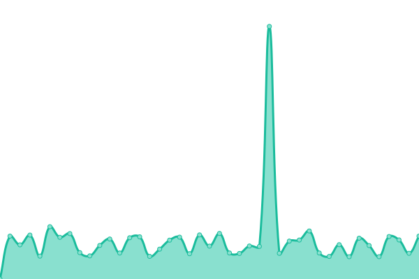 1051ms
     
 | 

<a href="https://searx-instances.tiekoetter.com/history/searxng-ir">99.95%</a>
    

|  [searxng.tordenskjold.de](https://searxng.tordenskjold.de/) | 🟩 Up | [searxng-tordenskjold-de.yml](https://github.com/tiekoettercom/searx-instances-uptime/commits/HEAD/history/searxng-tordenskjold-de.yml) | 

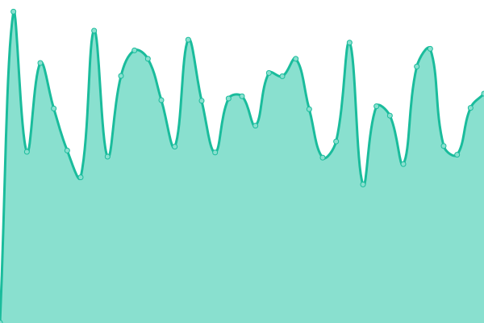 653ms
     
 | 

<a href="https://searx-instances.tiekoetter.com/history/searxng-tordenskjold-de">100.00%</a>
    

|  [searxng.zackptg5.com](https://searxng.zackptg5.com/) | 🟩 Up | [searxng-zackptg5-com.yml](https://github.com/tiekoettercom/searx-instances-uptime/commits/HEAD/history/searxng-zackptg5-com.yml) | 

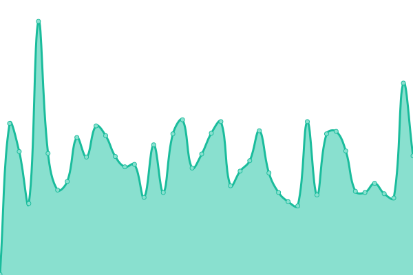 162ms
     
 | 

<a href="https://searx-instances.tiekoetter.com/history/searxng-zackptg5-com">96.69%</a>
    

|  [serx.ml](https://serx.ml/) | 🟩 Up | [serx-ml.yml](https://github.com/tiekoettercom/searx-instances-uptime/commits/HEAD/history/serx-ml.yml) | 

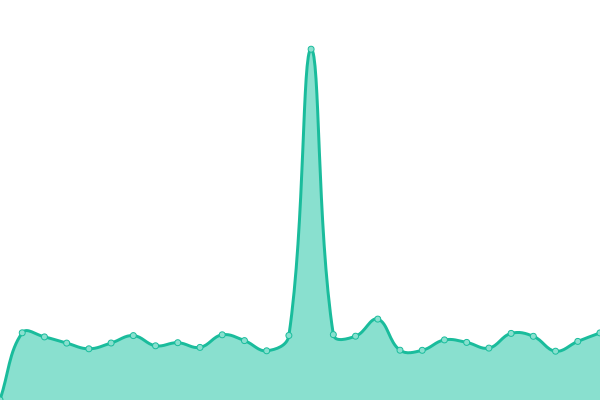 375ms
     
 | 

<a href="https://searx-instances.tiekoetter.com/history/serx-ml">99.95%</a>
    

|  [spot.ecloud.global](https://spot.ecloud.global/) | 🟩 Up | [spot-ecloud-global.yml](https://github.com/tiekoettercom/searx-instances-uptime/commits/HEAD/history/spot-ecloud-global.yml) | 

 1276ms
     
 | 

<a href="https://searx-instances.tiekoetter.com/history/spot-ecloud-global">100.00%</a>
    

|  [srx.cosmohub.io](https://srx.cosmohub.io/) | 🟩 Up | [srx-cosmohub-io.yml](https://github.com/tiekoettercom/searx-instances-uptime/commits/HEAD/history/srx-cosmohub-io.yml) | 

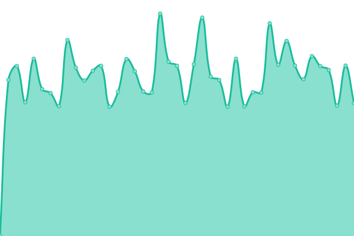 648ms
     
 | 

<a href="https://searx-instances.tiekoetter.com/history/srx-cosmohub-io">100.00%</a>
    

|  [suche.dasnetzundich.de](https://suche.dasnetzundich.de/) | 🟩 Up | [suche-dasnetzundich-de.yml](https://github.com/tiekoettercom/searx-instances-uptime/commits/HEAD/history/suche-dasnetzundich-de.yml) | 

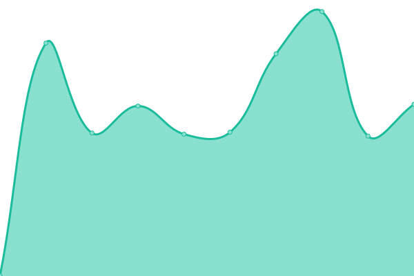 941ms
     
 | 

<a href="https://searx-instances.tiekoetter.com/history/suche-dasnetzundich-de">99.89%</a>
    

|  [suche.tromdienste.de](https://suche.tromdienste.de/) | 🟩 Up | [suche-tromdienste-de.yml](https://github.com/tiekoettercom/searx-instances-uptime/commits/HEAD/history/suche-tromdienste-de.yml) | 

 669ms
     
 | 

<a href="https://searx-instances.tiekoetter.com/history/suche-tromdienste-de">99.95%</a>
    

|  [suche.uferwerk.org](https://suche.uferwerk.org/) | 🟩 Up | [suche-uferwerk-org.yml](https://github.com/tiekoettercom/searx-instances-uptime/commits/HEAD/history/suche-uferwerk-org.yml) | 

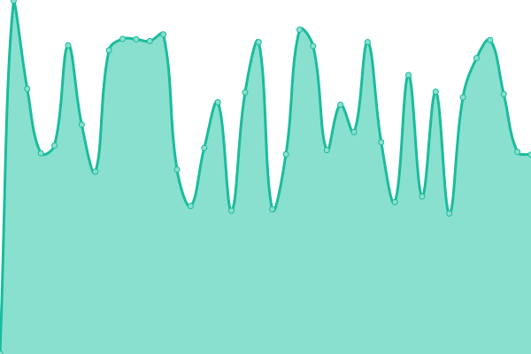 670ms
     
 | 

<a href="https://searx-instances.tiekoetter.com/history/suche-uferwerk-org">100.00%</a>
    

|  [swag.pw](https://swag.pw/) | 🟩 Up | [swag-pw.yml](https://github.com/tiekoettercom/searx-instances-uptime/commits/HEAD/history/swag-pw.yml) | 

 208ms
     
 | 

<a href="https://searx-instances.tiekoetter.com/history/swag-pw">100.00%</a>
    

|  [sx.catgirl.cloud](https://sx.catgirl.cloud/) | 🟩 Up | [sx-catgirl-cloud.yml](https://github.com/tiekoettercom/searx-instances-uptime/commits/HEAD/history/sx-catgirl-cloud.yml) | 

 676ms
     
 | 

<a href="https://searx-instances.tiekoetter.com/history/sx-catgirl-cloud">100.00%</a>
    

|  [timdor.noip.me/searx](https://timdor.noip.me/searx/) | 🟩 Up | [timdor-noip-me-searx.yml](https://github.com/tiekoettercom/searx-instances-uptime/commits/HEAD/history/timdor-noip-me-searx.yml) | 

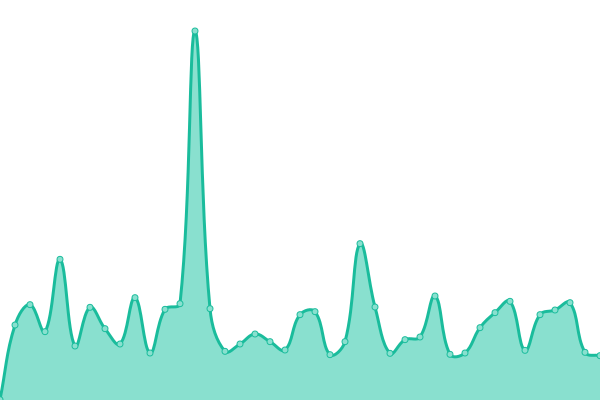 234ms
     
 | 

<a href="https://searx-instances.tiekoetter.com/history/timdor-noip-me-searx">100.00%</a>
    

|  [www.gruble.de](https://www.gruble.de/) | 🟩 Up | [www-gruble-de.yml](https://github.com/tiekoettercom/searx-instances-uptime/commits/HEAD/history/www-gruble-de.yml) | 

 695ms
     
 | 

<a href="https://searx-instances.tiekoetter.com/history/www-gruble-de">99.87%</a>
    

|  [www.webrats.xyz](https://www.webrats.xyz/) | 🟩 Up | [www-webrats-xyz.yml](https://github.com/tiekoettercom/searx-instances-uptime/commits/HEAD/history/www-webrats-xyz.yml) | 

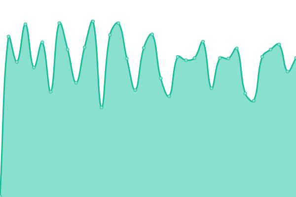 243ms
     
 | 

<a href="https://searx-instances.tiekoetter.com/history/www-webrats-xyz">100.00%</a>
    

|  [xcxc.ml](https://xcxc.ml/) | 🟩 Up | [xcxc-ml.yml](https://github.com/tiekoettercom/searx-instances-uptime/commits/HEAD/history/xcxc-ml.yml) | 

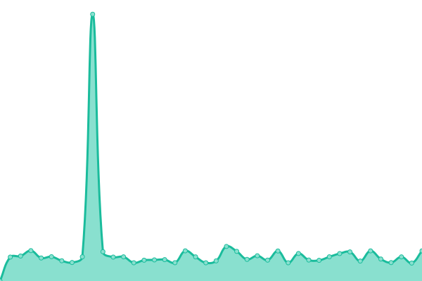 770ms
     
 | 

<a href="https://searx-instances.tiekoetter.com/history/xcxc-ml">99.91%</a>
    

|  [searx.roflcopter.fr](https://searx.roflcopter.fr/) | 🟩 Up | [searx-roflcopter-fr.yml](https://github.com/tiekoettercom/searx-instances-uptime/commits/HEAD/history/searx-roflcopter-fr.yml) | 

 690ms
     
 | 

<a href="https://searx-instances.tiekoetter.com/history/searx-roflcopter-fr">100.00%</a>
    

<!--end: status pages-->

[**Visit our status website →**](https://searx-instances.tiekoetter.com)

## 📄 License

- Powered by: [Upptime](https://github.com/upptime/upptime)
- Code: [MIT](./LICENSE) © [Tiekötter.com](https://www.tiekoetter.com)
- Data in the `./history` directory: [Open Database License](https://opendatacommons.org/licenses/odbl/1-0/)
