# [📈 Live Status](https://searx-instances.tiekoetter.com): <!--live status--> **🟧 Partial outage**

This repository contains the open-source uptime monitor and status page for [Tiekötter.com](https://www.tiekoetter.com), powered by [Upptime](https://github.com/upptime/upptime).

With [Upptime](https://upptime.js.org), you can get your own unlimited and free uptime monitor and status page, powered entirely by a GitHub repository. We use [Issues](https://github.com/tiekoettercom/searx-instances-uptime/issues) as incident reports, [Actions](https://github.com/tiekoettercom/searx-instances-uptime/actions) as uptime monitors, and [Pages](https://searx-instances.tiekoetter.com) for the status page.

<!--start: status pages-->
<!-- This summary is generated by Upptime (https://github.com/upptime/upptime) -->
<!-- Do not edit this manually, your changes will be overwritten -->
<!-- prettier-ignore -->
| URL | Status | History | Response Time | Uptime |
| --- | ------ | ------- | ------------- | ------ |
|  [searx.tiekoetter.com](https://searx.tiekoetter.com/) | 🟩 Up | [searx-tiekoetter-com.yml](https://github.com/tiekoettercom/searx-instances-uptime/commits/HEAD/history/searx-tiekoetter-com.yml) | 

 684ms
     
 | 

<a href="https://searx-instances.tiekoetter.com/history/searx-tiekoetter-com">100.00%</a>
    

|  [darmarit.org/searx](https://darmarit.org/searx/) | 🟩 Up | [darmarit-org-searx.yml](https://github.com/tiekoettercom/searx-instances-uptime/commits/HEAD/history/darmarit-org-searx.yml) | 

 664ms
     
 | 

<a href="https://searx-instances.tiekoetter.com/history/darmarit-org-searx">100.00%</a>
    

|  [paulgo.io](https://paulgo.io/) | 🟩 Up | [paulgo-io.yml](https://github.com/tiekoettercom/searx-instances-uptime/commits/HEAD/history/paulgo-io.yml) | 

 519ms
     
 | 

<a href="https://searx-instances.tiekoetter.com/history/paulgo-io">100.00%</a>
    

|  [baresearch.org](https://baresearch.org/) | 🟩 Up | [baresearch-org.yml](https://github.com/tiekoettercom/searx-instances-uptime/commits/HEAD/history/baresearch-org.yml) | 

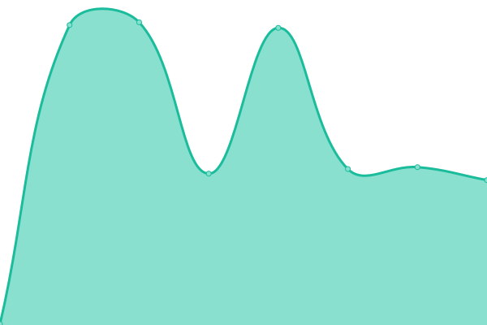 224ms
     
 | 

<a href="https://searx-instances.tiekoetter.com/history/baresearch-org">99.61%</a>
    

|  [copp.gg](https://copp.gg/) | 🟩 Up | [copp-gg.yml](https://github.com/tiekoettercom/searx-instances-uptime/commits/HEAD/history/copp-gg.yml) | 

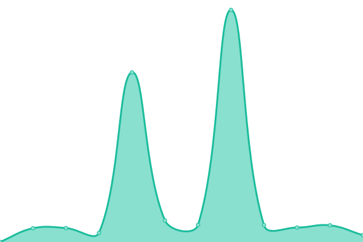 1720ms
     
 | 

<a href="https://searx-instances.tiekoetter.com/history/copp-gg">96.72%</a>
    

|  [etsi.me](https://etsi.me/) | 🟩 Up | [etsi-me.yml](https://github.com/tiekoettercom/searx-instances-uptime/commits/HEAD/history/etsi-me.yml) | 

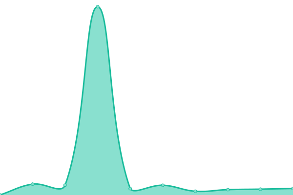 277ms
     
 | 

<a href="https://searx-instances.tiekoetter.com/history/etsi-me">100.00%</a>
    

|  [fairsuch.net](https://fairsuch.net/) | 🟩 Up | [fairsuch-net.yml](https://github.com/tiekoettercom/searx-instances-uptime/commits/HEAD/history/fairsuch-net.yml) | 

 644ms
     
 | 

<a href="https://searx-instances.tiekoetter.com/history/fairsuch-net">100.00%</a>
    

|  [find.xenorio.xyz](https://find.xenorio.xyz/) | 🟩 Up | [find-xenorio-xyz.yml](https://github.com/tiekoettercom/searx-instances-uptime/commits/HEAD/history/find-xenorio-xyz.yml) | 

 418ms
     
 | 

<a href="https://searx-instances.tiekoetter.com/history/find-xenorio-xyz">100.00%</a>
    

|  [kantan.cat](https://kantan.cat/) | 🟩 Up | [kantan-cat.yml](https://github.com/tiekoettercom/searx-instances-uptime/commits/HEAD/history/kantan-cat.yml) | 

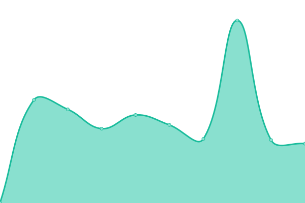 2212ms
     
 | 

<a href="https://searx-instances.tiekoetter.com/history/kantan-cat">99.61%</a>
    

|  [metacat.online](https://metacat.online/) | 🟩 Up | [metacat-online.yml](https://github.com/tiekoettercom/searx-instances-uptime/commits/HEAD/history/metacat-online.yml) | 

 577ms
     
 | 

<a href="https://searx-instances.tiekoetter.com/history/metacat-online">100.00%</a>
    

|  [northboot.xyz](https://northboot.xyz/) | 🟩 Up | [northboot-xyz.yml](https://github.com/tiekoettercom/searx-instances-uptime/commits/HEAD/history/northboot-xyz.yml) | 

 576ms
     
 | 

<a href="https://searx-instances.tiekoetter.com/history/northboot-xyz">100.00%</a>
    

|  [o5.gg](https://o5.gg/) | 🟩 Up | [o5-gg.yml](https://github.com/tiekoettercom/searx-instances-uptime/commits/HEAD/history/o5-gg.yml) | 

 439ms
     
 | 

<a href="https://searx-instances.tiekoetter.com/history/o5-gg">99.80%</a>
    

|  [ooglester.com](https://ooglester.com/) | 🟩 Up | [ooglester-com.yml](https://github.com/tiekoettercom/searx-instances-uptime/commits/HEAD/history/ooglester-com.yml) | 

 19224ms
     
 | 

<a href="https://searx-instances.tiekoetter.com/history/ooglester-com">95.82%</a>
    

|  [opnxng.com](https://opnxng.com/) | 🟩 Up | [opnxng-com.yml](https://github.com/tiekoettercom/searx-instances-uptime/commits/HEAD/history/opnxng-com.yml) | 

 769ms
     
 | 

<a href="https://searx-instances.tiekoetter.com/history/opnxng-com">100.00%</a>
    

|  [priv.au](https://priv.au/) | 🟩 Up | [priv-au.yml](https://github.com/tiekoettercom/searx-instances-uptime/commits/HEAD/history/priv-au.yml) | 

 873ms
     
 | 

<a href="https://searx-instances.tiekoetter.com/history/priv-au">99.81%</a>
    

|  [s.mble.dk](https://s.mble.dk/) | 🟩 Up | [s-mble-dk.yml](https://github.com/tiekoettercom/searx-instances-uptime/commits/HEAD/history/s-mble-dk.yml) | 

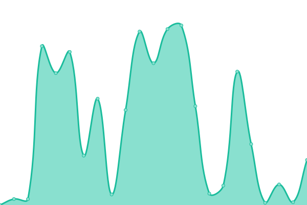 6143ms
     
 | 

<a href="https://searx-instances.tiekoetter.com/history/s-mble-dk">70.81%</a>
    

|  [search.2b9t.xyz](https://search.2b9t.xyz/) | 🟩 Up | [search-2b9t-xyz.yml](https://github.com/tiekoettercom/searx-instances-uptime/commits/HEAD/history/search-2b9t-xyz.yml) | 

 211ms
     
 | 

<a href="https://searx-instances.tiekoetter.com/history/search-2b9t-xyz">100.00%</a>
    

|  [search.anoni.net](https://search.anoni.net/) | 🟩 Up | [search-anoni-net.yml](https://github.com/tiekoettercom/searx-instances-uptime/commits/HEAD/history/search-anoni-net.yml) | 

 625ms
     
 | 

<a href="https://searx-instances.tiekoetter.com/history/search-anoni-net">100.00%</a>
    

|  [search.bladerunn.in](https://search.bladerunn.in/) | 🟩 Up | [search-bladerunn-in.yml](https://github.com/tiekoettercom/searx-instances-uptime/commits/HEAD/history/search-bladerunn-in.yml) | 

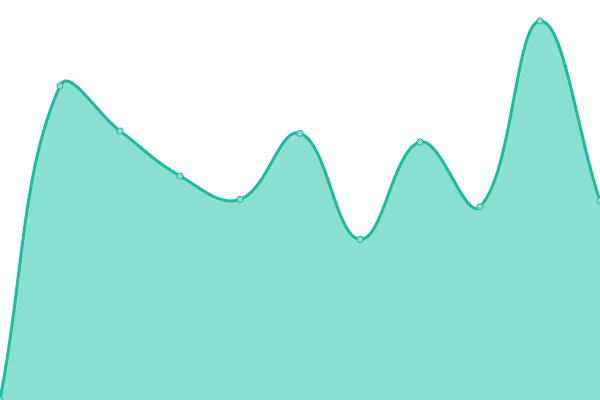 746ms
     
 | 

<a href="https://searx-instances.tiekoetter.com/history/search-bladerunn-in">99.00%</a>
    

|  [search.buddyverse.net](https://search.buddyverse.net/) | 🟩 Up | [search-buddyverse-net.yml](https://github.com/tiekoettercom/searx-instances-uptime/commits/HEAD/history/search-buddyverse-net.yml) | 

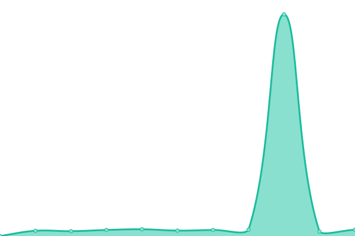 833ms
     
 | 

<a href="https://searx-instances.tiekoetter.com/history/search-buddyverse-net">91.83%</a>
    

|  [search.catboy.house](https://search.catboy.house/) | 🟩 Up | [search-catboy-house.yml](https://github.com/tiekoettercom/searx-instances-uptime/commits/HEAD/history/search-catboy-house.yml) | 

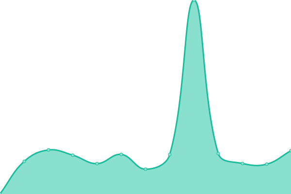 573ms
     
 | 

<a href="https://searx-instances.tiekoetter.com/history/search-catboy-house">100.00%</a>
    

|  [search.charliewhiskey.net](https://search.charliewhiskey.net/) | 🟩 Up | [search-charliewhiskey-net.yml](https://github.com/tiekoettercom/searx-instances-uptime/commits/HEAD/history/search-charliewhiskey-net.yml) | 

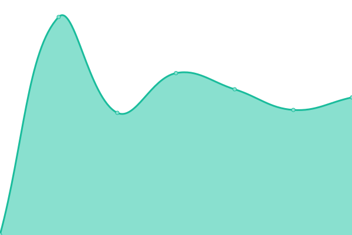 502ms
     
 | 

<a href="https://searx-instances.tiekoetter.com/history/search-charliewhiskey-net">100.00%</a>
    

|  [search.einfachzocken.eu](https://search.einfachzocken.eu/) | 🟩 Up | [search-einfachzocken-eu.yml](https://github.com/tiekoettercom/searx-instances-uptime/commits/HEAD/history/search-einfachzocken-eu.yml) | 

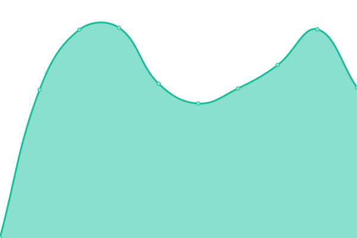 710ms
     
 | 

<a href="https://searx-instances.tiekoetter.com/history/search-einfachzocken-eu">99.61%</a>
    

|  [search.ethibox.fr](https://search.ethibox.fr/) | 🟩 Up | [search-ethibox-fr.yml](https://github.com/tiekoettercom/searx-instances-uptime/commits/HEAD/history/search-ethibox-fr.yml) | 

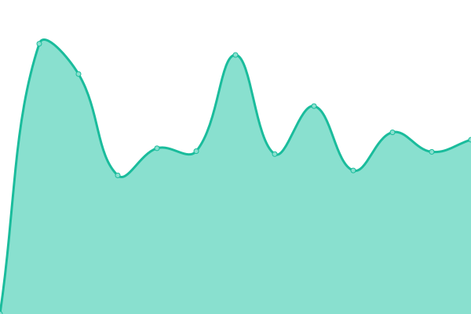 1061ms
     
 | 

<a href="https://searx-instances.tiekoetter.com/history/search-ethibox-fr">99.91%</a>
    

|  [search.femboy.ad](https://search.femboy.ad/) | 🟩 Up | [search-femboy-ad.yml](https://github.com/tiekoettercom/searx-instances-uptime/commits/HEAD/history/search-femboy-ad.yml) | 

 230ms
     
 | 

<a href="https://searx-instances.tiekoetter.com/history/search-femboy-ad">100.00%</a>
    

|  [search.hbubli.cc](https://search.hbubli.cc/) | 🟩 Up | [search-hbubli-cc.yml](https://github.com/tiekoettercom/searx-instances-uptime/commits/HEAD/history/search-hbubli-cc.yml) | 

 385ms
     
 | 

<a href="https://searx-instances.tiekoetter.com/history/search-hbubli-cc">100.00%</a>
    

|  [search.iguru.gr](https://search.iguru.gr/) | 🟥 Down | [search-iguru-gr.yml](https://github.com/tiekoettercom/searx-instances-uptime/commits/HEAD/history/search-iguru-gr.yml) | 

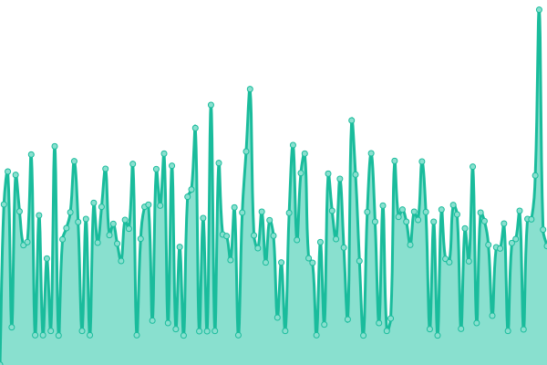 444ms
     
 | 

<a href="https://searx-instances.tiekoetter.com/history/search-iguru-gr">10.38%</a>
    

|  [search.im-in.space](https://search.im-in.space/) | 🟩 Up | [search-im-in-space.yml](https://github.com/tiekoettercom/searx-instances-uptime/commits/HEAD/history/search-im-in-space.yml) | 

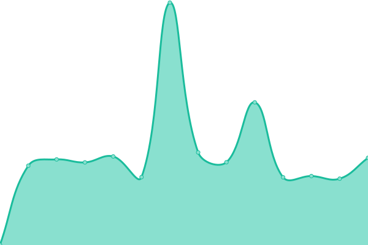 412ms
     
 | 

<a href="https://searx-instances.tiekoetter.com/history/search-im-in-space">99.82%</a>
    

|  [search.indst.eu](https://search.indst.eu/) | 🟩 Up | [search-indst-eu.yml](https://github.com/tiekoettercom/searx-instances-uptime/commits/HEAD/history/search-indst-eu.yml) | 

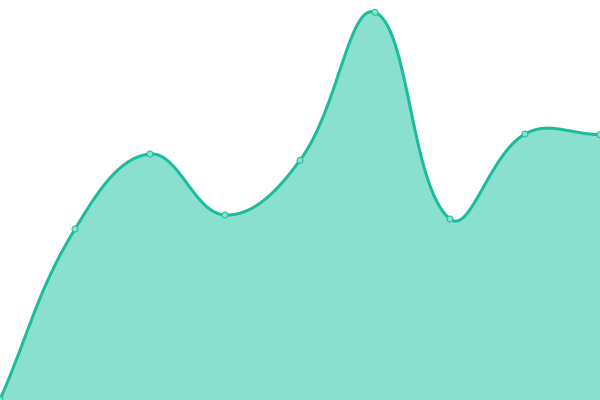 900ms
     
 | 

<a href="https://searx-instances.tiekoetter.com/history/search-indst-eu">100.00%</a>
    

|  [search.inetol.net](https://search.inetol.net/) | 🟩 Up | [search-inetol-net.yml](https://github.com/tiekoettercom/searx-instances-uptime/commits/HEAD/history/search-inetol-net.yml) | 

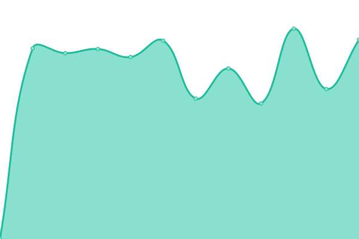 657ms
     
 | 

<a href="https://searx-instances.tiekoetter.com/history/search-inetol-net">98.62%</a>
    

|  [search.internetsucks.net](https://search.internetsucks.net/) | 🟩 Up | [search-internetsucks-net.yml](https://github.com/tiekoettercom/searx-instances-uptime/commits/HEAD/history/search-internetsucks-net.yml) | 

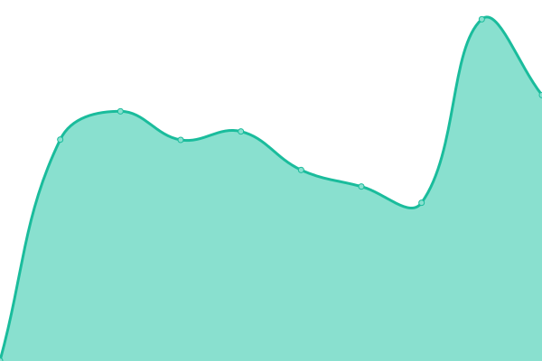 745ms
     
 | 

<a href="https://searx-instances.tiekoetter.com/history/search-internetsucks-net">99.80%</a>
    

|  [search.ipsys.bf](https://search.ipsys.bf/) | 🟩 Up | [search-ipsys-bf.yml](https://github.com/tiekoettercom/searx-instances-uptime/commits/HEAD/history/search-ipsys-bf.yml) | 

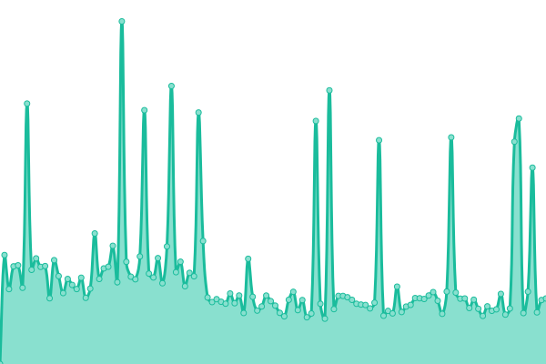 2342ms
     
 | 

<a href="https://searx-instances.tiekoetter.com/history/search-ipsys-bf">84.08%</a>
    

|  [search.ipv6s.net](https://search.ipv6s.net/) | 🟩 Up | [search-ipv6s-net.yml](https://github.com/tiekoettercom/searx-instances-uptime/commits/HEAD/history/search-ipv6s-net.yml) | 

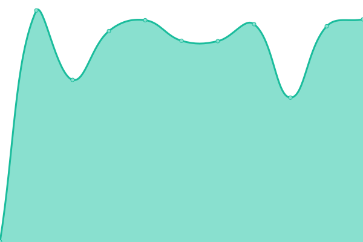 405ms
     
 | 

<a href="https://searx-instances.tiekoetter.com/history/search-ipv6s-net">100.00%</a>
    

|  [search.leptons.xyz](https://search.leptons.xyz/) | 🟩 Up | [search-leptons-xyz.yml](https://github.com/tiekoettercom/searx-instances-uptime/commits/HEAD/history/search-leptons-xyz.yml) | 

 354ms
     
 | 

<a href="https://searx-instances.tiekoetter.com/history/search-leptons-xyz">100.00%</a>
    

|  [search.mdosch.de](https://search.mdosch.de/) | 🟩 Up | [search-mdosch-de.yml](https://github.com/tiekoettercom/searx-instances-uptime/commits/HEAD/history/search-mdosch-de.yml) | 

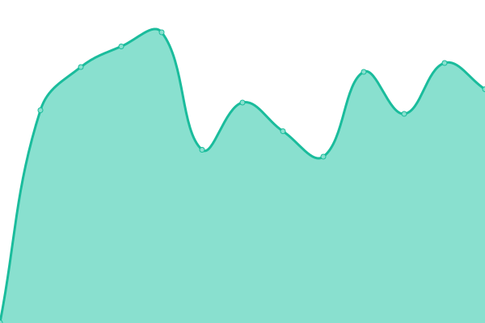 562ms
     
 | 

<a href="https://searx-instances.tiekoetter.com/history/search-mdosch-de">100.00%</a>
    

|  [search.mycotrip.tech](https://search.mycotrip.tech/) | 🟩 Up | [search-mycotrip-tech.yml](https://github.com/tiekoettercom/searx-instances-uptime/commits/HEAD/history/search-mycotrip-tech.yml) | 

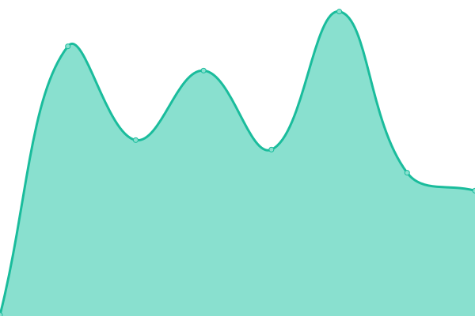 119ms
     
 | 

<a href="https://searx-instances.tiekoetter.com/history/search-mycotrip-tech">100.00%</a>
    

|  [search.nerdvpn.de](https://search.nerdvpn.de/) | 🟩 Up | [search-nerdvpn-de.yml](https://github.com/tiekoettercom/searx-instances-uptime/commits/HEAD/history/search-nerdvpn-de.yml) | 

 651ms
     
 | 

<a href="https://searx-instances.tiekoetter.com/history/search-nerdvpn-de">100.00%</a>
    

|  [search.oh64.moe](https://search.oh64.moe/) | 🟩 Up | [search-oh64-moe.yml](https://github.com/tiekoettercom/searx-instances-uptime/commits/HEAD/history/search-oh64-moe.yml) | 

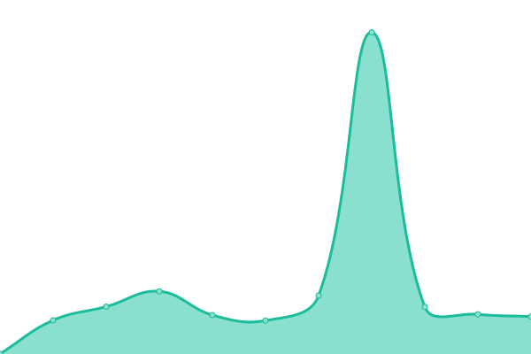 404ms
     
 | 

<a href="https://searx-instances.tiekoetter.com/history/search-oh64-moe">100.00%</a>
    

|  [search.ononoki.org](https://search.ononoki.org/) | 🟩 Up | [search-ononoki-org.yml](https://github.com/tiekoettercom/searx-instances-uptime/commits/HEAD/history/search-ononoki-org.yml) | 

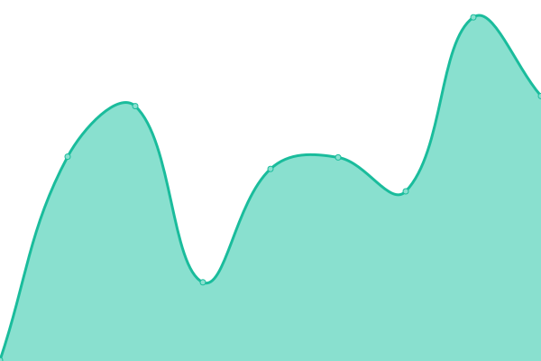 204ms
     
 | 

<a href="https://searx-instances.tiekoetter.com/history/search-ononoki-org">100.00%</a>
    

|  [search.perditum.com](https://search.perditum.com/) | 🟩 Up | [search-perditum-com.yml](https://github.com/tiekoettercom/searx-instances-uptime/commits/HEAD/history/search-perditum-com.yml) | 

 883ms
     
 | 

<a href="https://searx-instances.tiekoetter.com/history/search-perditum-com">99.91%</a>
    

|  [search.privacyredirect.com](https://search.privacyredirect.com/) | 🟩 Up | [search-privacyredirect-com.yml](https://github.com/tiekoettercom/searx-instances-uptime/commits/HEAD/history/search-privacyredirect-com.yml) | 

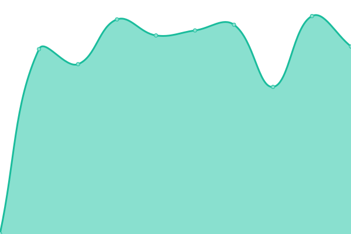 5195ms
     
 | 

<a href="https://searx-instances.tiekoetter.com/history/search-privacyredirect-com">99.90%</a>
    

|  [search.rhscz.eu](https://search.rhscz.eu/) | 🟩 Up | [search-rhscz-eu.yml](https://github.com/tiekoettercom/searx-instances-uptime/commits/HEAD/history/search-rhscz-eu.yml) | 

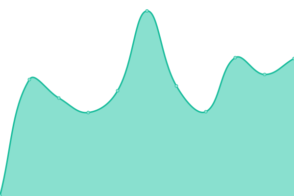 653ms
     
 | 

<a href="https://searx-instances.tiekoetter.com/history/search-rhscz-eu">100.00%</a>
    

|  [search.rowie.at](https://search.rowie.at/) | 🟩 Up | [search-rowie-at.yml](https://github.com/tiekoettercom/searx-instances-uptime/commits/HEAD/history/search-rowie-at.yml) | 

 664ms
     
 | 

<a href="https://searx-instances.tiekoetter.com/history/search-rowie-at">100.00%</a>
    

|  [search.sapti.me](https://search.sapti.me/) | 🟩 Up | [search-sapti-me.yml](https://github.com/tiekoettercom/searx-instances-uptime/commits/HEAD/history/search-sapti-me.yml) | 

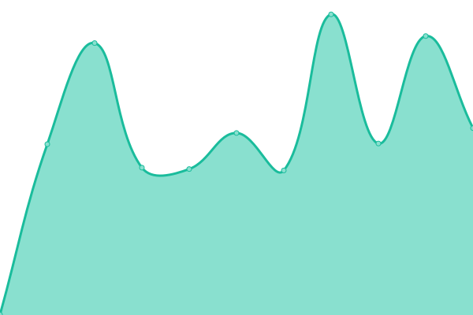 515ms
     
 | 

<a href="https://searx-instances.tiekoetter.com/history/search-sapti-me">100.00%</a>
    

|  [search.system51.co.uk](https://search.system51.co.uk/) | 🟥 Down | [search-system51-co-uk.yml](https://github.com/tiekoettercom/searx-instances-uptime/commits/HEAD/history/search-system51-co-uk.yml) | 

 0ms
     
 | 

<a href="https://searx-instances.tiekoetter.com/history/search-system51-co-uk">0.00%</a>
    

|  [search.undertale.uk](https://search.undertale.uk/) | 🟥 Down | [search-undertale-uk.yml](https://github.com/tiekoettercom/searx-instances-uptime/commits/HEAD/history/search-undertale-uk.yml) | 

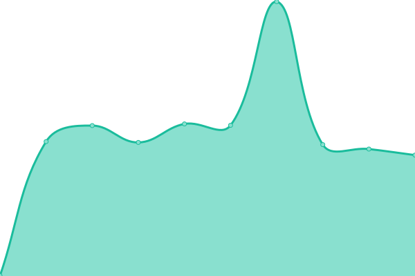 525ms
     
 | 

<a href="https://searx-instances.tiekoetter.com/history/search-undertale-uk">21.01%</a>
    

|  [search.url4irl.com](https://search.url4irl.com/) | 🟩 Up | [search-url4irl-com.yml](https://github.com/tiekoettercom/searx-instances-uptime/commits/HEAD/history/search-url4irl-com.yml) | 

 459ms
     
 | 

<a href="https://searx-instances.tiekoetter.com/history/search-url4irl-com">100.00%</a>
    

|  [searx.ankha.ac](https://searx.ankha.ac/) | 🟩 Up | [searx-ankha-ac.yml](https://github.com/tiekoettercom/searx-instances-uptime/commits/HEAD/history/searx-ankha-ac.yml) | 

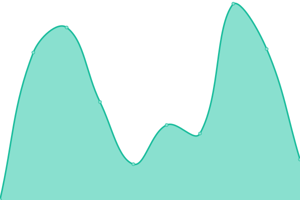 468ms
     
 | 

<a href="https://searx-instances.tiekoetter.com/history/searx-ankha-ac">100.00%</a>
    

|  [searx.dresden.network](https://searx.dresden.network/) | 🟩 Up | [searx-dresden-network.yml](https://github.com/tiekoettercom/searx-instances-uptime/commits/HEAD/history/searx-dresden-network.yml) | 

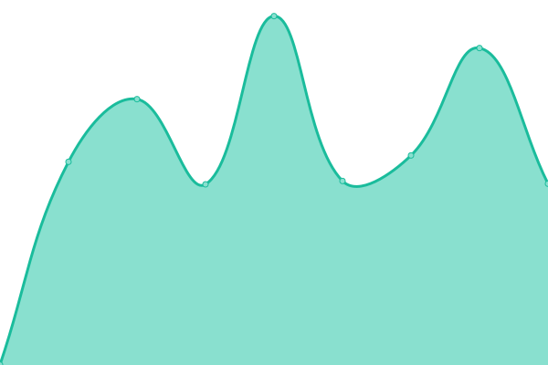 709ms
     
 | 

<a href="https://searx-instances.tiekoetter.com/history/searx-dresden-network">100.00%</a>
    

|  [searx.foobar.vip](https://searx.foobar.vip/) | 🟩 Up | [searx-foobar-vip.yml](https://github.com/tiekoettercom/searx-instances-uptime/commits/HEAD/history/searx-foobar-vip.yml) | 

 623ms
     
 | 

<a href="https://searx-instances.tiekoetter.com/history/searx-foobar-vip">100.00%</a>
    

|  [searx.foss.family](https://searx.foss.family/) | 🟩 Up | [searx-foss-family.yml](https://github.com/tiekoettercom/searx-instances-uptime/commits/HEAD/history/searx-foss-family.yml) | 

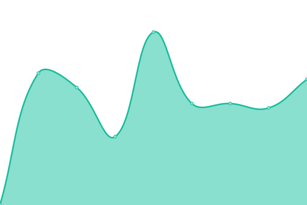 1392ms
     
 | 

<a href="https://searx-instances.tiekoetter.com/history/searx-foss-family">99.71%</a>
    

|  [searx.juancord.xyz](https://searx.juancord.xyz/) | 🟩 Up | [searx-juancord-xyz.yml](https://github.com/tiekoettercom/searx-instances-uptime/commits/HEAD/history/searx-juancord-xyz.yml) | 

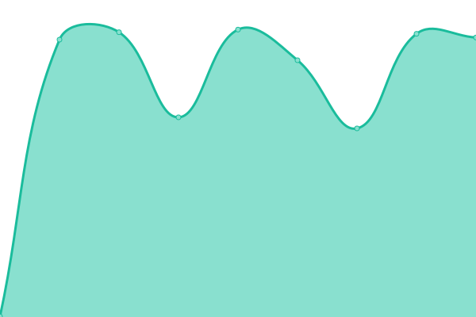 561ms
     
 | 

<a href="https://searx-instances.tiekoetter.com/history/searx-juancord-xyz">100.00%</a>
    

|  [searx.lunar.icu](https://searx.lunar.icu/) | 🟩 Up | [searx-lunar-icu.yml](https://github.com/tiekoettercom/searx-instances-uptime/commits/HEAD/history/searx-lunar-icu.yml) | 

 400ms
     
 | 

<a href="https://searx-instances.tiekoetter.com/history/searx-lunar-icu">99.71%</a>
    

|  [searx.mbuf.net](https://searx.mbuf.net/) | 🟩 Up | [searx-mbuf-net.yml](https://github.com/tiekoettercom/searx-instances-uptime/commits/HEAD/history/searx-mbuf-net.yml) | 

 693ms
     
 | 

<a href="https://searx-instances.tiekoetter.com/history/searx-mbuf-net">99.90%</a>
    

|  [searx.mxchange.org](https://searx.mxchange.org/) | 🟩 Up | [searx-mxchange-org.yml](https://github.com/tiekoettercom/searx-instances-uptime/commits/HEAD/history/searx-mxchange-org.yml) | 

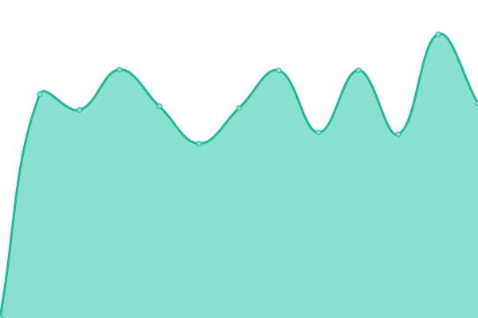 796ms
     
 | 

<a href="https://searx-instances.tiekoetter.com/history/searx-mxchange-org">100.00%</a>
    

|  [searx.namejeff.xyz](https://searx.namejeff.xyz/) | 🟩 Up | [searx-namejeff-xyz.yml](https://github.com/tiekoettercom/searx-instances-uptime/commits/HEAD/history/searx-namejeff-xyz.yml) | 

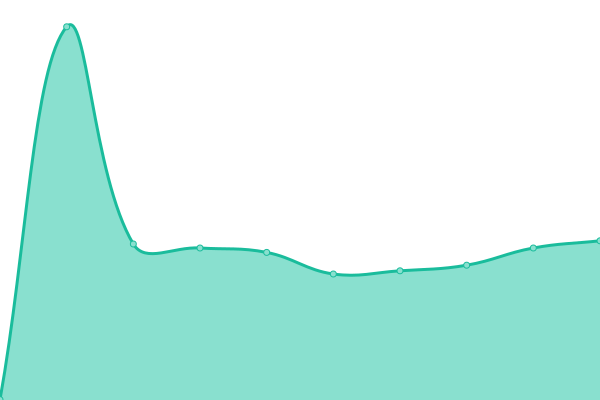 427ms
     
 | 

<a href="https://searx-instances.tiekoetter.com/history/searx-namejeff-xyz">99.49%</a>
    

|  [searx.oloke.xyz](https://searx.oloke.xyz/) | 🟩 Up | [searx-oloke-xyz.yml](https://github.com/tiekoettercom/searx-instances-uptime/commits/HEAD/history/searx-oloke-xyz.yml) | 

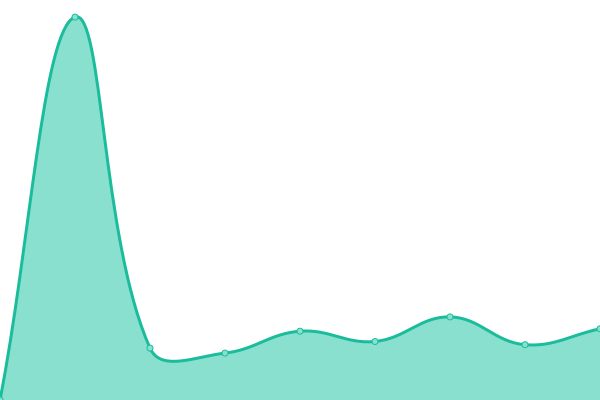 572ms
     
 | 

<a href="https://searx-instances.tiekoetter.com/history/searx-oloke-xyz">99.82%</a>
    

|  [searx.ox2.fr](https://searx.ox2.fr/) | 🟩 Up | [searx-ox2-fr.yml](https://github.com/tiekoettercom/searx-instances-uptime/commits/HEAD/history/searx-ox2-fr.yml) | 

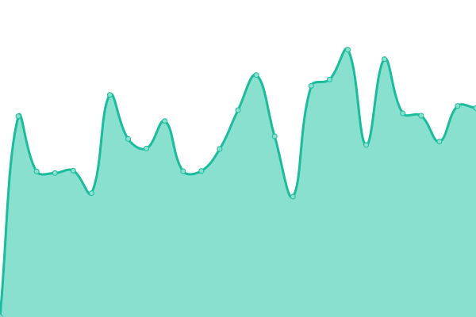 574ms
     
 | 

<a href="https://searx-instances.tiekoetter.com/history/searx-ox2-fr">100.00%</a>
    

|  [searx.party](https://searx.party/) | 🟥 Down | [searx-party.yml](https://github.com/tiekoettercom/searx-instances-uptime/commits/HEAD/history/searx-party.yml) | 

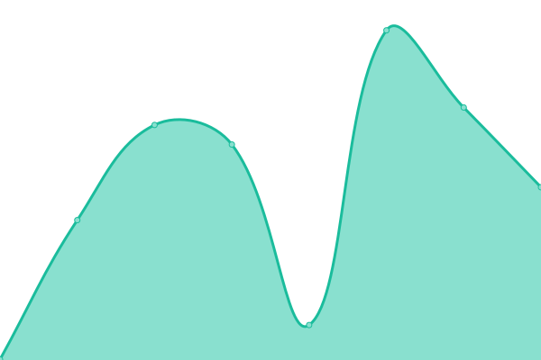 220ms
     
 | 

<a href="https://searx-instances.tiekoetter.com/history/searx-party">36.29%</a>
    

|  [searx.perennialte.ch](https://searx.perennialte.ch/) | 🟩 Up | [searx-perennialte-ch.yml](https://github.com/tiekoettercom/searx-instances-uptime/commits/HEAD/history/searx-perennialte-ch.yml) | 

 824ms
     
 | 

<a href="https://searx-instances.tiekoetter.com/history/searx-perennialte-ch">100.00%</a>
    

|  [searx.ppeb.me](https://searx.ppeb.me/) | 🟩 Up | [searx-ppeb-me.yml](https://github.com/tiekoettercom/searx-instances-uptime/commits/HEAD/history/searx-ppeb-me.yml) | 

 1585ms
     
 | 

<a href="https://searx-instances.tiekoetter.com/history/searx-ppeb-me">100.00%</a>
    

|  [searx.rhscz.eu](https://searx.rhscz.eu/) | 🟩 Up | [searx-rhscz-eu.yml](https://github.com/tiekoettercom/searx-instances-uptime/commits/HEAD/history/searx-rhscz-eu.yml) | 

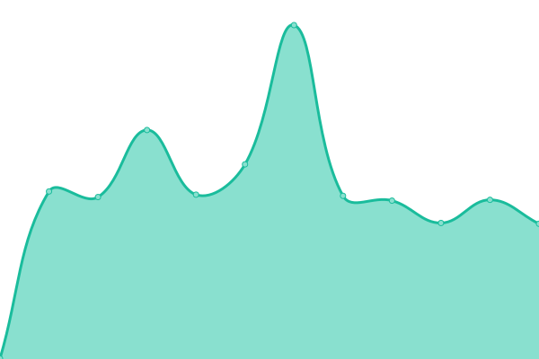 555ms
     
 | 

<a href="https://searx-instances.tiekoetter.com/history/searx-rhscz-eu">99.91%</a>
    

|  [searx.ro](https://searx.ro/) | 🟩 Up | [searx-ro.yml](https://github.com/tiekoettercom/searx-instances-uptime/commits/HEAD/history/searx-ro.yml) | 

 458ms
     
 | 

<a href="https://searx-instances.tiekoetter.com/history/searx-ro">100.00%</a>
    

|  [searx.sev.monster](https://searx.sev.monster/) | 🟩 Up | [searx-sev-monster.yml](https://github.com/tiekoettercom/searx-instances-uptime/commits/HEAD/history/searx-sev-monster.yml) | 

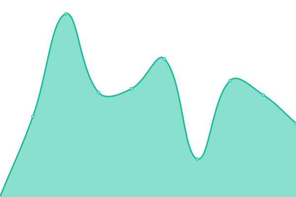 287ms
     
 | 

<a href="https://searx-instances.tiekoetter.com/history/searx-sev-monster">100.00%</a>
    

|  [searx.stream](https://searx.stream/) | 🟩 Up | [searx-stream.yml](https://github.com/tiekoettercom/searx-instances-uptime/commits/HEAD/history/searx-stream.yml) | 

 564ms
     
 | 

<a href="https://searx-instances.tiekoetter.com/history/searx-stream">100.00%</a>
    

|  [searx.tuxcloud.net](https://searx.tuxcloud.net/) | 🟩 Up | [searx-tuxcloud-net.yml](https://github.com/tiekoettercom/searx-instances-uptime/commits/HEAD/history/searx-tuxcloud-net.yml) | 

 490ms
     
 | 

<a href="https://searx-instances.tiekoetter.com/history/searx-tuxcloud-net">100.00%</a>
    

|  [searx.zhenyapav.com](https://searx.zhenyapav.com/) | 🟩 Up | [searx-zhenyapav-com.yml](https://github.com/tiekoettercom/searx-instances-uptime/commits/HEAD/history/searx-zhenyapav-com.yml) | 

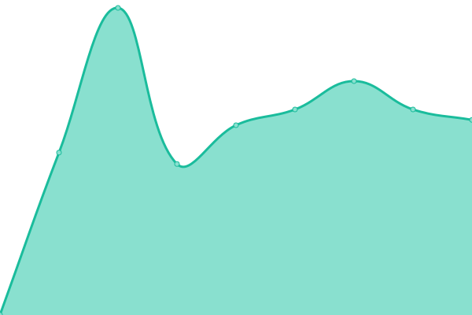 823ms
     
 | 

<a href="https://searx-instances.tiekoetter.com/history/searx-zhenyapav-com">98.72%</a>
    

|  [searxng.biz](https://searxng.biz/) | 🟩 Up | [searxng-biz.yml](https://github.com/tiekoettercom/searx-instances-uptime/commits/HEAD/history/searxng-biz.yml) | 

 2547ms
     
 | 

<a href="https://searx-instances.tiekoetter.com/history/searxng-biz">99.73%</a>
    

|  [searxng.canine.tools](https://searxng.canine.tools/) | 🟩 Up | [searxng-canine-tools.yml](https://github.com/tiekoettercom/searx-instances-uptime/commits/HEAD/history/searxng-canine-tools.yml) | 

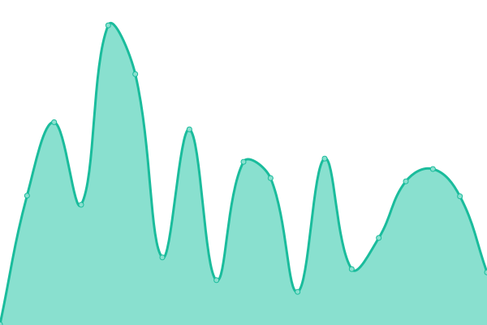 221ms
     
 | 

<a href="https://searx-instances.tiekoetter.com/history/searxng-canine-tools">99.81%</a>
    

|  [searxng.deliberate.world](https://searxng.deliberate.world/) | 🟩 Up | [searxng-deliberate-world.yml](https://github.com/tiekoettercom/searx-instances-uptime/commits/HEAD/history/searxng-deliberate-world.yml) | 

 431ms
     
 | 

<a href="https://searx-instances.tiekoetter.com/history/searxng-deliberate-world">100.00%</a>
    

|  [searxng.f24o.zip](https://searxng.f24o.zip/) | 🟩 Up | [searxng-f24o-zip.yml](https://github.com/tiekoettercom/searx-instances-uptime/commits/HEAD/history/searxng-f24o-zip.yml) | 

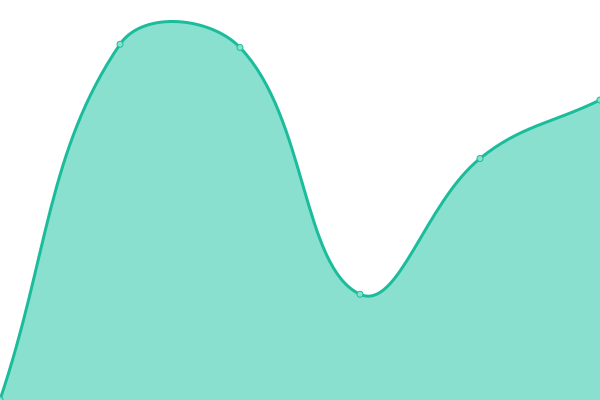 736ms
     
 | 

<a href="https://searx-instances.tiekoetter.com/history/searxng-f24o-zip">98.91%</a>
    

|  [searxng.hweeren.com](https://searxng.hweeren.com/) | 🟩 Up | [searxng-hweeren-com.yml](https://github.com/tiekoettercom/searx-instances-uptime/commits/HEAD/history/searxng-hweeren-com.yml) | 

 724ms
     
 | 

<a href="https://searx-instances.tiekoetter.com/history/searxng-hweeren-com">99.60%</a>
    

|  [searxng.mcgee.red](https://searxng.mcgee.red/) | 🟩 Up | [searxng-mcgee-red.yml](https://github.com/tiekoettercom/searx-instances-uptime/commits/HEAD/history/searxng-mcgee-red.yml) | 

 1189ms
     
 | 

<a href="https://searx-instances.tiekoetter.com/history/searxng-mcgee-red">82.54%</a>
    

|  [searxng.shreven.org](https://searxng.shreven.org/) | 🟩 Up | [searxng-shreven-org.yml](https://github.com/tiekoettercom/searx-instances-uptime/commits/HEAD/history/searxng-shreven-org.yml) | 

 226ms
     
 | 

<a href="https://searx-instances.tiekoetter.com/history/searxng-shreven-org">100.00%</a>
    

|  [searxng.site](https://searxng.site/) | 🟩 Up | [searxng-site.yml](https://github.com/tiekoettercom/searx-instances-uptime/commits/HEAD/history/searxng-site.yml) | 

 414ms
     
 | 

<a href="https://searx-instances.tiekoetter.com/history/searxng-site">100.00%</a>
    

|  [searxng.website](https://searxng.website/) | 🟩 Up | [searxng-website.yml](https://github.com/tiekoettercom/searx-instances-uptime/commits/HEAD/history/searxng-website.yml) | 

 526ms
     
 | 

<a href="https://searx-instances.tiekoetter.com/history/searxng-website">85.18%</a>
    

|  [seek.fyi](https://seek.fyi/) | 🟩 Up | [seek-fyi.yml](https://github.com/tiekoettercom/searx-instances-uptime/commits/HEAD/history/seek-fyi.yml) | 

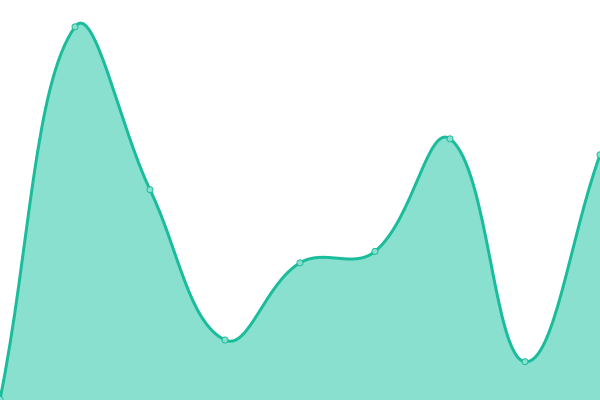 153ms
     
 | 

<a href="https://searx-instances.tiekoetter.com/history/seek-fyi">100.00%</a>
    

|  [sx.catgirl.cloud](https://sx.catgirl.cloud/) | 🟩 Up | [sx-catgirl-cloud.yml](https://github.com/tiekoettercom/searx-instances-uptime/commits/HEAD/history/sx-catgirl-cloud.yml) | 

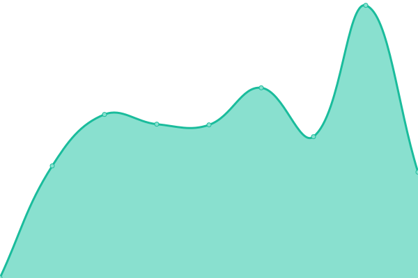 1982ms
     
 | 

<a href="https://searx-instances.tiekoetter.com/history/sx-catgirl-cloud">100.00%</a>
    

|  [www.gruble.de](https://www.gruble.de/) | 🟩 Up | [www-gruble-de.yml](https://github.com/tiekoettercom/searx-instances-uptime/commits/HEAD/history/www-gruble-de.yml) | 

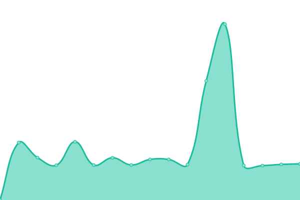 1069ms
     
 | 

<a href="https://searx-instances.tiekoetter.com/history/www-gruble-de">98.90%</a>
    

<!--end: status pages-->

[**Visit our status website →**](https://searx-instances.tiekoetter.com)

## 📄 License

- Powered by: [Upptime](https://github.com/upptime/upptime)
- Code: [MIT](./LICENSE) © [Tiekötter.com](https://www.tiekoetter.com)
- Data in the `./history` directory: [Open Database License](https://opendatacommons.org/licenses/odbl/1-0/)
