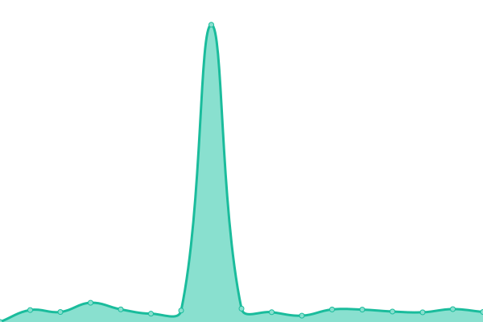
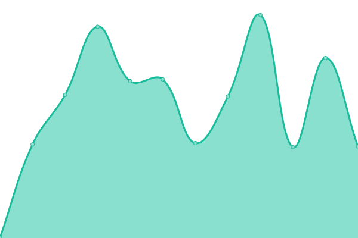
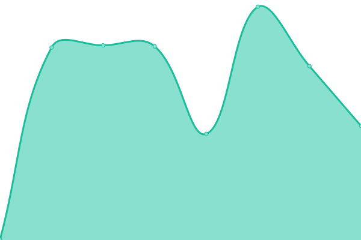

# [📈 Live Status](https://searx-instances.tiekoetter.com): <!--live status--> **🟧 Partial outage**

This repository contains the open-source uptime monitor and status page for [Tiekötter.com](https://www.tiekoetter.com), powered by [Upptime](https://github.com/upptime/upptime).

With [Upptime](https://upptime.js.org), you can get your own unlimited and free uptime monitor and status page, powered entirely by a GitHub repository. We use [Issues](https://github.com/tiekoettercom/searx-instances-uptime/issues) as incident reports, [Actions](https://github.com/tiekoettercom/searx-instances-uptime/actions) as uptime monitors, and [Pages](https://searx-instances.tiekoetter.com) for the status page.

<!--start: status pages-->
<!-- This summary is generated by Upptime (https://github.com/upptime/upptime) -->
<!-- Do not edit this manually, your changes will be overwritten -->
<!-- prettier-ignore -->
| URL | Status | History | Response Time | Uptime |
| --- | ------ | ------- | ------------- | ------ |
|  [searx.tiekoetter.com](https://searx.tiekoetter.com/) | 🟩 Up | [searx-tiekoetter-com.yml](https://github.com/tiekoettercom/searx-instances-uptime/commits/HEAD/history/searx-tiekoetter-com.yml) | 

 728ms
     
 | 

<a href="https://searx-instances.tiekoetter.com/history/searx-tiekoetter-com">100.00%</a>
    

|  [paulgo.io](https://paulgo.io/) | 🟩 Up | [paulgo-io.yml](https://github.com/tiekoettercom/searx-instances-uptime/commits/HEAD/history/paulgo-io.yml) | 

 2755ms
     
 | 

<a href="https://searx-instances.tiekoetter.com/history/paulgo-io">99.33%</a>
    

|  [baresearch.org](https://baresearch.org/) | 🟩 Up | [baresearch-org.yml](https://github.com/tiekoettercom/searx-instances-uptime/commits/HEAD/history/baresearch-org.yml) | 

 276ms
     
 | 

<a href="https://searx-instances.tiekoetter.com/history/baresearch-org">100.00%</a>
    

|  [copp.gg](https://copp.gg/) | 🟩 Up | [copp-gg.yml](https://github.com/tiekoettercom/searx-instances-uptime/commits/HEAD/history/copp-gg.yml) | 

 695ms
     
 | 

<a href="https://searx-instances.tiekoetter.com/history/copp-gg">99.80%</a>
    

|  [etsi.me](https://etsi.me/) | 🟩 Up | [etsi-me.yml](https://github.com/tiekoettercom/searx-instances-uptime/commits/HEAD/history/etsi-me.yml) | 

 324ms
     
 | 

<a href="https://searx-instances.tiekoetter.com/history/etsi-me">100.00%</a>
    

|  [find.xenorio.xyz](https://find.xenorio.xyz/) | 🟩 Up | [find-xenorio-xyz.yml](https://github.com/tiekoettercom/searx-instances-uptime/commits/HEAD/history/find-xenorio-xyz.yml) | 

 495ms
     
 | 

<a href="https://searx-instances.tiekoetter.com/history/find-xenorio-xyz">99.70%</a>
    

|  [kantan.cat](https://kantan.cat/) | 🟩 Up | [kantan-cat.yml](https://github.com/tiekoettercom/searx-instances-uptime/commits/HEAD/history/kantan-cat.yml) | 

 828ms
     
 | 

<a href="https://searx-instances.tiekoetter.com/history/kantan-cat">100.00%</a>
    

|  [o5.gg](https://o5.gg/) | 🟩 Up | [o5-gg.yml](https://github.com/tiekoettercom/searx-instances-uptime/commits/HEAD/history/o5-gg.yml) | 

 481ms
     
 | 

<a href="https://searx-instances.tiekoetter.com/history/o5-gg">99.91%</a>
    

|  [ooglester.com](https://ooglester.com/) | 🟩 Up | [ooglester-com.yml](https://github.com/tiekoettercom/searx-instances-uptime/commits/HEAD/history/ooglester-com.yml) | 

 363ms
     
 | 

<a href="https://searx-instances.tiekoetter.com/history/ooglester-com">100.00%</a>
    

|  [opnxng.com](https://opnxng.com/) | 🟩 Up | [opnxng-com.yml](https://github.com/tiekoettercom/searx-instances-uptime/commits/HEAD/history/opnxng-com.yml) | 

 696ms
     
 | 

<a href="https://searx-instances.tiekoetter.com/history/opnxng-com">99.90%</a>
    

|  [priv.au](https://priv.au/) | 🟩 Up | [priv-au.yml](https://github.com/tiekoettercom/searx-instances-uptime/commits/HEAD/history/priv-au.yml) | 

 904ms
     
 | 

<a href="https://searx-instances.tiekoetter.com/history/priv-au">99.90%</a>
    

|  [s.mble.dk](https://s.mble.dk/) | 🟩 Up | [s-mble-dk.yml](https://github.com/tiekoettercom/searx-instances-uptime/commits/HEAD/history/s-mble-dk.yml) | 

 827ms
     
 | 

<a href="https://searx-instances.tiekoetter.com/history/s-mble-dk">99.61%</a>
    

|  [search.2b9t.xyz](https://search.2b9t.xyz/) | 🟩 Up | [search-2b9t-xyz.yml](https://github.com/tiekoettercom/searx-instances-uptime/commits/HEAD/history/search-2b9t-xyz.yml) | 

 188ms
     
 | 

<a href="https://searx-instances.tiekoetter.com/history/search-2b9t-xyz">100.00%</a>
    

|  [search.abohiccups.com](https://search.abohiccups.com/) | 🟩 Up | [search-abohiccups-com.yml](https://github.com/tiekoettercom/searx-instances-uptime/commits/HEAD/history/search-abohiccups-com.yml) | 

 320ms
     
 | 

<a href="https://searx-instances.tiekoetter.com/history/search-abohiccups-com">99.60%</a>
    

|  [search.anoni.net](https://search.anoni.net/) | 🟩 Up | [search-anoni-net.yml](https://github.com/tiekoettercom/searx-instances-uptime/commits/HEAD/history/search-anoni-net.yml) | 

 615ms
     
 | 

<a href="https://searx-instances.tiekoetter.com/history/search-anoni-net">100.00%</a>
    

|  [search.atl.tools](https://search.atl.tools/) | 🟩 Up | [search-atl-tools.yml](https://github.com/tiekoettercom/searx-instances-uptime/commits/HEAD/history/search-atl-tools.yml) | 

 589ms
     
 | 

<a href="https://searx-instances.tiekoetter.com/history/search-atl-tools">100.00%</a>
    

|  [search.bladerunn.in](https://search.bladerunn.in/) | 🟩 Up | [search-bladerunn-in.yml](https://github.com/tiekoettercom/searx-instances-uptime/commits/HEAD/history/search-bladerunn-in.yml) | 

 832ms
     
 | 

<a href="https://searx-instances.tiekoetter.com/history/search-bladerunn-in">98.70%</a>
    

|  [search.buddyverse.net](https://search.buddyverse.net/) | 🟥 Down | [search-buddyverse-net.yml](https://github.com/tiekoettercom/searx-instances-uptime/commits/HEAD/history/search-buddyverse-net.yml) | 

 83ms
     
 | 

<a href="https://searx-instances.tiekoetter.com/history/search-buddyverse-net">0.00%</a>
    

|  [search.catboy.house](https://search.catboy.house/) | 🟥 Down | [search-catboy-house.yml](https://github.com/tiekoettercom/searx-instances-uptime/commits/HEAD/history/search-catboy-house.yml) | 

 710ms
     
 | 

<a href="https://searx-instances.tiekoetter.com/history/search-catboy-house">84.81%</a>
    

|  [search.charliewhiskey.net](https://search.charliewhiskey.net/) | 🟩 Up | [search-charliewhiskey-net.yml](https://github.com/tiekoettercom/searx-instances-uptime/commits/HEAD/history/search-charliewhiskey-net.yml) | 

 599ms
     
 | 

<a href="https://searx-instances.tiekoetter.com/history/search-charliewhiskey-net">100.00%</a>
    

|  [search.darkness.services](https://search.darkness.services/) | 🟩 Up | [search-darkness-services.yml](https://github.com/tiekoettercom/searx-instances-uptime/commits/HEAD/history/search-darkness-services.yml) | 

 249ms
     
 | 

<a href="https://searx-instances.tiekoetter.com/history/search-darkness-services">99.02%</a>
    

|  [search.einfachzocken.eu](https://search.einfachzocken.eu/) | 🟩 Up | [search-einfachzocken-eu.yml](https://github.com/tiekoettercom/searx-instances-uptime/commits/HEAD/history/search-einfachzocken-eu.yml) | 

 802ms
     
 | 

<a href="https://searx-instances.tiekoetter.com/history/search-einfachzocken-eu">100.00%</a>
    

|  [search.ethibox.fr](https://search.ethibox.fr/) | 🟩 Up | [search-ethibox-fr.yml](https://github.com/tiekoettercom/searx-instances-uptime/commits/HEAD/history/search-ethibox-fr.yml) | 

 910ms
     
 | 

<a href="https://searx-instances.tiekoetter.com/history/search-ethibox-fr">99.31%</a>
    

|  [search.femboy.ad](https://search.femboy.ad/) | 🟩 Up | [search-femboy-ad.yml](https://github.com/tiekoettercom/searx-instances-uptime/commits/HEAD/history/search-femboy-ad.yml) | 

 308ms
     
 | 

<a href="https://searx-instances.tiekoetter.com/history/search-femboy-ad">100.00%</a>
    

|  [search.freestater.org](https://search.freestater.org/) | 🟩 Up | [search-freestater-org.yml](https://github.com/tiekoettercom/searx-instances-uptime/commits/HEAD/history/search-freestater-org.yml) | 

 375ms
     
 | 

<a href="https://searx-instances.tiekoetter.com/history/search-freestater-org">99.92%</a>
    

|  [search.hbubli.cc](https://search.hbubli.cc/) | 🟩 Up | [search-hbubli-cc.yml](https://github.com/tiekoettercom/searx-instances-uptime/commits/HEAD/history/search-hbubli-cc.yml) | 

 451ms
     
 | 

<a href="https://searx-instances.tiekoetter.com/history/search-hbubli-cc">100.00%</a>
    

|  [search.im-in.space](https://search.im-in.space/) | 🟩 Up | [search-im-in-space.yml](https://github.com/tiekoettercom/searx-instances-uptime/commits/HEAD/history/search-im-in-space.yml) | 

 435ms
     
 | 

<a href="https://searx-instances.tiekoetter.com/history/search-im-in-space">100.00%</a>
    

|  [search.indst.eu](https://search.indst.eu/) | 🟩 Up | [search-indst-eu.yml](https://github.com/tiekoettercom/searx-instances-uptime/commits/HEAD/history/search-indst-eu.yml) | 

 793ms
     
 | 

<a href="https://searx-instances.tiekoetter.com/history/search-indst-eu">99.81%</a>
    

|  [search.inetol.net](https://search.inetol.net/) | 🟩 Up | [search-inetol-net.yml](https://github.com/tiekoettercom/searx-instances-uptime/commits/HEAD/history/search-inetol-net.yml) | 

 803ms
     
 | 

<a href="https://searx-instances.tiekoetter.com/history/search-inetol-net">99.80%</a>
    

|  [search.internetsucks.net](https://search.internetsucks.net/) | 🟩 Up | [search-internetsucks-net.yml](https://github.com/tiekoettercom/searx-instances-uptime/commits/HEAD/history/search-internetsucks-net.yml) | 

 962ms
     
 | 

<a href="https://searx-instances.tiekoetter.com/history/search-internetsucks-net">100.00%</a>
    

|  [search.ipsys.bf](https://search.ipsys.bf/) | 🟩 Up | [search-ipsys-bf.yml](https://github.com/tiekoettercom/searx-instances-uptime/commits/HEAD/history/search-ipsys-bf.yml) | 

 2470ms
     
 | 

<a href="https://searx-instances.tiekoetter.com/history/search-ipsys-bf">78.38%</a>
    

|  [search.ipv6s.net](https://search.ipv6s.net/) | 🟩 Up | [search-ipv6s-net.yml](https://github.com/tiekoettercom/searx-instances-uptime/commits/HEAD/history/search-ipv6s-net.yml) | 

 872ms
     
 | 

<a href="https://searx-instances.tiekoetter.com/history/search-ipv6s-net">99.61%</a>
    

|  [search.leptons.xyz](https://search.leptons.xyz/) | 🟩 Up | [search-leptons-xyz.yml](https://github.com/tiekoettercom/searx-instances-uptime/commits/HEAD/history/search-leptons-xyz.yml) | 

 382ms
     
 | 

<a href="https://searx-instances.tiekoetter.com/history/search-leptons-xyz">100.00%</a>
    

|  [search.mdosch.de](https://search.mdosch.de/) | 🟩 Up | [search-mdosch-de.yml](https://github.com/tiekoettercom/searx-instances-uptime/commits/HEAD/history/search-mdosch-de.yml) | 

 666ms
     
 | 

<a href="https://searx-instances.tiekoetter.com/history/search-mdosch-de">100.00%</a>
    

|  [search.oh64.moe](https://search.oh64.moe/) | 🟩 Up | [search-oh64-moe.yml](https://github.com/tiekoettercom/searx-instances-uptime/commits/HEAD/history/search-oh64-moe.yml) | 

 523ms
     
 | 

<a href="https://searx-instances.tiekoetter.com/history/search-oh64-moe">98.12%</a>
    

|  [search.ononoki.org](https://search.ononoki.org/) | 🟩 Up | [search-ononoki-org.yml](https://github.com/tiekoettercom/searx-instances-uptime/commits/HEAD/history/search-ononoki-org.yml) | 

 271ms
     
 | 

<a href="https://searx-instances.tiekoetter.com/history/search-ononoki-org">0.00%</a>
    

|  [search.privacyredirect.com](https://search.privacyredirect.com/) | 🟩 Up | [search-privacyredirect-com.yml](https://github.com/tiekoettercom/searx-instances-uptime/commits/HEAD/history/search-privacyredirect-com.yml) | 

 728ms
     
 | 

<a href="https://searx-instances.tiekoetter.com/history/search-privacyredirect-com">99.70%</a>
    

|  [search.rhscz.eu](https://search.rhscz.eu/) | 🟩 Up | [search-rhscz-eu.yml](https://github.com/tiekoettercom/searx-instances-uptime/commits/HEAD/history/search-rhscz-eu.yml) | 

 544ms
     
 | 

<a href="https://searx-instances.tiekoetter.com/history/search-rhscz-eu">100.00%</a>
    

|  [search.sapti.me](https://search.sapti.me/) | 🟩 Up | [search-sapti-me.yml](https://github.com/tiekoettercom/searx-instances-uptime/commits/HEAD/history/search-sapti-me.yml) | 

 640ms
     
 | 

<a href="https://searx-instances.tiekoetter.com/history/search-sapti-me">100.00%</a>
    

|  [search.undertale.uk](https://search.undertale.uk/) | 🟩 Up | [search-undertale-uk.yml](https://github.com/tiekoettercom/searx-instances-uptime/commits/HEAD/history/search-undertale-uk.yml) | 

 600ms
     
 | 

<a href="https://searx-instances.tiekoetter.com/history/search-undertale-uk">99.90%</a>
    

|  [search.unredacted.org](https://search.unredacted.org/) | 🟩 Up | [search-unredacted-org.yml](https://github.com/tiekoettercom/searx-instances-uptime/commits/HEAD/history/search-unredacted-org.yml) | 

 365ms
     
 | 

<a href="https://searx-instances.tiekoetter.com/history/search-unredacted-org">100.00%</a>
    

|  [search.url4irl.com](https://search.url4irl.com/) | 🟩 Up | [search-url4irl-com.yml](https://github.com/tiekoettercom/searx-instances-uptime/commits/HEAD/history/search-url4irl-com.yml) | 

 767ms
     
 | 

<a href="https://searx-instances.tiekoetter.com/history/search-url4irl-com">100.00%</a>
    

|  [searx.ankha.ac](https://searx.ankha.ac/) | 🟩 Up | [searx-ankha-ac.yml](https://github.com/tiekoettercom/searx-instances-uptime/commits/HEAD/history/searx-ankha-ac.yml) | 

 674ms
     
 | 

<a href="https://searx-instances.tiekoetter.com/history/searx-ankha-ac">99.90%</a>
    

|  [searx.dresden.network](https://searx.dresden.network/) | 🟩 Up | [searx-dresden-network.yml](https://github.com/tiekoettercom/searx-instances-uptime/commits/HEAD/history/searx-dresden-network.yml) | 

 822ms
     
 | 

<a href="https://searx-instances.tiekoetter.com/history/searx-dresden-network">100.00%</a>
    

|  [searx.lunar.icu](https://searx.lunar.icu/) | 🟩 Up | [searx-lunar-icu.yml](https://github.com/tiekoettercom/searx-instances-uptime/commits/HEAD/history/searx-lunar-icu.yml) | 

 462ms
     
 | 

<a href="https://searx-instances.tiekoetter.com/history/searx-lunar-icu">100.00%</a>
    

|  [searx.mbuf.net](https://searx.mbuf.net/) | 🟩 Up | [searx-mbuf-net.yml](https://github.com/tiekoettercom/searx-instances-uptime/commits/HEAD/history/searx-mbuf-net.yml) | 

 630ms
     
 | 

<a href="https://searx-instances.tiekoetter.com/history/searx-mbuf-net">100.00%</a>
    

|  [searx.mxchange.org](https://searx.mxchange.org/) | 🟩 Up | [searx-mxchange-org.yml](https://github.com/tiekoettercom/searx-instances-uptime/commits/HEAD/history/searx-mxchange-org.yml) | 

 1255ms
     
 | 

<a href="https://searx-instances.tiekoetter.com/history/searx-mxchange-org">100.00%</a>
    

|  [searx.namejeff.xyz](https://searx.namejeff.xyz/) | 🟩 Up | [searx-namejeff-xyz.yml](https://github.com/tiekoettercom/searx-instances-uptime/commits/HEAD/history/searx-namejeff-xyz.yml) | 

 411ms
     
 | 

<a href="https://searx-instances.tiekoetter.com/history/searx-namejeff-xyz">100.00%</a>
    

|  [searx.oloke.xyz](https://searx.oloke.xyz/) | 🟩 Up | [searx-oloke-xyz.yml](https://github.com/tiekoettercom/searx-instances-uptime/commits/HEAD/history/searx-oloke-xyz.yml) | 

 615ms
     
 | 

<a href="https://searx-instances.tiekoetter.com/history/searx-oloke-xyz">100.00%</a>
    

|  [searx.ox2.fr](https://searx.ox2.fr/) | 🟩 Up | [searx-ox2-fr.yml](https://github.com/tiekoettercom/searx-instances-uptime/commits/HEAD/history/searx-ox2-fr.yml) | 

 768ms
     
 | 

<a href="https://searx-instances.tiekoetter.com/history/searx-ox2-fr">100.00%</a>
    

|  [searx.party](https://searx.party/) | 🟩 Up | [searx-party.yml](https://github.com/tiekoettercom/searx-instances-uptime/commits/HEAD/history/searx-party.yml) | 

 357ms
     
 | 

<a href="https://searx-instances.tiekoetter.com/history/searx-party">100.00%</a>
    

|  [searx.perennialte.ch](https://searx.perennialte.ch/) | 🟩 Up | [searx-perennialte-ch.yml](https://github.com/tiekoettercom/searx-instances-uptime/commits/HEAD/history/searx-perennialte-ch.yml) | 

 678ms
     
 | 

<a href="https://searx-instances.tiekoetter.com/history/searx-perennialte-ch">100.00%</a>
    

|  [searx.rhscz.eu](https://searx.rhscz.eu/) | 🟩 Up | [searx-rhscz-eu.yml](https://github.com/tiekoettercom/searx-instances-uptime/commits/HEAD/history/searx-rhscz-eu.yml) | 

 551ms
     
 | 

<a href="https://searx-instances.tiekoetter.com/history/searx-rhscz-eu">100.00%</a>
    

|  [searx.ro](https://searx.ro/) | 🟩 Up | [searx-ro.yml](https://github.com/tiekoettercom/searx-instances-uptime/commits/HEAD/history/searx-ro.yml) | 

 551ms
     
 | 

<a href="https://searx-instances.tiekoetter.com/history/searx-ro">100.00%</a>
    

|  [searx.sev.monster](https://searx.sev.monster/) | 🟩 Up | [searx-sev-monster.yml](https://github.com/tiekoettercom/searx-instances-uptime/commits/HEAD/history/searx-sev-monster.yml) | 

 440ms
     
 | 

<a href="https://searx-instances.tiekoetter.com/history/searx-sev-monster">100.00%</a>
    

|  [searx.stream](https://searx.stream/) | 🟩 Up | [searx-stream.yml](https://github.com/tiekoettercom/searx-instances-uptime/commits/HEAD/history/searx-stream.yml) | 

 551ms
     
 | 

<a href="https://searx-instances.tiekoetter.com/history/searx-stream">100.00%</a>
    

|  [searx.tuxcloud.net](https://searx.tuxcloud.net/) | 🟩 Up | [searx-tuxcloud-net.yml](https://github.com/tiekoettercom/searx-instances-uptime/commits/HEAD/history/searx-tuxcloud-net.yml) | 

 599ms
     
 | 

<a href="https://searx-instances.tiekoetter.com/history/searx-tuxcloud-net">100.00%</a>
    

|  [searxng.biz](https://searxng.biz/) | 🟩 Up | [searxng-biz.yml](https://github.com/tiekoettercom/searx-instances-uptime/commits/HEAD/history/searxng-biz.yml) | 

 763ms
     
 | 

<a href="https://searx-instances.tiekoetter.com/history/searxng-biz">100.00%</a>
    

|  [searxng.blockblitz.dev](https://searxng.blockblitz.dev/) | 🟥 Down | [searxng-blockblitz-dev.yml](https://github.com/tiekoettercom/searx-instances-uptime/commits/HEAD/history/searxng-blockblitz-dev.yml) | 

 219ms
     
 | 

<a href="https://searx-instances.tiekoetter.com/history/searxng-blockblitz-dev">60.89%</a>
    

|  [searxng.canine.tools](https://searxng.canine.tools/) | 🟩 Up | [searxng-canine-tools.yml](https://github.com/tiekoettercom/searx-instances-uptime/commits/HEAD/history/searxng-canine-tools.yml) | 

 214ms
     
 | 

<a href="https://searx-instances.tiekoetter.com/history/searxng-canine-tools">100.00%</a>
    

|  [searxng.cups.moe](https://searxng.cups.moe/) | 🟩 Up | [searxng-cups-moe.yml](https://github.com/tiekoettercom/searx-instances-uptime/commits/HEAD/history/searxng-cups-moe.yml) | 

 566ms
     
 | 

<a href="https://searx-instances.tiekoetter.com/history/searxng-cups-moe">100.00%</a>
    

|  [searxng.shreven.org](https://searxng.shreven.org/) | 🟩 Up | [searxng-shreven-org.yml](https://github.com/tiekoettercom/searx-instances-uptime/commits/HEAD/history/searxng-shreven-org.yml) | 

 334ms
     
 | 

<a href="https://searx-instances.tiekoetter.com/history/searxng-shreven-org">100.00%</a>
    

|  [searxng.site](https://searxng.site/) | 🟩 Up | [searxng-site.yml](https://github.com/tiekoettercom/searx-instances-uptime/commits/HEAD/history/searxng-site.yml) | 

 497ms
     
 | 

<a href="https://searx-instances.tiekoetter.com/history/searxng-site">95.54%</a>
    

|  [searxng.website](https://searxng.website/) | 🟩 Up | [searxng-website.yml](https://github.com/tiekoettercom/searx-instances-uptime/commits/HEAD/history/searxng-website.yml) | 

 522ms
     
 | 

<a href="https://searx-instances.tiekoetter.com/history/searxng-website">100.00%</a>
    

|  [seek.fyi](https://seek.fyi/) | 🟩 Up | [seek-fyi.yml](https://github.com/tiekoettercom/searx-instances-uptime/commits/HEAD/history/seek-fyi.yml) | 

 405ms
     
 | 

<a href="https://searx-instances.tiekoetter.com/history/seek-fyi">100.00%</a>
    

|  [sx.catgirl.cloud](https://sx.catgirl.cloud/) | 🟩 Up | [sx-catgirl-cloud.yml](https://github.com/tiekoettercom/searx-instances-uptime/commits/HEAD/history/sx-catgirl-cloud.yml) | 

 771ms
     
 | 

<a href="https://searx-instances.tiekoetter.com/history/sx-catgirl-cloud">100.00%</a>
    

|  [www.gruble.de](https://www.gruble.de/) | 🟩 Up | [www-gruble-de.yml](https://github.com/tiekoettercom/searx-instances-uptime/commits/HEAD/history/www-gruble-de.yml) | 

 794ms
     
 | 

<a href="https://searx-instances.tiekoetter.com/history/www-gruble-de">99.03%</a>
    

<!--end: status pages-->

[**Visit our status website →**](https://searx-instances.tiekoetter.com)

## 📄 License

- Powered by: [Upptime](https://github.com/upptime/upptime)
- Code: [MIT](./LICENSE) © [Tiekötter.com](https://www.tiekoetter.com)
- Data in the `./history` directory: [Open Database License](https://opendatacommons.org/licenses/odbl/1-0/)
