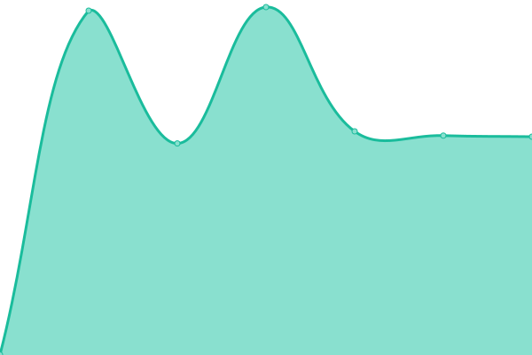

# [📈 Live Status](https://searx-instances.tiekoetter.com): <!--live status--> **🟧 Partial outage**

This repository contains the open-source uptime monitor and status page for [Tiekötter.com](https://www.tiekoetter.com), powered by [Upptime](https://github.com/upptime/upptime).

With [Upptime](https://upptime.js.org), you can get your own unlimited and free uptime monitor and status page, powered entirely by a GitHub repository. We use [Issues](https://github.com/tiekoettercom/searx-instances-uptime/issues) as incident reports, [Actions](https://github.com/tiekoettercom/searx-instances-uptime/actions) as uptime monitors, and [Pages](https://searx-instances.tiekoetter.com) for the status page.

<!--start: status pages-->
<!-- This summary is generated by Upptime (https://github.com/upptime/upptime) -->
<!-- Do not edit this manually, your changes will be overwritten -->
<!-- prettier-ignore -->
| URL | Status | History | Response Time | Uptime |
| --- | ------ | ------- | ------------- | ------ |
|  [searx.tiekoetter.com](https://searx.tiekoetter.com/) | 🟩 Up | [searx-tiekoetter-com.yml](https://github.com/tiekoettercom/searx-instances-uptime/commits/HEAD/history/searx-tiekoetter-com.yml) | 

 712ms
     
 | 

<a href="https://searx-instances.tiekoetter.com/history/searx-tiekoetter-com">99.61%</a>
    

|  [darmarit.org/searx](https://darmarit.org/searx/) | 🟩 Up | [darmarit-org-searx.yml](https://github.com/tiekoettercom/searx-instances-uptime/commits/HEAD/history/darmarit-org-searx.yml) | 

 4567ms
     
 | 

<a href="https://searx-instances.tiekoetter.com/history/darmarit-org-searx">97.84%</a>
    

|  [paulgo.io](https://paulgo.io/) | 🟩 Up | [paulgo-io.yml](https://github.com/tiekoettercom/searx-instances-uptime/commits/HEAD/history/paulgo-io.yml) | 

 694ms
     
 | 

<a href="https://searx-instances.tiekoetter.com/history/paulgo-io">98.62%</a>
    

|  [searx.be](https://searx.be/) | 🟩 Up | [searx-be.yml](https://github.com/tiekoettercom/searx-instances-uptime/commits/HEAD/history/searx-be.yml) | 

 3689ms
     
 | 

<a href="https://searx-instances.tiekoetter.com/history/searx-be">99.91%</a>
    

|  [baresearch.org](https://baresearch.org/) | 🟩 Up | [baresearch-org.yml](https://github.com/tiekoettercom/searx-instances-uptime/commits/HEAD/history/baresearch-org.yml) | 

 297ms
     
 | 

<a href="https://searx-instances.tiekoetter.com/history/baresearch-org">100.00%</a>
    

|  [copp.gg](https://copp.gg/) | 🟩 Up | [copp-gg.yml](https://github.com/tiekoettercom/searx-instances-uptime/commits/HEAD/history/copp-gg.yml) | 

 2665ms
     
 | 

<a href="https://searx-instances.tiekoetter.com/history/copp-gg">91.01%</a>
    

|  [etsi.me](https://etsi.me/) | 🟩 Up | [etsi-me.yml](https://github.com/tiekoettercom/searx-instances-uptime/commits/HEAD/history/etsi-me.yml) | 

 1063ms
     
 | 

<a href="https://searx-instances.tiekoetter.com/history/etsi-me">98.45%</a>
    

|  [fairsuch.net](https://fairsuch.net/) | 🟩 Up | [fairsuch-net.yml](https://github.com/tiekoettercom/searx-instances-uptime/commits/HEAD/history/fairsuch-net.yml) | 

 1367ms
     
 | 

<a href="https://searx-instances.tiekoetter.com/history/fairsuch-net">99.81%</a>
    

|  [kantan.cat](https://kantan.cat/) | 🟩 Up | [kantan-cat.yml](https://github.com/tiekoettercom/searx-instances-uptime/commits/HEAD/history/kantan-cat.yml) | 

 1219ms
     
 | 

<a href="https://searx-instances.tiekoetter.com/history/kantan-cat">98.12%</a>
    

|  [nogoo.me](https://nogoo.me/) | 🟩 Up | [nogoo-me.yml](https://github.com/tiekoettercom/searx-instances-uptime/commits/HEAD/history/nogoo-me.yml) | 

 738ms
     
 | 

<a href="https://searx-instances.tiekoetter.com/history/nogoo-me">99.91%</a>
    

|  [northboot.xyz](https://northboot.xyz/) | 🟥 Down | [northboot-xyz.yml](https://github.com/tiekoettercom/searx-instances-uptime/commits/HEAD/history/northboot-xyz.yml) | 

 2692ms
     
 | 

<a href="https://searx-instances.tiekoetter.com/history/northboot-xyz">98.21%</a>
    

|  [nyc1.sx.ggtyler.dev](https://nyc1.sx.ggtyler.dev/) | 🟩 Up | [nyc1-sx-ggtyler-dev.yml](https://github.com/tiekoettercom/searx-instances-uptime/commits/HEAD/history/nyc1-sx-ggtyler-dev.yml) | 

 619ms
     
 | 

<a href="https://searx-instances.tiekoetter.com/history/nyc1-sx-ggtyler-dev">64.79%</a>
    

|  [ooglester.com](https://ooglester.com/) | 🟩 Up | [ooglester-com.yml](https://github.com/tiekoettercom/searx-instances-uptime/commits/HEAD/history/ooglester-com.yml) | 

 197ms
     
 | 

<a href="https://searx-instances.tiekoetter.com/history/ooglester-com">100.00%</a>
    

|  [opnxng.com](https://opnxng.com/) | 🟩 Up | [opnxng-com.yml](https://github.com/tiekoettercom/searx-instances-uptime/commits/HEAD/history/opnxng-com.yml) | 

 667ms
     
 | 

<a href="https://searx-instances.tiekoetter.com/history/opnxng-com">99.81%</a>
    

|  [priv.au](https://priv.au/) | 🟩 Up | [priv-au.yml](https://github.com/tiekoettercom/searx-instances-uptime/commits/HEAD/history/priv-au.yml) | 

 1002ms
     
 | 

<a href="https://searx-instances.tiekoetter.com/history/priv-au">99.73%</a>
    

|  [s.mble.dk](https://s.mble.dk/) | 🟥 Down | [s-mble-dk.yml](https://github.com/tiekoettercom/searx-instances-uptime/commits/HEAD/history/s-mble-dk.yml) | 

 7690ms
     
 | 

<a href="https://searx-instances.tiekoetter.com/history/s-mble-dk">64.08%</a>
    

|  [search.blitzw.in](https://search.blitzw.in/) | 🟩 Up | [search-blitzw-in.yml](https://github.com/tiekoettercom/searx-instances-uptime/commits/HEAD/history/search-blitzw-in.yml) | 

 599ms
     
 | 

<a href="https://searx-instances.tiekoetter.com/history/search-blitzw-in">100.00%</a>
    

|  [search.bus-hit.me](https://search.bus-hit.me/) | 🟩 Up | [search-bus-hit-me.yml](https://github.com/tiekoettercom/searx-instances-uptime/commits/HEAD/history/search-bus-hit-me.yml) | 

 363ms
     
 | 

<a href="https://searx-instances.tiekoetter.com/history/search-bus-hit-me">99.91%</a>
    

|  [search.canine.tools](https://search.canine.tools/) | 🟩 Up | [search-canine-tools.yml](https://github.com/tiekoettercom/searx-instances-uptime/commits/HEAD/history/search-canine-tools.yml) | 

 334ms
     
 | 

<a href="https://searx-instances.tiekoetter.com/history/search-canine-tools">99.89%</a>
    

|  [search.citw.lgbt](https://search.citw.lgbt/) | 🟩 Up | [search-citw-lgbt.yml](https://github.com/tiekoettercom/searx-instances-uptime/commits/HEAD/history/search-citw-lgbt.yml) | 

 800ms
     
 | 

<a href="https://searx-instances.tiekoetter.com/history/search-citw-lgbt">87.60%</a>
    

|  [search.einfachzocken.eu](https://search.einfachzocken.eu/) | 🟩 Up | [search-einfachzocken-eu.yml](https://github.com/tiekoettercom/searx-instances-uptime/commits/HEAD/history/search-einfachzocken-eu.yml) | 

 1552ms
     
 | 

<a href="https://searx-instances.tiekoetter.com/history/search-einfachzocken-eu">99.90%</a>
    

|  [search.fredix.xyz](https://search.fredix.xyz/) | 🟩 Up | [search-fredix-xyz.yml](https://github.com/tiekoettercom/searx-instances-uptime/commits/HEAD/history/search-fredix-xyz.yml) | 

 585ms
     
 | 

<a href="https://searx-instances.tiekoetter.com/history/search-fredix-xyz">100.00%</a>
    

|  [search.gcomm.ch](https://search.gcomm.ch/) | 🟩 Up | [search-gcomm-ch.yml](https://github.com/tiekoettercom/searx-instances-uptime/commits/HEAD/history/search-gcomm-ch.yml) | 

 494ms
     
 | 

<a href="https://searx-instances.tiekoetter.com/history/search-gcomm-ch">100.00%</a>
    

|  [search.getcobalt.org](https://search.getcobalt.org/) | 🟩 Up | [search-getcobalt-org.yml](https://github.com/tiekoettercom/searx-instances-uptime/commits/HEAD/history/search-getcobalt-org.yml) | 

 1215ms
     
 | 

<a href="https://searx-instances.tiekoetter.com/history/search-getcobalt-org">99.65%</a>
    

|  [search.hbubli.cc](https://search.hbubli.cc/) | 🟩 Up | [search-hbubli-cc.yml](https://github.com/tiekoettercom/searx-instances-uptime/commits/HEAD/history/search-hbubli-cc.yml) | 

 1882ms
     
 | 

<a href="https://searx-instances.tiekoetter.com/history/search-hbubli-cc">99.75%</a>
    

|  [search.im-in.space](https://search.im-in.space/) | 🟩 Up | [search-im-in-space.yml](https://github.com/tiekoettercom/searx-instances-uptime/commits/HEAD/history/search-im-in-space.yml) | 

 468ms
     
 | 

<a href="https://searx-instances.tiekoetter.com/history/search-im-in-space">100.00%</a>
    

|  [search.indst.eu](https://search.indst.eu/) | 🟩 Up | [search-indst-eu.yml](https://github.com/tiekoettercom/searx-instances-uptime/commits/HEAD/history/search-indst-eu.yml) | 

 687ms
     
 | 

<a href="https://searx-instances.tiekoetter.com/history/search-indst-eu">99.91%</a>
    

|  [search.inetol.net](https://search.inetol.net/) | 🟩 Up | [search-inetol-net.yml](https://github.com/tiekoettercom/searx-instances-uptime/commits/HEAD/history/search-inetol-net.yml) | 

 1205ms
     
 | 

<a href="https://searx-instances.tiekoetter.com/history/search-inetol-net">95.32%</a>
    

|  [search.leptons.xyz](https://search.leptons.xyz/) | 🟩 Up | [search-leptons-xyz.yml](https://github.com/tiekoettercom/searx-instances-uptime/commits/HEAD/history/search-leptons-xyz.yml) | 

 415ms
     
 | 

<a href="https://searx-instances.tiekoetter.com/history/search-leptons-xyz">100.00%</a>
    

|  [search.mdosch.de](https://search.mdosch.de/) | 🟩 Up | [search-mdosch-de.yml](https://github.com/tiekoettercom/searx-instances-uptime/commits/HEAD/history/search-mdosch-de.yml) | 

 649ms
     
 | 

<a href="https://searx-instances.tiekoetter.com/history/search-mdosch-de">100.00%</a>
    

|  [search.nadeko.net](https://search.nadeko.net/) | 🟩 Up | [search-nadeko-net.yml](https://github.com/tiekoettercom/searx-instances-uptime/commits/HEAD/history/search-nadeko-net.yml) | 

 507ms
     
 | 

<a href="https://searx-instances.tiekoetter.com/history/search-nadeko-net">100.00%</a>
    

|  [search.nerdvpn.de](https://search.nerdvpn.de/) | 🟩 Up | [search-nerdvpn-de.yml](https://github.com/tiekoettercom/searx-instances-uptime/commits/HEAD/history/search-nerdvpn-de.yml) | 

 808ms
     
 | 

<a href="https://searx-instances.tiekoetter.com/history/search-nerdvpn-de">100.00%</a>
    

|  [search.ngn.tf](https://search.ngn.tf/) | 🟩 Up | [search-ngn-tf.yml](https://github.com/tiekoettercom/searx-instances-uptime/commits/HEAD/history/search-ngn-tf.yml) | 

 939ms
     
 | 

<a href="https://searx-instances.tiekoetter.com/history/search-ngn-tf">96.82%</a>
    

|  [search.nordh.tech](https://search.nordh.tech/) | 🟩 Up | [search-nordh-tech.yml](https://github.com/tiekoettercom/searx-instances-uptime/commits/HEAD/history/search-nordh-tech.yml) | 

 620ms
     
 | 

<a href="https://searx-instances.tiekoetter.com/history/search-nordh-tech">99.71%</a>
    

|  [search.ononoki.org](https://search.ononoki.org/) | 🟩 Up | [search-ononoki-org.yml](https://github.com/tiekoettercom/searx-instances-uptime/commits/HEAD/history/search-ononoki-org.yml) | 

 260ms
     
 | 

<a href="https://searx-instances.tiekoetter.com/history/search-ononoki-org">100.00%</a>
    

|  [search.privacyredirect.com](https://search.privacyredirect.com/) | 🟩 Up | [search-privacyredirect-com.yml](https://github.com/tiekoettercom/searx-instances-uptime/commits/HEAD/history/search-privacyredirect-com.yml) | 

 489ms
     
 | 

<a href="https://searx-instances.tiekoetter.com/history/search-privacyredirect-com">94.85%</a>
    

|  [search.projectsegfau.lt](https://search.projectsegfau.lt/) | 🟩 Up | [search-projectsegfau-lt.yml](https://github.com/tiekoettercom/searx-instances-uptime/commits/HEAD/history/search-projectsegfau-lt.yml) | 

 1302ms
     
 | 

<a href="https://searx-instances.tiekoetter.com/history/search-projectsegfau-lt">93.77%</a>
    

|  [search.rhscz.eu](https://search.rhscz.eu/) | 🟩 Up | [search-rhscz-eu.yml](https://github.com/tiekoettercom/searx-instances-uptime/commits/HEAD/history/search-rhscz-eu.yml) | 

 487ms
     
 | 

<a href="https://searx-instances.tiekoetter.com/history/search-rhscz-eu">100.00%</a>
    

|  [search.rowie.at](https://search.rowie.at/) | 🟩 Up | [search-rowie-at.yml](https://github.com/tiekoettercom/searx-instances-uptime/commits/HEAD/history/search-rowie-at.yml) | 

 770ms
     
 | 

<a href="https://searx-instances.tiekoetter.com/history/search-rowie-at">100.00%</a>
    

|  [search.sapti.me](https://search.sapti.me/) | 🟩 Up | [search-sapti-me.yml](https://github.com/tiekoettercom/searx-instances-uptime/commits/HEAD/history/search-sapti-me.yml) | 

 827ms
     
 | 

<a href="https://searx-instances.tiekoetter.com/history/search-sapti-me">100.00%</a>
    

|  [search.tommy-tran.com](https://search.tommy-tran.com/) | 🟩 Up | [search-tommy-tran-com.yml](https://github.com/tiekoettercom/searx-instances-uptime/commits/HEAD/history/search-tommy-tran-com.yml) | 

 468ms
     
 | 

<a href="https://searx-instances.tiekoetter.com/history/search-tommy-tran-com">100.00%</a>
    

|  [searx.aleteoryx.me](https://searx.aleteoryx.me/) | 🟩 Up | [searx-aleteoryx-me.yml](https://github.com/tiekoettercom/searx-instances-uptime/commits/HEAD/history/searx-aleteoryx-me.yml) | 

 1145ms
     
 | 

<a href="https://searx-instances.tiekoetter.com/history/searx-aleteoryx-me">99.90%</a>
    

|  [searx.ankha.ac](https://searx.ankha.ac/) | 🟩 Up | [searx-ankha-ac.yml](https://github.com/tiekoettercom/searx-instances-uptime/commits/HEAD/history/searx-ankha-ac.yml) | 

 533ms
     
 | 

<a href="https://searx-instances.tiekoetter.com/history/searx-ankha-ac">86.90%</a>
    

|  [searx.colbster937.dev](https://searx.colbster937.dev/) | 🟩 Up | [searx-colbster937-dev.yml](https://github.com/tiekoettercom/searx-instances-uptime/commits/HEAD/history/searx-colbster937-dev.yml) | 

 402ms
     
 | 

<a href="https://searx-instances.tiekoetter.com/history/searx-colbster937-dev">99.91%</a>
    

|  [searx.daetalytica.io](https://searx.daetalytica.io/) | 🟥 Down | [searx-daetalytica-io.yml](https://github.com/tiekoettercom/searx-instances-uptime/commits/HEAD/history/searx-daetalytica-io.yml) | 

 334ms
     
 | 

<a href="https://searx-instances.tiekoetter.com/history/searx-daetalytica-io">68.84%</a>
    

|  [searx.dresden.network](https://searx.dresden.network/) | 🟩 Up | [searx-dresden-network.yml](https://github.com/tiekoettercom/searx-instances-uptime/commits/HEAD/history/searx-dresden-network.yml) | 

 976ms
     
 | 

<a href="https://searx-instances.tiekoetter.com/history/searx-dresden-network">100.00%</a>
    

|  [searx.electroncash.de](https://searx.electroncash.de/) | 🟩 Up | [searx-electroncash-de.yml](https://github.com/tiekoettercom/searx-instances-uptime/commits/HEAD/history/searx-electroncash-de.yml) | 

 843ms
     
 | 

<a href="https://searx-instances.tiekoetter.com/history/searx-electroncash-de">99.90%</a>
    

|  [searx.foss.family](https://searx.foss.family/) | 🟩 Up | [searx-foss-family.yml](https://github.com/tiekoettercom/searx-instances-uptime/commits/HEAD/history/searx-foss-family.yml) | 

 735ms
     
 | 

<a href="https://searx-instances.tiekoetter.com/history/searx-foss-family">100.00%</a>
    

|  [searx.juancord.xyz](https://searx.juancord.xyz/) | 🟩 Up | [searx-juancord-xyz.yml](https://github.com/tiekoettercom/searx-instances-uptime/commits/HEAD/history/searx-juancord-xyz.yml) | 

 444ms
     
 | 

<a href="https://searx-instances.tiekoetter.com/history/searx-juancord-xyz">99.91%</a>
    

|  [searx.lunar.icu](https://searx.lunar.icu/) | 🟩 Up | [searx-lunar-icu.yml](https://github.com/tiekoettercom/searx-instances-uptime/commits/HEAD/history/searx-lunar-icu.yml) | 

 569ms
     
 | 

<a href="https://searx-instances.tiekoetter.com/history/searx-lunar-icu">100.00%</a>
    

|  [searx.mv-software.de](https://searx.mv-software.de/) | 🟩 Up | [searx-mv-software-de.yml](https://github.com/tiekoettercom/searx-instances-uptime/commits/HEAD/history/searx-mv-software-de.yml) | 

 1147ms
     
 | 

<a href="https://searx-instances.tiekoetter.com/history/searx-mv-software-de">100.00%</a>
    

|  [searx.mxchange.org](https://searx.mxchange.org/) | 🟩 Up | [searx-mxchange-org.yml](https://github.com/tiekoettercom/searx-instances-uptime/commits/HEAD/history/searx-mxchange-org.yml) | 

 1754ms
     
 | 

<a href="https://searx-instances.tiekoetter.com/history/searx-mxchange-org">99.22%</a>
    

|  [searx.namejeff.xyz](https://searx.namejeff.xyz/) | 🟩 Up | [searx-namejeff-xyz.yml](https://github.com/tiekoettercom/searx-instances-uptime/commits/HEAD/history/searx-namejeff-xyz.yml) | 

 454ms
     
 | 

<a href="https://searx-instances.tiekoetter.com/history/searx-namejeff-xyz">100.00%</a>
    

|  [searx.nobulart.com](https://searx.nobulart.com/) | 🟩 Up | [searx-nobulart-com.yml](https://github.com/tiekoettercom/searx-instances-uptime/commits/HEAD/history/searx-nobulart-com.yml) | 

 614ms
     
 | 

<a href="https://searx-instances.tiekoetter.com/history/searx-nobulart-com">100.00%</a>
    

|  [searx.oakleycord.dev](https://searx.oakleycord.dev/) | 🟩 Up | [searx-oakleycord-dev.yml](https://github.com/tiekoettercom/searx-instances-uptime/commits/HEAD/history/searx-oakleycord-dev.yml) | 

 248ms
     
 | 

<a href="https://searx-instances.tiekoetter.com/history/searx-oakleycord-dev">100.00%</a>
    

|  [searx.ox2.fr](https://searx.ox2.fr/) | 🟩 Up | [searx-ox2-fr.yml](https://github.com/tiekoettercom/searx-instances-uptime/commits/HEAD/history/searx-ox2-fr.yml) | 

 802ms
     
 | 

<a href="https://searx-instances.tiekoetter.com/history/searx-ox2-fr">99.91%</a>
    

|  [searx.perennialte.ch](https://searx.perennialte.ch/) | 🟩 Up | [searx-perennialte-ch.yml](https://github.com/tiekoettercom/searx-instances-uptime/commits/HEAD/history/searx-perennialte-ch.yml) | 

 1700ms
     
 | 

<a href="https://searx-instances.tiekoetter.com/history/searx-perennialte-ch">100.00%</a>
    

|  [searx.rhscz.eu](https://searx.rhscz.eu/) | 🟩 Up | [searx-rhscz-eu.yml](https://github.com/tiekoettercom/searx-instances-uptime/commits/HEAD/history/searx-rhscz-eu.yml) | 

 575ms
     
 | 

<a href="https://searx-instances.tiekoetter.com/history/searx-rhscz-eu">100.00%</a>
    

|  [searx.ro](https://searx.ro/) | 🟩 Up | [searx-ro.yml](https://github.com/tiekoettercom/searx-instances-uptime/commits/HEAD/history/searx-ro.yml) | 

 593ms
     
 | 

<a href="https://searx-instances.tiekoetter.com/history/searx-ro">100.00%</a>
    

|  [searx.sev.monster](https://searx.sev.monster/) | 🟩 Up | [searx-sev-monster.yml](https://github.com/tiekoettercom/searx-instances-uptime/commits/HEAD/history/searx-sev-monster.yml) | 

 584ms
     
 | 

<a href="https://searx-instances.tiekoetter.com/history/searx-sev-monster">100.00%</a>
    

|  [searx.technicalvoid.dev](https://searx.technicalvoid.dev/) | 🟩 Up | [searx-technicalvoid-dev.yml](https://github.com/tiekoettercom/searx-instances-uptime/commits/HEAD/history/searx-technicalvoid-dev.yml) | 

 573ms
     
 | 

<a href="https://searx-instances.tiekoetter.com/history/searx-technicalvoid-dev">97.94%</a>
    

|  [searx.thefloatinglab.world](https://searx.thefloatinglab.world/) | 🟩 Up | [searx-thefloatinglab-world.yml](https://github.com/tiekoettercom/searx-instances-uptime/commits/HEAD/history/searx-thefloatinglab-world.yml) | 

 6541ms
     
 | 

<a href="https://searx-instances.tiekoetter.com/history/searx-thefloatinglab-world">99.92%</a>
    

|  [searx.tuxcloud.net](https://searx.tuxcloud.net/) | 🟩 Up | [searx-tuxcloud-net.yml](https://github.com/tiekoettercom/searx-instances-uptime/commits/HEAD/history/searx-tuxcloud-net.yml) | 

 797ms
     
 | 

<a href="https://searx-instances.tiekoetter.com/history/searx-tuxcloud-net">100.00%</a>
    

|  [searx.zhenyapav.com](https://searx.zhenyapav.com/) | 🟩 Up | [searx-zhenyapav-com.yml](https://github.com/tiekoettercom/searx-instances-uptime/commits/HEAD/history/searx-zhenyapav-com.yml) | 

 1427ms
     
 | 

<a href="https://searx-instances.tiekoetter.com/history/searx-zhenyapav-com">99.95%</a>
    

|  [searxng.brihx.fr](https://searxng.brihx.fr/) | 🟩 Up | [searxng-brihx-fr.yml](https://github.com/tiekoettercom/searx-instances-uptime/commits/HEAD/history/searxng-brihx-fr.yml) | 

 674ms
     
 | 

<a href="https://searx-instances.tiekoetter.com/history/searxng-brihx-fr">99.90%</a>
    

|  [searxng.ch](https://searxng.ch/) | 🟩 Up | [searxng-ch.yml](https://github.com/tiekoettercom/searx-instances-uptime/commits/HEAD/history/searxng-ch.yml) | 

 518ms
     
 | 

<a href="https://searx-instances.tiekoetter.com/history/searxng-ch">100.00%</a>
    

|  [searxng.hweeren.com](https://searxng.hweeren.com/) | 🟩 Up | [searxng-hweeren-com.yml](https://github.com/tiekoettercom/searx-instances-uptime/commits/HEAD/history/searxng-hweeren-com.yml) | 

 652ms
     
 | 

<a href="https://searx-instances.tiekoetter.com/history/searxng-hweeren-com">100.00%</a>
    

|  [searxng.linuxchad.win](https://searxng.linuxchad.win/) | 🟩 Up | [searxng-linuxchad-win.yml](https://github.com/tiekoettercom/searx-instances-uptime/commits/HEAD/history/searxng-linuxchad-win.yml) | 

 3174ms
     
 | 

<a href="https://searx-instances.tiekoetter.com/history/searxng-linuxchad-win">100.00%</a>
    

|  [searxng.shreven.org](https://searxng.shreven.org/) | 🟩 Up | [searxng-shreven-org.yml](https://github.com/tiekoettercom/searx-instances-uptime/commits/HEAD/history/searxng-shreven-org.yml) | 

 365ms
     
 | 

<a href="https://searx-instances.tiekoetter.com/history/searxng-shreven-org">100.00%</a>
    

|  [seek.fyi](https://seek.fyi/) | 🟩 Up | [seek-fyi.yml](https://github.com/tiekoettercom/searx-instances-uptime/commits/HEAD/history/seek-fyi.yml) | 

 316ms
     
 | 

<a href="https://searx-instances.tiekoetter.com/history/seek-fyi">100.00%</a>
    

|  [skyrimhater.com](https://skyrimhater.com/) | 🟩 Up | [skyrimhater-com.yml](https://github.com/tiekoettercom/searx-instances-uptime/commits/HEAD/history/skyrimhater-com.yml) | 

 249ms
     
 | 

<a href="https://searx-instances.tiekoetter.com/history/skyrimhater-com">99.62%</a>
    

|  [sx.catgirl.cloud](https://sx.catgirl.cloud/) | 🟩 Up | [sx-catgirl-cloud.yml](https://github.com/tiekoettercom/searx-instances-uptime/commits/HEAD/history/sx-catgirl-cloud.yml) | 

 771ms
     
 | 

<a href="https://searx-instances.tiekoetter.com/history/sx-catgirl-cloud">100.00%</a>
    

|  [sx.thatxtreme.dev](https://sx.thatxtreme.dev/) | 🟩 Up | [sx-thatxtreme-dev.yml](https://github.com/tiekoettercom/searx-instances-uptime/commits/HEAD/history/sx-thatxtreme-dev.yml) | 

 889ms
     
 | 

<a href="https://searx-instances.tiekoetter.com/history/sx-thatxtreme-dev">100.00%</a>
    

|  [www.gruble.de](https://www.gruble.de/) | 🟩 Up | [www-gruble-de.yml](https://github.com/tiekoettercom/searx-instances-uptime/commits/HEAD/history/www-gruble-de.yml) | 

 568ms
     
 | 

<a href="https://searx-instances.tiekoetter.com/history/www-gruble-de">100.00%</a>
    

<!--end: status pages-->

[**Visit our status website →**](https://searx-instances.tiekoetter.com)

## 📄 License

- Powered by: [Upptime](https://github.com/upptime/upptime)
- Code: [MIT](./LICENSE) © [Tiekötter.com](https://www.tiekoetter.com)
- Data in the `./history` directory: [Open Database License](https://opendatacommons.org/licenses/odbl/1-0/)
