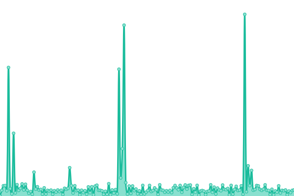

# [📈 Live Status](https://searx-instances.tiekoetter.com): <!--live status--> **🟧 Partial outage**

This repository contains the open-source uptime monitor and status page for [Tiekötter.com](https://www.tiekoetter.com), powered by [Upptime](https://github.com/upptime/upptime).

With [Upptime](https://upptime.js.org), you can get your own unlimited and free uptime monitor and status page, powered entirely by a GitHub repository. We use [Issues](https://github.com/tiekoettercom/searx-instances-uptime/issues) as incident reports, [Actions](https://github.com/tiekoettercom/searx-instances-uptime/actions) as uptime monitors, and [Pages](https://searx-instances.tiekoetter.com) for the status page.

<!--start: status pages-->
<!-- This summary is generated by Upptime (https://github.com/upptime/upptime) -->
<!-- Do not edit this manually, your changes will be overwritten -->
<!-- prettier-ignore -->
| URL | Status | History | Response Time | Uptime |
| --- | ------ | ------- | ------------- | ------ |
|  [searx.tiekoetter.com](https://searx.tiekoetter.com/) | 🟩 Up | [searx-tiekoetter-com.yml](https://github.com/tiekoettercom/searx-instances-uptime/commits/HEAD/history/searx-tiekoetter-com.yml) | 

 794ms
     
 | 

<a href="https://searx-instances.tiekoetter.com/history/searx-tiekoetter-com">100.00%</a>
    

|  [darmarit.org/searx](https://darmarit.org/searx/) | 🟩 Up | [darmarit-org-searx.yml](https://github.com/tiekoettercom/searx-instances-uptime/commits/HEAD/history/darmarit-org-searx.yml) | 

 890ms
     
 | 

<a href="https://searx-instances.tiekoetter.com/history/darmarit-org-searx">100.00%</a>
    

|  [paulgo.io](https://paulgo.io/) | 🟩 Up | [paulgo-io.yml](https://github.com/tiekoettercom/searx-instances-uptime/commits/HEAD/history/paulgo-io.yml) | 

 2316ms
     
 | 

<a href="https://searx-instances.tiekoetter.com/history/paulgo-io">99.83%</a>
    

|  [baresearch.org](https://baresearch.org/) | 🟩 Up | [baresearch-org.yml](https://github.com/tiekoettercom/searx-instances-uptime/commits/HEAD/history/baresearch-org.yml) | 

 401ms
     
 | 

<a href="https://searx-instances.tiekoetter.com/history/baresearch-org">100.00%</a>
    

|  [copp.gg](https://copp.gg/) | 🟩 Up | [copp-gg.yml](https://github.com/tiekoettercom/searx-instances-uptime/commits/HEAD/history/copp-gg.yml) | 

 856ms
     
 | 

<a href="https://searx-instances.tiekoetter.com/history/copp-gg">100.00%</a>
    

|  [etsi.me](https://etsi.me/) | 🟩 Up | [etsi-me.yml](https://github.com/tiekoettercom/searx-instances-uptime/commits/HEAD/history/etsi-me.yml) | 

 349ms
     
 | 

<a href="https://searx-instances.tiekoetter.com/history/etsi-me">100.00%</a>
    

|  [fairsuch.net](https://fairsuch.net/) | 🟩 Up | [fairsuch-net.yml](https://github.com/tiekoettercom/searx-instances-uptime/commits/HEAD/history/fairsuch-net.yml) | 

 791ms
     
 | 

<a href="https://searx-instances.tiekoetter.com/history/fairsuch-net">100.00%</a>
    

|  [find.xenorio.xyz](https://find.xenorio.xyz/) | 🟩 Up | [find-xenorio-xyz.yml](https://github.com/tiekoettercom/searx-instances-uptime/commits/HEAD/history/find-xenorio-xyz.yml) | 

 531ms
     
 | 

<a href="https://searx-instances.tiekoetter.com/history/find-xenorio-xyz">100.00%</a>
    

|  [kantan.cat](https://kantan.cat/) | 🟩 Up | [kantan-cat.yml](https://github.com/tiekoettercom/searx-instances-uptime/commits/HEAD/history/kantan-cat.yml) | 

 1801ms
     
 | 

<a href="https://searx-instances.tiekoetter.com/history/kantan-cat">92.66%</a>
    

|  [metacat.online](https://metacat.online/) | 🟩 Up | [metacat-online.yml](https://github.com/tiekoettercom/searx-instances-uptime/commits/HEAD/history/metacat-online.yml) | 

 697ms
     
 | 

<a href="https://searx-instances.tiekoetter.com/history/metacat-online">100.00%</a>
    

|  [northboot.xyz](https://northboot.xyz/) | 🟩 Up | [northboot-xyz.yml](https://github.com/tiekoettercom/searx-instances-uptime/commits/HEAD/history/northboot-xyz.yml) | 

 851ms
     
 | 

<a href="https://searx-instances.tiekoetter.com/history/northboot-xyz">100.00%</a>
    

|  [nyc1.sx.ggtyler.dev](https://nyc1.sx.ggtyler.dev/) | 🟩 Up | [nyc1-sx-ggtyler-dev.yml](https://github.com/tiekoettercom/searx-instances-uptime/commits/HEAD/history/nyc1-sx-ggtyler-dev.yml) | 

 925ms
     
 | 

<a href="https://searx-instances.tiekoetter.com/history/nyc1-sx-ggtyler-dev">98.91%</a>
    

|  [ooglester.com](https://ooglester.com/) | 🟩 Up | [ooglester-com.yml](https://github.com/tiekoettercom/searx-instances-uptime/commits/HEAD/history/ooglester-com.yml) | 

 199ms
     
 | 

<a href="https://searx-instances.tiekoetter.com/history/ooglester-com">100.00%</a>
    

|  [opnxng.com](https://opnxng.com/) | 🟩 Up | [opnxng-com.yml](https://github.com/tiekoettercom/searx-instances-uptime/commits/HEAD/history/opnxng-com.yml) | 

 759ms
     
 | 

<a href="https://searx-instances.tiekoetter.com/history/opnxng-com">100.00%</a>
    

|  [priv.au](https://priv.au/) | 🟩 Up | [priv-au.yml](https://github.com/tiekoettercom/searx-instances-uptime/commits/HEAD/history/priv-au.yml) | 

 703ms
     
 | 

<a href="https://searx-instances.tiekoetter.com/history/priv-au">99.90%</a>
    

|  [s.datuan.dev](https://s.datuan.dev/) | 🟥 Down | [s-datuan-dev.yml](https://github.com/tiekoettercom/searx-instances-uptime/commits/HEAD/history/s-datuan-dev.yml) | 

 0ms
     
 | 

<a href="https://searx-instances.tiekoetter.com/history/s-datuan-dev">0.00%</a>
    

|  [s.mble.dk](https://s.mble.dk/) | 🟩 Up | [s-mble-dk.yml](https://github.com/tiekoettercom/searx-instances-uptime/commits/HEAD/history/s-mble-dk.yml) | 

 468ms
     
 | 

<a href="https://searx-instances.tiekoetter.com/history/s-mble-dk">43.08%</a>
    

|  [search.080609.xyz](https://search.080609.xyz/) | 🟩 Up | [search-080609-xyz.yml](https://github.com/tiekoettercom/searx-instances-uptime/commits/HEAD/history/search-080609-xyz.yml) | 

 817ms
     
 | 

<a href="https://searx-instances.tiekoetter.com/history/search-080609-xyz">100.00%</a>
    

|  [search.2b9t.xyz](https://search.2b9t.xyz/) | 🟩 Up | [search-2b9t-xyz.yml](https://github.com/tiekoettercom/searx-instances-uptime/commits/HEAD/history/search-2b9t-xyz.yml) | 

 156ms
     
 | 

<a href="https://searx-instances.tiekoetter.com/history/search-2b9t-xyz">91.30%</a>
    

|  [search.ashisgreat.xyz](https://search.ashisgreat.xyz/) | 🟩 Up | [search-ashisgreat-xyz.yml](https://github.com/tiekoettercom/searx-instances-uptime/commits/HEAD/history/search-ashisgreat-xyz.yml) | 

 476ms
     
 | 

<a href="https://searx-instances.tiekoetter.com/history/search-ashisgreat-xyz">100.00%</a>
    

|  [search.buddyverse.net](https://search.buddyverse.net/) | 🟩 Up | [search-buddyverse-net.yml](https://github.com/tiekoettercom/searx-instances-uptime/commits/HEAD/history/search-buddyverse-net.yml) | 

 471ms
     
 | 

<a href="https://searx-instances.tiekoetter.com/history/search-buddyverse-net">100.00%</a>
    

|  [search.canine.tools](https://search.canine.tools/) | 🟩 Up | [search-canine-tools.yml](https://github.com/tiekoettercom/searx-instances-uptime/commits/HEAD/history/search-canine-tools.yml) | 

 466ms
     
 | 

<a href="https://searx-instances.tiekoetter.com/history/search-canine-tools">100.00%</a>
    

|  [search.catboy.house](https://search.catboy.house/) | 🟩 Up | [search-catboy-house.yml](https://github.com/tiekoettercom/searx-instances-uptime/commits/HEAD/history/search-catboy-house.yml) | 

 1193ms
     
 | 

<a href="https://searx-instances.tiekoetter.com/history/search-catboy-house">100.00%</a>
    

|  [search.charliewhiskey.net](https://search.charliewhiskey.net/) | 🟩 Up | [search-charliewhiskey-net.yml](https://github.com/tiekoettercom/searx-instances-uptime/commits/HEAD/history/search-charliewhiskey-net.yml) | 

 718ms
     
 | 

<a href="https://searx-instances.tiekoetter.com/history/search-charliewhiskey-net">100.00%</a>
    

|  [search.citw.lgbt](https://search.citw.lgbt/) | 🟩 Up | [search-citw-lgbt.yml](https://github.com/tiekoettercom/searx-instances-uptime/commits/HEAD/history/search-citw-lgbt.yml) | 

 869ms
     
 | 

<a href="https://searx-instances.tiekoetter.com/history/search-citw-lgbt">85.22%</a>
    

|  [search.einfachzocken.eu](https://search.einfachzocken.eu/) | 🟥 Down | [search-einfachzocken-eu.yml](https://github.com/tiekoettercom/searx-instances-uptime/commits/HEAD/history/search-einfachzocken-eu.yml) | 

 680ms
     
 | 

<a href="https://searx-instances.tiekoetter.com/history/search-einfachzocken-eu">86.61%</a>
    

|  [search.goober.cloud](https://search.goober.cloud/) | 🟥 Down | [search-goober-cloud.yml](https://github.com/tiekoettercom/searx-instances-uptime/commits/HEAD/history/search-goober-cloud.yml) | 

 370ms
     
 | 

<a href="https://searx-instances.tiekoetter.com/history/search-goober-cloud">75.40%</a>
    

|  [search.hbubli.cc](https://search.hbubli.cc/) | 🟩 Up | [search-hbubli-cc.yml](https://github.com/tiekoettercom/searx-instances-uptime/commits/HEAD/history/search-hbubli-cc.yml) | 

 521ms
     
 | 

<a href="https://searx-instances.tiekoetter.com/history/search-hbubli-cc">100.00%</a>
    

|  [search.im-in.space](https://search.im-in.space/) | 🟩 Up | [search-im-in-space.yml](https://github.com/tiekoettercom/searx-instances-uptime/commits/HEAD/history/search-im-in-space.yml) | 

 3245ms
     
 | 

<a href="https://searx-instances.tiekoetter.com/history/search-im-in-space">99.81%</a>
    

|  [search.indst.eu](https://search.indst.eu/) | 🟩 Up | [search-indst-eu.yml](https://github.com/tiekoettercom/searx-instances-uptime/commits/HEAD/history/search-indst-eu.yml) | 

 782ms
     
 | 

<a href="https://searx-instances.tiekoetter.com/history/search-indst-eu">100.00%</a>
    

|  [search.inetol.net](https://search.inetol.net/) | 🟩 Up | [search-inetol-net.yml](https://github.com/tiekoettercom/searx-instances-uptime/commits/HEAD/history/search-inetol-net.yml) | 

 508ms
     
 | 

<a href="https://searx-instances.tiekoetter.com/history/search-inetol-net">100.00%</a>
    

|  [search.ipv6s.net](https://search.ipv6s.net/) | 🟩 Up | [search-ipv6s-net.yml](https://github.com/tiekoettercom/searx-instances-uptime/commits/HEAD/history/search-ipv6s-net.yml) | 

 536ms
     
 | 

<a href="https://searx-instances.tiekoetter.com/history/search-ipv6s-net">100.00%</a>
    

|  [search.leptons.xyz](https://search.leptons.xyz/) | 🟩 Up | [search-leptons-xyz.yml](https://github.com/tiekoettercom/searx-instances-uptime/commits/HEAD/history/search-leptons-xyz.yml) | 

 442ms
     
 | 

<a href="https://searx-instances.tiekoetter.com/history/search-leptons-xyz">100.00%</a>
    

|  [search.librenode.com](https://search.librenode.com/) | 🟥 Down | [search-librenode-com.yml](https://github.com/tiekoettercom/searx-instances-uptime/commits/HEAD/history/search-librenode-com.yml) | 

 0ms
     
 | 

<a href="https://searx-instances.tiekoetter.com/history/search-librenode-com">0.00%</a>
    

|  [search.mdosch.de](https://search.mdosch.de/) | 🟩 Up | [search-mdosch-de.yml](https://github.com/tiekoettercom/searx-instances-uptime/commits/HEAD/history/search-mdosch-de.yml) | 

 639ms
     
 | 

<a href="https://searx-instances.tiekoetter.com/history/search-mdosch-de">88.89%</a>
    

|  [search.nerdvpn.de](https://search.nerdvpn.de/) | 🟩 Up | [search-nerdvpn-de.yml](https://github.com/tiekoettercom/searx-instances-uptime/commits/HEAD/history/search-nerdvpn-de.yml) | 

 856ms
     
 | 

<a href="https://searx-instances.tiekoetter.com/history/search-nerdvpn-de">100.00%</a>
    

|  [search.oh64.moe](https://search.oh64.moe/) | 🟩 Up | [search-oh64-moe.yml](https://github.com/tiekoettercom/searx-instances-uptime/commits/HEAD/history/search-oh64-moe.yml) | 

 855ms
     
 | 

<a href="https://searx-instances.tiekoetter.com/history/search-oh64-moe">92.74%</a>
    

|  [search.ohaa.xyz](https://search.ohaa.xyz/) | 🟩 Up | [search-ohaa-xyz.yml](https://github.com/tiekoettercom/searx-instances-uptime/commits/HEAD/history/search-ohaa-xyz.yml) | 

 687ms
     
 | 

<a href="https://searx-instances.tiekoetter.com/history/search-ohaa-xyz">99.28%</a>
    

|  [search.ononoki.org](https://search.ononoki.org/) | 🟩 Up | [search-ononoki-org.yml](https://github.com/tiekoettercom/searx-instances-uptime/commits/HEAD/history/search-ononoki-org.yml) | 

 295ms
     
 | 

<a href="https://searx-instances.tiekoetter.com/history/search-ononoki-org">92.06%</a>
    

|  [search.privacyredirect.com](https://search.privacyredirect.com/) | 🟩 Up | [search-privacyredirect-com.yml](https://github.com/tiekoettercom/searx-instances-uptime/commits/HEAD/history/search-privacyredirect-com.yml) | 

 531ms
     
 | 

<a href="https://searx-instances.tiekoetter.com/history/search-privacyredirect-com">100.00%</a>
    

|  [search.projectsegfau.lt](https://search.projectsegfau.lt/) | 🟩 Up | [search-projectsegfau-lt.yml](https://github.com/tiekoettercom/searx-instances-uptime/commits/HEAD/history/search-projectsegfau-lt.yml) | 

 2661ms
     
 | 

<a href="https://searx-instances.tiekoetter.com/history/search-projectsegfau-lt">88.87%</a>
    

|  [search.rhscz.eu](https://search.rhscz.eu/) | 🟩 Up | [search-rhscz-eu.yml](https://github.com/tiekoettercom/searx-instances-uptime/commits/HEAD/history/search-rhscz-eu.yml) | 

 574ms
     
 | 

<a href="https://searx-instances.tiekoetter.com/history/search-rhscz-eu">100.00%</a>
    

|  [search.rowie.at](https://search.rowie.at/) | 🟩 Up | [search-rowie-at.yml](https://github.com/tiekoettercom/searx-instances-uptime/commits/HEAD/history/search-rowie-at.yml) | 

 844ms
     
 | 

<a href="https://searx-instances.tiekoetter.com/history/search-rowie-at">100.00%</a>
    

|  [search.sapti.me](https://search.sapti.me/) | 🟩 Up | [search-sapti-me.yml](https://github.com/tiekoettercom/searx-instances-uptime/commits/HEAD/history/search-sapti-me.yml) | 

 720ms
     
 | 

<a href="https://searx-instances.tiekoetter.com/history/search-sapti-me">100.00%</a>
    

|  [search.system51.co.uk](https://search.system51.co.uk/) | 🟩 Up | [search-system51-co-uk.yml](https://github.com/tiekoettercom/searx-instances-uptime/commits/HEAD/history/search-system51-co-uk.yml) | 

 626ms
     
 | 

<a href="https://searx-instances.tiekoetter.com/history/search-system51-co-uk">100.00%</a>
    

|  [search.url4irl.com](https://search.url4irl.com/) | 🟩 Up | [search-url4irl-com.yml](https://github.com/tiekoettercom/searx-instances-uptime/commits/HEAD/history/search-url4irl-com.yml) | 

 581ms
     
 | 

<a href="https://searx-instances.tiekoetter.com/history/search-url4irl-com">100.00%</a>
    

|  [searx.ankha.ac](https://searx.ankha.ac/) | 🟩 Up | [searx-ankha-ac.yml](https://github.com/tiekoettercom/searx-instances-uptime/commits/HEAD/history/searx-ankha-ac.yml) | 

 664ms
     
 | 

<a href="https://searx-instances.tiekoetter.com/history/searx-ankha-ac">100.00%</a>
    

|  [searx.dresden.network](https://searx.dresden.network/) | 🟩 Up | [searx-dresden-network.yml](https://github.com/tiekoettercom/searx-instances-uptime/commits/HEAD/history/searx-dresden-network.yml) | 

 1418ms
     
 | 

<a href="https://searx-instances.tiekoetter.com/history/searx-dresden-network">100.00%</a>
    

|  [searx.foobar.vip](https://searx.foobar.vip/) | 🟩 Up | [searx-foobar-vip.yml](https://github.com/tiekoettercom/searx-instances-uptime/commits/HEAD/history/searx-foobar-vip.yml) | 

 947ms
     
 | 

<a href="https://searx-instances.tiekoetter.com/history/searx-foobar-vip">99.61%</a>
    

|  [searx.foss.family](https://searx.foss.family/) | 🟩 Up | [searx-foss-family.yml](https://github.com/tiekoettercom/searx-instances-uptime/commits/HEAD/history/searx-foss-family.yml) | 

 1285ms
     
 | 

<a href="https://searx-instances.tiekoetter.com/history/searx-foss-family">99.90%</a>
    

|  [searx.juancord.xyz](https://searx.juancord.xyz/) | 🟩 Up | [searx-juancord-xyz.yml](https://github.com/tiekoettercom/searx-instances-uptime/commits/HEAD/history/searx-juancord-xyz.yml) | 

 473ms
     
 | 

<a href="https://searx-instances.tiekoetter.com/history/searx-juancord-xyz">100.00%</a>
    

|  [searx.lunar.icu](https://searx.lunar.icu/) | 🟩 Up | [searx-lunar-icu.yml](https://github.com/tiekoettercom/searx-instances-uptime/commits/HEAD/history/searx-lunar-icu.yml) | 

 550ms
     
 | 

<a href="https://searx-instances.tiekoetter.com/history/searx-lunar-icu">100.00%</a>
    

|  [searx.mbuf.net](https://searx.mbuf.net/) | 🟩 Up | [searx-mbuf-net.yml](https://github.com/tiekoettercom/searx-instances-uptime/commits/HEAD/history/searx-mbuf-net.yml) | 

 715ms
     
 | 

<a href="https://searx-instances.tiekoetter.com/history/searx-mbuf-net">100.00%</a>
    

|  [searx.mxchange.org](https://searx.mxchange.org/) | 🟩 Up | [searx-mxchange-org.yml](https://github.com/tiekoettercom/searx-instances-uptime/commits/HEAD/history/searx-mxchange-org.yml) | 

 934ms
     
 | 

<a href="https://searx-instances.tiekoetter.com/history/searx-mxchange-org">99.25%</a>
    

|  [searx.namejeff.xyz](https://searx.namejeff.xyz/) | 🟩 Up | [searx-namejeff-xyz.yml](https://github.com/tiekoettercom/searx-instances-uptime/commits/HEAD/history/searx-namejeff-xyz.yml) | 

 466ms
     
 | 

<a href="https://searx-instances.tiekoetter.com/history/searx-namejeff-xyz">100.00%</a>
    

|  [searx.oloke.xyz](https://searx.oloke.xyz/) | 🟩 Up | [searx-oloke-xyz.yml](https://github.com/tiekoettercom/searx-instances-uptime/commits/HEAD/history/searx-oloke-xyz.yml) | 

 649ms
     
 | 

<a href="https://searx-instances.tiekoetter.com/history/searx-oloke-xyz">100.00%</a>
    

|  [searx.ox2.fr](https://searx.ox2.fr/) | 🟩 Up | [searx-ox2-fr.yml](https://github.com/tiekoettercom/searx-instances-uptime/commits/HEAD/history/searx-ox2-fr.yml) | 

 785ms
     
 | 

<a href="https://searx-instances.tiekoetter.com/history/searx-ox2-fr">100.00%</a>
    

|  [searx.party](https://searx.party/) | 🟩 Up | [searx-party.yml](https://github.com/tiekoettercom/searx-instances-uptime/commits/HEAD/history/searx-party.yml) | 

 541ms
     
 | 

<a href="https://searx-instances.tiekoetter.com/history/searx-party">99.90%</a>
    

|  [searx.perennialte.ch](https://searx.perennialte.ch/) | 🟩 Up | [searx-perennialte-ch.yml](https://github.com/tiekoettercom/searx-instances-uptime/commits/HEAD/history/searx-perennialte-ch.yml) | 

 603ms
     
 | 

<a href="https://searx-instances.tiekoetter.com/history/searx-perennialte-ch">99.91%</a>
    

|  [searx.ppeb.me](https://searx.ppeb.me/) | 🟩 Up | [searx-ppeb-me.yml](https://github.com/tiekoettercom/searx-instances-uptime/commits/HEAD/history/searx-ppeb-me.yml) | 

 2696ms
     
 | 

<a href="https://searx-instances.tiekoetter.com/history/searx-ppeb-me">100.00%</a>
    

|  [searx.rhscz.eu](https://searx.rhscz.eu/) | 🟩 Up | [searx-rhscz-eu.yml](https://github.com/tiekoettercom/searx-instances-uptime/commits/HEAD/history/searx-rhscz-eu.yml) | 

 542ms
     
 | 

<a href="https://searx-instances.tiekoetter.com/history/searx-rhscz-eu">100.00%</a>
    

|  [searx.ro](https://searx.ro/) | 🟩 Up | [searx-ro.yml](https://github.com/tiekoettercom/searx-instances-uptime/commits/HEAD/history/searx-ro.yml) | 

 560ms
     
 | 

<a href="https://searx-instances.tiekoetter.com/history/searx-ro">100.00%</a>
    

|  [searx.sev.monster](https://searx.sev.monster/) | 🟩 Up | [searx-sev-monster.yml](https://github.com/tiekoettercom/searx-instances-uptime/commits/HEAD/history/searx-sev-monster.yml) | 

 468ms
     
 | 

<a href="https://searx-instances.tiekoetter.com/history/searx-sev-monster">100.00%</a>
    

|  [searx.stream](https://searx.stream/) | 🟩 Up | [searx-stream.yml](https://github.com/tiekoettercom/searx-instances-uptime/commits/HEAD/history/searx-stream.yml) | 

 875ms
     
 | 

<a href="https://searx-instances.tiekoetter.com/history/searx-stream">100.00%</a>
    

|  [searx.thefloatinglab.world](https://searx.thefloatinglab.world/) | 🟩 Up | [searx-thefloatinglab-world.yml](https://github.com/tiekoettercom/searx-instances-uptime/commits/HEAD/history/searx-thefloatinglab-world.yml) | 

 857ms
     
 | 

<a href="https://searx-instances.tiekoetter.com/history/searx-thefloatinglab-world">100.00%</a>
    

|  [searx.tuxcloud.net](https://searx.tuxcloud.net/) | 🟩 Up | [searx-tuxcloud-net.yml](https://github.com/tiekoettercom/searx-instances-uptime/commits/HEAD/history/searx-tuxcloud-net.yml) | 

 774ms
     
 | 

<a href="https://searx-instances.tiekoetter.com/history/searx-tuxcloud-net">100.00%</a>
    

|  [searx.zhenyapav.com](https://searx.zhenyapav.com/) | 🟩 Up | [searx-zhenyapav-com.yml](https://github.com/tiekoettercom/searx-instances-uptime/commits/HEAD/history/searx-zhenyapav-com.yml) | 

 1060ms
     
 | 

<a href="https://searx-instances.tiekoetter.com/history/searx-zhenyapav-com">100.00%</a>
    

|  [searxng.biz](https://searxng.biz/) | 🟩 Up | [searxng-biz.yml](https://github.com/tiekoettercom/searx-instances-uptime/commits/HEAD/history/searxng-biz.yml) | 

 699ms
     
 | 

<a href="https://searx-instances.tiekoetter.com/history/searxng-biz">100.00%</a>
    

|  [searxng.deliberate.world](https://searxng.deliberate.world/) | 🟩 Up | [searxng-deliberate-world.yml](https://github.com/tiekoettercom/searx-instances-uptime/commits/HEAD/history/searxng-deliberate-world.yml) | 

 599ms
     
 | 

<a href="https://searx-instances.tiekoetter.com/history/searxng-deliberate-world">100.00%</a>
    

|  [searxng.f24o.zip](https://searxng.f24o.zip/) | 🟩 Up | [searxng-f24o-zip.yml](https://github.com/tiekoettercom/searx-instances-uptime/commits/HEAD/history/searxng-f24o-zip.yml) | 

 768ms
     
 | 

<a href="https://searx-instances.tiekoetter.com/history/searxng-f24o-zip">100.00%</a>
    

|  [searxng.hweeren.com](https://searxng.hweeren.com/) | 🟩 Up | [searxng-hweeren-com.yml](https://github.com/tiekoettercom/searx-instances-uptime/commits/HEAD/history/searxng-hweeren-com.yml) | 

 717ms
     
 | 

<a href="https://searx-instances.tiekoetter.com/history/searxng-hweeren-com">99.89%</a>
    

|  [searxng.shreven.org](https://searxng.shreven.org/) | 🟩 Up | [searxng-shreven-org.yml](https://github.com/tiekoettercom/searx-instances-uptime/commits/HEAD/history/searxng-shreven-org.yml) | 

 513ms
     
 | 

<a href="https://searx-instances.tiekoetter.com/history/searxng-shreven-org">100.00%</a>
    

|  [searxng.site](https://searxng.site/) | 🟩 Up | [searxng-site.yml](https://github.com/tiekoettercom/searx-instances-uptime/commits/HEAD/history/searxng-site.yml) | 

 500ms
     
 | 

<a href="https://searx-instances.tiekoetter.com/history/searxng-site">84.26%</a>
    

|  [searxng.website](https://searxng.website/) | 🟩 Up | [searxng-website.yml](https://github.com/tiekoettercom/searx-instances-uptime/commits/HEAD/history/searxng-website.yml) | 

 566ms
     
 | 

<a href="https://searx-instances.tiekoetter.com/history/searxng-website">79.07%</a>
    

|  [seek.fyi](https://seek.fyi/) | 🟩 Up | [seek-fyi.yml](https://github.com/tiekoettercom/searx-instances-uptime/commits/HEAD/history/seek-fyi.yml) | 

 431ms
     
 | 

<a href="https://searx-instances.tiekoetter.com/history/seek-fyi">100.00%</a>
    

|  [suche.dasnetzundich.de](https://suche.dasnetzundich.de/) | 🟩 Up | [suche-dasnetzundich-de.yml](https://github.com/tiekoettercom/searx-instances-uptime/commits/HEAD/history/suche-dasnetzundich-de.yml) | 

 768ms
     
 | 

<a href="https://searx-instances.tiekoetter.com/history/suche-dasnetzundich-de">30.90%</a>
    

|  [sx.catgirl.cloud](https://sx.catgirl.cloud/) | 🟩 Up | [sx-catgirl-cloud.yml](https://github.com/tiekoettercom/searx-instances-uptime/commits/HEAD/history/sx-catgirl-cloud.yml) | 

 715ms
     
 | 

<a href="https://searx-instances.tiekoetter.com/history/sx-catgirl-cloud">100.00%</a>
    

|  [www.gruble.de](https://www.gruble.de/) | 🟩 Up | [www-gruble-de.yml](https://github.com/tiekoettercom/searx-instances-uptime/commits/HEAD/history/www-gruble-de.yml) | 

 1454ms
     
 | 

<a href="https://searx-instances.tiekoetter.com/history/www-gruble-de">97.19%</a>
    

<!--end: status pages-->

[**Visit our status website →**](https://searx-instances.tiekoetter.com)

## 📄 License

- Powered by: [Upptime](https://github.com/upptime/upptime)
- Code: [MIT](./LICENSE) © [Tiekötter.com](https://www.tiekoetter.com)
- Data in the `./history` directory: [Open Database License](https://opendatacommons.org/licenses/odbl/1-0/)
