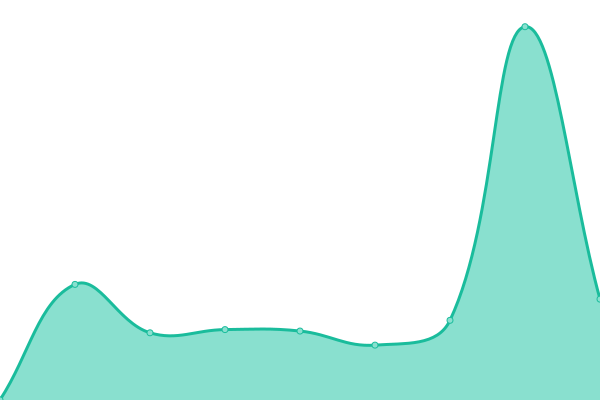

# [📈 Live Status](https://searx-instances.tiekoetter.com): <!--live status--> **🟧 Partial outage**

This repository contains the open-source uptime monitor and status page for [Tiekötter.com](https://www.tiekoetter.com), powered by [Upptime](https://github.com/upptime/upptime).

With [Upptime](https://upptime.js.org), you can get your own unlimited and free uptime monitor and status page, powered entirely by a GitHub repository. We use [Issues](https://github.com/tiekoettercom/searx-instances-uptime/issues) as incident reports, [Actions](https://github.com/tiekoettercom/searx-instances-uptime/actions) as uptime monitors, and [Pages](https://searx-instances.tiekoetter.com) for the status page.

<!--start: status pages-->
<!-- This summary is generated by Upptime (https://github.com/upptime/upptime) -->
<!-- Do not edit this manually, your changes will be overwritten -->
<!-- prettier-ignore -->
| URL | Status | History | Response Time | Uptime |
| --- | ------ | ------- | ------------- | ------ |
|  [searx.tiekoetter.com](https://searx.tiekoetter.com/) | 🟩 Up | [searx-tiekoetter-com.yml](https://github.com/tiekoettercom/searx-instances-uptime/commits/HEAD/history/searx-tiekoetter-com.yml) | 

 671ms
     
 | 

<a href="https://searx-instances.tiekoetter.com/history/searx-tiekoetter-com">100.00%</a>
    

|  [darmarit.org/searx](https://darmarit.org/searx/) | 🟩 Up | [darmarit-org-searx.yml](https://github.com/tiekoettercom/searx-instances-uptime/commits/HEAD/history/darmarit-org-searx.yml) | 

 647ms
     
 | 

<a href="https://searx-instances.tiekoetter.com/history/darmarit-org-searx">100.00%</a>
    

|  [paulgo.io](https://paulgo.io/) | 🟩 Up | [paulgo-io.yml](https://github.com/tiekoettercom/searx-instances-uptime/commits/HEAD/history/paulgo-io.yml) | 

 531ms
     
 | 

<a href="https://searx-instances.tiekoetter.com/history/paulgo-io">100.00%</a>
    

|  [searx.be](https://searx.be/) | 🟩 Up | [searx-be.yml](https://github.com/tiekoettercom/searx-instances-uptime/commits/HEAD/history/searx-be.yml) | 

 703ms
     
 | 

<a href="https://searx-instances.tiekoetter.com/history/searx-be">100.00%</a>
    

|  [331221.xyz](https://331221.xyz/) | 🟩 Up | [331221-xyz.yml](https://github.com/tiekoettercom/searx-instances-uptime/commits/HEAD/history/331221-xyz.yml) | 

 122ms
     
 | 

<a href="https://searx-instances.tiekoetter.com/history/331221-xyz">100.00%</a>
    

|  [baresearch.org](https://baresearch.org/) | 🟩 Up | [baresearch-org.yml](https://github.com/tiekoettercom/searx-instances-uptime/commits/HEAD/history/baresearch-org.yml) | 

 261ms
     
 | 

<a href="https://searx-instances.tiekoetter.com/history/baresearch-org">100.00%</a>
    

|  [copp.gg](https://copp.gg/) | 🟩 Up | [copp-gg.yml](https://github.com/tiekoettercom/searx-instances-uptime/commits/HEAD/history/copp-gg.yml) | 

 248ms
     
 | 

<a href="https://searx-instances.tiekoetter.com/history/copp-gg">100.00%</a>
    

|  [etsi.me](https://etsi.me/) | 🟩 Up | [etsi-me.yml](https://github.com/tiekoettercom/searx-instances-uptime/commits/HEAD/history/etsi-me.yml) | 

 235ms
     
 | 

<a href="https://searx-instances.tiekoetter.com/history/etsi-me">99.72%</a>
    

|  [fgiggle.com](https://fgiggle.com/) | 🟩 Up | [fgiggle-com.yml](https://github.com/tiekoettercom/searx-instances-uptime/commits/HEAD/history/fgiggle-com.yml) | 

 377ms
     
 | 

<a href="https://searx-instances.tiekoetter.com/history/fgiggle-com">100.00%</a>
    

|  [find.m3wz.su](https://find.m3wz.su/) | 🟩 Up | [find-m3wz-su.yml](https://github.com/tiekoettercom/searx-instances-uptime/commits/HEAD/history/find-m3wz-su.yml) | 

 855ms
     
 | 

<a href="https://searx-instances.tiekoetter.com/history/find-m3wz-su">99.91%</a>
    

|  [freesearch.club](https://freesearch.club/) | 🟩 Up | [freesearch-club.yml](https://github.com/tiekoettercom/searx-instances-uptime/commits/HEAD/history/freesearch-club.yml) | 

 413ms
     
 | 

<a href="https://searx-instances.tiekoetter.com/history/freesearch-club">100.00%</a>
    

|  [northboot.xyz](https://northboot.xyz/) | 🟩 Up | [northboot-xyz.yml](https://github.com/tiekoettercom/searx-instances-uptime/commits/HEAD/history/northboot-xyz.yml) | 

 1179ms
     
 | 

<a href="https://searx-instances.tiekoetter.com/history/northboot-xyz">99.80%</a>
    

|  [nyc1.sx.ggtyler.dev](https://nyc1.sx.ggtyler.dev/) | 🟩 Up | [nyc1-sx-ggtyler-dev.yml](https://github.com/tiekoettercom/searx-instances-uptime/commits/HEAD/history/nyc1-sx-ggtyler-dev.yml) | 

 277ms
     
 | 

<a href="https://searx-instances.tiekoetter.com/history/nyc1-sx-ggtyler-dev">99.11%</a>
    

|  [offtheradar.info](https://offtheradar.info/) | 🟩 Up | [offtheradar-info.yml](https://github.com/tiekoettercom/searx-instances-uptime/commits/HEAD/history/offtheradar-info.yml) | 

 346ms
     
 | 

<a href="https://searx-instances.tiekoetter.com/history/offtheradar-info">100.00%</a>
    

|  [ooglester.com](https://ooglester.com/) | 🟩 Up | [ooglester-com.yml](https://github.com/tiekoettercom/searx-instances-uptime/commits/HEAD/history/ooglester-com.yml) | 

 256ms
     
 | 

<a href="https://searx-instances.tiekoetter.com/history/ooglester-com">99.92%</a>
    

|  [opnxng.com](https://opnxng.com/) | 🟥 Down | [opnxng-com.yml](https://github.com/tiekoettercom/searx-instances-uptime/commits/HEAD/history/opnxng-com.yml) | 

 1106ms
     
 | 

<a href="https://searx-instances.tiekoetter.com/history/opnxng-com">99.88%</a>
    

|  [priv.au](https://priv.au/) | 🟩 Up | [priv-au.yml](https://github.com/tiekoettercom/searx-instances-uptime/commits/HEAD/history/priv-au.yml) | 

 715ms
     
 | 

<a href="https://searx-instances.tiekoetter.com/history/priv-au">97.23%</a>
    

|  [s.trung.fun](https://s.trung.fun/) | 🟩 Up | [s-trung-fun.yml](https://github.com/tiekoettercom/searx-instances-uptime/commits/HEAD/history/s-trung-fun.yml) | 

 1105ms
     
 | 

<a href="https://searx-instances.tiekoetter.com/history/s-trung-fun">100.00%</a>
    

|  [search.bus-hit.me](https://search.bus-hit.me/) | 🟩 Up | [search-bus-hit-me.yml](https://github.com/tiekoettercom/searx-instances-uptime/commits/HEAD/history/search-bus-hit-me.yml) | 

 342ms
     
 | 

<a href="https://searx-instances.tiekoetter.com/history/search-bus-hit-me">100.00%</a>
    

|  [search.citw.lgbt](https://search.citw.lgbt/) | 🟩 Up | [search-citw-lgbt.yml](https://github.com/tiekoettercom/searx-instances-uptime/commits/HEAD/history/search-citw-lgbt.yml) | 

 491ms
     
 | 

<a href="https://searx-instances.tiekoetter.com/history/search-citw-lgbt">100.00%</a>
    

|  [search.demoniak.ch](https://search.demoniak.ch/) | 🟩 Up | [search-demoniak-ch.yml](https://github.com/tiekoettercom/searx-instances-uptime/commits/HEAD/history/search-demoniak-ch.yml) | 

 518ms
     
 | 

<a href="https://searx-instances.tiekoetter.com/history/search-demoniak-ch">99.80%</a>
    

|  [search.disroot.org](https://search.disroot.org/) | 🟩 Up | [search-disroot-org.yml](https://github.com/tiekoettercom/searx-instances-uptime/commits/HEAD/history/search-disroot-org.yml) | 

 828ms
     
 | 

<a href="https://searx-instances.tiekoetter.com/history/search-disroot-org">100.00%</a>
    

|  [search.dojoro.de](https://search.dojoro.de/) | 🟩 Up | [search-dojoro-de.yml](https://github.com/tiekoettercom/searx-instances-uptime/commits/HEAD/history/search-dojoro-de.yml) | 

 816ms
     
 | 

<a href="https://searx-instances.tiekoetter.com/history/search-dojoro-de">99.62%</a>
    

|  [search.fawkesguy.com](https://search.fawkesguy.com/) | 🟩 Up | [search-fawkesguy-com.yml](https://github.com/tiekoettercom/searx-instances-uptime/commits/HEAD/history/search-fawkesguy-com.yml) | 

 86ms
     
 | 

<a href="https://searx-instances.tiekoetter.com/history/search-fawkesguy-com">100.00%</a>
    

|  [search.gcomm.ch](https://search.gcomm.ch/) | 🟩 Up | [search-gcomm-ch.yml](https://github.com/tiekoettercom/searx-instances-uptime/commits/HEAD/history/search-gcomm-ch.yml) | 

 481ms
     
 | 

<a href="https://searx-instances.tiekoetter.com/history/search-gcomm-ch">100.00%</a>
    

|  [search.hbubli.cc](https://search.hbubli.cc/) | 🟩 Up | [search-hbubli-cc.yml](https://github.com/tiekoettercom/searx-instances-uptime/commits/HEAD/history/search-hbubli-cc.yml) | 

 420ms
     
 | 

<a href="https://searx-instances.tiekoetter.com/history/search-hbubli-cc">99.80%</a>
    

|  [search.im-in.space](https://search.im-in.space/) | 🟩 Up | [search-im-in-space.yml](https://github.com/tiekoettercom/searx-instances-uptime/commits/HEAD/history/search-im-in-space.yml) | 

 387ms
     
 | 

<a href="https://searx-instances.tiekoetter.com/history/search-im-in-space">100.00%</a>
    

|  [search.in.projectsegfau.lt](https://search.in.projectsegfau.lt/) | 🟩 Up | [search-in-projectsegfau-lt.yml](https://github.com/tiekoettercom/searx-instances-uptime/commits/HEAD/history/search-in-projectsegfau-lt.yml) | 

 1631ms
     
 | 

<a href="https://searx-instances.tiekoetter.com/history/search-in-projectsegfau-lt">95.93%</a>
    

|  [search.inetol.net](https://search.inetol.net/) | 🟩 Up | [search-inetol-net.yml](https://github.com/tiekoettercom/searx-instances-uptime/commits/HEAD/history/search-inetol-net.yml) | 

 376ms
     
 | 

<a href="https://searx-instances.tiekoetter.com/history/search-inetol-net">99.90%</a>
    

|  [search.laksith.dev](https://search.laksith.dev/) | 🟩 Up | [search-laksith-dev.yml](https://github.com/tiekoettercom/searx-instances-uptime/commits/HEAD/history/search-laksith-dev.yml) | 

 362ms
     
 | 

<a href="https://searx-instances.tiekoetter.com/history/search-laksith-dev">100.00%</a>
    

|  [search.leptons.xyz](https://search.leptons.xyz/) | 🟩 Up | [search-leptons-xyz.yml](https://github.com/tiekoettercom/searx-instances-uptime/commits/HEAD/history/search-leptons-xyz.yml) | 

 312ms
     
 | 

<a href="https://searx-instances.tiekoetter.com/history/search-leptons-xyz">100.00%</a>
    

|  [search.lvkaszus.pl](https://search.lvkaszus.pl/) | 🟩 Up | [search-lvkaszus-pl.yml](https://github.com/tiekoettercom/searx-instances-uptime/commits/HEAD/history/search-lvkaszus-pl.yml) | 

 954ms
     
 | 

<a href="https://searx-instances.tiekoetter.com/history/search-lvkaszus-pl">99.32%</a>
    

|  [search.mdosch.de](https://search.mdosch.de/) | 🟩 Up | [search-mdosch-de.yml](https://github.com/tiekoettercom/searx-instances-uptime/commits/HEAD/history/search-mdosch-de.yml) | 

 656ms
     
 | 

<a href="https://searx-instances.tiekoetter.com/history/search-mdosch-de">100.00%</a>
    

|  [search.modalogi.com](https://search.modalogi.com/) | 🟩 Up | [search-modalogi-com.yml](https://github.com/tiekoettercom/searx-instances-uptime/commits/HEAD/history/search-modalogi-com.yml) | 

 521ms
     
 | 

<a href="https://searx-instances.tiekoetter.com/history/search-modalogi-com">100.00%</a>
    

|  [search.ononoki.org](https://search.ononoki.org/) | 🟩 Up | [search-ononoki-org.yml](https://github.com/tiekoettercom/searx-instances-uptime/commits/HEAD/history/search-ononoki-org.yml) | 

 1058ms
     
 | 

<a href="https://searx-instances.tiekoetter.com/history/search-ononoki-org">99.80%</a>
    

|  [search.ovh](https://search.ovh/) | 🟩 Up | [search-ovh.yml](https://github.com/tiekoettercom/searx-instances-uptime/commits/HEAD/history/search-ovh.yml) | 

 409ms
     
 | 

<a href="https://searx-instances.tiekoetter.com/history/search-ovh">100.00%</a>
    

|  [search.projectsegfau.lt](https://search.projectsegfau.lt/) | 🟩 Up | [search-projectsegfau-lt.yml](https://github.com/tiekoettercom/searx-instances-uptime/commits/HEAD/history/search-projectsegfau-lt.yml) | 

 792ms
     
 | 

<a href="https://searx-instances.tiekoetter.com/history/search-projectsegfau-lt">99.21%</a>
    

|  [search.rabbit-company.com](https://search.rabbit-company.com/) | 🟩 Up | [search-rabbit-company-com.yml](https://github.com/tiekoettercom/searx-instances-uptime/commits/HEAD/history/search-rabbit-company-com.yml) | 

 449ms
     
 | 

<a href="https://searx-instances.tiekoetter.com/history/search-rabbit-company-com">100.00%</a>
    

|  [search.rhscz.eu](https://search.rhscz.eu/) | 🟩 Up | [search-rhscz-eu.yml](https://github.com/tiekoettercom/searx-instances-uptime/commits/HEAD/history/search-rhscz-eu.yml) | 

 494ms
     
 | 

<a href="https://searx-instances.tiekoetter.com/history/search-rhscz-eu">99.80%</a>
    

|  [search.rowie.at](https://search.rowie.at/) | 🟩 Up | [search-rowie-at.yml](https://github.com/tiekoettercom/searx-instances-uptime/commits/HEAD/history/search-rowie-at.yml) | 

 688ms
     
 | 

<a href="https://searx-instances.tiekoetter.com/history/search-rowie-at">100.00%</a>
    

|  [search.sapti.me](https://search.sapti.me/) | 🟩 Up | [search-sapti-me.yml](https://github.com/tiekoettercom/searx-instances-uptime/commits/HEAD/history/search-sapti-me.yml) | 

 566ms
     
 | 

<a href="https://searx-instances.tiekoetter.com/history/search-sapti-me">100.00%</a>
    

|  [search.smnz.de](https://search.smnz.de/) | 🟩 Up | [search-smnz-de.yml](https://github.com/tiekoettercom/searx-instances-uptime/commits/HEAD/history/search-smnz-de.yml) | 

 828ms
     
 | 

<a href="https://searx-instances.tiekoetter.com/history/search-smnz-de">99.60%</a>
    

|  [search.whateveritworks.org](https://search.whateveritworks.org/) | 🟩 Up | [search-whateveritworks-org.yml](https://github.com/tiekoettercom/searx-instances-uptime/commits/HEAD/history/search-whateveritworks-org.yml) | 

 556ms
     
 | 

<a href="https://searx-instances.tiekoetter.com/history/search-whateveritworks-org">100.00%</a>
    

|  [search.zzls.xyz](https://search.zzls.xyz/) | 🟩 Up | [search-zzls-xyz.yml](https://github.com/tiekoettercom/searx-instances-uptime/commits/HEAD/history/search-zzls-xyz.yml) | 

 452ms
     
 | 

<a href="https://searx-instances.tiekoetter.com/history/search-zzls-xyz">100.00%</a>
    

|  [searx.baczek.me](https://searx.baczek.me/) | 🟩 Up | [searx-baczek-me.yml](https://github.com/tiekoettercom/searx-instances-uptime/commits/HEAD/history/searx-baczek-me.yml) | 

 559ms
     
 | 

<a href="https://searx-instances.tiekoetter.com/history/searx-baczek-me">100.00%</a>
    

|  [searx.catfluori.de](https://searx.catfluori.de/) | 🟩 Up | [searx-catfluori-de.yml](https://github.com/tiekoettercom/searx-instances-uptime/commits/HEAD/history/searx-catfluori-de.yml) | 

 448ms
     
 | 

<a href="https://searx-instances.tiekoetter.com/history/searx-catfluori-de">100.00%</a>
    

|  [searx.cthd.icu](https://searx.cthd.icu/) | 🟩 Up | [searx-cthd-icu.yml](https://github.com/tiekoettercom/searx-instances-uptime/commits/HEAD/history/searx-cthd-icu.yml) | 

 841ms
     
 | 

<a href="https://searx-instances.tiekoetter.com/history/searx-cthd-icu">51.70%</a>
    

|  [searx.daetalytica.io](https://searx.daetalytica.io/) | 🟩 Up | [searx-daetalytica-io.yml](https://github.com/tiekoettercom/searx-instances-uptime/commits/HEAD/history/searx-daetalytica-io.yml) | 

 219ms
     
 | 

<a href="https://searx-instances.tiekoetter.com/history/searx-daetalytica-io">100.00%</a>
    

|  [searx.divided-by-zero.eu](https://searx.divided-by-zero.eu/) | 🟩 Up | [searx-divided-by-zero-eu.yml](https://github.com/tiekoettercom/searx-instances-uptime/commits/HEAD/history/searx-divided-by-zero-eu.yml) | 

 617ms
     
 | 

<a href="https://searx-instances.tiekoetter.com/history/searx-divided-by-zero-eu">100.00%</a>
    

|  [searx.fmac.xyz](https://searx.fmac.xyz/) | 🟩 Up | [searx-fmac-xyz.yml](https://github.com/tiekoettercom/searx-instances-uptime/commits/HEAD/history/searx-fmac-xyz.yml) | 

 759ms
     
 | 

<a href="https://searx-instances.tiekoetter.com/history/searx-fmac-xyz">82.67%</a>
    

|  [searx.headpat.exchange](https://searx.headpat.exchange/) | 🟩 Up | [searx-headpat-exchange.yml](https://github.com/tiekoettercom/searx-instances-uptime/commits/HEAD/history/searx-headpat-exchange.yml) | 

 844ms
     
 | 

<a href="https://searx-instances.tiekoetter.com/history/searx-headpat-exchange">99.91%</a>
    

|  [searx.juancord.xyz](https://searx.juancord.xyz/) | 🟩 Up | [searx-juancord-xyz.yml](https://github.com/tiekoettercom/searx-instances-uptime/commits/HEAD/history/searx-juancord-xyz.yml) | 

 492ms
     
 | 

<a href="https://searx-instances.tiekoetter.com/history/searx-juancord-xyz">100.00%</a>
    

|  [searx.kutay.dev](https://searx.kutay.dev/) | 🟩 Up | [searx-kutay-dev.yml](https://github.com/tiekoettercom/searx-instances-uptime/commits/HEAD/history/searx-kutay-dev.yml) | 

 366ms
     
 | 

<a href="https://searx-instances.tiekoetter.com/history/searx-kutay-dev">100.00%</a>
    

|  [searx.mha.fi](https://searx.mha.fi/) | 🟥 Down | [searx-mha-fi.yml](https://github.com/tiekoettercom/searx-instances-uptime/commits/HEAD/history/searx-mha-fi.yml) | 

 409ms
     
 | 

<a href="https://searx-instances.tiekoetter.com/history/searx-mha-fi">91.84%</a>
    

|  [searx.namejeff.xyz](https://searx.namejeff.xyz/) | 🟩 Up | [searx-namejeff-xyz.yml](https://github.com/tiekoettercom/searx-instances-uptime/commits/HEAD/history/searx-namejeff-xyz.yml) | 

 371ms
     
 | 

<a href="https://searx-instances.tiekoetter.com/history/searx-namejeff-xyz">100.00%</a>
    

|  [searx.nobulart.com](https://searx.nobulart.com/) | 🟩 Up | [searx-nobulart-com.yml](https://github.com/tiekoettercom/searx-instances-uptime/commits/HEAD/history/searx-nobulart-com.yml) | 

 481ms
     
 | 

<a href="https://searx-instances.tiekoetter.com/history/searx-nobulart-com">99.80%</a>
    

|  [searx.oakleycord.dev](https://searx.oakleycord.dev/) | 🟩 Up | [searx-oakleycord-dev.yml](https://github.com/tiekoettercom/searx-instances-uptime/commits/HEAD/history/searx-oakleycord-dev.yml) | 

 122ms
     
 | 

<a href="https://searx-instances.tiekoetter.com/history/searx-oakleycord-dev">100.00%</a>
    

|  [searx.ox2.fr](https://searx.ox2.fr/) | 🟩 Up | [searx-ox2-fr.yml](https://github.com/tiekoettercom/searx-instances-uptime/commits/HEAD/history/searx-ox2-fr.yml) | 

 773ms
     
 | 

<a href="https://searx-instances.tiekoetter.com/history/searx-ox2-fr">100.00%</a>
    

|  [searx.perennialte.ch](https://searx.perennialte.ch/) | 🟩 Up | [searx-perennialte-ch.yml](https://github.com/tiekoettercom/searx-instances-uptime/commits/HEAD/history/searx-perennialte-ch.yml) | 

 751ms
     
 | 

<a href="https://searx-instances.tiekoetter.com/history/searx-perennialte-ch">100.00%</a>
    

|  [searx.prvcy.eu](https://searx.prvcy.eu/) | 🟩 Up | [searx-prvcy-eu.yml](https://github.com/tiekoettercom/searx-instances-uptime/commits/HEAD/history/searx-prvcy-eu.yml) | 

 692ms
     
 | 

<a href="https://searx-instances.tiekoetter.com/history/searx-prvcy-eu">100.00%</a>
    

|  [searx.sev.monster](https://searx.sev.monster/) | 🟩 Up | [searx-sev-monster.yml](https://github.com/tiekoettercom/searx-instances-uptime/commits/HEAD/history/searx-sev-monster.yml) | 

 368ms
     
 | 

<a href="https://searx-instances.tiekoetter.com/history/searx-sev-monster">97.83%</a>
    

|  [searx.si](https://searx.si/) | 🟩 Up | [searx-si.yml](https://github.com/tiekoettercom/searx-instances-uptime/commits/HEAD/history/searx-si.yml) | 

 419ms
     
 | 

<a href="https://searx-instances.tiekoetter.com/history/searx-si">100.00%</a>
    

|  [searx.techsaviours.org](https://searx.techsaviours.org/) | 🟩 Up | [searx-techsaviours-org.yml](https://github.com/tiekoettercom/searx-instances-uptime/commits/HEAD/history/searx-techsaviours-org.yml) | 

 803ms
     
 | 

<a href="https://searx-instances.tiekoetter.com/history/searx-techsaviours-org">100.00%</a>
    

|  [searx.thefloatinglab.world](https://searx.thefloatinglab.world/) | 🟩 Up | [searx-thefloatinglab-world.yml](https://github.com/tiekoettercom/searx-instances-uptime/commits/HEAD/history/searx-thefloatinglab-world.yml) | 

 606ms
     
 | 

<a href="https://searx-instances.tiekoetter.com/history/searx-thefloatinglab-world">0.00%</a>
    

|  [searx.tuxcloud.net](https://searx.tuxcloud.net/) | 🟩 Up | [searx-tuxcloud-net.yml](https://github.com/tiekoettercom/searx-instances-uptime/commits/HEAD/history/searx-tuxcloud-net.yml) | 

 604ms
     
 | 

<a href="https://searx-instances.tiekoetter.com/history/searx-tuxcloud-net">99.80%</a>
    

|  [searx.work](https://searx.work/) | 🟩 Up | [searx-work.yml](https://github.com/tiekoettercom/searx-instances-uptime/commits/HEAD/history/searx-work.yml) | 

 328ms
     
 | 

<a href="https://searx-instances.tiekoetter.com/history/searx-work">100.00%</a>
    

|  [searx.zhenyapav.com](https://searx.zhenyapav.com/) | 🟩 Up | [searx-zhenyapav-com.yml](https://github.com/tiekoettercom/searx-instances-uptime/commits/HEAD/history/searx-zhenyapav-com.yml) | 

 1776ms
     
 | 

<a href="https://searx-instances.tiekoetter.com/history/searx-zhenyapav-com">99.90%</a>
    

|  [searxng.ch](https://searxng.ch/) | 🟩 Up | [searxng-ch.yml](https://github.com/tiekoettercom/searx-instances-uptime/commits/HEAD/history/searxng-ch.yml) | 

 476ms
     
 | 

<a href="https://searx-instances.tiekoetter.com/history/searxng-ch">100.00%</a>
    

|  [searxng.no-logs.com](https://searxng.no-logs.com/) | 🟩 Up | [searxng-no-logs-com.yml](https://github.com/tiekoettercom/searx-instances-uptime/commits/HEAD/history/searxng-no-logs-com.yml) | 

 470ms
     
 | 

<a href="https://searx-instances.tiekoetter.com/history/searxng-no-logs-com">100.00%</a>
    

|  [searxng.online](https://searxng.online/) | 🟩 Up | [searxng-online.yml](https://github.com/tiekoettercom/searx-instances-uptime/commits/HEAD/history/searxng-online.yml) | 

 97ms
     
 | 

<a href="https://searx-instances.tiekoetter.com/history/searxng-online">100.00%</a>
    

|  [searxng.xcxc.eu](https://searxng.xcxc.eu/) | 🟩 Up | [searxng-xcxc-eu.yml](https://github.com/tiekoettercom/searx-instances-uptime/commits/HEAD/history/searxng-xcxc-eu.yml) | 

 637ms
     
 | 

<a href="https://searx-instances.tiekoetter.com/history/searxng-xcxc-eu">100.00%</a>
    

|  [suche.tromdienste.de](https://suche.tromdienste.de/) | 🟩 Up | [suche-tromdienste-de.yml](https://github.com/tiekoettercom/searx-instances-uptime/commits/HEAD/history/suche-tromdienste-de.yml) | 

 939ms
     
 | 

<a href="https://searx-instances.tiekoetter.com/history/suche-tromdienste-de">100.00%</a>
    

|  [sx.catgirl.cloud](https://sx.catgirl.cloud/) | 🟩 Up | [sx-catgirl-cloud.yml](https://github.com/tiekoettercom/searx-instances-uptime/commits/HEAD/history/sx-catgirl-cloud.yml) | 

 697ms
     
 | 

<a href="https://searx-instances.tiekoetter.com/history/sx-catgirl-cloud">100.00%</a>
    

|  [www.gruble.de](https://www.gruble.de/) | 🟩 Up | [www-gruble-de.yml](https://github.com/tiekoettercom/searx-instances-uptime/commits/HEAD/history/www-gruble-de.yml) | 

 579ms
     
 | 

<a href="https://searx-instances.tiekoetter.com/history/www-gruble-de">100.00%</a>
    

|  [www.jabber-germany.de/searx](https://www.jabber-germany.de/searx/) | 🟩 Up | [www-jabber-germany-de-searx.yml](https://github.com/tiekoettercom/searx-instances-uptime/commits/HEAD/history/www-jabber-germany-de-searx.yml) | 

 623ms
     
 | 

<a href="https://searx-instances.tiekoetter.com/history/www-jabber-germany-de-searx">100.00%</a>
    

|  [xo.wtf](https://xo.wtf/) | 🟩 Up | [xo-wtf.yml](https://github.com/tiekoettercom/searx-instances-uptime/commits/HEAD/history/xo-wtf.yml) | 

 347ms
     
 | 

<a href="https://searx-instances.tiekoetter.com/history/xo-wtf">100.00%</a>
    

<!--end: status pages-->

[**Visit our status website →**](https://searx-instances.tiekoetter.com)

## 📄 License

- Powered by: [Upptime](https://github.com/upptime/upptime)
- Code: [MIT](./LICENSE) © [Tiekötter.com](https://www.tiekoetter.com)
- Data in the `./history` directory: [Open Database License](https://opendatacommons.org/licenses/odbl/1-0/)
