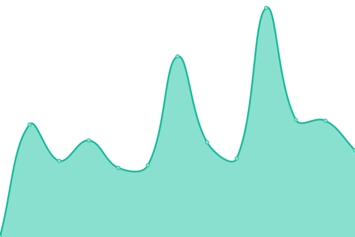

# [📈 Live Status](https://searx-instances.tiekoetter.com): <!--live status--> **🟧 Partial outage**

This repository contains the open-source uptime monitor and status page for [Tiekötter.com](https://www.tiekoetter.com), powered by [Upptime](https://github.com/upptime/upptime).

With [Upptime](https://upptime.js.org), you can get your own unlimited and free uptime monitor and status page, powered entirely by a GitHub repository. We use [Issues](https://github.com/tiekoettercom/searx-instances-uptime/issues) as incident reports, [Actions](https://github.com/tiekoettercom/searx-instances-uptime/actions) as uptime monitors, and [Pages](https://searx-instances.tiekoetter.com) for the status page.

<!--start: status pages-->
<!-- This summary is generated by Upptime (https://github.com/upptime/upptime) -->
<!-- Do not edit this manually, your changes will be overwritten -->
<!-- prettier-ignore -->
| URL | Status | History | Response Time | Uptime |
| --- | ------ | ------- | ------------- | ------ |
|  [searx.tiekoetter.com](https://searx.tiekoetter.com/) | 🟩 Up | [searx-tiekoetter-com.yml](https://github.com/tiekoettercom/searx-instances-uptime/commits/HEAD/history/searx-tiekoetter-com.yml) | 

 712ms
     
 | 

<a href="https://searx-instances.tiekoetter.com/history/searx-tiekoetter-com">99.90%</a>
    

|  [darmarit.org/searx](https://darmarit.org/searx/) | 🟩 Up | [darmarit-org-searx.yml](https://github.com/tiekoettercom/searx-instances-uptime/commits/HEAD/history/darmarit-org-searx.yml) | 

 699ms
     
 | 

<a href="https://searx-instances.tiekoetter.com/history/darmarit-org-searx">100.00%</a>
    

|  [paulgo.io](https://paulgo.io/) | 🟩 Up | [paulgo-io.yml](https://github.com/tiekoettercom/searx-instances-uptime/commits/HEAD/history/paulgo-io.yml) | 

 553ms
     
 | 

<a href="https://searx-instances.tiekoetter.com/history/paulgo-io">100.00%</a>
    

|  [searx.be](https://searx.be/) | 🟩 Up | [searx-be.yml](https://github.com/tiekoettercom/searx-instances-uptime/commits/HEAD/history/searx-be.yml) | 

 649ms
     
 | 

<a href="https://searx-instances.tiekoetter.com/history/searx-be">100.00%</a>
    

|  [baresearch.org](https://baresearch.org/) | 🟩 Up | [baresearch-org.yml](https://github.com/tiekoettercom/searx-instances-uptime/commits/HEAD/history/baresearch-org.yml) | 

 220ms
     
 | 

<a href="https://searx-instances.tiekoetter.com/history/baresearch-org">100.00%</a>
    

|  [copp.gg](https://copp.gg/) | 🟩 Up | [copp-gg.yml](https://github.com/tiekoettercom/searx-instances-uptime/commits/HEAD/history/copp-gg.yml) | 

 194ms
     
 | 

<a href="https://searx-instances.tiekoetter.com/history/copp-gg">100.00%</a>
    

|  [etsi.me](https://etsi.me/) | 🟩 Up | [etsi-me.yml](https://github.com/tiekoettercom/searx-instances-uptime/commits/HEAD/history/etsi-me.yml) | 

 269ms
     
 | 

<a href="https://searx-instances.tiekoetter.com/history/etsi-me">99.21%</a>
    

|  [freesearch.club](https://freesearch.club/) | 🟩 Up | [freesearch-club.yml](https://github.com/tiekoettercom/searx-instances-uptime/commits/HEAD/history/freesearch-club.yml) | 

 464ms
     
 | 

<a href="https://searx-instances.tiekoetter.com/history/freesearch-club">80.06%</a>
    

|  [northboot.xyz](https://northboot.xyz/) | 🟩 Up | [northboot-xyz.yml](https://github.com/tiekoettercom/searx-instances-uptime/commits/HEAD/history/northboot-xyz.yml) | 

 2788ms
     
 | 

<a href="https://searx-instances.tiekoetter.com/history/northboot-xyz">100.00%</a>
    

|  [nyc1.sx.ggtyler.dev](https://nyc1.sx.ggtyler.dev/) | 🟩 Up | [nyc1-sx-ggtyler-dev.yml](https://github.com/tiekoettercom/searx-instances-uptime/commits/HEAD/history/nyc1-sx-ggtyler-dev.yml) | 

 340ms
     
 | 

<a href="https://searx-instances.tiekoetter.com/history/nyc1-sx-ggtyler-dev">100.00%</a>
    

|  [ooglester.com](https://ooglester.com/) | 🟩 Up | [ooglester-com.yml](https://github.com/tiekoettercom/searx-instances-uptime/commits/HEAD/history/ooglester-com.yml) | 

 198ms
     
 | 

<a href="https://searx-instances.tiekoetter.com/history/ooglester-com">100.00%</a>
    

|  [opnxng.com](https://opnxng.com/) | 🟩 Up | [opnxng-com.yml](https://github.com/tiekoettercom/searx-instances-uptime/commits/HEAD/history/opnxng-com.yml) | 

 689ms
     
 | 

<a href="https://searx-instances.tiekoetter.com/history/opnxng-com">100.00%</a>
    

|  [priv.au](https://priv.au/) | 🟩 Up | [priv-au.yml](https://github.com/tiekoettercom/searx-instances-uptime/commits/HEAD/history/priv-au.yml) | 

 419ms
     
 | 

<a href="https://searx-instances.tiekoetter.com/history/priv-au">100.00%</a>
    

|  [s.mble.dk](https://s.mble.dk/) | 🟩 Up | [s-mble-dk.yml](https://github.com/tiekoettercom/searx-instances-uptime/commits/HEAD/history/s-mble-dk.yml) | 

 465ms
     
 | 

<a href="https://searx-instances.tiekoetter.com/history/s-mble-dk">100.00%</a>
    

|  [s.trung.fun](https://s.trung.fun/) | 🟩 Up | [s-trung-fun.yml](https://github.com/tiekoettercom/searx-instances-uptime/commits/HEAD/history/s-trung-fun.yml) | 

 1275ms
     
 | 

<a href="https://searx-instances.tiekoetter.com/history/s-trung-fun">100.00%</a>
    

|  [search.broker](https://search.broker/) | 🟩 Up | [search-broker.yml](https://github.com/tiekoettercom/searx-instances-uptime/commits/HEAD/history/search-broker.yml) | 

 713ms
     
 | 

<a href="https://searx-instances.tiekoetter.com/history/search-broker">99.60%</a>
    

|  [search.bus-hit.me](https://search.bus-hit.me/) | 🟩 Up | [search-bus-hit-me.yml](https://github.com/tiekoettercom/searx-instances-uptime/commits/HEAD/history/search-bus-hit-me.yml) | 

 265ms
     
 | 

<a href="https://searx-instances.tiekoetter.com/history/search-bus-hit-me">100.00%</a>
    

|  [search.demoniak.ch](https://search.demoniak.ch/) | 🟩 Up | [search-demoniak-ch.yml](https://github.com/tiekoettercom/searx-instances-uptime/commits/HEAD/history/search-demoniak-ch.yml) | 

 409ms
     
 | 

<a href="https://searx-instances.tiekoetter.com/history/search-demoniak-ch">99.71%</a>
    

|  [search.gcomm.ch](https://search.gcomm.ch/) | 🟩 Up | [search-gcomm-ch.yml](https://github.com/tiekoettercom/searx-instances-uptime/commits/HEAD/history/search-gcomm-ch.yml) | 

 538ms
     
 | 

<a href="https://searx-instances.tiekoetter.com/history/search-gcomm-ch">100.00%</a>
    

|  [search.hbubli.cc](https://search.hbubli.cc/) | 🟩 Up | [search-hbubli-cc.yml](https://github.com/tiekoettercom/searx-instances-uptime/commits/HEAD/history/search-hbubli-cc.yml) | 

 519ms
     
 | 

<a href="https://searx-instances.tiekoetter.com/history/search-hbubli-cc">95.79%</a>
    

|  [search.im-in.space](https://search.im-in.space/) | 🟩 Up | [search-im-in-space.yml](https://github.com/tiekoettercom/searx-instances-uptime/commits/HEAD/history/search-im-in-space.yml) | 

 449ms
     
 | 

<a href="https://searx-instances.tiekoetter.com/history/search-im-in-space">100.00%</a>
    

|  [search.in.projectsegfau.lt](https://search.in.projectsegfau.lt/) | 🟩 Up | [search-in-projectsegfau-lt.yml](https://github.com/tiekoettercom/searx-instances-uptime/commits/HEAD/history/search-in-projectsegfau-lt.yml) | 

 1101ms
     
 | 

<a href="https://searx-instances.tiekoetter.com/history/search-in-projectsegfau-lt">98.59%</a>
    

|  [search.inetol.net](https://search.inetol.net/) | 🟩 Up | [search-inetol-net.yml](https://github.com/tiekoettercom/searx-instances-uptime/commits/HEAD/history/search-inetol-net.yml) | 

 510ms
     
 | 

<a href="https://searx-instances.tiekoetter.com/history/search-inetol-net">100.00%</a>
    

|  [search.itstechtime.com](https://search.itstechtime.com/) | 🟩 Up | [search-itstechtime-com.yml](https://github.com/tiekoettercom/searx-instances-uptime/commits/HEAD/history/search-itstechtime-com.yml) | 

 156ms
     
 | 

<a href="https://searx-instances.tiekoetter.com/history/search-itstechtime-com">100.00%</a>
    

|  [search.leptons.xyz](https://search.leptons.xyz/) | 🟩 Up | [search-leptons-xyz.yml](https://github.com/tiekoettercom/searx-instances-uptime/commits/HEAD/history/search-leptons-xyz.yml) | 

 789ms
     
 | 

<a href="https://searx-instances.tiekoetter.com/history/search-leptons-xyz">99.90%</a>
    

|  [search.lvkaszus.pl](https://search.lvkaszus.pl/) | 🟩 Up | [search-lvkaszus-pl.yml](https://github.com/tiekoettercom/searx-instances-uptime/commits/HEAD/history/search-lvkaszus-pl.yml) | 

 625ms
     
 | 

<a href="https://searx-instances.tiekoetter.com/history/search-lvkaszus-pl">100.00%</a>
    

|  [search.mdosch.de](https://search.mdosch.de/) | 🟩 Up | [search-mdosch-de.yml](https://github.com/tiekoettercom/searx-instances-uptime/commits/HEAD/history/search-mdosch-de.yml) | 

 526ms
     
 | 

<a href="https://searx-instances.tiekoetter.com/history/search-mdosch-de">100.00%</a>
    

|  [search.nadeko.net](https://search.nadeko.net/) | 🟩 Up | [search-nadeko-net.yml](https://github.com/tiekoettercom/searx-instances-uptime/commits/HEAD/history/search-nadeko-net.yml) | 

 476ms
     
 | 

<a href="https://searx-instances.tiekoetter.com/history/search-nadeko-net">86.61%</a>
    

|  [search.ononoki.org](https://search.ononoki.org/) | 🟩 Up | [search-ononoki-org.yml](https://github.com/tiekoettercom/searx-instances-uptime/commits/HEAD/history/search-ononoki-org.yml) | 

 548ms
     
 | 

<a href="https://searx-instances.tiekoetter.com/history/search-ononoki-org">100.00%</a>
    

|  [search.projectsegfau.lt](https://search.projectsegfau.lt/) | 🟩 Up | [search-projectsegfau-lt.yml](https://github.com/tiekoettercom/searx-instances-uptime/commits/HEAD/history/search-projectsegfau-lt.yml) | 

 689ms
     
 | 

<a href="https://searx-instances.tiekoetter.com/history/search-projectsegfau-lt">99.81%</a>
    

|  [search.rhscz.eu](https://search.rhscz.eu/) | 🟩 Up | [search-rhscz-eu.yml](https://github.com/tiekoettercom/searx-instances-uptime/commits/HEAD/history/search-rhscz-eu.yml) | 

 423ms
     
 | 

<a href="https://searx-instances.tiekoetter.com/history/search-rhscz-eu">100.00%</a>
    

|  [search.rowie.at](https://search.rowie.at/) | 🟩 Up | [search-rowie-at.yml](https://github.com/tiekoettercom/searx-instances-uptime/commits/HEAD/history/search-rowie-at.yml) | 

 1260ms
     
 | 

<a href="https://searx-instances.tiekoetter.com/history/search-rowie-at">100.00%</a>
    

|  [search.sapti.me](https://search.sapti.me/) | 🟩 Up | [search-sapti-me.yml](https://github.com/tiekoettercom/searx-instances-uptime/commits/HEAD/history/search-sapti-me.yml) | 

 683ms
     
 | 

<a href="https://searx-instances.tiekoetter.com/history/search-sapti-me">99.90%</a>
    

|  [search.smnz.de](https://search.smnz.de/) | 🟩 Up | [search-smnz-de.yml](https://github.com/tiekoettercom/searx-instances-uptime/commits/HEAD/history/search-smnz-de.yml) | 

 588ms
     
 | 

<a href="https://searx-instances.tiekoetter.com/history/search-smnz-de">99.80%</a>
    

|  [search.upinmars.com](https://search.upinmars.com/) | 🟩 Up | [search-upinmars-com.yml](https://github.com/tiekoettercom/searx-instances-uptime/commits/HEAD/history/search-upinmars-com.yml) | 

 189ms
     
 | 

<a href="https://searx-instances.tiekoetter.com/history/search-upinmars-com">100.00%</a>
    

|  [searx.aleteoryx.me](https://searx.aleteoryx.me/) | 🟩 Up | [searx-aleteoryx-me.yml](https://github.com/tiekoettercom/searx-instances-uptime/commits/HEAD/history/searx-aleteoryx-me.yml) | 

 214ms
     
 | 

<a href="https://searx-instances.tiekoetter.com/history/searx-aleteoryx-me">100.00%</a>
    

|  [searx.ankha.ac](https://searx.ankha.ac/) | 🟩 Up | [searx-ankha-ac.yml](https://github.com/tiekoettercom/searx-instances-uptime/commits/HEAD/history/searx-ankha-ac.yml) | 

 571ms
     
 | 

<a href="https://searx-instances.tiekoetter.com/history/searx-ankha-ac">100.00%</a>
    

|  [searx.baczek.me](https://searx.baczek.me/) | 🟩 Up | [searx-baczek-me.yml](https://github.com/tiekoettercom/searx-instances-uptime/commits/HEAD/history/searx-baczek-me.yml) | 

 1587ms
     
 | 

<a href="https://searx-instances.tiekoetter.com/history/searx-baczek-me">99.51%</a>
    

|  [searx.catfluori.de](https://searx.catfluori.de/) | 🟩 Up | [searx-catfluori-de.yml](https://github.com/tiekoettercom/searx-instances-uptime/commits/HEAD/history/searx-catfluori-de.yml) | 

 454ms
     
 | 

<a href="https://searx-instances.tiekoetter.com/history/searx-catfluori-de">100.00%</a>
    

|  [searx.cthd.icu](https://searx.cthd.icu/) | 🟩 Up | [searx-cthd-icu.yml](https://github.com/tiekoettercom/searx-instances-uptime/commits/HEAD/history/searx-cthd-icu.yml) | 

 977ms
     
 | 

<a href="https://searx-instances.tiekoetter.com/history/searx-cthd-icu">100.00%</a>
    

|  [searx.daetalytica.io](https://searx.daetalytica.io/) | 🟩 Up | [searx-daetalytica-io.yml](https://github.com/tiekoettercom/searx-instances-uptime/commits/HEAD/history/searx-daetalytica-io.yml) | 

 202ms
     
 | 

<a href="https://searx-instances.tiekoetter.com/history/searx-daetalytica-io">100.00%</a>
    

|  [searx.ee](https://searx.ee/) | 🟩 Up | [searx-ee.yml](https://github.com/tiekoettercom/searx-instances-uptime/commits/HEAD/history/searx-ee.yml) | 

 616ms
     
 | 

<a href="https://searx-instances.tiekoetter.com/history/searx-ee">99.90%</a>
    

|  [searx.fmhy.net](https://searx.fmhy.net/) | 🟩 Up | [searx-fmhy-net.yml](https://github.com/tiekoettercom/searx-instances-uptime/commits/HEAD/history/searx-fmhy-net.yml) | 

 401ms
     
 | 

<a href="https://searx-instances.tiekoetter.com/history/searx-fmhy-net">100.00%</a>
    

|  [searx.headpat.exchange](https://searx.headpat.exchange/) | 🟩 Up | [searx-headpat-exchange.yml](https://github.com/tiekoettercom/searx-instances-uptime/commits/HEAD/history/searx-headpat-exchange.yml) | 

 800ms
     
 | 

<a href="https://searx-instances.tiekoetter.com/history/searx-headpat-exchange">93.39%</a>
    

|  [searx.juancord.xyz](https://searx.juancord.xyz/) | 🟩 Up | [searx-juancord-xyz.yml](https://github.com/tiekoettercom/searx-instances-uptime/commits/HEAD/history/searx-juancord-xyz.yml) | 

 462ms
     
 | 

<a href="https://searx-instances.tiekoetter.com/history/searx-juancord-xyz">100.00%</a>
    

|  [searx.kutay.dev](https://searx.kutay.dev/) | 🟩 Up | [searx-kutay-dev.yml](https://github.com/tiekoettercom/searx-instances-uptime/commits/HEAD/history/searx-kutay-dev.yml) | 

 512ms
     
 | 

<a href="https://searx-instances.tiekoetter.com/history/searx-kutay-dev">100.00%</a>
    

|  [searx.lunar.icu](https://searx.lunar.icu/) | 🟩 Up | [searx-lunar-icu.yml](https://github.com/tiekoettercom/searx-instances-uptime/commits/HEAD/history/searx-lunar-icu.yml) | 

 1229ms
     
 | 

<a href="https://searx-instances.tiekoetter.com/history/searx-lunar-icu">99.81%</a>
    

|  [searx.namejeff.xyz](https://searx.namejeff.xyz/) | 🟩 Up | [searx-namejeff-xyz.yml](https://github.com/tiekoettercom/searx-instances-uptime/commits/HEAD/history/searx-namejeff-xyz.yml) | 

 422ms
     
 | 

<a href="https://searx-instances.tiekoetter.com/history/searx-namejeff-xyz">100.00%</a>
    

|  [searx.nobulart.com](https://searx.nobulart.com/) | 🟩 Up | [searx-nobulart-com.yml](https://github.com/tiekoettercom/searx-instances-uptime/commits/HEAD/history/searx-nobulart-com.yml) | 

 485ms
     
 | 

<a href="https://searx-instances.tiekoetter.com/history/searx-nobulart-com">100.00%</a>
    

|  [searx.oakleycord.dev](https://searx.oakleycord.dev/) | 🟩 Up | [searx-oakleycord-dev.yml](https://github.com/tiekoettercom/searx-instances-uptime/commits/HEAD/history/searx-oakleycord-dev.yml) | 

 571ms
     
 | 

<a href="https://searx-instances.tiekoetter.com/history/searx-oakleycord-dev">99.22%</a>
    

|  [searx.ox2.fr](https://searx.ox2.fr/) | 🟩 Up | [searx-ox2-fr.yml](https://github.com/tiekoettercom/searx-instances-uptime/commits/HEAD/history/searx-ox2-fr.yml) | 

 717ms
     
 | 

<a href="https://searx-instances.tiekoetter.com/history/searx-ox2-fr">100.00%</a>
    

|  [searx.perennialte.ch](https://searx.perennialte.ch/) | 🟩 Up | [searx-perennialte-ch.yml](https://github.com/tiekoettercom/searx-instances-uptime/commits/HEAD/history/searx-perennialte-ch.yml) | 

 592ms
     
 | 

<a href="https://searx-instances.tiekoetter.com/history/searx-perennialte-ch">100.00%</a>
    

|  [searx.rhscz.eu](https://searx.rhscz.eu/) | 🟩 Up | [searx-rhscz-eu.yml](https://github.com/tiekoettercom/searx-instances-uptime/commits/HEAD/history/searx-rhscz-eu.yml) | 

 498ms
     
 | 

<a href="https://searx-instances.tiekoetter.com/history/searx-rhscz-eu">99.81%</a>
    

|  [searx.sev.monster](https://searx.sev.monster/) | 🟩 Up | [searx-sev-monster.yml](https://github.com/tiekoettercom/searx-instances-uptime/commits/HEAD/history/searx-sev-monster.yml) | 

 324ms
     
 | 

<a href="https://searx-instances.tiekoetter.com/history/searx-sev-monster">58.34%</a>
    

|  [searx.si](https://searx.si/) | 🟩 Up | [searx-si.yml](https://github.com/tiekoettercom/searx-instances-uptime/commits/HEAD/history/searx-si.yml) | 

 494ms
     
 | 

<a href="https://searx-instances.tiekoetter.com/history/searx-si">100.00%</a>
    

|  [searx.techsaviours.org](https://searx.techsaviours.org/) | 🟩 Up | [searx-techsaviours-org.yml](https://github.com/tiekoettercom/searx-instances-uptime/commits/HEAD/history/searx-techsaviours-org.yml) | 

 918ms
     
 | 

<a href="https://searx-instances.tiekoetter.com/history/searx-techsaviours-org">100.00%</a>
    

|  [searx.tuxcloud.net](https://searx.tuxcloud.net/) | 🟥 Down | [searx-tuxcloud-net.yml](https://github.com/tiekoettercom/searx-instances-uptime/commits/HEAD/history/searx-tuxcloud-net.yml) | 

 686ms
     
 | 

<a href="https://searx-instances.tiekoetter.com/history/searx-tuxcloud-net">99.44%</a>
    

|  [searx.work](https://searx.work/) | 🟩 Up | [searx-work.yml](https://github.com/tiekoettercom/searx-instances-uptime/commits/HEAD/history/searx-work.yml) | 

 400ms
     
 | 

<a href="https://searx-instances.tiekoetter.com/history/searx-work">99.90%</a>
    

|  [searx.zhenyapav.com](https://searx.zhenyapav.com/) | 🟩 Up | [searx-zhenyapav-com.yml](https://github.com/tiekoettercom/searx-instances-uptime/commits/HEAD/history/searx-zhenyapav-com.yml) | 

 857ms
     
 | 

<a href="https://searx-instances.tiekoetter.com/history/searx-zhenyapav-com">97.42%</a>
    

|  [searxng.ch](https://searxng.ch/) | 🟩 Up | [searxng-ch.yml](https://github.com/tiekoettercom/searx-instances-uptime/commits/HEAD/history/searxng-ch.yml) | 

 414ms
     
 | 

<a href="https://searx-instances.tiekoetter.com/history/searxng-ch">100.00%</a>
    

|  [searxng.site](https://searxng.site/) | 🟩 Up | [searxng-site.yml](https://github.com/tiekoettercom/searx-instances-uptime/commits/HEAD/history/searxng-site.yml) | 

 447ms
     
 | 

<a href="https://searx-instances.tiekoetter.com/history/searxng-site">100.00%</a>
    

|  [sex.finaltek.net](https://sex.finaltek.net/) | 🟩 Up | [sex-finaltek-net.yml](https://github.com/tiekoettercom/searx-instances-uptime/commits/HEAD/history/sex-finaltek-net.yml) | 

 564ms
     
 | 

<a href="https://searx-instances.tiekoetter.com/history/sex-finaltek-net">100.00%</a>
    

|  [sx.catgirl.cloud](https://sx.catgirl.cloud/) | 🟩 Up | [sx-catgirl-cloud.yml](https://github.com/tiekoettercom/searx-instances-uptime/commits/HEAD/history/sx-catgirl-cloud.yml) | 

 910ms
     
 | 

<a href="https://searx-instances.tiekoetter.com/history/sx-catgirl-cloud">99.90%</a>
    

|  [www.gruble.de](https://www.gruble.de/) | 🟩 Up | [www-gruble-de.yml](https://github.com/tiekoettercom/searx-instances-uptime/commits/HEAD/history/www-gruble-de.yml) | 

 594ms
     
 | 

<a href="https://searx-instances.tiekoetter.com/history/www-gruble-de">100.00%</a>
    

|  [www.jabber-germany.de/searx](https://www.jabber-germany.de/searx/) | 🟩 Up | [www-jabber-germany-de-searx.yml](https://github.com/tiekoettercom/searx-instances-uptime/commits/HEAD/history/www-jabber-germany-de-searx.yml) | 

 677ms
     
 | 

<a href="https://searx-instances.tiekoetter.com/history/www-jabber-germany-de-searx">100.00%</a>
    

|  [xo.wtf](https://xo.wtf/) | 🟩 Up | [xo-wtf.yml](https://github.com/tiekoettercom/searx-instances-uptime/commits/HEAD/history/xo-wtf.yml) | 

 402ms
     
 | 

<a href="https://searx-instances.tiekoetter.com/history/xo-wtf">98.52%</a>
    

<!--end: status pages-->

[**Visit our status website →**](https://searx-instances.tiekoetter.com)

## 📄 License

- Powered by: [Upptime](https://github.com/upptime/upptime)
- Code: [MIT](./LICENSE) © [Tiekötter.com](https://www.tiekoetter.com)
- Data in the `./history` directory: [Open Database License](https://opendatacommons.org/licenses/odbl/1-0/)
