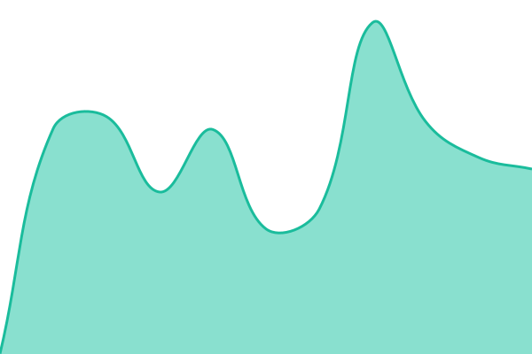
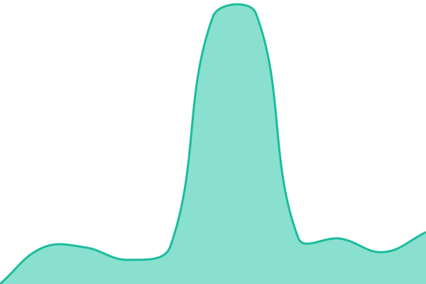

# [📈 Live Status](https://searx-instances.tiekoetter.com): <!--live status--> **🟧 Partial outage**

This repository contains the open-source uptime monitor and status page for [Tiekötter.com](https://www.tiekoetter.com), powered by [Upptime](https://github.com/upptime/upptime).

With [Upptime](https://upptime.js.org), you can get your own unlimited and free uptime monitor and status page, powered entirely by a GitHub repository. We use [Issues](https://github.com/tiekoettercom/searx-instances-uptime/issues) as incident reports, [Actions](https://github.com/tiekoettercom/searx-instances-uptime/actions) as uptime monitors, and [Pages](https://searx-instances.tiekoetter.com) for the status page.

<!--start: status pages-->
<!-- This summary is generated by Upptime (https://github.com/upptime/upptime) -->
<!-- Do not edit this manually, your changes will be overwritten -->
<!-- prettier-ignore -->
| URL | Status | History | Response Time | Uptime |
| --- | ------ | ------- | ------------- | ------ |
|  [searx.tiekoetter.com](https://searx.tiekoetter.com/) | 🟩 Up | [searx-tiekoetter-com.yml](https://github.com/tiekoettercom/searx-instances-uptime/commits/HEAD/history/searx-tiekoetter-com.yml) | 

 742ms
     
 | 

<a href="https://searx-instances.tiekoetter.com/history/searx-tiekoetter-com">100.00%</a>
    

|  [paulgo.io](https://paulgo.io/) | 🟩 Up | [paulgo-io.yml](https://github.com/tiekoettercom/searx-instances-uptime/commits/HEAD/history/paulgo-io.yml) | 

 600ms
     
 | 

<a href="https://searx-instances.tiekoetter.com/history/paulgo-io">99.86%</a>
    

|  [anonsearch.win](https://anonsearch.win/) | 🟩 Up | [anonsearch-win.yml](https://github.com/tiekoettercom/searx-instances-uptime/commits/HEAD/history/anonsearch-win.yml) | 

 191ms
     
 | 

<a href="https://searx-instances.tiekoetter.com/history/anonsearch-win">100.00%</a>
    

|  [baresearch.org](https://baresearch.org/) | 🟩 Up | [baresearch-org.yml](https://github.com/tiekoettercom/searx-instances-uptime/commits/HEAD/history/baresearch-org.yml) | 

 254ms
     
 | 

<a href="https://searx-instances.tiekoetter.com/history/baresearch-org">100.00%</a>
    

|  [etsi.me](https://etsi.me/) | 🟩 Up | [etsi-me.yml](https://github.com/tiekoettercom/searx-instances-uptime/commits/HEAD/history/etsi-me.yml) | 

 245ms
     
 | 

<a href="https://searx-instances.tiekoetter.com/history/etsi-me">100.00%</a>
    

|  [failsearx.culturanerd.it](https://failsearx.culturanerd.it/) | 🟩 Up | [failsearx-culturanerd-it.yml](https://github.com/tiekoettercom/searx-instances-uptime/commits/HEAD/history/failsearx-culturanerd-it.yml) | 

 509ms
     
 | 

<a href="https://searx-instances.tiekoetter.com/history/failsearx-culturanerd-it">97.79%</a>
    

|  [find.xenorio.xyz](https://find.xenorio.xyz/) | 🟩 Up | [find-xenorio-xyz.yml](https://github.com/tiekoettercom/searx-instances-uptime/commits/HEAD/history/find-xenorio-xyz.yml) | 

 470ms
     
 | 

<a href="https://searx-instances.tiekoetter.com/history/find-xenorio-xyz">100.00%</a>
    

|  [grep.vim.wtf](https://grep.vim.wtf/) | 🟩 Up | [grep-vim-wtf.yml](https://github.com/tiekoettercom/searx-instances-uptime/commits/HEAD/history/grep-vim-wtf.yml) | 

 583ms
     
 | 

<a href="https://searx-instances.tiekoetter.com/history/grep-vim-wtf">100.00%</a>
    

|  [kantan.cat](https://kantan.cat/) | 🟩 Up | [kantan-cat.yml](https://github.com/tiekoettercom/searx-instances-uptime/commits/HEAD/history/kantan-cat.yml) | 

 795ms
     
 | 

<a href="https://searx-instances.tiekoetter.com/history/kantan-cat">99.73%</a>
    

|  [libresearch.space](https://libresearch.space/) | 🟩 Up | [libresearch-space.yml](https://github.com/tiekoettercom/searx-instances-uptime/commits/HEAD/history/libresearch-space.yml) | 

 192ms
     
 | 

<a href="https://searx-instances.tiekoetter.com/history/libresearch-space">98.25%</a>
    

|  [opnxng.com](https://opnxng.com/) | 🟩 Up | [opnxng-com.yml](https://github.com/tiekoettercom/searx-instances-uptime/commits/HEAD/history/opnxng-com.yml) | 

 2601ms
     
 | 

<a href="https://searx-instances.tiekoetter.com/history/opnxng-com">99.55%</a>
    

|  [priv.au](https://priv.au/) | 🟩 Up | [priv-au.yml](https://github.com/tiekoettercom/searx-instances-uptime/commits/HEAD/history/priv-au.yml) | 

 864ms
     
 | 

<a href="https://searx-instances.tiekoetter.com/history/priv-au">100.00%</a>
    

|  [sear.lurx.net](https://sear.lurx.net/) | 🟩 Up | [sear-lurx-net.yml](https://github.com/tiekoettercom/searx-instances-uptime/commits/HEAD/history/sear-lurx-net.yml) | 

 598ms
     
 | 

<a href="https://searx-instances.tiekoetter.com/history/sear-lurx-net">99.44%</a>
    

|  [search.2b9t.xyz](https://search.2b9t.xyz/) | 🟩 Up | [search-2b9t-xyz.yml](https://github.com/tiekoettercom/searx-instances-uptime/commits/HEAD/history/search-2b9t-xyz.yml) | 

 163ms
     
 | 

<a href="https://searx-instances.tiekoetter.com/history/search-2b9t-xyz">100.00%</a>
    

|  [search.anoni.net](https://search.anoni.net/) | 🟩 Up | [search-anoni-net.yml](https://github.com/tiekoettercom/searx-instances-uptime/commits/HEAD/history/search-anoni-net.yml) | 

 1446ms
     
 | 

<a href="https://searx-instances.tiekoetter.com/history/search-anoni-net">99.58%</a>
    

|  [search.bladerunn.in](https://search.bladerunn.in/) | 🟩 Up | [search-bladerunn-in.yml](https://github.com/tiekoettercom/searx-instances-uptime/commits/HEAD/history/search-bladerunn-in.yml) | 

 923ms
     
 | 

<a href="https://searx-instances.tiekoetter.com/history/search-bladerunn-in">99.87%</a>
    

|  [search.catboy.house](https://search.catboy.house/) | 🟩 Up | [search-catboy-house.yml](https://github.com/tiekoettercom/searx-instances-uptime/commits/HEAD/history/search-catboy-house.yml) | 

 713ms
     
 | 

<a href="https://searx-instances.tiekoetter.com/history/search-catboy-house">100.00%</a>
    

|  [search.chocolatemoo53.com](https://search.chocolatemoo53.com/) | 🟩 Up | [search-chocolatemoo53-com.yml](https://github.com/tiekoettercom/searx-instances-uptime/commits/HEAD/history/search-chocolatemoo53-com.yml) | 

 2208ms
     
 | 

<a href="https://searx-instances.tiekoetter.com/history/search-chocolatemoo53-com">98.23%</a>
    

|  [search.ctq.ro](https://search.ctq.ro/) | 🟩 Up | [search-ctq-ro.yml](https://github.com/tiekoettercom/searx-instances-uptime/commits/HEAD/history/search-ctq-ro.yml) | 

 619ms
     
 | 

<a href="https://searx-instances.tiekoetter.com/history/search-ctq-ro">100.00%</a>
    

|  [search.einfachzocken.eu](https://search.einfachzocken.eu/) | 🟩 Up | [search-einfachzocken-eu.yml](https://github.com/tiekoettercom/searx-instances-uptime/commits/HEAD/history/search-einfachzocken-eu.yml) | 

 564ms
     
 | 

<a href="https://searx-instances.tiekoetter.com/history/search-einfachzocken-eu">100.00%</a>
    

|  [search.ethibox.fr](https://search.ethibox.fr/) | 🟩 Up | [search-ethibox-fr.yml](https://github.com/tiekoettercom/searx-instances-uptime/commits/HEAD/history/search-ethibox-fr.yml) | 

 966ms
     
 | 

<a href="https://searx-instances.tiekoetter.com/history/search-ethibox-fr">100.00%</a>
    

|  [search.femboy.ad](https://search.femboy.ad/) | 🟩 Up | [search-femboy-ad.yml](https://github.com/tiekoettercom/searx-instances-uptime/commits/HEAD/history/search-femboy-ad.yml) | 

 200ms
     
 | 

<a href="https://searx-instances.tiekoetter.com/history/search-femboy-ad">100.00%</a>
    

|  [search.hbubli.cc](https://search.hbubli.cc/) | 🟩 Up | [search-hbubli-cc.yml](https://github.com/tiekoettercom/searx-instances-uptime/commits/HEAD/history/search-hbubli-cc.yml) | 

 535ms
     
 | 

<a href="https://searx-instances.tiekoetter.com/history/search-hbubli-cc">100.00%</a>
    

|  [search.im-in.space](https://search.im-in.space/) | 🟩 Up | [search-im-in-space.yml](https://github.com/tiekoettercom/searx-instances-uptime/commits/HEAD/history/search-im-in-space.yml) | 

 436ms
     
 | 

<a href="https://searx-instances.tiekoetter.com/history/search-im-in-space">100.00%</a>
    

|  [search.indst.eu](https://search.indst.eu/) | 🟩 Up | [search-indst-eu.yml](https://github.com/tiekoettercom/searx-instances-uptime/commits/HEAD/history/search-indst-eu.yml) | 

 642ms
     
 | 

<a href="https://searx-instances.tiekoetter.com/history/search-indst-eu">99.59%</a>
    

|  [search.inetol.net](https://search.inetol.net/) | 🟩 Up | [search-inetol-net.yml](https://github.com/tiekoettercom/searx-instances-uptime/commits/HEAD/history/search-inetol-net.yml) | 

 571ms
     
 | 

<a href="https://searx-instances.tiekoetter.com/history/search-inetol-net">100.00%</a>
    

|  [search.jns.net.ar](https://search.jns.net.ar/) | 🟥 Down | [search-jns-net-ar.yml](https://github.com/tiekoettercom/searx-instances-uptime/commits/HEAD/history/search-jns-net-ar.yml) | 

 0ms
     
 | 

<a href="https://searx-instances.tiekoetter.com/history/search-jns-net-ar">0.00%</a>
    

|  [search.liuzj.net](https://search.liuzj.net/) | 🟩 Up | [search-liuzj-net.yml](https://github.com/tiekoettercom/searx-instances-uptime/commits/HEAD/history/search-liuzj-net.yml) | 

 694ms
     
 | 

<a href="https://searx-instances.tiekoetter.com/history/search-liuzj-net">100.00%</a>
    

|  [search.lumy.live](https://search.lumy.live/) | 🟩 Up | [search-lumy-live.yml](https://github.com/tiekoettercom/searx-instances-uptime/commits/HEAD/history/search-lumy-live.yml) | 

 5971ms
     
 | 

<a href="https://searx-instances.tiekoetter.com/history/search-lumy-live">96.99%</a>
    

|  [search.mdosch.de](https://search.mdosch.de/) | 🟥 Down | [search-mdosch-de.yml](https://github.com/tiekoettercom/searx-instances-uptime/commits/HEAD/history/search-mdosch-de.yml) | 

 362ms
     
 | 

<a href="https://searx-instances.tiekoetter.com/history/search-mdosch-de">0.00%</a>
    

|  [search.mectov.my.id](https://search.mectov.my.id/) | 🟩 Up | [search-mectov-my-id.yml](https://github.com/tiekoettercom/searx-instances-uptime/commits/HEAD/history/search-mectov-my-id.yml) | 

 1120ms
     
 | 

<a href="https://searx-instances.tiekoetter.com/history/search-mectov-my-id">100.00%</a>
    

|  [search.minus27315.dev](https://search.minus27315.dev/) | 🟩 Up | [search-minus27315-dev.yml](https://github.com/tiekoettercom/searx-instances-uptime/commits/HEAD/history/search-minus27315-dev.yml) | 

 500ms
     
 | 

<a href="https://searx-instances.tiekoetter.com/history/search-minus27315-dev">99.77%</a>
    

|  [search.mizuki.st](https://search.mizuki.st/) | 🟩 Up | [search-mizuki-st.yml](https://github.com/tiekoettercom/searx-instances-uptime/commits/HEAD/history/search-mizuki-st.yml) | 

 702ms
     
 | 

<a href="https://searx-instances.tiekoetter.com/history/search-mizuki-st">100.00%</a>
    

|  [search.pereira.is](https://search.pereira.is/) | 🟩 Up | [search-pereira-is.yml](https://github.com/tiekoettercom/searx-instances-uptime/commits/HEAD/history/search-pereira-is.yml) | 

 662ms
     
 | 

<a href="https://searx-instances.tiekoetter.com/history/search-pereira-is">82.23%</a>
    

|  [search.pi.vps.pw](https://search.pi.vps.pw/) | 🟩 Up | [search-pi-vps-pw.yml](https://github.com/tiekoettercom/searx-instances-uptime/commits/HEAD/history/search-pi-vps-pw.yml) | 

 647ms
     
 | 

<a href="https://searx-instances.tiekoetter.com/history/search-pi-vps-pw">100.00%</a>
    

|  [search.rhscz.eu](https://search.rhscz.eu/) | 🟩 Up | [search-rhscz-eu.yml](https://github.com/tiekoettercom/searx-instances-uptime/commits/HEAD/history/search-rhscz-eu.yml) | 

 563ms
     
 | 

<a href="https://searx-instances.tiekoetter.com/history/search-rhscz-eu">100.00%</a>
    

|  [search.rowie.at](https://search.rowie.at/) | 🟩 Up | [search-rowie-at.yml](https://github.com/tiekoettercom/searx-instances-uptime/commits/HEAD/history/search-rowie-at.yml) | 

 819ms
     
 | 

<a href="https://searx-instances.tiekoetter.com/history/search-rowie-at">100.00%</a>
    

|  [search.seddens.net](https://search.seddens.net/) | 🟩 Up | [search-seddens-net.yml](https://github.com/tiekoettercom/searx-instances-uptime/commits/HEAD/history/search-seddens-net.yml) | 

 1482ms
     
 | 

<a href="https://searx-instances.tiekoetter.com/history/search-seddens-net">0.00%</a>
    

|  [search.serpensin.com](https://search.serpensin.com/) | 🟩 Up | [search-serpensin-com.yml](https://github.com/tiekoettercom/searx-instances-uptime/commits/HEAD/history/search-serpensin-com.yml) | 

 429ms
     
 | 

<a href="https://searx-instances.tiekoetter.com/history/search-serpensin-com">98.42%</a>
    

|  [search.spiralab.org](https://search.spiralab.org/) | 🟥 Down | [search-spiralab-org.yml](https://github.com/tiekoettercom/searx-instances-uptime/commits/HEAD/history/search-spiralab-org.yml) | 

 237ms
     
 | 

<a href="https://searx-instances.tiekoetter.com/history/search-spiralab-org">95.60%</a>
    

|  [search.undertale.uk](https://search.undertale.uk/) | 🟩 Up | [search-undertale-uk.yml](https://github.com/tiekoettercom/searx-instances-uptime/commits/HEAD/history/search-undertale-uk.yml) | 

 485ms
     
 | 

<a href="https://searx-instances.tiekoetter.com/history/search-undertale-uk">99.86%</a>
    

|  [search.unredacted.org](https://search.unredacted.org/) | 🟩 Up | [search-unredacted-org.yml](https://github.com/tiekoettercom/searx-instances-uptime/commits/HEAD/history/search-unredacted-org.yml) | 

 585ms
     
 | 

<a href="https://searx-instances.tiekoetter.com/history/search-unredacted-org">100.00%</a>
    

|  [search.yuri.llc](https://search.yuri.llc/) | 🟩 Up | [search-yuri-llc.yml](https://github.com/tiekoettercom/searx-instances-uptime/commits/HEAD/history/search-yuri-llc.yml) | 

 257ms
     
 | 

<a href="https://searx-instances.tiekoetter.com/history/search-yuri-llc">100.00%</a>
    

|  [search.zina.dev](https://search.zina.dev/) | 🟩 Up | [search-zina-dev.yml](https://github.com/tiekoettercom/searx-instances-uptime/commits/HEAD/history/search-zina-dev.yml) | 

 439ms
     
 | 

<a href="https://searx-instances.tiekoetter.com/history/search-zina-dev">99.86%</a>
    

|  [searx.ankha.ac](https://searx.ankha.ac/) | 🟥 Down | [searx-ankha-ac.yml](https://github.com/tiekoettercom/searx-instances-uptime/commits/HEAD/history/searx-ankha-ac.yml) | 

 483ms
     
 | 

<a href="https://searx-instances.tiekoetter.com/history/searx-ankha-ac">7.94%</a>
    

|  [searx.dresden.network](https://searx.dresden.network/) | 🟩 Up | [searx-dresden-network.yml](https://github.com/tiekoettercom/searx-instances-uptime/commits/HEAD/history/searx-dresden-network.yml) | 

 783ms
     
 | 

<a href="https://searx-instances.tiekoetter.com/history/searx-dresden-network">100.00%</a>
    

|  [searx.linxx.net](https://searx.linxx.net/) | 🟩 Up | [searx-linxx-net.yml](https://github.com/tiekoettercom/searx-instances-uptime/commits/HEAD/history/searx-linxx-net.yml) | 

 460ms
     
 | 

<a href="https://searx-instances.tiekoetter.com/history/searx-linxx-net">100.00%</a>
    

|  [searx.mbuf.net](https://searx.mbuf.net/) | 🟩 Up | [searx-mbuf-net.yml](https://github.com/tiekoettercom/searx-instances-uptime/commits/HEAD/history/searx-mbuf-net.yml) | 

 607ms
     
 | 

<a href="https://searx-instances.tiekoetter.com/history/searx-mbuf-net">100.00%</a>
    

|  [searx.mxchange.org](https://searx.mxchange.org/) | 🟩 Up | [searx-mxchange-org.yml](https://github.com/tiekoettercom/searx-instances-uptime/commits/HEAD/history/searx-mxchange-org.yml) | 

 1033ms
     
 | 

<a href="https://searx-instances.tiekoetter.com/history/searx-mxchange-org">100.00%</a>
    

|  [searx.namejeff.xyz](https://searx.namejeff.xyz/) | 🟩 Up | [searx-namejeff-xyz.yml](https://github.com/tiekoettercom/searx-instances-uptime/commits/HEAD/history/searx-namejeff-xyz.yml) | 

 408ms
     
 | 

<a href="https://searx-instances.tiekoetter.com/history/searx-namejeff-xyz">98.14%</a>
    

|  [searx.oloke.xyz](https://searx.oloke.xyz/) | 🟩 Up | [searx-oloke-xyz.yml](https://github.com/tiekoettercom/searx-instances-uptime/commits/HEAD/history/searx-oloke-xyz.yml) | 

 654ms
     
 | 

<a href="https://searx-instances.tiekoetter.com/history/searx-oloke-xyz">100.00%</a>
    

|  [searx.ononoki.org](https://searx.ononoki.org/) | 🟩 Up | [searx-ononoki-org.yml](https://github.com/tiekoettercom/searx-instances-uptime/commits/HEAD/history/searx-ononoki-org.yml) | 

 469ms
     
 | 

<a href="https://searx-instances.tiekoetter.com/history/searx-ononoki-org">100.00%</a>
    

|  [searx.party](https://searx.party/) | 🟩 Up | [searx-party.yml](https://github.com/tiekoettercom/searx-instances-uptime/commits/HEAD/history/searx-party.yml) | 

 310ms
     
 | 

<a href="https://searx-instances.tiekoetter.com/history/searx-party">92.79%</a>
    

|  [searx.perennialte.ch](https://searx.perennialte.ch/) | 🟩 Up | [searx-perennialte-ch.yml](https://github.com/tiekoettercom/searx-instances-uptime/commits/HEAD/history/searx-perennialte-ch.yml) | 

 257ms
     
 | 

<a href="https://searx-instances.tiekoetter.com/history/searx-perennialte-ch">100.00%</a>
    

|  [searx.redgarden.cv](https://searx.redgarden.cv/) | 🟩 Up | [searx-redgarden-cv.yml](https://github.com/tiekoettercom/searx-instances-uptime/commits/HEAD/history/searx-redgarden-cv.yml) | 

 308ms
     
 | 

<a href="https://searx-instances.tiekoetter.com/history/searx-redgarden-cv">99.32%</a>
    

|  [searx.rhscz.eu](https://searx.rhscz.eu/) | 🟩 Up | [searx-rhscz-eu.yml](https://github.com/tiekoettercom/searx-instances-uptime/commits/HEAD/history/searx-rhscz-eu.yml) | 

 523ms
     
 | 

<a href="https://searx-instances.tiekoetter.com/history/searx-rhscz-eu">99.87%</a>
    

|  [searx.ro](https://searx.ro/) | 🟥 Down | [searx-ro.yml](https://github.com/tiekoettercom/searx-instances-uptime/commits/HEAD/history/searx-ro.yml) | 

 507ms
     
 | 

<a href="https://searx-instances.tiekoetter.com/history/searx-ro">76.18%</a>
    

|  [searx.sev.monster](https://searx.sev.monster/) | 🟩 Up | [searx-sev-monster.yml](https://github.com/tiekoettercom/searx-instances-uptime/commits/HEAD/history/searx-sev-monster.yml) | 

 341ms
     
 | 

<a href="https://searx-instances.tiekoetter.com/history/searx-sev-monster">24.17%</a>
    

|  [searx.thefloatinglab.world](https://searx.thefloatinglab.world/) | 🟩 Up | [searx-thefloatinglab-world.yml](https://github.com/tiekoettercom/searx-instances-uptime/commits/HEAD/history/searx-thefloatinglab-world.yml) | 

 628ms
     
 | 

<a href="https://searx-instances.tiekoetter.com/history/searx-thefloatinglab-world">95.30%</a>
    

|  [searx.tsmdt.de](https://searx.tsmdt.de/) | 🟩 Up | [searx-tsmdt-de.yml](https://github.com/tiekoettercom/searx-instances-uptime/commits/HEAD/history/searx-tsmdt-de.yml) | 

 497ms
     
 | 

<a href="https://searx-instances.tiekoetter.com/history/searx-tsmdt-de">100.00%</a>
    

|  [searxng.buffon.cloud](https://searxng.buffon.cloud/) | 🟩 Up | [searxng-buffon-cloud.yml](https://github.com/tiekoettercom/searx-instances-uptime/commits/HEAD/history/searxng-buffon-cloud.yml) | 

 784ms
     
 | 

<a href="https://searx-instances.tiekoetter.com/history/searxng-buffon-cloud">95.46%</a>
    

|  [searxng.canine.tools](https://searxng.canine.tools/) | 🟩 Up | [searxng-canine-tools.yml](https://github.com/tiekoettercom/searx-instances-uptime/commits/HEAD/history/searxng-canine-tools.yml) | 

 218ms
     
 | 

<a href="https://searx-instances.tiekoetter.com/history/searxng-canine-tools">99.87%</a>
    

|  [searxng.cups.moe](https://searxng.cups.moe/) | 🟩 Up | [searxng-cups-moe.yml](https://github.com/tiekoettercom/searx-instances-uptime/commits/HEAD/history/searxng-cups-moe.yml) | 

 641ms
     
 | 

<a href="https://searx-instances.tiekoetter.com/history/searxng-cups-moe">99.87%</a>
    

|  [searxng.deggo.fyi](https://searxng.deggo.fyi/) | 🟩 Up | [searxng-deggo-fyi.yml](https://github.com/tiekoettercom/searx-instances-uptime/commits/HEAD/history/searxng-deggo-fyi.yml) | 

 498ms
     
 | 

<a href="https://searx-instances.tiekoetter.com/history/searxng-deggo-fyi">100.00%</a>
    

|  [searxng.eshnetwork.space](https://searxng.eshnetwork.space/) | 🟩 Up | [searxng-eshnetwork-space.yml](https://github.com/tiekoettercom/searx-instances-uptime/commits/HEAD/history/searxng-eshnetwork-space.yml) | 

 503ms
     
 | 

<a href="https://searx-instances.tiekoetter.com/history/searxng-eshnetwork-space">97.08%</a>
    

|  [searxng.fishfvch.com](https://searxng.fishfvch.com/) | 🟥 Down | [searxng-fishfvch-com.yml](https://github.com/tiekoettercom/searx-instances-uptime/commits/HEAD/history/searxng-fishfvch-com.yml) | 

 468ms
     
 | 

<a href="https://searx-instances.tiekoetter.com/history/searxng-fishfvch-com">0.00%</a>
    

|  [searxng.gdebest.net](https://searxng.gdebest.net/) | 🟩 Up | [searxng-gdebest-net.yml](https://github.com/tiekoettercom/searx-instances-uptime/commits/HEAD/history/searxng-gdebest-net.yml) | 

 555ms
     
 | 

<a href="https://searx-instances.tiekoetter.com/history/searxng-gdebest-net">70.10%</a>
    

|  [searxng.gr](https://searxng.gr/) | 🟥 Down | [searxng-gr.yml](https://github.com/tiekoettercom/searx-instances-uptime/commits/HEAD/history/searxng-gr.yml) | 

 794ms
     
 | 

<a href="https://searx-instances.tiekoetter.com/history/searxng-gr">18.49%</a>
    

|  [searxng.moonshadow.dev](https://searxng.moonshadow.dev/) | 🟩 Up | [searxng-moonshadow-dev.yml](https://github.com/tiekoettercom/searx-instances-uptime/commits/HEAD/history/searxng-moonshadow-dev.yml) | 

 444ms
     
 | 

<a href="https://searx-instances.tiekoetter.com/history/searxng-moonshadow-dev">100.00%</a>
    

|  [searxng.paralaxitaentomology.org](https://searxng.paralaxitaentomology.org/) | 🟩 Up | [searxng-paralaxitaentomology-org.yml](https://github.com/tiekoettercom/searx-instances-uptime/commits/HEAD/history/searxng-paralaxitaentomology-org.yml) | 

 322ms
     
 | 

<a href="https://searx-instances.tiekoetter.com/history/searxng-paralaxitaentomology-org">100.00%</a>
    

|  [searxng.shreven.org](https://searxng.shreven.org/) | 🟩 Up | [searxng-shreven-org.yml](https://github.com/tiekoettercom/searx-instances-uptime/commits/HEAD/history/searxng-shreven-org.yml) | 

 290ms
     
 | 

<a href="https://searx-instances.tiekoetter.com/history/searxng-shreven-org">99.74%</a>
    

|  [searxng.site](https://searxng.site/) | 🟩 Up | [searxng-site.yml](https://github.com/tiekoettercom/searx-instances-uptime/commits/HEAD/history/searxng-site.yml) | 

 4795ms
     
 | 

<a href="https://searx-instances.tiekoetter.com/history/searxng-site">100.00%</a>
    

|  [searxng.tr](https://searxng.tr/) | 🟩 Up | [searxng-tr.yml](https://github.com/tiekoettercom/searx-instances-uptime/commits/HEAD/history/searxng-tr.yml) | 

 1714ms
     
 | 

<a href="https://searx-instances.tiekoetter.com/history/searxng-tr">100.00%</a>
    

|  [searxng.website](https://searxng.website/) | 🟩 Up | [searxng-website.yml](https://github.com/tiekoettercom/searx-instances-uptime/commits/HEAD/history/searxng-website.yml) | 

 486ms
     
 | 

<a href="https://searx-instances.tiekoetter.com/history/searxng-website">100.00%</a>
    

|  [searxng.wuemeli.com](https://searxng.wuemeli.com/) | 🟩 Up | [searxng-wuemeli-com.yml](https://github.com/tiekoettercom/searx-instances-uptime/commits/HEAD/history/searxng-wuemeli-com.yml) | 

 568ms
     
 | 

<a href="https://searx-instances.tiekoetter.com/history/searxng-wuemeli-com">97.99%</a>
    

|  [sx.catgirl.cloud](https://sx.catgirl.cloud/) | 🟩 Up | [sx-catgirl-cloud.yml](https://github.com/tiekoettercom/searx-instances-uptime/commits/HEAD/history/sx-catgirl-cloud.yml) | 

 904ms
     
 | 

<a href="https://searx-instances.tiekoetter.com/history/sx-catgirl-cloud">100.00%</a>
    

|  [sx.h4rl3y.xyz](https://sx.h4rl3y.xyz/) | 🟥 Down | [sx-h4rl3y-xyz.yml](https://github.com/tiekoettercom/searx-instances-uptime/commits/HEAD/history/sx-h4rl3y-xyz.yml) | 

 30465ms
     
 | 

<a href="https://searx-instances.tiekoetter.com/history/sx-h4rl3y-xyz">0.00%</a>
    

|  [sx.xo.st](https://sx.xo.st/) | 🟩 Up | [sx-xo-st.yml](https://github.com/tiekoettercom/searx-instances-uptime/commits/HEAD/history/sx-xo-st.yml) | 

 1081ms
     
 | 

<a href="https://searx-instances.tiekoetter.com/history/sx-xo-st">99.42%</a>
    

|  [www.gruble.de](https://www.gruble.de/) | 🟩 Up | [www-gruble-de.yml](https://github.com/tiekoettercom/searx-instances-uptime/commits/HEAD/history/www-gruble-de.yml) | 

 682ms
     
 | 

<a href="https://searx-instances.tiekoetter.com/history/www-gruble-de">99.82%</a>
    

|  [www.isci.si](https://www.isci.si/) | 🟩 Up | [www-isci-si.yml](https://github.com/tiekoettercom/searx-instances-uptime/commits/HEAD/history/www-isci-si.yml) | 

 782ms
     
 | 

<a href="https://searx-instances.tiekoetter.com/history/www-isci-si">99.75%</a>
    

|  [xka.cz](https://xka.cz/) | 🟩 Up | [xka-cz.yml](https://github.com/tiekoettercom/searx-instances-uptime/commits/HEAD/history/xka-cz.yml) | 

 572ms
     
 | 

<a href="https://searx-instances.tiekoetter.com/history/xka-cz">100.00%</a>
    

|  [privacyredirect.com](https://privacyredirect.com/) | 🟩 Up | [privacyredirect-com.yml](https://github.com/tiekoettercom/searx-instances-uptime/commits/HEAD/history/privacyredirect-com.yml) | 

 565ms
     
 | 

<a href="https://searx-instances.tiekoetter.com/history/privacyredirect-com">99.87%</a>
    

<!--end: status pages-->

[**Visit our status website →**](https://searx-instances.tiekoetter.com)

## 📄 License

- Powered by: [Upptime](https://github.com/upptime/upptime)
- Code: [MIT](./LICENSE) © [Tiekötter.com](https://www.tiekoetter.com)
- Data in the `./history` directory: [Open Database License](https://opendatacommons.org/licenses/odbl/1-0/)
