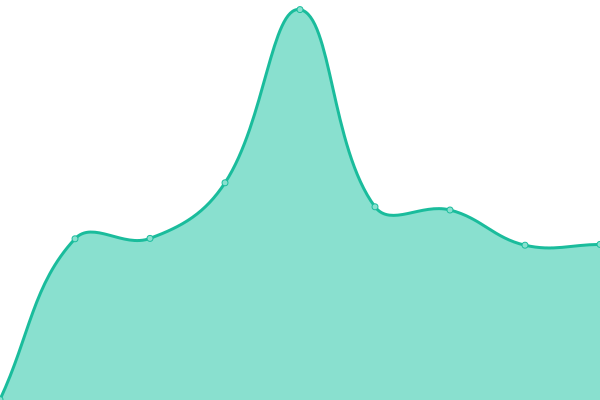

# [📈 Live Status](https://searx-instances.tiekoetter.com): <!--live status--> **🟧 Partial outage**

This repository contains the open-source uptime monitor and status page for [Tiekötter.com](https://www.tiekoetter.com), powered by [Upptime](https://github.com/upptime/upptime).

With [Upptime](https://upptime.js.org), you can get your own unlimited and free uptime monitor and status page, powered entirely by a GitHub repository. We use [Issues](https://github.com/tiekoettercom/searx-instances-uptime/issues) as incident reports, [Actions](https://github.com/tiekoettercom/searx-instances-uptime/actions) as uptime monitors, and [Pages](https://searx-instances.tiekoetter.com) for the status page.

<!--start: status pages-->
<!-- This summary is generated by Upptime (https://github.com/upptime/upptime) -->
<!-- Do not edit this manually, your changes will be overwritten -->
<!-- prettier-ignore -->
| URL | Status | History | Response Time | Uptime |
| --- | ------ | ------- | ------------- | ------ |
|  [searx.tiekoetter.com](https://searx.tiekoetter.com/) | 🟩 Up | [searx-tiekoetter-com.yml](https://github.com/tiekoettercom/searx-instances-uptime/commits/HEAD/history/searx-tiekoetter-com.yml) | 

 816ms
     
 | 

<a href="https://searx-instances.tiekoetter.com/history/searx-tiekoetter-com">100.00%</a>
    

|  [darmarit.org/searx](https://darmarit.org/searx/) | 🟩 Up | [darmarit-org-searx.yml](https://github.com/tiekoettercom/searx-instances-uptime/commits/HEAD/history/darmarit-org-searx.yml) | 

 822ms
     
 | 

<a href="https://searx-instances.tiekoetter.com/history/darmarit-org-searx">100.00%</a>
    

|  [paulgo.io](https://paulgo.io/) | 🟩 Up | [paulgo-io.yml](https://github.com/tiekoettercom/searx-instances-uptime/commits/HEAD/history/paulgo-io.yml) | 

 644ms
     
 | 

<a href="https://searx-instances.tiekoetter.com/history/paulgo-io">100.00%</a>
    

|  [baresearch.org](https://baresearch.org/) | 🟩 Up | [baresearch-org.yml](https://github.com/tiekoettercom/searx-instances-uptime/commits/HEAD/history/baresearch-org.yml) | 

 230ms
     
 | 

<a href="https://searx-instances.tiekoetter.com/history/baresearch-org">99.90%</a>
    

|  [copp.gg](https://copp.gg/) | 🟩 Up | [copp-gg.yml](https://github.com/tiekoettercom/searx-instances-uptime/commits/HEAD/history/copp-gg.yml) | 

 852ms
     
 | 

<a href="https://searx-instances.tiekoetter.com/history/copp-gg">99.92%</a>
    

|  [etsi.me](https://etsi.me/) | 🟩 Up | [etsi-me.yml](https://github.com/tiekoettercom/searx-instances-uptime/commits/HEAD/history/etsi-me.yml) | 

 317ms
     
 | 

<a href="https://searx-instances.tiekoetter.com/history/etsi-me">99.90%</a>
    

|  [fairsuch.net](https://fairsuch.net/) | 🟩 Up | [fairsuch-net.yml](https://github.com/tiekoettercom/searx-instances-uptime/commits/HEAD/history/fairsuch-net.yml) | 

 775ms
     
 | 

<a href="https://searx-instances.tiekoetter.com/history/fairsuch-net">100.00%</a>
    

|  [find.xenorio.xyz](https://find.xenorio.xyz/) | 🟩 Up | [find-xenorio-xyz.yml](https://github.com/tiekoettercom/searx-instances-uptime/commits/HEAD/history/find-xenorio-xyz.yml) | 

 471ms
     
 | 

<a href="https://searx-instances.tiekoetter.com/history/find-xenorio-xyz">100.00%</a>
    

|  [kantan.cat](https://kantan.cat/) | 🟩 Up | [kantan-cat.yml](https://github.com/tiekoettercom/searx-instances-uptime/commits/HEAD/history/kantan-cat.yml) | 

 1302ms
     
 | 

<a href="https://searx-instances.tiekoetter.com/history/kantan-cat">59.97%</a>
    

|  [metacat.online](https://metacat.online/) | 🟩 Up | [metacat-online.yml](https://github.com/tiekoettercom/searx-instances-uptime/commits/HEAD/history/metacat-online.yml) | 

 592ms
     
 | 

<a href="https://searx-instances.tiekoetter.com/history/metacat-online">100.00%</a>
    

|  [o5.gg](https://o5.gg/) | 🟩 Up | [o5-gg.yml](https://github.com/tiekoettercom/searx-instances-uptime/commits/HEAD/history/o5-gg.yml) | 

 491ms
     
 | 

<a href="https://searx-instances.tiekoetter.com/history/o5-gg">99.60%</a>
    

|  [ooglester.com](https://ooglester.com/) | 🟩 Up | [ooglester-com.yml](https://github.com/tiekoettercom/searx-instances-uptime/commits/HEAD/history/ooglester-com.yml) | 

 22452ms
     
 | 

<a href="https://searx-instances.tiekoetter.com/history/ooglester-com">97.86%</a>
    

|  [opnxng.com](https://opnxng.com/) | 🟩 Up | [opnxng-com.yml](https://github.com/tiekoettercom/searx-instances-uptime/commits/HEAD/history/opnxng-com.yml) | 

 762ms
     
 | 

<a href="https://searx-instances.tiekoetter.com/history/opnxng-com">99.92%</a>
    

|  [priv.au](https://priv.au/) | 🟩 Up | [priv-au.yml](https://github.com/tiekoettercom/searx-instances-uptime/commits/HEAD/history/priv-au.yml) | 

 859ms
     
 | 

<a href="https://searx-instances.tiekoetter.com/history/priv-au">99.80%</a>
    

|  [s.mble.dk](https://s.mble.dk/) | 🟩 Up | [s-mble-dk.yml](https://github.com/tiekoettercom/searx-instances-uptime/commits/HEAD/history/s-mble-dk.yml) | 

 12980ms
     
 | 

<a href="https://searx-instances.tiekoetter.com/history/s-mble-dk">68.57%</a>
    

|  [search.2b9t.xyz](https://search.2b9t.xyz/) | 🟩 Up | [search-2b9t-xyz.yml](https://github.com/tiekoettercom/searx-instances-uptime/commits/HEAD/history/search-2b9t-xyz.yml) | 

 214ms
     
 | 

<a href="https://searx-instances.tiekoetter.com/history/search-2b9t-xyz">99.88%</a>
    

|  [search.anoni.net](https://search.anoni.net/) | 🟩 Up | [search-anoni-net.yml](https://github.com/tiekoettercom/searx-instances-uptime/commits/HEAD/history/search-anoni-net.yml) | 

 729ms
     
 | 

<a href="https://searx-instances.tiekoetter.com/history/search-anoni-net">100.00%</a>
    

|  [search.bladerunn.in](https://search.bladerunn.in/) | 🟩 Up | [search-bladerunn-in.yml](https://github.com/tiekoettercom/searx-instances-uptime/commits/HEAD/history/search-bladerunn-in.yml) | 

 2182ms
     
 | 

<a href="https://searx-instances.tiekoetter.com/history/search-bladerunn-in">66.58%</a>
    

|  [search.buddyverse.net](https://search.buddyverse.net/) | 🟩 Up | [search-buddyverse-net.yml](https://github.com/tiekoettercom/searx-instances-uptime/commits/HEAD/history/search-buddyverse-net.yml) | 

 754ms
     
 | 

<a href="https://searx-instances.tiekoetter.com/history/search-buddyverse-net">99.82%</a>
    

|  [search.catboy.house](https://search.catboy.house/) | 🟥 Down | [search-catboy-house.yml](https://github.com/tiekoettercom/searx-instances-uptime/commits/HEAD/history/search-catboy-house.yml) | 

 745ms
     
 | 

<a href="https://searx-instances.tiekoetter.com/history/search-catboy-house">60.63%</a>
    

|  [search.charliewhiskey.net](https://search.charliewhiskey.net/) | 🟩 Up | [search-charliewhiskey-net.yml](https://github.com/tiekoettercom/searx-instances-uptime/commits/HEAD/history/search-charliewhiskey-net.yml) | 

 611ms
     
 | 

<a href="https://searx-instances.tiekoetter.com/history/search-charliewhiskey-net">100.00%</a>
    

|  [search.darkness.services](https://search.darkness.services/) | 🟩 Up | [search-darkness-services.yml](https://github.com/tiekoettercom/searx-instances-uptime/commits/HEAD/history/search-darkness-services.yml) | 

 382ms
     
 | 

<a href="https://searx-instances.tiekoetter.com/history/search-darkness-services">94.57%</a>
    

|  [search.einfachzocken.eu](https://search.einfachzocken.eu/) | 🟩 Up | [search-einfachzocken-eu.yml](https://github.com/tiekoettercom/searx-instances-uptime/commits/HEAD/history/search-einfachzocken-eu.yml) | 

 490ms
     
 | 

<a href="https://searx-instances.tiekoetter.com/history/search-einfachzocken-eu">99.90%</a>
    

|  [search.ethibox.fr](https://search.ethibox.fr/) | 🟩 Up | [search-ethibox-fr.yml](https://github.com/tiekoettercom/searx-instances-uptime/commits/HEAD/history/search-ethibox-fr.yml) | 

 1037ms
     
 | 

<a href="https://searx-instances.tiekoetter.com/history/search-ethibox-fr">100.00%</a>
    

|  [search.femboy.ad](https://search.femboy.ad/) | 🟩 Up | [search-femboy-ad.yml](https://github.com/tiekoettercom/searx-instances-uptime/commits/HEAD/history/search-femboy-ad.yml) | 

 223ms
     
 | 

<a href="https://searx-instances.tiekoetter.com/history/search-femboy-ad">100.00%</a>
    

|  [search.hbubli.cc](https://search.hbubli.cc/) | 🟩 Up | [search-hbubli-cc.yml](https://github.com/tiekoettercom/searx-instances-uptime/commits/HEAD/history/search-hbubli-cc.yml) | 

 461ms
     
 | 

<a href="https://searx-instances.tiekoetter.com/history/search-hbubli-cc">100.00%</a>
    

|  [search.im-in.space](https://search.im-in.space/) | 🟩 Up | [search-im-in-space.yml](https://github.com/tiekoettercom/searx-instances-uptime/commits/HEAD/history/search-im-in-space.yml) | 

 512ms
     
 | 

<a href="https://searx-instances.tiekoetter.com/history/search-im-in-space">100.00%</a>
    

|  [search.indst.eu](https://search.indst.eu/) | 🟩 Up | [search-indst-eu.yml](https://github.com/tiekoettercom/searx-instances-uptime/commits/HEAD/history/search-indst-eu.yml) | 

 775ms
     
 | 

<a href="https://searx-instances.tiekoetter.com/history/search-indst-eu">99.82%</a>
    

|  [search.inetol.net](https://search.inetol.net/) | 🟩 Up | [search-inetol-net.yml](https://github.com/tiekoettercom/searx-instances-uptime/commits/HEAD/history/search-inetol-net.yml) | 

 764ms
     
 | 

<a href="https://searx-instances.tiekoetter.com/history/search-inetol-net">100.00%</a>
    

|  [search.internetsucks.net](https://search.internetsucks.net/) | 🟩 Up | [search-internetsucks-net.yml](https://github.com/tiekoettercom/searx-instances-uptime/commits/HEAD/history/search-internetsucks-net.yml) | 

 818ms
     
 | 

<a href="https://searx-instances.tiekoetter.com/history/search-internetsucks-net">100.00%</a>
    

|  [search.ipsys.bf](https://search.ipsys.bf/) | 🟩 Up | [search-ipsys-bf.yml](https://github.com/tiekoettercom/searx-instances-uptime/commits/HEAD/history/search-ipsys-bf.yml) | 

 2436ms
     
 | 

<a href="https://searx-instances.tiekoetter.com/history/search-ipsys-bf">88.63%</a>
    

|  [search.ipv6s.net](https://search.ipv6s.net/) | 🟩 Up | [search-ipv6s-net.yml](https://github.com/tiekoettercom/searx-instances-uptime/commits/HEAD/history/search-ipv6s-net.yml) | 

 467ms
     
 | 

<a href="https://searx-instances.tiekoetter.com/history/search-ipv6s-net">19.04%</a>
    

|  [search.leptons.xyz](https://search.leptons.xyz/) | 🟥 Down | [search-leptons-xyz.yml](https://github.com/tiekoettercom/searx-instances-uptime/commits/HEAD/history/search-leptons-xyz.yml) | 

 427ms
     
 | 

<a href="https://searx-instances.tiekoetter.com/history/search-leptons-xyz">80.57%</a>
    

|  [search.mdosch.de](https://search.mdosch.de/) | 🟩 Up | [search-mdosch-de.yml](https://github.com/tiekoettercom/searx-instances-uptime/commits/HEAD/history/search-mdosch-de.yml) | 

 669ms
     
 | 

<a href="https://searx-instances.tiekoetter.com/history/search-mdosch-de">100.00%</a>
    

|  [search.mycotrip.tech](https://search.mycotrip.tech/) | 🟥 Down | [search-mycotrip-tech.yml](https://github.com/tiekoettercom/searx-instances-uptime/commits/HEAD/history/search-mycotrip-tech.yml) | 

 892ms
     
 | 

<a href="https://searx-instances.tiekoetter.com/history/search-mycotrip-tech">53.77%</a>
    

|  [search.nerdvpn.de](https://search.nerdvpn.de/) | 🟩 Up | [search-nerdvpn-de.yml](https://github.com/tiekoettercom/searx-instances-uptime/commits/HEAD/history/search-nerdvpn-de.yml) | 

 740ms
     
 | 

<a href="https://searx-instances.tiekoetter.com/history/search-nerdvpn-de">100.00%</a>
    

|  [search.notsparkable.org](https://search.notsparkable.org/) | 🟥 Down | [search-notsparkable-org.yml](https://github.com/tiekoettercom/searx-instances-uptime/commits/HEAD/history/search-notsparkable-org.yml) | 

 211ms
     
 | 

<a href="https://searx-instances.tiekoetter.com/history/search-notsparkable-org">76.61%</a>
    

|  [search.oh64.moe](https://search.oh64.moe/) | 🟩 Up | [search-oh64-moe.yml](https://github.com/tiekoettercom/searx-instances-uptime/commits/HEAD/history/search-oh64-moe.yml) | 

 518ms
     
 | 

<a href="https://searx-instances.tiekoetter.com/history/search-oh64-moe">100.00%</a>
    

|  [search.ononoki.org](https://search.ononoki.org/) | 🟩 Up | [search-ononoki-org.yml](https://github.com/tiekoettercom/searx-instances-uptime/commits/HEAD/history/search-ononoki-org.yml) | 

 198ms
     
 | 

<a href="https://searx-instances.tiekoetter.com/history/search-ononoki-org">100.00%</a>
    

|  [search.perditum.com](https://search.perditum.com/) | 🟩 Up | [search-perditum-com.yml](https://github.com/tiekoettercom/searx-instances-uptime/commits/HEAD/history/search-perditum-com.yml) | 

 1080ms
     
 | 

<a href="https://searx-instances.tiekoetter.com/history/search-perditum-com">99.91%</a>
    

|  [search.privacyredirect.com](https://search.privacyredirect.com/) | 🟩 Up | [search-privacyredirect-com.yml](https://github.com/tiekoettercom/searx-instances-uptime/commits/HEAD/history/search-privacyredirect-com.yml) | 

 588ms
     
 | 

<a href="https://searx-instances.tiekoetter.com/history/search-privacyredirect-com">99.90%</a>
    

|  [search.rhscz.eu](https://search.rhscz.eu/) | 🟩 Up | [search-rhscz-eu.yml](https://github.com/tiekoettercom/searx-instances-uptime/commits/HEAD/history/search-rhscz-eu.yml) | 

 602ms
     
 | 

<a href="https://searx-instances.tiekoetter.com/history/search-rhscz-eu">100.00%</a>
    

|  [search.rowie.at](https://search.rowie.at/) | 🟩 Up | [search-rowie-at.yml](https://github.com/tiekoettercom/searx-instances-uptime/commits/HEAD/history/search-rowie-at.yml) | 

 1284ms
     
 | 

<a href="https://searx-instances.tiekoetter.com/history/search-rowie-at">100.00%</a>
    

|  [search.sapti.me](https://search.sapti.me/) | 🟩 Up | [search-sapti-me.yml](https://github.com/tiekoettercom/searx-instances-uptime/commits/HEAD/history/search-sapti-me.yml) | 

 698ms
     
 | 

<a href="https://searx-instances.tiekoetter.com/history/search-sapti-me">100.00%</a>
    

|  [search.undertale.uk](https://search.undertale.uk/) | 🟩 Up | [search-undertale-uk.yml](https://github.com/tiekoettercom/searx-instances-uptime/commits/HEAD/history/search-undertale-uk.yml) | 

 506ms
     
 | 

<a href="https://searx-instances.tiekoetter.com/history/search-undertale-uk">100.00%</a>
    

|  [search.unredacted.org](https://search.unredacted.org/) | 🟩 Up | [search-unredacted-org.yml](https://github.com/tiekoettercom/searx-instances-uptime/commits/HEAD/history/search-unredacted-org.yml) | 

 234ms
     
 | 

<a href="https://searx-instances.tiekoetter.com/history/search-unredacted-org">100.00%</a>
    

|  [search.url4irl.com](https://search.url4irl.com/) | 🟩 Up | [search-url4irl-com.yml](https://github.com/tiekoettercom/searx-instances-uptime/commits/HEAD/history/search-url4irl-com.yml) | 

 583ms
     
 | 

<a href="https://searx-instances.tiekoetter.com/history/search-url4irl-com">100.00%</a>
    

|  [searx.ankha.ac](https://searx.ankha.ac/) | 🟩 Up | [searx-ankha-ac.yml](https://github.com/tiekoettercom/searx-instances-uptime/commits/HEAD/history/searx-ankha-ac.yml) | 

 851ms
     
 | 

<a href="https://searx-instances.tiekoetter.com/history/searx-ankha-ac">100.00%</a>
    

|  [searx.dresden.network](https://searx.dresden.network/) | 🟩 Up | [searx-dresden-network.yml](https://github.com/tiekoettercom/searx-instances-uptime/commits/HEAD/history/searx-dresden-network.yml) | 

 774ms
     
 | 

<a href="https://searx-instances.tiekoetter.com/history/searx-dresden-network">100.00%</a>
    

|  [searx.foss.family](https://searx.foss.family/) | 🟥 Down | [searx-foss-family.yml](https://github.com/tiekoettercom/searx-instances-uptime/commits/HEAD/history/searx-foss-family.yml) | 

 1419ms
     
 | 

<a href="https://searx-instances.tiekoetter.com/history/searx-foss-family">81.86%</a>
    

|  [searx.juancord.xyz](https://searx.juancord.xyz/) | 🟩 Up | [searx-juancord-xyz.yml](https://github.com/tiekoettercom/searx-instances-uptime/commits/HEAD/history/searx-juancord-xyz.yml) | 

 495ms
     
 | 

<a href="https://searx-instances.tiekoetter.com/history/searx-juancord-xyz">100.00%</a>
    

|  [searx.lunar.icu](https://searx.lunar.icu/) | 🟩 Up | [searx-lunar-icu.yml](https://github.com/tiekoettercom/searx-instances-uptime/commits/HEAD/history/searx-lunar-icu.yml) | 

 602ms
     
 | 

<a href="https://searx-instances.tiekoetter.com/history/searx-lunar-icu">60.22%</a>
    

|  [searx.mbuf.net](https://searx.mbuf.net/) | 🟩 Up | [searx-mbuf-net.yml](https://github.com/tiekoettercom/searx-instances-uptime/commits/HEAD/history/searx-mbuf-net.yml) | 

 640ms
     
 | 

<a href="https://searx-instances.tiekoetter.com/history/searx-mbuf-net">100.00%</a>
    

|  [searx.mxchange.org](https://searx.mxchange.org/) | 🟩 Up | [searx-mxchange-org.yml](https://github.com/tiekoettercom/searx-instances-uptime/commits/HEAD/history/searx-mxchange-org.yml) | 

 852ms
     
 | 

<a href="https://searx-instances.tiekoetter.com/history/searx-mxchange-org">100.00%</a>
    

|  [searx.namejeff.xyz](https://searx.namejeff.xyz/) | 🟩 Up | [searx-namejeff-xyz.yml](https://github.com/tiekoettercom/searx-instances-uptime/commits/HEAD/history/searx-namejeff-xyz.yml) | 

 446ms
     
 | 

<a href="https://searx-instances.tiekoetter.com/history/searx-namejeff-xyz">100.00%</a>
    

|  [searx.oloke.xyz](https://searx.oloke.xyz/) | 🟩 Up | [searx-oloke-xyz.yml](https://github.com/tiekoettercom/searx-instances-uptime/commits/HEAD/history/searx-oloke-xyz.yml) | 

 609ms
     
 | 

<a href="https://searx-instances.tiekoetter.com/history/searx-oloke-xyz">100.00%</a>
    

|  [searx.ox2.fr](https://searx.ox2.fr/) | 🟩 Up | [searx-ox2-fr.yml](https://github.com/tiekoettercom/searx-instances-uptime/commits/HEAD/history/searx-ox2-fr.yml) | 

 739ms
     
 | 

<a href="https://searx-instances.tiekoetter.com/history/searx-ox2-fr">100.00%</a>
    

|  [searx.party](https://searx.party/) | 🟩 Up | [searx-party.yml](https://github.com/tiekoettercom/searx-instances-uptime/commits/HEAD/history/searx-party.yml) | 

 392ms
     
 | 

<a href="https://searx-instances.tiekoetter.com/history/searx-party">99.90%</a>
    

|  [searx.perennialte.ch](https://searx.perennialte.ch/) | 🟩 Up | [searx-perennialte-ch.yml](https://github.com/tiekoettercom/searx-instances-uptime/commits/HEAD/history/searx-perennialte-ch.yml) | 

 691ms
     
 | 

<a href="https://searx-instances.tiekoetter.com/history/searx-perennialte-ch">100.00%</a>
    

|  [searx.ppeb.me](https://searx.ppeb.me/) | 🟩 Up | [searx-ppeb-me.yml](https://github.com/tiekoettercom/searx-instances-uptime/commits/HEAD/history/searx-ppeb-me.yml) | 

 1630ms
     
 | 

<a href="https://searx-instances.tiekoetter.com/history/searx-ppeb-me">99.91%</a>
    

|  [searx.rhscz.eu](https://searx.rhscz.eu/) | 🟩 Up | [searx-rhscz-eu.yml](https://github.com/tiekoettercom/searx-instances-uptime/commits/HEAD/history/searx-rhscz-eu.yml) | 

 637ms
     
 | 

<a href="https://searx-instances.tiekoetter.com/history/searx-rhscz-eu">99.91%</a>
    

|  [searx.ro](https://searx.ro/) | 🟩 Up | [searx-ro.yml](https://github.com/tiekoettercom/searx-instances-uptime/commits/HEAD/history/searx-ro.yml) | 

 548ms
     
 | 

<a href="https://searx-instances.tiekoetter.com/history/searx-ro">100.00%</a>
    

|  [searx.sev.monster](https://searx.sev.monster/) | 🟩 Up | [searx-sev-monster.yml](https://github.com/tiekoettercom/searx-instances-uptime/commits/HEAD/history/searx-sev-monster.yml) | 

 527ms
     
 | 

<a href="https://searx-instances.tiekoetter.com/history/searx-sev-monster">94.96%</a>
    

|  [searx.stream](https://searx.stream/) | 🟩 Up | [searx-stream.yml](https://github.com/tiekoettercom/searx-instances-uptime/commits/HEAD/history/searx-stream.yml) | 

 580ms
     
 | 

<a href="https://searx-instances.tiekoetter.com/history/searx-stream">100.00%</a>
    

|  [searx.tuxcloud.net](https://searx.tuxcloud.net/) | 🟩 Up | [searx-tuxcloud-net.yml](https://github.com/tiekoettercom/searx-instances-uptime/commits/HEAD/history/searx-tuxcloud-net.yml) | 

 631ms
     
 | 

<a href="https://searx-instances.tiekoetter.com/history/searx-tuxcloud-net">100.00%</a>
    

|  [searx.zhenyapav.com](https://searx.zhenyapav.com/) | 🟩 Up | [searx-zhenyapav-com.yml](https://github.com/tiekoettercom/searx-instances-uptime/commits/HEAD/history/searx-zhenyapav-com.yml) | 

 969ms
     
 | 

<a href="https://searx-instances.tiekoetter.com/history/searx-zhenyapav-com">99.40%</a>
    

|  [searxng.biz](https://searxng.biz/) | 🟩 Up | [searxng-biz.yml](https://github.com/tiekoettercom/searx-instances-uptime/commits/HEAD/history/searxng-biz.yml) | 

 1238ms
     
 | 

<a href="https://searx-instances.tiekoetter.com/history/searxng-biz">99.92%</a>
    

|  [searxng.canine.tools](https://searxng.canine.tools/) | 🟩 Up | [searxng-canine-tools.yml](https://github.com/tiekoettercom/searx-instances-uptime/commits/HEAD/history/searxng-canine-tools.yml) | 

 239ms
     
 | 

<a href="https://searx-instances.tiekoetter.com/history/searxng-canine-tools">100.00%</a>
    

|  [searxng.f24o.zip](https://searxng.f24o.zip/) | 🟩 Up | [searxng-f24o-zip.yml](https://github.com/tiekoettercom/searx-instances-uptime/commits/HEAD/history/searxng-f24o-zip.yml) | 

 691ms
     
 | 

<a href="https://searx-instances.tiekoetter.com/history/searxng-f24o-zip">100.00%</a>
    

|  [searxng.hweeren.com](https://searxng.hweeren.com/) | 🟩 Up | [searxng-hweeren-com.yml](https://github.com/tiekoettercom/searx-instances-uptime/commits/HEAD/history/searxng-hweeren-com.yml) | 

 656ms
     
 | 

<a href="https://searx-instances.tiekoetter.com/history/searxng-hweeren-com">88.67%</a>
    

|  [searxng.mcgee.red](https://searxng.mcgee.red/) | 🟩 Up | [searxng-mcgee-red.yml](https://github.com/tiekoettercom/searx-instances-uptime/commits/HEAD/history/searxng-mcgee-red.yml) | 

 566ms
     
 | 

<a href="https://searx-instances.tiekoetter.com/history/searxng-mcgee-red">99.80%</a>
    

|  [searxng.shreven.org](https://searxng.shreven.org/) | 🟩 Up | [searxng-shreven-org.yml](https://github.com/tiekoettercom/searx-instances-uptime/commits/HEAD/history/searxng-shreven-org.yml) | 

 258ms
     
 | 

<a href="https://searx-instances.tiekoetter.com/history/searxng-shreven-org">99.91%</a>
    

|  [searxng.site](https://searxng.site/) | 🟩 Up | [searxng-site.yml](https://github.com/tiekoettercom/searx-instances-uptime/commits/HEAD/history/searxng-site.yml) | 

 439ms
     
 | 

<a href="https://searx-instances.tiekoetter.com/history/searxng-site">100.00%</a>
    

|  [searxng.website](https://searxng.website/) | 🟩 Up | [searxng-website.yml](https://github.com/tiekoettercom/searx-instances-uptime/commits/HEAD/history/searxng-website.yml) | 

 428ms
     
 | 

<a href="https://searx-instances.tiekoetter.com/history/searxng-website">100.00%</a>
    

|  [seek.fyi](https://seek.fyi/) | 🟩 Up | [seek-fyi.yml](https://github.com/tiekoettercom/searx-instances-uptime/commits/HEAD/history/seek-fyi.yml) | 

 352ms
     
 | 

<a href="https://searx-instances.tiekoetter.com/history/seek-fyi">100.00%</a>
    

|  [sx.catgirl.cloud](https://sx.catgirl.cloud/) | 🟩 Up | [sx-catgirl-cloud.yml](https://github.com/tiekoettercom/searx-instances-uptime/commits/HEAD/history/sx-catgirl-cloud.yml) | 

 803ms
     
 | 

<a href="https://searx-instances.tiekoetter.com/history/sx-catgirl-cloud">100.00%</a>
    

|  [www.gruble.de](https://www.gruble.de/) | 🟩 Up | [www-gruble-de.yml](https://github.com/tiekoettercom/searx-instances-uptime/commits/HEAD/history/www-gruble-de.yml) | 

 986ms
     
 | 

<a href="https://searx-instances.tiekoetter.com/history/www-gruble-de">85.09%</a>
    

<!--end: status pages-->

[**Visit our status website →**](https://searx-instances.tiekoetter.com)

## 📄 License

- Powered by: [Upptime](https://github.com/upptime/upptime)
- Code: [MIT](./LICENSE) © [Tiekötter.com](https://www.tiekoetter.com)
- Data in the `./history` directory: [Open Database License](https://opendatacommons.org/licenses/odbl/1-0/)
