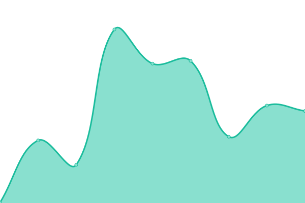

# [📈 Live Status](https://searx-instances.tiekoetter.com): <!--live status--> **🟧 Partial outage**

This repository contains the open-source uptime monitor and status page for [Tiekötter.com](https://www.tiekoetter.com), powered by [Upptime](https://github.com/upptime/upptime).

With [Upptime](https://upptime.js.org), you can get your own unlimited and free uptime monitor and status page, powered entirely by a GitHub repository. We use [Issues](https://github.com/tiekoettercom/searx-instances-uptime/issues) as incident reports, [Actions](https://github.com/tiekoettercom/searx-instances-uptime/actions) as uptime monitors, and [Pages](https://searx-instances.tiekoetter.com) for the status page.

<!--start: status pages-->
<!-- This summary is generated by Upptime (https://github.com/upptime/upptime) -->
<!-- Do not edit this manually, your changes will be overwritten -->
<!-- prettier-ignore -->
| URL | Status | History | Response Time | Uptime |
| --- | ------ | ------- | ------------- | ------ |
|  [searx.tiekoetter.com](https://searx.tiekoetter.com/) | 🟩 Up | [searx-tiekoetter-com.yml](https://github.com/tiekoettercom/searx-instances-uptime/commits/HEAD/history/searx-tiekoetter-com.yml) | 

 1204ms
     
 | 

<a href="https://searx-instances.tiekoetter.com/history/searx-tiekoetter-com">98.81%</a>
    

|  [darmarit.org/searx](https://darmarit.org/searx/) | 🟩 Up | [darmarit-org-searx.yml](https://github.com/tiekoettercom/searx-instances-uptime/commits/HEAD/history/darmarit-org-searx.yml) | 

 1950ms
     
 | 

<a href="https://searx-instances.tiekoetter.com/history/darmarit-org-searx">100.00%</a>
    

|  [paulgo.io](https://paulgo.io/) | 🟩 Up | [paulgo-io.yml](https://github.com/tiekoettercom/searx-instances-uptime/commits/HEAD/history/paulgo-io.yml) | 

 596ms
     
 | 

<a href="https://searx-instances.tiekoetter.com/history/paulgo-io">100.00%</a>
    

|  [searx.be](https://searx.be/) | 🟩 Up | [searx-be.yml](https://github.com/tiekoettercom/searx-instances-uptime/commits/HEAD/history/searx-be.yml) | 

 626ms
     
 | 

<a href="https://searx-instances.tiekoetter.com/history/searx-be">99.90%</a>
    

|  [baresearch.org](https://baresearch.org/) | 🟩 Up | [baresearch-org.yml](https://github.com/tiekoettercom/searx-instances-uptime/commits/HEAD/history/baresearch-org.yml) | 

 301ms
     
 | 

<a href="https://searx-instances.tiekoetter.com/history/baresearch-org">100.00%</a>
    

|  [copp.gg](https://copp.gg/) | 🟩 Up | [copp-gg.yml](https://github.com/tiekoettercom/searx-instances-uptime/commits/HEAD/history/copp-gg.yml) | 

 1543ms
     
 | 

<a href="https://searx-instances.tiekoetter.com/history/copp-gg">95.94%</a>
    

|  [etsi.me](https://etsi.me/) | 🟩 Up | [etsi-me.yml](https://github.com/tiekoettercom/searx-instances-uptime/commits/HEAD/history/etsi-me.yml) | 

 1460ms
     
 | 

<a href="https://searx-instances.tiekoetter.com/history/etsi-me">26.77%</a>
    

|  [fairsuch.net](https://fairsuch.net/) | 🟩 Up | [fairsuch-net.yml](https://github.com/tiekoettercom/searx-instances-uptime/commits/HEAD/history/fairsuch-net.yml) | 

 5475ms
     
 | 

<a href="https://searx-instances.tiekoetter.com/history/fairsuch-net">91.35%</a>
    

|  [nogoo.me](https://nogoo.me/) | 🟩 Up | [nogoo-me.yml](https://github.com/tiekoettercom/searx-instances-uptime/commits/HEAD/history/nogoo-me.yml) | 

 647ms
     
 | 

<a href="https://searx-instances.tiekoetter.com/history/nogoo-me">62.49%</a>
    

|  [northboot.xyz](https://northboot.xyz/) | 🟩 Up | [northboot-xyz.yml](https://github.com/tiekoettercom/searx-instances-uptime/commits/HEAD/history/northboot-xyz.yml) | 

 1351ms
     
 | 

<a href="https://searx-instances.tiekoetter.com/history/northboot-xyz">100.00%</a>
    

|  [nyc1.sx.ggtyler.dev](https://nyc1.sx.ggtyler.dev/) | 🟩 Up | [nyc1-sx-ggtyler-dev.yml](https://github.com/tiekoettercom/searx-instances-uptime/commits/HEAD/history/nyc1-sx-ggtyler-dev.yml) | 

 504ms
     
 | 

<a href="https://searx-instances.tiekoetter.com/history/nyc1-sx-ggtyler-dev">98.04%</a>
    

|  [ooglester.com](https://ooglester.com/) | 🟩 Up | [ooglester-com.yml](https://github.com/tiekoettercom/searx-instances-uptime/commits/HEAD/history/ooglester-com.yml) | 

 245ms
     
 | 

<a href="https://searx-instances.tiekoetter.com/history/ooglester-com">100.00%</a>
    

|  [opnxng.com](https://opnxng.com/) | 🟩 Up | [opnxng-com.yml](https://github.com/tiekoettercom/searx-instances-uptime/commits/HEAD/history/opnxng-com.yml) | 

 738ms
     
 | 

<a href="https://searx-instances.tiekoetter.com/history/opnxng-com">99.71%</a>
    

|  [priv.au](https://priv.au/) | 🟩 Up | [priv-au.yml](https://github.com/tiekoettercom/searx-instances-uptime/commits/HEAD/history/priv-au.yml) | 

 201ms
     
 | 

<a href="https://searx-instances.tiekoetter.com/history/priv-au">99.91%</a>
    

|  [s.mble.dk](https://s.mble.dk/) | 🟩 Up | [s-mble-dk.yml](https://github.com/tiekoettercom/searx-instances-uptime/commits/HEAD/history/s-mble-dk.yml) | 

 443ms
     
 | 

<a href="https://searx-instances.tiekoetter.com/history/s-mble-dk">100.00%</a>
    

|  [s.trung.fun](https://s.trung.fun/) | 🟩 Up | [s-trung-fun.yml](https://github.com/tiekoettercom/searx-instances-uptime/commits/HEAD/history/s-trung-fun.yml) | 

 1169ms
     
 | 

<a href="https://searx-instances.tiekoetter.com/history/s-trung-fun">100.00%</a>
    

|  [search.blitzw.in](https://search.blitzw.in/) | 🟩 Up | [search-blitzw-in.yml](https://github.com/tiekoettercom/searx-instances-uptime/commits/HEAD/history/search-blitzw-in.yml) | 

 474ms
     
 | 

<a href="https://searx-instances.tiekoetter.com/history/search-blitzw-in">100.00%</a>
    

|  [search.bus-hit.me](https://search.bus-hit.me/) | 🟩 Up | [search-bus-hit-me.yml](https://github.com/tiekoettercom/searx-instances-uptime/commits/HEAD/history/search-bus-hit-me.yml) | 

 2802ms
     
 | 

<a href="https://searx-instances.tiekoetter.com/history/search-bus-hit-me">99.80%</a>
    

|  [search.charliewhiskey.net](https://search.charliewhiskey.net/) | 🟩 Up | [search-charliewhiskey-net.yml](https://github.com/tiekoettercom/searx-instances-uptime/commits/HEAD/history/search-charliewhiskey-net.yml) | 

 560ms
     
 | 

<a href="https://searx-instances.tiekoetter.com/history/search-charliewhiskey-net">100.00%</a>
    

|  [search.citw.lgbt](https://search.citw.lgbt/) | 🟩 Up | [search-citw-lgbt.yml](https://github.com/tiekoettercom/searx-instances-uptime/commits/HEAD/history/search-citw-lgbt.yml) | 

 917ms
     
 | 

<a href="https://searx-instances.tiekoetter.com/history/search-citw-lgbt">100.00%</a>
    

|  [search.datura.network](https://search.datura.network/) | 🟥 Down | [search-datura-network.yml](https://github.com/tiekoettercom/searx-instances-uptime/commits/HEAD/history/search-datura-network.yml) | 

 0ms
     
 | 

<a href="https://searx-instances.tiekoetter.com/history/search-datura-network">0.00%</a>
    

|  [search.dotone.nl](https://search.dotone.nl/) | 🟥 Down | [search-dotone-nl.yml](https://github.com/tiekoettercom/searx-instances-uptime/commits/HEAD/history/search-dotone-nl.yml) | 

 548ms
     
 | 

<a href="https://searx-instances.tiekoetter.com/history/search-dotone-nl">28.75%</a>
    

|  [search.einfachzocken.eu](https://search.einfachzocken.eu/) | 🟩 Up | [search-einfachzocken-eu.yml](https://github.com/tiekoettercom/searx-instances-uptime/commits/HEAD/history/search-einfachzocken-eu.yml) | 

 508ms
     
 | 

<a href="https://searx-instances.tiekoetter.com/history/search-einfachzocken-eu">100.00%</a>
    

|  [search.gcomm.ch](https://search.gcomm.ch/) | 🟩 Up | [search-gcomm-ch.yml](https://github.com/tiekoettercom/searx-instances-uptime/commits/HEAD/history/search-gcomm-ch.yml) | 

 433ms
     
 | 

<a href="https://searx-instances.tiekoetter.com/history/search-gcomm-ch">100.00%</a>
    

|  [search.hbubli.cc](https://search.hbubli.cc/) | 🟩 Up | [search-hbubli-cc.yml](https://github.com/tiekoettercom/searx-instances-uptime/commits/HEAD/history/search-hbubli-cc.yml) | 

 420ms
     
 | 

<a href="https://searx-instances.tiekoetter.com/history/search-hbubli-cc">99.61%</a>
    

|  [search.im-in.space](https://search.im-in.space/) | 🟩 Up | [search-im-in-space.yml](https://github.com/tiekoettercom/searx-instances-uptime/commits/HEAD/history/search-im-in-space.yml) | 

 382ms
     
 | 

<a href="https://searx-instances.tiekoetter.com/history/search-im-in-space">100.00%</a>
    

|  [search.incogniweb.net](https://search.incogniweb.net/) | 🟥 Down | [search-incogniweb-net.yml](https://github.com/tiekoettercom/searx-instances-uptime/commits/HEAD/history/search-incogniweb-net.yml) | 

 10302ms
     
 | 

<a href="https://searx-instances.tiekoetter.com/history/search-incogniweb-net">82.82%</a>
    

|  [search.indst.eu](https://search.indst.eu/) | 🟩 Up | [search-indst-eu.yml](https://github.com/tiekoettercom/searx-instances-uptime/commits/HEAD/history/search-indst-eu.yml) | 

 509ms
     
 | 

<a href="https://searx-instances.tiekoetter.com/history/search-indst-eu">100.00%</a>
    

|  [search.inetol.net](https://search.inetol.net/) | 🟩 Up | [search-inetol-net.yml](https://github.com/tiekoettercom/searx-instances-uptime/commits/HEAD/history/search-inetol-net.yml) | 

 503ms
     
 | 

<a href="https://searx-instances.tiekoetter.com/history/search-inetol-net">99.80%</a>
    

|  [search.leptons.xyz](https://search.leptons.xyz/) | 🟩 Up | [search-leptons-xyz.yml](https://github.com/tiekoettercom/searx-instances-uptime/commits/HEAD/history/search-leptons-xyz.yml) | 

 347ms
     
 | 

<a href="https://searx-instances.tiekoetter.com/history/search-leptons-xyz">97.43%</a>
    

|  [search.mdosch.de](https://search.mdosch.de/) | 🟩 Up | [search-mdosch-de.yml](https://github.com/tiekoettercom/searx-instances-uptime/commits/HEAD/history/search-mdosch-de.yml) | 

 8287ms
     
 | 

<a href="https://searx-instances.tiekoetter.com/history/search-mdosch-de">92.16%</a>
    

|  [search.nadeko.net](https://search.nadeko.net/) | 🟩 Up | [search-nadeko-net.yml](https://github.com/tiekoettercom/searx-instances-uptime/commits/HEAD/history/search-nadeko-net.yml) | 

 1967ms
     
 | 

<a href="https://searx-instances.tiekoetter.com/history/search-nadeko-net">99.24%</a>
    

|  [search.nerdvpn.de](https://search.nerdvpn.de/) | 🟩 Up | [search-nerdvpn-de.yml](https://github.com/tiekoettercom/searx-instances-uptime/commits/HEAD/history/search-nerdvpn-de.yml) | 

 1408ms
     
 | 

<a href="https://searx-instances.tiekoetter.com/history/search-nerdvpn-de">99.51%</a>
    

|  [search.ngn.tf](https://search.ngn.tf/) | 🟩 Up | [search-ngn-tf.yml](https://github.com/tiekoettercom/searx-instances-uptime/commits/HEAD/history/search-ngn-tf.yml) | 

 778ms
     
 | 

<a href="https://searx-instances.tiekoetter.com/history/search-ngn-tf">99.70%</a>
    

|  [search.ononoki.org](https://search.ononoki.org/) | 🟩 Up | [search-ononoki-org.yml](https://github.com/tiekoettercom/searx-instances-uptime/commits/HEAD/history/search-ononoki-org.yml) | 

 323ms
     
 | 

<a href="https://searx-instances.tiekoetter.com/history/search-ononoki-org">99.80%</a>
    

|  [search.privacyredirect.com](https://search.privacyredirect.com/) | 🟩 Up | [search-privacyredirect-com.yml](https://github.com/tiekoettercom/searx-instances-uptime/commits/HEAD/history/search-privacyredirect-com.yml) | 

 528ms
     
 | 

<a href="https://searx-instances.tiekoetter.com/history/search-privacyredirect-com">100.00%</a>
    

|  [search.projectsegfau.lt](https://search.projectsegfau.lt/) | 🟩 Up | [search-projectsegfau-lt.yml](https://github.com/tiekoettercom/searx-instances-uptime/commits/HEAD/history/search-projectsegfau-lt.yml) | 

 766ms
     
 | 

<a href="https://searx-instances.tiekoetter.com/history/search-projectsegfau-lt">98.82%</a>
    

|  [search.rhscz.eu](https://search.rhscz.eu/) | 🟩 Up | [search-rhscz-eu.yml](https://github.com/tiekoettercom/searx-instances-uptime/commits/HEAD/history/search-rhscz-eu.yml) | 

 453ms
     
 | 

<a href="https://searx-instances.tiekoetter.com/history/search-rhscz-eu">82.01%</a>
    

|  [search.rowie.at](https://search.rowie.at/) | 🟩 Up | [search-rowie-at.yml](https://github.com/tiekoettercom/searx-instances-uptime/commits/HEAD/history/search-rowie-at.yml) | 

 1437ms
     
 | 

<a href="https://searx-instances.tiekoetter.com/history/search-rowie-at">100.00%</a>
    

|  [search.sapti.me](https://search.sapti.me/) | 🟩 Up | [search-sapti-me.yml](https://github.com/tiekoettercom/searx-instances-uptime/commits/HEAD/history/search-sapti-me.yml) | 

 732ms
     
 | 

<a href="https://searx-instances.tiekoetter.com/history/search-sapti-me">100.00%</a>
    

|  [search.smnz.de](https://search.smnz.de/) | 🟩 Up | [search-smnz-de.yml](https://github.com/tiekoettercom/searx-instances-uptime/commits/HEAD/history/search-smnz-de.yml) | 

 592ms
     
 | 

<a href="https://searx-instances.tiekoetter.com/history/search-smnz-de">100.00%</a>
    

|  [search.tommy-tran.com](https://search.tommy-tran.com/) | 🟥 Down | [search-tommy-tran-com.yml](https://github.com/tiekoettercom/searx-instances-uptime/commits/HEAD/history/search-tommy-tran-com.yml) | 

 10561ms
     
 | 

<a href="https://searx-instances.tiekoetter.com/history/search-tommy-tran-com">98.83%</a>
    

|  [searx.aleteoryx.me](https://searx.aleteoryx.me/) | 🟩 Up | [searx-aleteoryx-me.yml](https://github.com/tiekoettercom/searx-instances-uptime/commits/HEAD/history/searx-aleteoryx-me.yml) | 

 2229ms
     
 | 

<a href="https://searx-instances.tiekoetter.com/history/searx-aleteoryx-me">94.97%</a>
    

|  [searx.ankha.ac](https://searx.ankha.ac/) | 🟩 Up | [searx-ankha-ac.yml](https://github.com/tiekoettercom/searx-instances-uptime/commits/HEAD/history/searx-ankha-ac.yml) | 

 671ms
     
 | 

<a href="https://searx-instances.tiekoetter.com/history/searx-ankha-ac">100.00%</a>
    

|  [searx.catfluori.de](https://searx.catfluori.de/) | 🟩 Up | [searx-catfluori-de.yml](https://github.com/tiekoettercom/searx-instances-uptime/commits/HEAD/history/searx-catfluori-de.yml) | 

 473ms
     
 | 

<a href="https://searx-instances.tiekoetter.com/history/searx-catfluori-de">100.00%</a>
    

|  [searx.colbster937.dev](https://searx.colbster937.dev/) | 🟩 Up | [searx-colbster937-dev.yml](https://github.com/tiekoettercom/searx-instances-uptime/commits/HEAD/history/searx-colbster937-dev.yml) | 

 163ms
     
 | 

<a href="https://searx-instances.tiekoetter.com/history/searx-colbster937-dev">100.00%</a>
    

|  [searx.daetalytica.io](https://searx.daetalytica.io/) | 🟩 Up | [searx-daetalytica-io.yml](https://github.com/tiekoettercom/searx-instances-uptime/commits/HEAD/history/searx-daetalytica-io.yml) | 

 287ms
     
 | 

<a href="https://searx-instances.tiekoetter.com/history/searx-daetalytica-io">100.00%</a>
    

|  [searx.dresden.network](https://searx.dresden.network/) | 🟩 Up | [searx-dresden-network.yml](https://github.com/tiekoettercom/searx-instances-uptime/commits/HEAD/history/searx-dresden-network.yml) | 

 820ms
     
 | 

<a href="https://searx-instances.tiekoetter.com/history/searx-dresden-network">99.70%</a>
    

|  [searx.electroncash.de](https://searx.electroncash.de/) | 🟩 Up | [searx-electroncash-de.yml](https://github.com/tiekoettercom/searx-instances-uptime/commits/HEAD/history/searx-electroncash-de.yml) | 

 763ms
     
 | 

<a href="https://searx-instances.tiekoetter.com/history/searx-electroncash-de">55.00%</a>
    

|  [searx.foss.family](https://searx.foss.family/) | 🟩 Up | [searx-foss-family.yml](https://github.com/tiekoettercom/searx-instances-uptime/commits/HEAD/history/searx-foss-family.yml) | 

 714ms
     
 | 

<a href="https://searx-instances.tiekoetter.com/history/searx-foss-family">100.00%</a>
    

|  [searx.hu](https://searx.hu/) | 🟩 Up | [searx-hu.yml](https://github.com/tiekoettercom/searx-instances-uptime/commits/HEAD/history/searx-hu.yml) | 

 1770ms
     
 | 

<a href="https://searx-instances.tiekoetter.com/history/searx-hu">96.83%</a>
    

|  [searx.juancord.xyz](https://searx.juancord.xyz/) | 🟩 Up | [searx-juancord-xyz.yml](https://github.com/tiekoettercom/searx-instances-uptime/commits/HEAD/history/searx-juancord-xyz.yml) | 

 2095ms
     
 | 

<a href="https://searx-instances.tiekoetter.com/history/searx-juancord-xyz">75.04%</a>
    

|  [searx.lunar.icu](https://searx.lunar.icu/) | 🟩 Up | [searx-lunar-icu.yml](https://github.com/tiekoettercom/searx-instances-uptime/commits/HEAD/history/searx-lunar-icu.yml) | 

 442ms
     
 | 

<a href="https://searx-instances.tiekoetter.com/history/searx-lunar-icu">100.00%</a>
    

|  [searx.mv-software.de](https://searx.mv-software.de/) | 🟩 Up | [searx-mv-software-de.yml](https://github.com/tiekoettercom/searx-instances-uptime/commits/HEAD/history/searx-mv-software-de.yml) | 

 969ms
     
 | 

<a href="https://searx-instances.tiekoetter.com/history/searx-mv-software-de">100.00%</a>
    

|  [searx.mxchange.org](https://searx.mxchange.org/) | 🟩 Up | [searx-mxchange-org.yml](https://github.com/tiekoettercom/searx-instances-uptime/commits/HEAD/history/searx-mxchange-org.yml) | 

 886ms
     
 | 

<a href="https://searx-instances.tiekoetter.com/history/searx-mxchange-org">99.90%</a>
    

|  [searx.namejeff.xyz](https://searx.namejeff.xyz/) | 🟩 Up | [searx-namejeff-xyz.yml](https://github.com/tiekoettercom/searx-instances-uptime/commits/HEAD/history/searx-namejeff-xyz.yml) | 

 390ms
     
 | 

<a href="https://searx-instances.tiekoetter.com/history/searx-namejeff-xyz">100.00%</a>
    

|  [searx.nobulart.com](https://searx.nobulart.com/) | 🟩 Up | [searx-nobulart-com.yml](https://github.com/tiekoettercom/searx-instances-uptime/commits/HEAD/history/searx-nobulart-com.yml) | 

 508ms
     
 | 

<a href="https://searx-instances.tiekoetter.com/history/searx-nobulart-com">97.43%</a>
    

|  [searx.numeriquement.fr](https://searx.numeriquement.fr/) | 🟩 Up | [searx-numeriquement-fr.yml](https://github.com/tiekoettercom/searx-instances-uptime/commits/HEAD/history/searx-numeriquement-fr.yml) | 

 907ms
     
 | 

<a href="https://searx-instances.tiekoetter.com/history/searx-numeriquement-fr">33.07%</a>
    

|  [searx.oakleycord.dev](https://searx.oakleycord.dev/) | 🟩 Up | [searx-oakleycord-dev.yml](https://github.com/tiekoettercom/searx-instances-uptime/commits/HEAD/history/searx-oakleycord-dev.yml) | 

 152ms
     
 | 

<a href="https://searx-instances.tiekoetter.com/history/searx-oakleycord-dev">100.00%</a>
    

|  [searx.ox2.fr](https://searx.ox2.fr/) | 🟩 Up | [searx-ox2-fr.yml](https://github.com/tiekoettercom/searx-instances-uptime/commits/HEAD/history/searx-ox2-fr.yml) | 

 716ms
     
 | 

<a href="https://searx-instances.tiekoetter.com/history/searx-ox2-fr">100.00%</a>
    

|  [searx.perennialte.ch](https://searx.perennialte.ch/) | 🟩 Up | [searx-perennialte-ch.yml](https://github.com/tiekoettercom/searx-instances-uptime/commits/HEAD/history/searx-perennialte-ch.yml) | 

 588ms
     
 | 

<a href="https://searx-instances.tiekoetter.com/history/searx-perennialte-ch">99.55%</a>
    

|  [searx.rhscz.eu](https://searx.rhscz.eu/) | 🟩 Up | [searx-rhscz-eu.yml](https://github.com/tiekoettercom/searx-instances-uptime/commits/HEAD/history/searx-rhscz-eu.yml) | 

 411ms
     
 | 

<a href="https://searx-instances.tiekoetter.com/history/searx-rhscz-eu">81.44%</a>
    

|  [searx.ro](https://searx.ro/) | 🟩 Up | [searx-ro.yml](https://github.com/tiekoettercom/searx-instances-uptime/commits/HEAD/history/searx-ro.yml) | 

 471ms
     
 | 

<a href="https://searx-instances.tiekoetter.com/history/searx-ro">99.91%</a>
    

|  [searx.sev.monster](https://searx.sev.monster/) | 🟩 Up | [searx-sev-monster.yml](https://github.com/tiekoettercom/searx-instances-uptime/commits/HEAD/history/searx-sev-monster.yml) | 

 375ms
     
 | 

<a href="https://searx-instances.tiekoetter.com/history/searx-sev-monster">100.00%</a>
    

|  [searx.thefloatinglab.world](https://searx.thefloatinglab.world/) | 🟩 Up | [searx-thefloatinglab-world.yml](https://github.com/tiekoettercom/searx-instances-uptime/commits/HEAD/history/searx-thefloatinglab-world.yml) | 

 675ms
     
 | 

<a href="https://searx-instances.tiekoetter.com/history/searx-thefloatinglab-world">100.00%</a>
    

|  [searx.tuxcloud.net](https://searx.tuxcloud.net/) | 🟩 Up | [searx-tuxcloud-net.yml](https://github.com/tiekoettercom/searx-instances-uptime/commits/HEAD/history/searx-tuxcloud-net.yml) | 

 8019ms
     
 | 

<a href="https://searx-instances.tiekoetter.com/history/searx-tuxcloud-net">98.60%</a>
    

|  [searx.work](https://searx.work/) | 🟩 Up | [searx-work.yml](https://github.com/tiekoettercom/searx-instances-uptime/commits/HEAD/history/searx-work.yml) | 

 177ms
     
 | 

<a href="https://searx-instances.tiekoetter.com/history/searx-work">99.90%</a>
    

|  [searx.zhenyapav.com](https://searx.zhenyapav.com/) | 🟩 Up | [searx-zhenyapav-com.yml](https://github.com/tiekoettercom/searx-instances-uptime/commits/HEAD/history/searx-zhenyapav-com.yml) | 

 982ms
     
 | 

<a href="https://searx-instances.tiekoetter.com/history/searx-zhenyapav-com">100.00%</a>
    

|  [searxng.brihx.fr](https://searxng.brihx.fr/) | 🟩 Up | [searxng-brihx-fr.yml](https://github.com/tiekoettercom/searx-instances-uptime/commits/HEAD/history/searxng-brihx-fr.yml) | 

 409ms
     
 | 

<a href="https://searx-instances.tiekoetter.com/history/searxng-brihx-fr">100.00%</a>
    

|  [searxng.ch](https://searxng.ch/) | 🟩 Up | [searxng-ch.yml](https://github.com/tiekoettercom/searx-instances-uptime/commits/HEAD/history/searxng-ch.yml) | 

 425ms
     
 | 

<a href="https://searx-instances.tiekoetter.com/history/searxng-ch">100.00%</a>
    

|  [searxng.hweeren.com](https://searxng.hweeren.com/) | 🟩 Up | [searxng-hweeren-com.yml](https://github.com/tiekoettercom/searx-instances-uptime/commits/HEAD/history/searxng-hweeren-com.yml) | 

 741ms
     
 | 

<a href="https://searx-instances.tiekoetter.com/history/searxng-hweeren-com">100.00%</a>
    

|  [searxng.shreven.org](https://searxng.shreven.org/) | 🟩 Up | [searxng-shreven-org.yml](https://github.com/tiekoettercom/searx-instances-uptime/commits/HEAD/history/searxng-shreven-org.yml) | 

 319ms
     
 | 

<a href="https://searx-instances.tiekoetter.com/history/searxng-shreven-org">99.91%</a>
    

|  [searxng.site](https://searxng.site/) | 🟩 Up | [searxng-site.yml](https://github.com/tiekoettercom/searx-instances-uptime/commits/HEAD/history/searxng-site.yml) | 

 517ms
     
 | 

<a href="https://searx-instances.tiekoetter.com/history/searxng-site">74.09%</a>
    

|  [skyrimhater.com](https://skyrimhater.com/) | 🟩 Up | [skyrimhater-com.yml](https://github.com/tiekoettercom/searx-instances-uptime/commits/HEAD/history/skyrimhater-com.yml) | 

 330ms
     
 | 

<a href="https://searx-instances.tiekoetter.com/history/skyrimhater-com">98.94%</a>
    

|  [sx.ca.zorby.top](https://sx.ca.zorby.top/) | 🟥 Down | [sx-ca-zorby-top.yml](https://github.com/tiekoettercom/searx-instances-uptime/commits/HEAD/history/sx-ca-zorby-top.yml) | 

 434ms
     
 | 

<a href="https://searx-instances.tiekoetter.com/history/sx-ca-zorby-top">25.74%</a>
    

|  [sx.catgirl.cloud](https://sx.catgirl.cloud/) | 🟩 Up | [sx-catgirl-cloud.yml](https://github.com/tiekoettercom/searx-instances-uptime/commits/HEAD/history/sx-catgirl-cloud.yml) | 

 708ms
     
 | 

<a href="https://searx-instances.tiekoetter.com/history/sx-catgirl-cloud">100.00%</a>
    

|  [sx.thatxtreme.dev](https://sx.thatxtreme.dev/) | 🟩 Up | [sx-thatxtreme-dev.yml](https://github.com/tiekoettercom/searx-instances-uptime/commits/HEAD/history/sx-thatxtreme-dev.yml) | 

 691ms
     
 | 

<a href="https://searx-instances.tiekoetter.com/history/sx-thatxtreme-dev">90.67%</a>
    

|  [sx.zorby.top](https://sx.zorby.top/) | 🟩 Up | [sx-zorby-top.yml](https://github.com/tiekoettercom/searx-instances-uptime/commits/HEAD/history/sx-zorby-top.yml) | 

 2550ms
     
 | 

<a href="https://searx-instances.tiekoetter.com/history/sx-zorby-top">98.57%</a>
    

|  [www.gruble.de](https://www.gruble.de/) | 🟩 Up | [www-gruble-de.yml](https://github.com/tiekoettercom/searx-instances-uptime/commits/HEAD/history/www-gruble-de.yml) | 

 745ms
     
 | 

<a href="https://searx-instances.tiekoetter.com/history/www-gruble-de">99.90%</a>
    

|  [www.jabber-germany.de/searx](https://www.jabber-germany.de/searx/) | 🟥 Down | [www-jabber-germany-de-searx.yml](https://github.com/tiekoettercom/searx-instances-uptime/commits/HEAD/history/www-jabber-germany-de-searx.yml) | 

 2517ms
     
 | 

<a href="https://searx-instances.tiekoetter.com/history/www-jabber-germany-de-searx">25.52%</a>
    

|  [xo.wtf](https://xo.wtf/) | 🟥 Down | [xo-wtf.yml](https://github.com/tiekoettercom/searx-instances-uptime/commits/HEAD/history/xo-wtf.yml) | 

 431ms
     
 | 

<a href="https://searx-instances.tiekoetter.com/history/xo-wtf">47.61%</a>
    

<!--end: status pages-->

[**Visit our status website →**](https://searx-instances.tiekoetter.com)

## 📄 License

- Powered by: [Upptime](https://github.com/upptime/upptime)
- Code: [MIT](./LICENSE) © [Tiekötter.com](https://www.tiekoetter.com)
- Data in the `./history` directory: [Open Database License](https://opendatacommons.org/licenses/odbl/1-0/)
