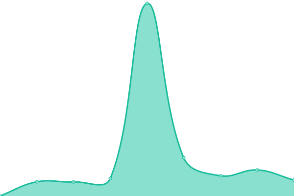

# [📈 Live Status](https://searx-instances.tiekoetter.com): <!--live status--> **🟧 Partial outage**

This repository contains the open-source uptime monitor and status page for [Tiekötter.com](https://www.tiekoetter.com), powered by [Upptime](https://github.com/upptime/upptime).

With [Upptime](https://upptime.js.org), you can get your own unlimited and free uptime monitor and status page, powered entirely by a GitHub repository. We use [Issues](https://github.com/tiekoettercom/searx-instances-uptime/issues) as incident reports, [Actions](https://github.com/tiekoettercom/searx-instances-uptime/actions) as uptime monitors, and [Pages](https://searx-instances.tiekoetter.com) for the status page.

<!--start: status pages-->
<!-- This summary is generated by Upptime (https://github.com/upptime/upptime) -->
<!-- Do not edit this manually, your changes will be overwritten -->
<!-- prettier-ignore -->
| URL | Status | History | Response Time | Uptime |
| --- | ------ | ------- | ------------- | ------ |
|  [searx.tiekoetter.com](https://searx.tiekoetter.com/) | 🟩 Up | [searx-tiekoetter-com.yml](https://github.com/tiekoettercom/searx-instances-uptime/commits/HEAD/history/searx-tiekoetter-com.yml) | 

 620ms
     
 | 

<a href="https://searx-instances.tiekoetter.com/history/searx-tiekoetter-com">100.00%</a>
    

|  [darmarit.org/searx](https://darmarit.org/searx/) | 🟩 Up | [darmarit-org-searx.yml](https://github.com/tiekoettercom/searx-instances-uptime/commits/HEAD/history/darmarit-org-searx.yml) | 

 810ms
     
 | 

<a href="https://searx-instances.tiekoetter.com/history/darmarit-org-searx">100.00%</a>
    

|  [paulgo.io](https://paulgo.io/) | 🟩 Up | [paulgo-io.yml](https://github.com/tiekoettercom/searx-instances-uptime/commits/HEAD/history/paulgo-io.yml) | 

 612ms
     
 | 

<a href="https://searx-instances.tiekoetter.com/history/paulgo-io">100.00%</a>
    

|  [searx.be](https://searx.be/) | 🟩 Up | [searx-be.yml](https://github.com/tiekoettercom/searx-instances-uptime/commits/HEAD/history/searx-be.yml) | 

 875ms
     
 | 

<a href="https://searx-instances.tiekoetter.com/history/searx-be">100.00%</a>
    

|  [anon.sx](https://anon.sx/) | 🟩 Up | [anon-sx.yml](https://github.com/tiekoettercom/searx-instances-uptime/commits/HEAD/history/anon-sx.yml) | 

 596ms
     
 | 

<a href="https://searx-instances.tiekoetter.com/history/anon-sx">100.00%</a>
    

|  [asowneryt.cloudns.nz](https://asowneryt.cloudns.nz/) | 🟩 Up | [asowneryt-cloudns-nz.yml](https://github.com/tiekoettercom/searx-instances-uptime/commits/HEAD/history/asowneryt-cloudns-nz.yml) | 

 950ms
     
 | 

<a href="https://searx-instances.tiekoetter.com/history/asowneryt-cloudns-nz">72.90%</a>
    

|  [dynabyte.ca](https://dynabyte.ca/) | 🟩 Up | [dynabyte-ca.yml](https://github.com/tiekoettercom/searx-instances-uptime/commits/HEAD/history/dynabyte-ca.yml) | 

 1000ms
     
 | 

<a href="https://searx-instances.tiekoetter.com/history/dynabyte-ca">100.00%</a>
    

|  [etsi.me](https://etsi.me/) | 🟩 Up | [etsi-me.yml](https://github.com/tiekoettercom/searx-instances-uptime/commits/HEAD/history/etsi-me.yml) | 

 209ms
     
 | 

<a href="https://searx-instances.tiekoetter.com/history/etsi-me">100.00%</a>
    

|  [jsearch.pw](https://jsearch.pw/) | 🟩 Up | [jsearch-pw.yml](https://github.com/tiekoettercom/searx-instances-uptime/commits/HEAD/history/jsearch-pw.yml) | 

 236ms
     
 | 

<a href="https://searx-instances.tiekoetter.com/history/jsearch-pw">75.45%</a>
    

|  [nibblehole.com](https://nibblehole.com/) | 🟩 Up | [nibblehole-com.yml](https://github.com/tiekoettercom/searx-instances-uptime/commits/HEAD/history/nibblehole-com.yml) | 

 555ms
     
 | 

<a href="https://searx-instances.tiekoetter.com/history/nibblehole-com">100.00%</a>
    

|  [northboot.xyz](https://northboot.xyz/) | 🟩 Up | [northboot-xyz.yml](https://github.com/tiekoettercom/searx-instances-uptime/commits/HEAD/history/northboot-xyz.yml) | 

 802ms
     
 | 

<a href="https://searx-instances.tiekoetter.com/history/northboot-xyz">100.00%</a>
    

|  [procurx.pt](https://procurx.pt/) | 🟩 Up | [procurx-pt.yml](https://github.com/tiekoettercom/searx-instances-uptime/commits/HEAD/history/procurx-pt.yml) | 

 870ms
     
 | 

<a href="https://searx-instances.tiekoetter.com/history/procurx-pt">99.17%</a>
    

|  [s.zhaocloud.net](https://s.zhaocloud.net/) | 🟩 Up | [s-zhaocloud-net.yml](https://github.com/tiekoettercom/searx-instances-uptime/commits/HEAD/history/s-zhaocloud-net.yml) | 

 498ms
     
 | 

<a href="https://searx-instances.tiekoetter.com/history/s-zhaocloud-net">100.00%</a>
    

|  [search.antonkling.se](https://search.antonkling.se/) | 🟩 Up | [search-antonkling-se.yml](https://github.com/tiekoettercom/searx-instances-uptime/commits/HEAD/history/search-antonkling-se.yml) | 

 1048ms
     
 | 

<a href="https://searx-instances.tiekoetter.com/history/search-antonkling-se">99.97%</a>
    

|  [search.bus-hit.me](https://search.bus-hit.me/) | 🟩 Up | [search-bus-hit-me.yml](https://github.com/tiekoettercom/searx-instances-uptime/commits/HEAD/history/search-bus-hit-me.yml) | 

 328ms
     
 | 

<a href="https://searx-instances.tiekoetter.com/history/search-bus-hit-me">100.00%</a>
    

|  [search.chemicals-in-the-water.eu](https://search.chemicals-in-the-water.eu/) | 🟩 Up | [search-chemicals-in-the-water-eu.yml](https://github.com/tiekoettercom/searx-instances-uptime/commits/HEAD/history/search-chemicals-in-the-water-eu.yml) | 

 715ms
     
 | 

<a href="https://searx-instances.tiekoetter.com/history/search-chemicals-in-the-water-eu">98.92%</a>
    

|  [search.disroot.org](https://search.disroot.org/) | 🟩 Up | [search-disroot-org.yml](https://github.com/tiekoettercom/searx-instances-uptime/commits/HEAD/history/search-disroot-org.yml) | 

 1055ms
     
 | 

<a href="https://searx-instances.tiekoetter.com/history/search-disroot-org">99.85%</a>
    

|  [search.ethibox.fr](https://search.ethibox.fr/) | 🟩 Up | [search-ethibox-fr.yml](https://github.com/tiekoettercom/searx-instances-uptime/commits/HEAD/history/search-ethibox-fr.yml) | 

 906ms
     
 | 

<a href="https://searx-instances.tiekoetter.com/history/search-ethibox-fr">100.00%</a>
    

|  [search.jpope.org](https://search.jpope.org/) | 🟩 Up | [search-jpope-org.yml](https://github.com/tiekoettercom/searx-instances-uptime/commits/HEAD/history/search-jpope-org.yml) | 

 360ms
     
 | 

<a href="https://searx-instances.tiekoetter.com/history/search-jpope-org">92.52%</a>
    

|  [search.mdosch.de](https://search.mdosch.de/) | 🟩 Up | [search-mdosch-de.yml](https://github.com/tiekoettercom/searx-instances-uptime/commits/HEAD/history/search-mdosch-de.yml) | 

 606ms
     
 | 

<a href="https://searx-instances.tiekoetter.com/history/search-mdosch-de">100.00%</a>
    

|  [search.neet.works](https://search.neet.works/) | 🟩 Up | [search-neet-works.yml](https://github.com/tiekoettercom/searx-instances-uptime/commits/HEAD/history/search-neet-works.yml) | 

 313ms
     
 | 

<a href="https://searx-instances.tiekoetter.com/history/search-neet-works">99.95%</a>
    

|  [search.ononoki.org](https://search.ononoki.org/) | 🟩 Up | [search-ononoki-org.yml](https://github.com/tiekoettercom/searx-instances-uptime/commits/HEAD/history/search-ononoki-org.yml) | 

 291ms
     
 | 

<a href="https://searx-instances.tiekoetter.com/history/search-ononoki-org">100.00%</a>
    

|  [search.privacyguides.net](https://search.privacyguides.net/) | 🟩 Up | [search-privacyguides-net.yml](https://github.com/tiekoettercom/searx-instances-uptime/commits/HEAD/history/search-privacyguides-net.yml) | 

 187ms
     
 | 

<a href="https://searx-instances.tiekoetter.com/history/search-privacyguides-net">100.00%</a>
    

|  [search.rabbit-company.com](https://search.rabbit-company.com/) | 🟩 Up | [search-rabbit-company-com.yml](https://github.com/tiekoettercom/searx-instances-uptime/commits/HEAD/history/search-rabbit-company-com.yml) | 

 451ms
     
 | 

<a href="https://searx-instances.tiekoetter.com/history/search-rabbit-company-com">100.00%</a>
    

|  [search.roombob.cat](https://search.roombob.cat/) | 🟩 Up | [search-roombob-cat.yml](https://github.com/tiekoettercom/searx-instances-uptime/commits/HEAD/history/search-roombob-cat.yml) | 

 391ms
     
 | 

<a href="https://searx-instances.tiekoetter.com/history/search-roombob-cat">99.91%</a>
    

|  [search.snopyta.org](https://search.snopyta.org/) | 🟩 Up | [search-snopyta-org.yml](https://github.com/tiekoettercom/searx-instances-uptime/commits/HEAD/history/search-snopyta-org.yml) | 

 912ms
     
 | 

<a href="https://searx-instances.tiekoetter.com/history/search-snopyta-org">100.00%</a>
    

|  [search.stinpriza.org](https://search.stinpriza.org/) | 🟩 Up | [search-stinpriza-org.yml](https://github.com/tiekoettercom/searx-instances-uptime/commits/HEAD/history/search-stinpriza-org.yml) | 

 1087ms
     
 | 

<a href="https://searx-instances.tiekoetter.com/history/search-stinpriza-org">100.00%</a>
    

|  [search.trom.tf](https://search.trom.tf/) | 🟩 Up | [search-trom-tf.yml](https://github.com/tiekoettercom/searx-instances-uptime/commits/HEAD/history/search-trom-tf.yml) | 

 666ms
     
 | 

<a href="https://searx-instances.tiekoetter.com/history/search-trom-tf">99.95%</a>
    

|  [search.vojkovic.xyz](https://search.vojkovic.xyz/) | 🟩 Up | [search-vojkovic-xyz.yml](https://github.com/tiekoettercom/searx-instances-uptime/commits/HEAD/history/search-vojkovic-xyz.yml) | 

 657ms
     
 | 

<a href="https://searx-instances.tiekoetter.com/history/search-vojkovic-xyz">99.85%</a>
    

|  [search.zzls.xyz](https://search.zzls.xyz/) | 🟩 Up | [search-zzls-xyz.yml](https://github.com/tiekoettercom/searx-instances-uptime/commits/HEAD/history/search-zzls-xyz.yml) | 

 1985ms
     
 | 

<a href="https://searx-instances.tiekoetter.com/history/search-zzls-xyz">99.60%</a>
    

|  [searx.albony.xyz](https://searx.albony.xyz/) | 🟩 Up | [searx-albony-xyz.yml](https://github.com/tiekoettercom/searx-instances-uptime/commits/HEAD/history/searx-albony-xyz.yml) | 

 1083ms
     
 | 

<a href="https://searx-instances.tiekoetter.com/history/searx-albony-xyz">87.15%</a>
    

|  [searx.bardia.tech](https://searx.bardia.tech/) | 🟩 Up | [searx-bardia-tech.yml](https://github.com/tiekoettercom/searx-instances-uptime/commits/HEAD/history/searx-bardia-tech.yml) | 

 615ms
     
 | 

<a href="https://searx-instances.tiekoetter.com/history/searx-bardia-tech">100.00%</a>
    

|  [searx.bissisoft.com](https://searx.bissisoft.com/) | 🟩 Up | [searx-bissisoft-com.yml](https://github.com/tiekoettercom/searx-instances-uptime/commits/HEAD/history/searx-bissisoft-com.yml) | 

 690ms
     
 | 

<a href="https://searx-instances.tiekoetter.com/history/searx-bissisoft-com">79.12%</a>
    

|  [searx.divided-by-zero.eu](https://searx.divided-by-zero.eu/) | 🟩 Up | [searx-divided-by-zero-eu.yml](https://github.com/tiekoettercom/searx-instances-uptime/commits/HEAD/history/searx-divided-by-zero-eu.yml) | 

 696ms
     
 | 

<a href="https://searx-instances.tiekoetter.com/history/searx-divided-by-zero-eu">100.00%</a>
    

|  [searx.dresden.network](https://searx.dresden.network/) | 🟩 Up | [searx-dresden-network.yml](https://github.com/tiekoettercom/searx-instances-uptime/commits/HEAD/history/searx-dresden-network.yml) | 

 794ms
     
 | 

<a href="https://searx-instances.tiekoetter.com/history/searx-dresden-network">100.00%</a>
    

|  [searx.ebnar.xyz](https://searx.ebnar.xyz/) | 🟩 Up | [searx-ebnar-xyz.yml](https://github.com/tiekoettercom/searx-instances-uptime/commits/HEAD/history/searx-ebnar-xyz.yml) | 

 620ms
     
 | 

<a href="https://searx-instances.tiekoetter.com/history/searx-ebnar-xyz">99.90%</a>
    

|  [searx.esmailelbob.xyz](https://searx.esmailelbob.xyz/) | 🟩 Up | [searx-esmailelbob-xyz.yml](https://github.com/tiekoettercom/searx-instances-uptime/commits/HEAD/history/searx-esmailelbob-xyz.yml) | 

 761ms
     
 | 

<a href="https://searx-instances.tiekoetter.com/history/searx-esmailelbob-xyz">100.00%</a>
    

|  [searx.fmac.xyz](https://searx.fmac.xyz/) | 🟩 Up | [searx-fmac-xyz.yml](https://github.com/tiekoettercom/searx-instances-uptime/commits/HEAD/history/searx-fmac-xyz.yml) | 

 584ms
     
 | 

<a href="https://searx-instances.tiekoetter.com/history/searx-fmac-xyz">99.95%</a>
    

|  [searx.fossencdi.org](https://searx.fossencdi.org/) | 🟩 Up | [searx-fossencdi-org.yml](https://github.com/tiekoettercom/searx-instances-uptime/commits/HEAD/history/searx-fossencdi-org.yml) | 

 781ms
     
 | 

<a href="https://searx-instances.tiekoetter.com/history/searx-fossencdi-org">100.00%</a>
    

|  [searx.gnous.eu](https://searx.gnous.eu/) | 🟩 Up | [searx-gnous-eu.yml](https://github.com/tiekoettercom/searx-instances-uptime/commits/HEAD/history/searx-gnous-eu.yml) | 

 795ms
     
 | 

<a href="https://searx-instances.tiekoetter.com/history/searx-gnous-eu">100.00%</a>
    

|  [searx.gnu.style](https://searx.gnu.style/) | 🟩 Up | [searx-gnu-style.yml](https://github.com/tiekoettercom/searx-instances-uptime/commits/HEAD/history/searx-gnu-style.yml) | 

 799ms
     
 | 

<a href="https://searx-instances.tiekoetter.com/history/searx-gnu-style">99.96%</a>
    

|  [searx.josie.lol](https://searx.josie.lol/) | 🟩 Up | [searx-josie-lol.yml](https://github.com/tiekoettercom/searx-instances-uptime/commits/HEAD/history/searx-josie-lol.yml) | 

 120ms
     
 | 

<a href="https://searx-instances.tiekoetter.com/history/searx-josie-lol">100.00%</a>
    

|  [searx.kujonello.cf](https://searx.kujonello.cf/) | 🟩 Up | [searx-kujonello-cf.yml](https://github.com/tiekoettercom/searx-instances-uptime/commits/HEAD/history/searx-kujonello-cf.yml) | 

 899ms
     
 | 

<a href="https://searx-instances.tiekoetter.com/history/searx-kujonello-cf">100.00%</a>
    

|  [searx.loafland.xyz](https://searx.loafland.xyz/) | 🟩 Up | [searx-loafland-xyz.yml](https://github.com/tiekoettercom/searx-instances-uptime/commits/HEAD/history/searx-loafland-xyz.yml) | 

 179ms
     
 | 

<a href="https://searx-instances.tiekoetter.com/history/searx-loafland-xyz">99.95%</a>
    

|  [searx.mastodontech.de](https://searx.mastodontech.de/) | 🟩 Up | [searx-mastodontech-de.yml](https://github.com/tiekoettercom/searx-instances-uptime/commits/HEAD/history/searx-mastodontech-de.yml) | 

 858ms
     
 | 

<a href="https://searx-instances.tiekoetter.com/history/searx-mastodontech-de">100.00%</a>
    

|  [searx.mha.fi](https://searx.mha.fi/) | 🟩 Up | [searx-mha-fi.yml](https://github.com/tiekoettercom/searx-instances-uptime/commits/HEAD/history/searx-mha-fi.yml) | 

 555ms
     
 | 

<a href="https://searx-instances.tiekoetter.com/history/searx-mha-fi">100.00%</a>
    

|  [searx.mxchange.org](https://searx.mxchange.org/) | 🟩 Up | [searx-mxchange-org.yml](https://github.com/tiekoettercom/searx-instances-uptime/commits/HEAD/history/searx-mxchange-org.yml) | 

 787ms
     
 | 

<a href="https://searx-instances.tiekoetter.com/history/searx-mxchange-org">100.00%</a>
    

|  [searx.nakhan.net](https://searx.nakhan.net/) | 🟩 Up | [searx-nakhan-net.yml](https://github.com/tiekoettercom/searx-instances-uptime/commits/HEAD/history/searx-nakhan-net.yml) | 

 929ms
     
 | 

<a href="https://searx-instances.tiekoetter.com/history/searx-nakhan-net">100.00%</a>
    

|  [searx.namejeff.xyz](https://searx.namejeff.xyz/) | 🟩 Up | [searx-namejeff-xyz.yml](https://github.com/tiekoettercom/searx-instances-uptime/commits/HEAD/history/searx-namejeff-xyz.yml) | 

 445ms
     
 | 

<a href="https://searx-instances.tiekoetter.com/history/searx-namejeff-xyz">100.00%</a>
    

|  [searx.netzspielplatz.de](https://searx.netzspielplatz.de/) | 🟩 Up | [searx-netzspielplatz-de.yml](https://github.com/tiekoettercom/searx-instances-uptime/commits/HEAD/history/searx-netzspielplatz-de.yml) | 

 675ms
     
 | 

<a href="https://searx-instances.tiekoetter.com/history/searx-netzspielplatz-de">100.00%</a>
    

|  [searx.nixnet.services](https://searx.nixnet.services/) | 🟩 Up | [searx-nixnet-services.yml](https://github.com/tiekoettercom/searx-instances-uptime/commits/HEAD/history/searx-nixnet-services.yml) | 

 880ms
     
 | 

<a href="https://searx-instances.tiekoetter.com/history/searx-nixnet-services">100.00%</a>
    

|  [searx.openhoofd.nl](https://searx.openhoofd.nl/) | 🟩 Up | [searx-openhoofd-nl.yml](https://github.com/tiekoettercom/searx-instances-uptime/commits/HEAD/history/searx-openhoofd-nl.yml) | 

 948ms
     
 | 

<a href="https://searx-instances.tiekoetter.com/history/searx-openhoofd-nl">100.00%</a>
    

|  [searx.org](https://searx.org/) | 🟩 Up | [searx-org.yml](https://github.com/tiekoettercom/searx-instances-uptime/commits/HEAD/history/searx-org.yml) | 

 718ms
     
 | 

<a href="https://searx-instances.tiekoetter.com/history/searx-org">100.00%</a>
    

|  [searx.orion-hub.fr](https://searx.orion-hub.fr/) | 🟥 Down | [searx-orion-hub-fr.yml](https://github.com/tiekoettercom/searx-instances-uptime/commits/HEAD/history/searx-orion-hub-fr.yml) | 

 759ms
     
 | 

<a href="https://searx-instances.tiekoetter.com/history/searx-orion-hub-fr">99.87%</a>
    

|  [searx.ppeb.me](https://searx.ppeb.me/) | 🟩 Up | [searx-ppeb-me.yml](https://github.com/tiekoettercom/searx-instances-uptime/commits/HEAD/history/searx-ppeb-me.yml) | 

 460ms
     
 | 

<a href="https://searx-instances.tiekoetter.com/history/searx-ppeb-me">99.35%</a>
    

|  [searx.priv.pw](https://searx.priv.pw/) | 🟩 Up | [searx-priv-pw.yml](https://github.com/tiekoettercom/searx-instances-uptime/commits/HEAD/history/searx-priv-pw.yml) | 

 476ms
     
 | 

<a href="https://searx-instances.tiekoetter.com/history/searx-priv-pw">100.00%</a>
    

|  [searx.prvcy.eu](https://searx.prvcy.eu/) | 🟩 Up | [searx-prvcy-eu.yml](https://github.com/tiekoettercom/searx-instances-uptime/commits/HEAD/history/searx-prvcy-eu.yml) | 

 807ms
     
 | 

<a href="https://searx-instances.tiekoetter.com/history/searx-prvcy-eu">100.00%</a>
    

|  [searx.pwoss.org](https://searx.pwoss.org/) | 🟩 Up | [searx-pwoss-org.yml](https://github.com/tiekoettercom/searx-instances-uptime/commits/HEAD/history/searx-pwoss-org.yml) | 

 624ms
     
 | 

<a href="https://searx-instances.tiekoetter.com/history/searx-pwoss-org">99.96%</a>
    

|  [searx.rasp.fr](https://searx.rasp.fr/) | 🟩 Up | [searx-rasp-fr.yml](https://github.com/tiekoettercom/searx-instances-uptime/commits/HEAD/history/searx-rasp-fr.yml) | 

 1841ms
     
 | 

<a href="https://searx-instances.tiekoetter.com/history/searx-rasp-fr">99.86%</a>
    

|  [searx.ru](https://searx.ru/) | 🟩 Up | [searx-ru.yml](https://github.com/tiekoettercom/searx-instances-uptime/commits/HEAD/history/searx-ru.yml) | 

 902ms
     
 | 

<a href="https://searx-instances.tiekoetter.com/history/searx-ru">100.00%</a>
    

|  [searx.run](https://searx.run/) | 🟩 Up | [searx-run.yml](https://github.com/tiekoettercom/searx-instances-uptime/commits/HEAD/history/searx-run.yml) | 

 681ms
     
 | 

<a href="https://searx-instances.tiekoetter.com/history/searx-run">100.00%</a>
    

|  [searx.semipvt.com](https://searx.semipvt.com/) | 🟩 Up | [searx-semipvt-com.yml](https://github.com/tiekoettercom/searx-instances-uptime/commits/HEAD/history/searx-semipvt-com.yml) | 

 725ms
     
 | 

<a href="https://searx-instances.tiekoetter.com/history/searx-semipvt-com">100.00%</a>
    

|  [searx.sethforprivacy.com](https://searx.sethforprivacy.com/) | 🟩 Up | [searx-sethforprivacy-com.yml](https://github.com/tiekoettercom/searx-instances-uptime/commits/HEAD/history/searx-sethforprivacy-com.yml) | 

 582ms
     
 | 

<a href="https://searx-instances.tiekoetter.com/history/searx-sethforprivacy-com">100.00%</a>
    

|  [searx.sev.monster](https://searx.sev.monster/) | 🟩 Up | [searx-sev-monster.yml](https://github.com/tiekoettercom/searx-instances-uptime/commits/HEAD/history/searx-sev-monster.yml) | 

 419ms
     
 | 

<a href="https://searx-instances.tiekoetter.com/history/searx-sev-monster">100.00%</a>
    

|  [searx.solusar.de](https://searx.solusar.de/) | 🟩 Up | [searx-solusar-de.yml](https://github.com/tiekoettercom/searx-instances-uptime/commits/HEAD/history/searx-solusar-de.yml) | 

 882ms
     
 | 

<a href="https://searx-instances.tiekoetter.com/history/searx-solusar-de">100.00%</a>
    

|  [searx.sp-codes.de](https://searx.sp-codes.de/) | 🟩 Up | [searx-sp-codes-de.yml](https://github.com/tiekoettercom/searx-instances-uptime/commits/HEAD/history/searx-sp-codes-de.yml) | 

 1103ms
     
 | 

<a href="https://searx-instances.tiekoetter.com/history/searx-sp-codes-de">100.00%</a>
    

|  [searx.stuehieyr.com](https://searx.stuehieyr.com/) | 🟩 Up | [searx-stuehieyr-com.yml](https://github.com/tiekoettercom/searx-instances-uptime/commits/HEAD/history/searx-stuehieyr-com.yml) | 

 1259ms
     
 | 

<a href="https://searx-instances.tiekoetter.com/history/searx-stuehieyr-com">100.00%</a>
    

|  [searx.theanonymouse.xyz](https://searx.theanonymouse.xyz/) | 🟩 Up | [searx-theanonymouse-xyz.yml](https://github.com/tiekoettercom/searx-instances-uptime/commits/HEAD/history/searx-theanonymouse-xyz.yml) | 

 886ms
     
 | 

<a href="https://searx-instances.tiekoetter.com/history/searx-theanonymouse-xyz">100.00%</a>
    

|  [searx.tiekoetter.com](https://searx.tiekoetter.com/) | 🟩 Up | [searx-tiekoetter-com.yml](https://github.com/tiekoettercom/searx-instances-uptime/commits/HEAD/history/searx-tiekoetter-com.yml) | 

 620ms
     
 | 

<a href="https://searx-instances.tiekoetter.com/history/searx-tiekoetter-com">100.00%</a>
    

|  [searx.tux.land](https://searx.tux.land/) | 🟩 Up | [searx-tux-land.yml](https://github.com/tiekoettercom/searx-instances-uptime/commits/HEAD/history/searx-tux-land.yml) | 

 364ms
     
 | 

<a href="https://searx-instances.tiekoetter.com/history/searx-tux-land">100.00%</a>
    

|  [searx.tuxcloud.net](https://searx.tuxcloud.net/) | 🟩 Up | [searx-tuxcloud-net.yml](https://github.com/tiekoettercom/searx-instances-uptime/commits/HEAD/history/searx-tuxcloud-net.yml) | 

 998ms
     
 | 

<a href="https://searx-instances.tiekoetter.com/history/searx-tuxcloud-net">97.82%</a>
    

|  [searx.tyil.nl](https://searx.tyil.nl/) | 🟩 Up | [searx-tyil-nl.yml](https://github.com/tiekoettercom/searx-instances-uptime/commits/HEAD/history/searx-tyil-nl.yml) | 

 1065ms
     
 | 

<a href="https://searx-instances.tiekoetter.com/history/searx-tyil-nl">96.86%</a>
    

|  [searx.webheberg.info](https://searx.webheberg.info/) | 🟩 Up | [searx-webheberg-info.yml](https://github.com/tiekoettercom/searx-instances-uptime/commits/HEAD/history/searx-webheberg-info.yml) | 

 834ms
     
 | 

<a href="https://searx-instances.tiekoetter.com/history/searx-webheberg-info">100.00%</a>
    

|  [searx.xkek.net](https://searx.xkek.net/) | 🟩 Up | [searx-xkek-net.yml](https://github.com/tiekoettercom/searx-instances-uptime/commits/HEAD/history/searx-xkek-net.yml) | 

 1009ms
     
 | 

<a href="https://searx-instances.tiekoetter.com/history/searx-xkek-net">100.00%</a>
    

|  [searx.xyz](https://searx.xyz/) | 🟩 Up | [searx-xyz.yml](https://github.com/tiekoettercom/searx-instances-uptime/commits/HEAD/history/searx-xyz.yml) | 

 530ms
     
 | 

<a href="https://searx-instances.tiekoetter.com/history/searx-xyz">100.00%</a>
    

|  [searx.zapashcanon.fr](https://searx.zapashcanon.fr/) | 🟩 Up | [searx-zapashcanon-fr.yml](https://github.com/tiekoettercom/searx-instances-uptime/commits/HEAD/history/searx-zapashcanon-fr.yml) | 

 732ms
     
 | 

<a href="https://searx-instances.tiekoetter.com/history/searx-zapashcanon-fr">100.00%</a>
    

|  [searxng.zackptg5.com](https://searxng.zackptg5.com/) | 🟩 Up | [searxng-zackptg5-com.yml](https://github.com/tiekoettercom/searx-instances-uptime/commits/HEAD/history/searxng-zackptg5-com.yml) | 

 183ms
     
 | 

<a href="https://searx-instances.tiekoetter.com/history/searxng-zackptg5-com">100.00%</a>
    

|  [serx.ml](https://serx.ml/) | 🟩 Up | [serx-ml.yml](https://github.com/tiekoettercom/searx-instances-uptime/commits/HEAD/history/serx-ml.yml) | 

 449ms
     
 | 

<a href="https://searx-instances.tiekoetter.com/history/serx-ml">99.95%</a>
    

|  [spot.ecloud.global](https://spot.ecloud.global/) | 🟩 Up | [spot-ecloud-global.yml](https://github.com/tiekoettercom/searx-instances-uptime/commits/HEAD/history/spot-ecloud-global.yml) | 

 1879ms
     
 | 

<a href="https://searx-instances.tiekoetter.com/history/spot-ecloud-global">100.00%</a>
    

|  [suche.dasnetzundich.de](https://suche.dasnetzundich.de/) | 🟩 Up | [suche-dasnetzundich-de.yml](https://github.com/tiekoettercom/searx-instances-uptime/commits/HEAD/history/suche-dasnetzundich-de.yml) | 

 894ms
     
 | 

<a href="https://searx-instances.tiekoetter.com/history/suche-dasnetzundich-de">100.00%</a>
    

|  [suche.tromdienste.de](https://suche.tromdienste.de/) | 🟩 Up | [suche-tromdienste-de.yml](https://github.com/tiekoettercom/searx-instances-uptime/commits/HEAD/history/suche-tromdienste-de.yml) | 

 712ms
     
 | 

<a href="https://searx-instances.tiekoetter.com/history/suche-tromdienste-de">99.91%</a>
    

|  [suche.uferwerk.org](https://suche.uferwerk.org/) | 🟩 Up | [suche-uferwerk-org.yml](https://github.com/tiekoettercom/searx-instances-uptime/commits/HEAD/history/suche-uferwerk-org.yml) | 

 804ms
     
 | 

<a href="https://searx-instances.tiekoetter.com/history/suche-uferwerk-org">100.00%</a>
    

|  [swag.pw](https://swag.pw/) | 🟩 Up | [swag-pw.yml](https://github.com/tiekoettercom/searx-instances-uptime/commits/HEAD/history/swag-pw.yml) | 

 233ms
     
 | 

<a href="https://searx-instances.tiekoetter.com/history/swag-pw">99.95%</a>
    

|  [sx.catgirl.cloud](https://sx.catgirl.cloud/) | 🟩 Up | [sx-catgirl-cloud.yml](https://github.com/tiekoettercom/searx-instances-uptime/commits/HEAD/history/sx-catgirl-cloud.yml) | 

 749ms
     
 | 

<a href="https://searx-instances.tiekoetter.com/history/sx-catgirl-cloud">100.00%</a>
    

|  [timdor.noip.me/searx](https://timdor.noip.me/searx/) | 🟩 Up | [timdor-noip-me-searx.yml](https://github.com/tiekoettercom/searx-instances-uptime/commits/HEAD/history/timdor-noip-me-searx.yml) | 

 531ms
     
 | 

<a href="https://searx-instances.tiekoetter.com/history/timdor-noip-me-searx">99.44%</a>
    

|  [www.gruble.de](https://www.gruble.de/) | 🟩 Up | [www-gruble-de.yml](https://github.com/tiekoettercom/searx-instances-uptime/commits/HEAD/history/www-gruble-de.yml) | 

 783ms
     
 | 

<a href="https://searx-instances.tiekoetter.com/history/www-gruble-de">100.00%</a>
    

|  [www.webrats.xyz](https://www.webrats.xyz/) | 🟩 Up | [www-webrats-xyz.yml](https://github.com/tiekoettercom/searx-instances-uptime/commits/HEAD/history/www-webrats-xyz.yml) | 

 239ms
     
 | 

<a href="https://searx-instances.tiekoetter.com/history/www-webrats-xyz">100.00%</a>
    

|  [searx.roflcopter.fr](https://searx.roflcopter.fr/) | 🟩 Up | [searx-roflcopter-fr.yml](https://github.com/tiekoettercom/searx-instances-uptime/commits/HEAD/history/searx-roflcopter-fr.yml) | 

 686ms
     
 | 

<a href="https://searx-instances.tiekoetter.com/history/searx-roflcopter-fr">99.95%</a>
    

<!--end: status pages-->

[**Visit our status website →**](https://searx-instances.tiekoetter.com)

## 📄 License

- Powered by: [Upptime](https://github.com/upptime/upptime)
- Code: [MIT](./LICENSE) © [Tiekötter.com](https://www.tiekoetter.com)
- Data in the `./history` directory: [Open Database License](https://opendatacommons.org/licenses/odbl/1-0/)
