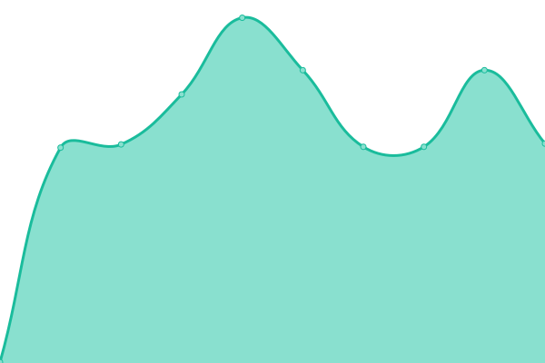

# [📈 Live Status](https://searx-instances.tiekoetter.com): <!--live status--> **🟧 Partial outage**

This repository contains the open-source uptime monitor and status page for [Tiekötter.com](https://www.tiekoetter.com), powered by [Upptime](https://github.com/upptime/upptime).

With [Upptime](https://upptime.js.org), you can get your own unlimited and free uptime monitor and status page, powered entirely by a GitHub repository. We use [Issues](https://github.com/tiekoettercom/searx-instances-uptime/issues) as incident reports, [Actions](https://github.com/tiekoettercom/searx-instances-uptime/actions) as uptime monitors, and [Pages](https://searx-instances.tiekoetter.com) for the status page.

<!--start: status pages-->
<!-- This summary is generated by Upptime (https://github.com/upptime/upptime) -->
<!-- Do not edit this manually, your changes will be overwritten -->
<!-- prettier-ignore -->
| URL | Status | History | Response Time | Uptime |
| --- | ------ | ------- | ------------- | ------ |
|  [searx.tiekoetter.com](https://searx.tiekoetter.com/) | 🟩 Up | [searx-tiekoetter-com.yml](https://github.com/tiekoettercom/searx-instances-uptime/commits/HEAD/history/searx-tiekoetter-com.yml) | 

 615ms
     
 | 

<a href="https://searx-instances.tiekoetter.com/history/searx-tiekoetter-com">100.00%</a>
    

|  [darmarit.org/searx](https://darmarit.org/searx/) | 🟩 Up | [darmarit-org-searx.yml](https://github.com/tiekoettercom/searx-instances-uptime/commits/HEAD/history/darmarit-org-searx.yml) | 

 642ms
     
 | 

<a href="https://searx-instances.tiekoetter.com/history/darmarit-org-searx">100.00%</a>
    

|  [paulgo.io](https://paulgo.io/) | 🟩 Up | [paulgo-io.yml](https://github.com/tiekoettercom/searx-instances-uptime/commits/HEAD/history/paulgo-io.yml) | 

 570ms
     
 | 

<a href="https://searx-instances.tiekoetter.com/history/paulgo-io">100.00%</a>
    

|  [searx.be](https://searx.be/) | 🟩 Up | [searx-be.yml](https://github.com/tiekoettercom/searx-instances-uptime/commits/HEAD/history/searx-be.yml) | 

 3200ms
     
 | 

<a href="https://searx-instances.tiekoetter.com/history/searx-be">99.90%</a>
    

|  [baresearch.org](https://baresearch.org/) | 🟩 Up | [baresearch-org.yml](https://github.com/tiekoettercom/searx-instances-uptime/commits/HEAD/history/baresearch-org.yml) | 

 195ms
     
 | 

<a href="https://searx-instances.tiekoetter.com/history/baresearch-org">99.49%</a>
    

|  [coppedge.info](https://coppedge.info/) | 🟩 Up | [coppedge-info.yml](https://github.com/tiekoettercom/searx-instances-uptime/commits/HEAD/history/coppedge-info.yml) | 

 174ms
     
 | 

<a href="https://searx-instances.tiekoetter.com/history/coppedge-info">85.42%</a>
    

|  [dynabyte.ca](https://dynabyte.ca/) | 🟩 Up | [dynabyte-ca.yml](https://github.com/tiekoettercom/searx-instances-uptime/commits/HEAD/history/dynabyte-ca.yml) | 

 487ms
     
 | 

<a href="https://searx-instances.tiekoetter.com/history/dynabyte-ca">99.81%</a>
    

|  [etsi.me](https://etsi.me/) | 🟩 Up | [etsi-me.yml](https://github.com/tiekoettercom/searx-instances-uptime/commits/HEAD/history/etsi-me.yml) | 

 190ms
     
 | 

<a href="https://searx-instances.tiekoetter.com/history/etsi-me">100.00%</a>
    

|  [gsch.eu](https://gsch.eu/) | 🟩 Up | [gsch-eu.yml](https://github.com/tiekoettercom/searx-instances-uptime/commits/HEAD/history/gsch-eu.yml) | 

 376ms
     
 | 

<a href="https://searx-instances.tiekoetter.com/history/gsch-eu">100.00%</a>
    

|  [intelwinds.com](https://intelwinds.com/) | 🟩 Up | [intelwinds-com.yml](https://github.com/tiekoettercom/searx-instances-uptime/commits/HEAD/history/intelwinds-com.yml) | 

 178ms
     
 | 

<a href="https://searx-instances.tiekoetter.com/history/intelwinds-com">100.00%</a>
    

|  [jackgoss.xyz](https://jackgoss.xyz/) | 🟩 Up | [jackgoss-xyz.yml](https://github.com/tiekoettercom/searx-instances-uptime/commits/HEAD/history/jackgoss-xyz.yml) | 

 442ms
     
 | 

<a href="https://searx-instances.tiekoetter.com/history/jackgoss-xyz">100.00%</a>
    

|  [jsearch.pw](https://jsearch.pw/) | 🟩 Up | [jsearch-pw.yml](https://github.com/tiekoettercom/searx-instances-uptime/commits/HEAD/history/jsearch-pw.yml) | 

 1452ms
     
 | 

<a href="https://searx-instances.tiekoetter.com/history/jsearch-pw">98.95%</a>
    

|  [northboot.xyz](https://northboot.xyz/) | 🟩 Up | [northboot-xyz.yml](https://github.com/tiekoettercom/searx-instances-uptime/commits/HEAD/history/northboot-xyz.yml) | 

 758ms
     
 | 

<a href="https://searx-instances.tiekoetter.com/history/northboot-xyz">99.90%</a>
    

|  [notsearch.uk](https://notsearch.uk/) | 🟩 Up | [notsearch-uk.yml](https://github.com/tiekoettercom/searx-instances-uptime/commits/HEAD/history/notsearch-uk.yml) | 

 414ms
     
 | 

<a href="https://searx-instances.tiekoetter.com/history/notsearch-uk">99.91%</a>
    

|  [ooglester.com](https://ooglester.com/) | 🟩 Up | [ooglester-com.yml](https://github.com/tiekoettercom/searx-instances-uptime/commits/HEAD/history/ooglester-com.yml) | 

 235ms
     
 | 

<a href="https://searx-instances.tiekoetter.com/history/ooglester-com">100.00%</a>
    

|  [opnxng.com](https://opnxng.com/) | 🟩 Up | [opnxng-com.yml](https://github.com/tiekoettercom/searx-instances-uptime/commits/HEAD/history/opnxng-com.yml) | 

 626ms
     
 | 

<a href="https://searx-instances.tiekoetter.com/history/opnxng-com">100.00%</a>
    

|  [priv.au](https://priv.au/) | 🟩 Up | [priv-au.yml](https://github.com/tiekoettercom/searx-instances-uptime/commits/HEAD/history/priv-au.yml) | 

 1366ms
     
 | 

<a href="https://searx-instances.tiekoetter.com/history/priv-au">96.96%</a>
    

|  [privatesearch.dev](https://privatesearch.dev/) | 🟩 Up | [privatesearch-dev.yml](https://github.com/tiekoettercom/searx-instances-uptime/commits/HEAD/history/privatesearch-dev.yml) | 

 701ms
     
 | 

<a href="https://searx-instances.tiekoetter.com/history/privatesearch-dev">99.51%</a>
    

|  [privatus.live](https://privatus.live/) | 🟩 Up | [privatus-live.yml](https://github.com/tiekoettercom/searx-instances-uptime/commits/HEAD/history/privatus-live.yml) | 

 639ms
     
 | 

<a href="https://searx-instances.tiekoetter.com/history/privatus-live">100.00%</a>
    

|  [s.frlt.one](https://s.frlt.one/) | 🟩 Up | [s-frlt-one.yml](https://github.com/tiekoettercom/searx-instances-uptime/commits/HEAD/history/s-frlt-one.yml) | 

 712ms
     
 | 

<a href="https://searx-instances.tiekoetter.com/history/s-frlt-one">100.00%</a>
    

|  [s.trung.fun](https://s.trung.fun/) | 🟩 Up | [s-trung-fun.yml](https://github.com/tiekoettercom/searx-instances-uptime/commits/HEAD/history/s-trung-fun.yml) | 

 1055ms
     
 | 

<a href="https://searx-instances.tiekoetter.com/history/s-trung-fun">100.00%</a>
    

|  [s.zhaocloud.net](https://s.zhaocloud.net/) | 🟩 Up | [s-zhaocloud-net.yml](https://github.com/tiekoettercom/searx-instances-uptime/commits/HEAD/history/s-zhaocloud-net.yml) | 

 616ms
     
 | 

<a href="https://searx-instances.tiekoetter.com/history/s-zhaocloud-net">100.00%</a>
    

|  [search.0relay.com](https://search.0relay.com/) | 🟩 Up | [search-0relay-com.yml](https://github.com/tiekoettercom/searx-instances-uptime/commits/HEAD/history/search-0relay-com.yml) | 

 233ms
     
 | 

<a href="https://searx-instances.tiekoetter.com/history/search-0relay-com">100.00%</a>
    

|  [search.0xgingi.com](https://search.0xgingi.com/) | 🟩 Up | [search-0xgingi-com.yml](https://github.com/tiekoettercom/searx-instances-uptime/commits/HEAD/history/search-0xgingi-com.yml) | 

 125ms
     
 | 

<a href="https://searx-instances.tiekoetter.com/history/search-0xgingi-com">100.00%</a>
    

|  [search.affusio.com](https://search.affusio.com/) | 🟩 Up | [search-affusio-com.yml](https://github.com/tiekoettercom/searx-instances-uptime/commits/HEAD/history/search-affusio-com.yml) | 

 640ms
     
 | 

<a href="https://searx-instances.tiekoetter.com/history/search-affusio-com">100.00%</a>
    

|  [search.bus-hit.me](https://search.bus-hit.me/) | 🟩 Up | [search-bus-hit-me.yml](https://github.com/tiekoettercom/searx-instances-uptime/commits/HEAD/history/search-bus-hit-me.yml) | 

 228ms
     
 | 

<a href="https://searx-instances.tiekoetter.com/history/search-bus-hit-me">100.00%</a>
    

|  [search.charleseroop.com](https://search.charleseroop.com/) | 🟩 Up | [search-charleseroop-com.yml](https://github.com/tiekoettercom/searx-instances-uptime/commits/HEAD/history/search-charleseroop-com.yml) | 

 132ms
     
 | 

<a href="https://searx-instances.tiekoetter.com/history/search-charleseroop-com">100.00%</a>
    

|  [search.chemicals-in-the-water.eu](https://search.chemicals-in-the-water.eu/) | 🟩 Up | [search-chemicals-in-the-water-eu.yml](https://github.com/tiekoettercom/searx-instances-uptime/commits/HEAD/history/search-chemicals-in-the-water-eu.yml) | 

 741ms
     
 | 

<a href="https://searx-instances.tiekoetter.com/history/search-chemicals-in-the-water-eu">100.00%</a>
    

|  [search.cronobox.one](https://search.cronobox.one/) | 🟩 Up | [search-cronobox-one.yml](https://github.com/tiekoettercom/searx-instances-uptime/commits/HEAD/history/search-cronobox-one.yml) | 

 745ms
     
 | 

<a href="https://searx-instances.tiekoetter.com/history/search-cronobox-one">100.00%</a>
    

|  [search.disroot.org](https://search.disroot.org/) | 🟩 Up | [search-disroot-org.yml](https://github.com/tiekoettercom/searx-instances-uptime/commits/HEAD/history/search-disroot-org.yml) | 

 2039ms
     
 | 

<a href="https://searx-instances.tiekoetter.com/history/search-disroot-org">100.00%</a>
    

|  [search.drivet.xyz](https://search.drivet.xyz/) | 🟩 Up | [search-drivet-xyz.yml](https://github.com/tiekoettercom/searx-instances-uptime/commits/HEAD/history/search-drivet-xyz.yml) | 

 410ms
     
 | 

<a href="https://searx-instances.tiekoetter.com/history/search-drivet-xyz">80.37%</a>
    

|  [search.gcomm.ch](https://search.gcomm.ch/) | 🟩 Up | [search-gcomm-ch.yml](https://github.com/tiekoettercom/searx-instances-uptime/commits/HEAD/history/search-gcomm-ch.yml) | 

 450ms
     
 | 

<a href="https://searx-instances.tiekoetter.com/history/search-gcomm-ch">100.00%</a>
    

|  [search.kiwitalk.de](https://search.kiwitalk.de/) | 🟩 Up | [search-kiwitalk-de.yml](https://github.com/tiekoettercom/searx-instances-uptime/commits/HEAD/history/search-kiwitalk-de.yml) | 

 567ms
     
 | 

<a href="https://searx-instances.tiekoetter.com/history/search-kiwitalk-de">100.00%</a>
    

|  [search.kvj.ovh](https://search.kvj.ovh/) | 🟥 Down | [search-kvj-ovh.yml](https://github.com/tiekoettercom/searx-instances-uptime/commits/HEAD/history/search-kvj-ovh.yml) | 

 678ms
     
 | 

<a href="https://searx-instances.tiekoetter.com/history/search-kvj-ovh">94.32%</a>
    

|  [search.leptons.xyz](https://search.leptons.xyz/) | 🟩 Up | [search-leptons-xyz.yml](https://github.com/tiekoettercom/searx-instances-uptime/commits/HEAD/history/search-leptons-xyz.yml) | 

 345ms
     
 | 

<a href="https://searx-instances.tiekoetter.com/history/search-leptons-xyz">100.00%</a>
    

|  [search.mdosch.de](https://search.mdosch.de/) | 🟩 Up | [search-mdosch-de.yml](https://github.com/tiekoettercom/searx-instances-uptime/commits/HEAD/history/search-mdosch-de.yml) | 

 552ms
     
 | 

<a href="https://searx-instances.tiekoetter.com/history/search-mdosch-de">100.00%</a>
    

|  [search.mpx.wtf](https://search.mpx.wtf/) | 🟩 Up | [search-mpx-wtf.yml](https://github.com/tiekoettercom/searx-instances-uptime/commits/HEAD/history/search-mpx-wtf.yml) | 

 548ms
     
 | 

<a href="https://searx-instances.tiekoetter.com/history/search-mpx-wtf">100.00%</a>
    

|  [search.neet.works](https://search.neet.works/) | 🟩 Up | [search-neet-works.yml](https://github.com/tiekoettercom/searx-instances-uptime/commits/HEAD/history/search-neet-works.yml) | 

 247ms
     
 | 

<a href="https://searx-instances.tiekoetter.com/history/search-neet-works">100.00%</a>
    

|  [search.ononoki.org](https://search.ononoki.org/) | 🟩 Up | [search-ononoki-org.yml](https://github.com/tiekoettercom/searx-instances-uptime/commits/HEAD/history/search-ononoki-org.yml) | 

 522ms
     
 | 

<a href="https://searx-instances.tiekoetter.com/history/search-ononoki-org">100.00%</a>
    

|  [search.privacyguides.net](https://search.privacyguides.net/) | 🟩 Up | [search-privacyguides-net.yml](https://github.com/tiekoettercom/searx-instances-uptime/commits/HEAD/history/search-privacyguides-net.yml) | 

 582ms
     
 | 

<a href="https://searx-instances.tiekoetter.com/history/search-privacyguides-net">100.00%</a>
    

|  [search.projectsegfau.lt](https://search.projectsegfau.lt/) | 🟩 Up | [search-projectsegfau-lt.yml](https://github.com/tiekoettercom/searx-instances-uptime/commits/HEAD/history/search-projectsegfau-lt.yml) | 

 2970ms
     
 | 

<a href="https://searx-instances.tiekoetter.com/history/search-projectsegfau-lt">79.47%</a>
    

|  [search.rabbit-company.com](https://search.rabbit-company.com/) | 🟩 Up | [search-rabbit-company-com.yml](https://github.com/tiekoettercom/searx-instances-uptime/commits/HEAD/history/search-rabbit-company-com.yml) | 

 461ms
     
 | 

<a href="https://searx-instances.tiekoetter.com/history/search-rabbit-company-com">100.00%</a>
    

|  [search.rhscz.eu](https://search.rhscz.eu/) | 🟩 Up | [search-rhscz-eu.yml](https://github.com/tiekoettercom/searx-instances-uptime/commits/HEAD/history/search-rhscz-eu.yml) | 

 479ms
     
 | 

<a href="https://searx-instances.tiekoetter.com/history/search-rhscz-eu">99.90%</a>
    

|  [search.rowie.at](https://search.rowie.at/) | 🟩 Up | [search-rowie-at.yml](https://github.com/tiekoettercom/searx-instances-uptime/commits/HEAD/history/search-rowie-at.yml) | 

 458ms
     
 | 

<a href="https://searx-instances.tiekoetter.com/history/search-rowie-at">100.00%</a>
    

|  [search.sapti.me](https://search.sapti.me/) | 🟩 Up | [search-sapti-me.yml](https://github.com/tiekoettercom/searx-instances-uptime/commits/HEAD/history/search-sapti-me.yml) | 

 853ms
     
 | 

<a href="https://searx-instances.tiekoetter.com/history/search-sapti-me">100.00%</a>
    

|  [search.serginho.dev](https://search.serginho.dev/) | 🟩 Up | [search-serginho-dev.yml](https://github.com/tiekoettercom/searx-instances-uptime/commits/HEAD/history/search-serginho-dev.yml) | 

 365ms
     
 | 

<a href="https://searx-instances.tiekoetter.com/history/search-serginho-dev">100.00%</a>
    

|  [search.smnz.de](https://search.smnz.de/) | 🟩 Up | [search-smnz-de.yml](https://github.com/tiekoettercom/searx-instances-uptime/commits/HEAD/history/search-smnz-de.yml) | 

 769ms
     
 | 

<a href="https://searx-instances.tiekoetter.com/history/search-smnz-de">99.90%</a>
    

|  [search.stinpriza.org](https://search.stinpriza.org/) | 🟩 Up | [search-stinpriza-org.yml](https://github.com/tiekoettercom/searx-instances-uptime/commits/HEAD/history/search-stinpriza-org.yml) | 

 1010ms
     
 | 

<a href="https://searx-instances.tiekoetter.com/history/search-stinpriza-org">100.00%</a>
    

|  [search.suenram.us](https://search.suenram.us/) | 🟩 Up | [search-suenram-us.yml](https://github.com/tiekoettercom/searx-instances-uptime/commits/HEAD/history/search-suenram-us.yml) | 

 216ms
     
 | 

<a href="https://searx-instances.tiekoetter.com/history/search-suenram-us">100.00%</a>
    

|  [search.trom.tf](https://search.trom.tf/) | 🟩 Up | [search-trom-tf.yml](https://github.com/tiekoettercom/searx-instances-uptime/commits/HEAD/history/search-trom-tf.yml) | 

 719ms
     
 | 

<a href="https://searx-instances.tiekoetter.com/history/search-trom-tf">100.00%</a>
    

|  [search.unlocked.link](https://search.unlocked.link/) | 🟩 Up | [search-unlocked-link.yml](https://github.com/tiekoettercom/searx-instances-uptime/commits/HEAD/history/search-unlocked-link.yml) | 

 620ms
     
 | 

<a href="https://searx-instances.tiekoetter.com/history/search-unlocked-link">100.00%</a>
    

|  [search.us.projectsegfau.lt](https://search.us.projectsegfau.lt/) | 🟩 Up | [search-us-projectsegfau-lt.yml](https://github.com/tiekoettercom/searx-instances-uptime/commits/HEAD/history/search-us-projectsegfau-lt.yml) | 

 334ms
     
 | 

<a href="https://searx-instances.tiekoetter.com/history/search-us-projectsegfau-lt">99.04%</a>
    

|  [search.uspersec.com](https://search.uspersec.com/) | 🟩 Up | [search-uspersec-com.yml](https://github.com/tiekoettercom/searx-instances-uptime/commits/HEAD/history/search-uspersec-com.yml) | 

 171ms
     
 | 

<a href="https://searx-instances.tiekoetter.com/history/search-uspersec-com">100.00%</a>
    

|  [search.zzls.xyz](https://search.zzls.xyz/) | 🟩 Up | [search-zzls-xyz.yml](https://github.com/tiekoettercom/searx-instances-uptime/commits/HEAD/history/search-zzls-xyz.yml) | 

 486ms
     
 | 

<a href="https://searx-instances.tiekoetter.com/history/search-zzls-xyz">100.00%</a>
    

|  [searx.baczek.me](https://searx.baczek.me/) | 🟩 Up | [searx-baczek-me.yml](https://github.com/tiekoettercom/searx-instances-uptime/commits/HEAD/history/searx-baczek-me.yml) | 

 593ms
     
 | 

<a href="https://searx-instances.tiekoetter.com/history/searx-baczek-me">100.00%</a>
    

|  [searx.becomesovran.com](https://searx.becomesovran.com/) | 🟩 Up | [searx-becomesovran-com.yml](https://github.com/tiekoettercom/searx-instances-uptime/commits/HEAD/history/searx-becomesovran-com.yml) | 

 292ms
     
 | 

<a href="https://searx-instances.tiekoetter.com/history/searx-becomesovran-com">100.00%</a>
    

|  [searx.bissisoft.com](https://searx.bissisoft.com/) | 🟩 Up | [searx-bissisoft-com.yml](https://github.com/tiekoettercom/searx-instances-uptime/commits/HEAD/history/searx-bissisoft-com.yml) | 

 503ms
     
 | 

<a href="https://searx-instances.tiekoetter.com/history/searx-bissisoft-com">100.00%</a>
    

|  [searx.catfluori.de](https://searx.catfluori.de/) | 🟩 Up | [searx-catfluori-de.yml](https://github.com/tiekoettercom/searx-instances-uptime/commits/HEAD/history/searx-catfluori-de.yml) | 

 873ms
     
 | 

<a href="https://searx-instances.tiekoetter.com/history/searx-catfluori-de">100.00%</a>
    

|  [searx.chocoflan.net](https://searx.chocoflan.net/) | 🟩 Up | [searx-chocoflan-net.yml](https://github.com/tiekoettercom/searx-instances-uptime/commits/HEAD/history/searx-chocoflan-net.yml) | 

 380ms
     
 | 

<a href="https://searx-instances.tiekoetter.com/history/searx-chocoflan-net">100.00%</a>
    

|  [searx.cthd.icu](https://searx.cthd.icu/) | 🟩 Up | [searx-cthd-icu.yml](https://github.com/tiekoettercom/searx-instances-uptime/commits/HEAD/history/searx-cthd-icu.yml) | 

 549ms
     
 | 

<a href="https://searx-instances.tiekoetter.com/history/searx-cthd-icu">77.78%</a>
    

|  [searx.delicta.pp.ua](https://searx.delicta.pp.ua/) | 🟩 Up | [searx-delicta-pp-ua.yml](https://github.com/tiekoettercom/searx-instances-uptime/commits/HEAD/history/searx-delicta-pp-ua.yml) | 

 1401ms
     
 | 

<a href="https://searx-instances.tiekoetter.com/history/searx-delicta-pp-ua">100.00%</a>
    

|  [searx.divided-by-zero.eu](https://searx.divided-by-zero.eu/) | 🟩 Up | [searx-divided-by-zero-eu.yml](https://github.com/tiekoettercom/searx-instances-uptime/commits/HEAD/history/searx-divided-by-zero-eu.yml) | 

 600ms
     
 | 

<a href="https://searx-instances.tiekoetter.com/history/searx-divided-by-zero-eu">100.00%</a>
    

|  [searx.dresden.network](https://searx.dresden.network/) | 🟩 Up | [searx-dresden-network.yml](https://github.com/tiekoettercom/searx-instances-uptime/commits/HEAD/history/searx-dresden-network.yml) | 

 807ms
     
 | 

<a href="https://searx-instances.tiekoetter.com/history/searx-dresden-network">100.00%</a>
    

|  [searx.ericaftereric.top](https://searx.ericaftereric.top/) | 🟩 Up | [searx-ericaftereric-top.yml](https://github.com/tiekoettercom/searx-instances-uptime/commits/HEAD/history/searx-ericaftereric-top.yml) | 

 500ms
     
 | 

<a href="https://searx-instances.tiekoetter.com/history/searx-ericaftereric-top">100.00%</a>
    

|  [searx.esmailelbob.xyz](https://searx.esmailelbob.xyz/) | 🟩 Up | [searx-esmailelbob-xyz.yml](https://github.com/tiekoettercom/searx-instances-uptime/commits/HEAD/history/searx-esmailelbob-xyz.yml) | 

 454ms
     
 | 

<a href="https://searx-instances.tiekoetter.com/history/searx-esmailelbob-xyz">100.00%</a>
    

|  [searx.fi](https://searx.fi/) | 🟩 Up | [searx-fi.yml](https://github.com/tiekoettercom/searx-instances-uptime/commits/HEAD/history/searx-fi.yml) | 

 673ms
     
 | 

<a href="https://searx-instances.tiekoetter.com/history/searx-fi">100.00%</a>
    

|  [searx.fmac.xyz](https://searx.fmac.xyz/) | 🟩 Up | [searx-fmac-xyz.yml](https://github.com/tiekoettercom/searx-instances-uptime/commits/HEAD/history/searx-fmac-xyz.yml) | 

 643ms
     
 | 

<a href="https://searx-instances.tiekoetter.com/history/searx-fmac-xyz">99.90%</a>
    

|  [searx.fossencdi.org](https://searx.fossencdi.org/) | 🟩 Up | [searx-fossencdi-org.yml](https://github.com/tiekoettercom/searx-instances-uptime/commits/HEAD/history/searx-fossencdi-org.yml) | 

 668ms
     
 | 

<a href="https://searx-instances.tiekoetter.com/history/searx-fossencdi-org">100.00%</a>
    

|  [searx.gnous.eu](https://searx.gnous.eu/) | 🟩 Up | [searx-gnous-eu.yml](https://github.com/tiekoettercom/searx-instances-uptime/commits/HEAD/history/searx-gnous-eu.yml) | 

 1825ms
     
 | 

<a href="https://searx-instances.tiekoetter.com/history/searx-gnous-eu">100.00%</a>
    

|  [searx.gnu.style](https://searx.gnu.style/) | 🟩 Up | [searx-gnu-style.yml](https://github.com/tiekoettercom/searx-instances-uptime/commits/HEAD/history/searx-gnu-style.yml) | 

 836ms
     
 | 

<a href="https://searx-instances.tiekoetter.com/history/searx-gnu-style">93.76%</a>
    

|  [searx.juancord.xyz](https://searx.juancord.xyz/) | 🟩 Up | [searx-juancord-xyz.yml](https://github.com/tiekoettercom/searx-instances-uptime/commits/HEAD/history/searx-juancord-xyz.yml) | 

 480ms
     
 | 

<a href="https://searx-instances.tiekoetter.com/history/searx-juancord-xyz">0.00%</a>
    

|  [searx.mastodontech.de](https://searx.mastodontech.de/) | 🟩 Up | [searx-mastodontech-de.yml](https://github.com/tiekoettercom/searx-instances-uptime/commits/HEAD/history/searx-mastodontech-de.yml) | 

 687ms
     
 | 

<a href="https://searx-instances.tiekoetter.com/history/searx-mastodontech-de">100.00%</a>
    

|  [searx.mha.fi](https://searx.mha.fi/) | 🟩 Up | [searx-mha-fi.yml](https://github.com/tiekoettercom/searx-instances-uptime/commits/HEAD/history/searx-mha-fi.yml) | 

 545ms
     
 | 

<a href="https://searx-instances.tiekoetter.com/history/searx-mha-fi">100.00%</a>
    

|  [searx.mxchange.org](https://searx.mxchange.org/) | 🟩 Up | [searx-mxchange-org.yml](https://github.com/tiekoettercom/searx-instances-uptime/commits/HEAD/history/searx-mxchange-org.yml) | 

 749ms
     
 | 

<a href="https://searx-instances.tiekoetter.com/history/searx-mxchange-org">100.00%</a>
    

|  [searx.nakhan.net](https://searx.nakhan.net/) | 🟥 Down | [searx-nakhan-net.yml](https://github.com/tiekoettercom/searx-instances-uptime/commits/HEAD/history/searx-nakhan-net.yml) | 

 702ms
     
 | 

<a href="https://searx-instances.tiekoetter.com/history/searx-nakhan-net">8.36%</a>
    

|  [searx.namejeff.xyz](https://searx.namejeff.xyz/) | 🟩 Up | [searx-namejeff-xyz.yml](https://github.com/tiekoettercom/searx-instances-uptime/commits/HEAD/history/searx-namejeff-xyz.yml) | 

 398ms
     
 | 

<a href="https://searx-instances.tiekoetter.com/history/searx-namejeff-xyz">100.00%</a>
    

|  [searx.netzspielplatz.de](https://searx.netzspielplatz.de/) | 🟩 Up | [searx-netzspielplatz-de.yml](https://github.com/tiekoettercom/searx-instances-uptime/commits/HEAD/history/searx-netzspielplatz-de.yml) | 

 522ms
     
 | 

<a href="https://searx-instances.tiekoetter.com/history/searx-netzspielplatz-de">99.35%</a>
    

|  [searx.nixnet.services](https://searx.nixnet.services/) | 🟩 Up | [searx-nixnet-services.yml](https://github.com/tiekoettercom/searx-instances-uptime/commits/HEAD/history/searx-nixnet-services.yml) | 

 1845ms
     
 | 

<a href="https://searx-instances.tiekoetter.com/history/searx-nixnet-services">100.00%</a>
    

|  [searx.oakleycord.dev](https://searx.oakleycord.dev/) | 🟩 Up | [searx-oakleycord-dev.yml](https://github.com/tiekoettercom/searx-instances-uptime/commits/HEAD/history/searx-oakleycord-dev.yml) | 

 167ms
     
 | 

<a href="https://searx-instances.tiekoetter.com/history/searx-oakleycord-dev">99.81%</a>
    

|  [searx.orion-hub.fr](https://searx.orion-hub.fr/) | 🟩 Up | [searx-orion-hub-fr.yml](https://github.com/tiekoettercom/searx-instances-uptime/commits/HEAD/history/searx-orion-hub-fr.yml) | 

 741ms
     
 | 

<a href="https://searx-instances.tiekoetter.com/history/searx-orion-hub-fr">99.90%</a>
    

|  [searx.priv.pw](https://searx.priv.pw/) | 🟩 Up | [searx-priv-pw.yml](https://github.com/tiekoettercom/searx-instances-uptime/commits/HEAD/history/searx-priv-pw.yml) | 

 1301ms
     
 | 

<a href="https://searx-instances.tiekoetter.com/history/searx-priv-pw">100.00%</a>
    

|  [searx.prvcy.eu](https://searx.prvcy.eu/) | 🟩 Up | [searx-prvcy-eu.yml](https://github.com/tiekoettercom/searx-instances-uptime/commits/HEAD/history/searx-prvcy-eu.yml) | 

 666ms
     
 | 

<a href="https://searx-instances.tiekoetter.com/history/searx-prvcy-eu">100.00%</a>
    

|  [searx.rasp.fr](https://searx.rasp.fr/) | 🟩 Up | [searx-rasp-fr.yml](https://github.com/tiekoettercom/searx-instances-uptime/commits/HEAD/history/searx-rasp-fr.yml) | 

 1034ms
     
 | 

<a href="https://searx-instances.tiekoetter.com/history/searx-rasp-fr">100.00%</a>
    

|  [searx.roflcopter.fr](https://searx.roflcopter.fr/) | 🟩 Up | [searx-roflcopter-fr.yml](https://github.com/tiekoettercom/searx-instances-uptime/commits/HEAD/history/searx-roflcopter-fr.yml) | 

 690ms
     
 | 

<a href="https://searx-instances.tiekoetter.com/history/searx-roflcopter-fr">100.00%</a>
    

|  [searx.ru](https://searx.ru/) | 🟩 Up | [searx-ru.yml](https://github.com/tiekoettercom/searx-instances-uptime/commits/HEAD/history/searx-ru.yml) | 

 822ms
     
 | 

<a href="https://searx-instances.tiekoetter.com/history/searx-ru">100.00%</a>
    

|  [searx.semipvt.com](https://searx.semipvt.com/) | 🟩 Up | [searx-semipvt-com.yml](https://github.com/tiekoettercom/searx-instances-uptime/commits/HEAD/history/searx-semipvt-com.yml) | 

 617ms
     
 | 

<a href="https://searx-instances.tiekoetter.com/history/searx-semipvt-com">100.00%</a>
    

|  [searx.sev.monster](https://searx.sev.monster/) | 🟩 Up | [searx-sev-monster.yml](https://github.com/tiekoettercom/searx-instances-uptime/commits/HEAD/history/searx-sev-monster.yml) | 

 372ms
     
 | 

<a href="https://searx-instances.tiekoetter.com/history/searx-sev-monster">100.00%</a>
    

|  [searx.si](https://searx.si/) | 🟩 Up | [searx-si.yml](https://github.com/tiekoettercom/searx-instances-uptime/commits/HEAD/history/searx-si.yml) | 

 567ms
     
 | 

<a href="https://searx-instances.tiekoetter.com/history/searx-si">99.40%</a>
    

|  [searx.slipfox.xyz/searx](https://searx.slipfox.xyz/searx/) | 🟩 Up | [searx-slipfox-xyz-searx.yml](https://github.com/tiekoettercom/searx-instances-uptime/commits/HEAD/history/searx-slipfox-xyz-searx.yml) | 

 308ms
     
 | 

<a href="https://searx-instances.tiekoetter.com/history/searx-slipfox-xyz-searx">100.00%</a>
    

|  [searx.sp-codes.de](https://searx.sp-codes.de/) | 🟩 Up | [searx-sp-codes-de.yml](https://github.com/tiekoettercom/searx-instances-uptime/commits/HEAD/history/searx-sp-codes-de.yml) | 

 1625ms
     
 | 

<a href="https://searx-instances.tiekoetter.com/history/searx-sp-codes-de">100.00%</a>
    

|  [searx.stuehieyr.com](https://searx.stuehieyr.com/) | 🟩 Up | [searx-stuehieyr-com.yml](https://github.com/tiekoettercom/searx-instances-uptime/commits/HEAD/history/searx-stuehieyr-com.yml) | 

 1029ms
     
 | 

<a href="https://searx-instances.tiekoetter.com/history/searx-stuehieyr-com">100.00%</a>
    

|  [searx.tuxcloud.net](https://searx.tuxcloud.net/) | 🟩 Up | [searx-tuxcloud-net.yml](https://github.com/tiekoettercom/searx-instances-uptime/commits/HEAD/history/searx-tuxcloud-net.yml) | 

 661ms
     
 | 

<a href="https://searx-instances.tiekoetter.com/history/searx-tuxcloud-net">99.92%</a>
    

|  [searx.tyil.nl](https://searx.tyil.nl/) | 🟩 Up | [searx-tyil-nl.yml](https://github.com/tiekoettercom/searx-instances-uptime/commits/HEAD/history/searx-tyil-nl.yml) | 

 872ms
     
 | 

<a href="https://searx-instances.tiekoetter.com/history/searx-tyil-nl">100.00%</a>
    

|  [searx.webheberg.info](https://searx.webheberg.info/) | 🟩 Up | [searx-webheberg-info.yml](https://github.com/tiekoettercom/searx-instances-uptime/commits/HEAD/history/searx-webheberg-info.yml) | 

 842ms
     
 | 

<a href="https://searx-instances.tiekoetter.com/history/searx-webheberg-info">20.65%</a>
    

|  [searx.win](https://searx.win/) | 🟩 Up | [searx-win.yml](https://github.com/tiekoettercom/searx-instances-uptime/commits/HEAD/history/searx-win.yml) | 

 648ms
     
 | 

<a href="https://searx-instances.tiekoetter.com/history/searx-win">100.00%</a>
    

|  [searx.work](https://searx.work/) | 🟩 Up | [searx-work.yml](https://github.com/tiekoettercom/searx-instances-uptime/commits/HEAD/history/searx-work.yml) | 

 207ms
     
 | 

<a href="https://searx-instances.tiekoetter.com/history/searx-work">100.00%</a>
    

|  [searx.xyz](https://searx.xyz/) | 🟩 Up | [searx-xyz.yml](https://github.com/tiekoettercom/searx-instances-uptime/commits/HEAD/history/searx-xyz.yml) | 

 586ms
     
 | 

<a href="https://searx-instances.tiekoetter.com/history/searx-xyz">100.00%</a>
    

|  [searx.zapashcanon.fr](https://searx.zapashcanon.fr/) | 🟩 Up | [searx-zapashcanon-fr.yml](https://github.com/tiekoettercom/searx-instances-uptime/commits/HEAD/history/searx-zapashcanon-fr.yml) | 

 748ms
     
 | 

<a href="https://searx-instances.tiekoetter.com/history/searx-zapashcanon-fr">98.83%</a>
    

|  [searxng.au](https://searxng.au/) | 🟩 Up | [searxng-au.yml](https://github.com/tiekoettercom/searx-instances-uptime/commits/HEAD/history/searxng-au.yml) | 

 776ms
     
 | 

<a href="https://searx-instances.tiekoetter.com/history/searxng-au">100.00%</a>
    

|  [searxng.bandarawela.net](https://searxng.bandarawela.net/) | 🟩 Up | [searxng-bandarawela-net.yml](https://github.com/tiekoettercom/searx-instances-uptime/commits/HEAD/history/searxng-bandarawela-net.yml) | 

 721ms
     
 | 

<a href="https://searx-instances.tiekoetter.com/history/searxng-bandarawela-net">100.00%</a>
    

|  [searxng.fingerbib.xyz](https://searxng.fingerbib.xyz/) | 🟩 Up | [searxng-fingerbib-xyz.yml](https://github.com/tiekoettercom/searx-instances-uptime/commits/HEAD/history/searxng-fingerbib-xyz.yml) | 

 329ms
     
 | 

<a href="https://searx-instances.tiekoetter.com/history/searxng-fingerbib-xyz">99.51%</a>
    

|  [searxng.nicfab.eu](https://searxng.nicfab.eu/) | 🟩 Up | [searxng-nicfab-eu.yml](https://github.com/tiekoettercom/searx-instances-uptime/commits/HEAD/history/searxng-nicfab-eu.yml) | 

 614ms
     
 | 

<a href="https://searx-instances.tiekoetter.com/history/searxng-nicfab-eu">99.90%</a>
    

|  [sh0.it](https://sh0.it/) | 🟥 Down | [sh0-it.yml](https://github.com/tiekoettercom/searx-instances-uptime/commits/HEAD/history/sh0-it.yml) | 

 0ms
     
 | 

<a href="https://searx-instances.tiekoetter.com/history/sh0-it">0.00%</a>
    

|  [spot.murena.io](https://spot.murena.io/) | 🟩 Up | [spot-murena-io.yml](https://github.com/tiekoettercom/searx-instances-uptime/commits/HEAD/history/spot-murena-io.yml) | 

 526ms
     
 | 

<a href="https://searx-instances.tiekoetter.com/history/spot-murena-io">100.00%</a>
    

|  [srx.cosmohub.io](https://srx.cosmohub.io/) | 🟩 Up | [srx-cosmohub-io.yml](https://github.com/tiekoettercom/searx-instances-uptime/commits/HEAD/history/srx-cosmohub-io.yml) | 

 652ms
     
 | 

<a href="https://searx-instances.tiekoetter.com/history/srx-cosmohub-io">100.00%</a>
    

|  [suche.tromdienste.de](https://suche.tromdienste.de/) | 🟩 Up | [suche-tromdienste-de.yml](https://github.com/tiekoettercom/searx-instances-uptime/commits/HEAD/history/suche-tromdienste-de.yml) | 

 671ms
     
 | 

<a href="https://searx-instances.tiekoetter.com/history/suche-tromdienste-de">99.90%</a>
    

|  [swag.pw](https://swag.pw/) | 🟩 Up | [swag-pw.yml](https://github.com/tiekoettercom/searx-instances-uptime/commits/HEAD/history/swag-pw.yml) | 

 137ms
     
 | 

<a href="https://searx-instances.tiekoetter.com/history/swag-pw">100.00%</a>
    

|  [sx.catgirl.cloud](https://sx.catgirl.cloud/) | 🟩 Up | [sx-catgirl-cloud.yml](https://github.com/tiekoettercom/searx-instances-uptime/commits/HEAD/history/sx-catgirl-cloud.yml) | 

 837ms
     
 | 

<a href="https://searx-instances.tiekoetter.com/history/sx-catgirl-cloud">100.00%</a>
    

|  [sx.fukt.lol](https://sx.fukt.lol/) | 🟥 Down | [sx-fukt-lol.yml](https://github.com/tiekoettercom/searx-instances-uptime/commits/HEAD/history/sx-fukt-lol.yml) | 

 400ms
     
 | 

<a href="https://searx-instances.tiekoetter.com/history/sx-fukt-lol">88.50%</a>
    

|  [www.gruble.de](https://www.gruble.de/) | 🟩 Up | [www-gruble-de.yml](https://github.com/tiekoettercom/searx-instances-uptime/commits/HEAD/history/www-gruble-de.yml) | 

 688ms
     
 | 

<a href="https://searx-instances.tiekoetter.com/history/www-gruble-de">100.00%</a>
    

|  [www.jabber-germany.de/searx](https://www.jabber-germany.de/searx/) | 🟩 Up | [www-jabber-germany-de-searx.yml](https://github.com/tiekoettercom/searx-instances-uptime/commits/HEAD/history/www-jabber-germany-de-searx.yml) | 

 820ms
     
 | 

<a href="https://searx-instances.tiekoetter.com/history/www-jabber-germany-de-searx">100.00%</a>
    

|  [xo.wtf](https://xo.wtf/) | 🟩 Up | [xo-wtf.yml](https://github.com/tiekoettercom/searx-instances-uptime/commits/HEAD/history/xo-wtf.yml) | 

 275ms
     
 | 

<a href="https://searx-instances.tiekoetter.com/history/xo-wtf">100.00%</a>
    

<!--end: status pages-->

[**Visit our status website →**](https://searx-instances.tiekoetter.com)

## 📄 License

- Powered by: [Upptime](https://github.com/upptime/upptime)
- Code: [MIT](./LICENSE) © [Tiekötter.com](https://www.tiekoetter.com)
- Data in the `./history` directory: [Open Database License](https://opendatacommons.org/licenses/odbl/1-0/)
