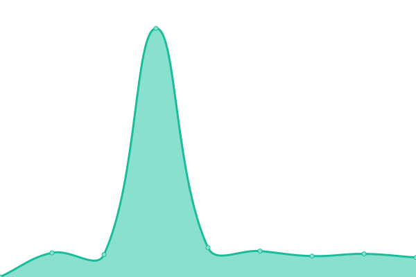

# [📈 Live Status](https://searx-instances.tiekoetter.com): <!--live status--> **🟧 Partial outage**

This repository contains the open-source uptime monitor and status page for [Tiekötter.com](https://www.tiekoetter.com), powered by [Upptime](https://github.com/upptime/upptime).

With [Upptime](https://upptime.js.org), you can get your own unlimited and free uptime monitor and status page, powered entirely by a GitHub repository. We use [Issues](https://github.com/tiekoettercom/searx-instances-uptime/issues) as incident reports, [Actions](https://github.com/tiekoettercom/searx-instances-uptime/actions) as uptime monitors, and [Pages](https://searx-instances.tiekoetter.com) for the status page.

<!--start: status pages-->
<!-- This summary is generated by Upptime (https://github.com/upptime/upptime) -->
<!-- Do not edit this manually, your changes will be overwritten -->
<!-- prettier-ignore -->
| URL | Status | History | Response Time | Uptime |
| --- | ------ | ------- | ------------- | ------ |
|  [searx.tiekoetter.com](https://searx.tiekoetter.com/) | 🟩 Up | [searx-tiekoetter-com.yml](https://github.com/tiekoettercom/searx-instances-uptime/commits/HEAD/history/searx-tiekoetter-com.yml) | 

 828ms
     
 | 

<a href="https://searx-instances.tiekoetter.com/history/searx-tiekoetter-com">99.61%</a>
    

|  [darmarit.org/searx](https://darmarit.org/searx/) | 🟩 Up | [darmarit-org-searx.yml](https://github.com/tiekoettercom/searx-instances-uptime/commits/HEAD/history/darmarit-org-searx.yml) | 

 644ms
     
 | 

<a href="https://searx-instances.tiekoetter.com/history/darmarit-org-searx">100.00%</a>
    

|  [paulgo.io](https://paulgo.io/) | 🟩 Up | [paulgo-io.yml](https://github.com/tiekoettercom/searx-instances-uptime/commits/HEAD/history/paulgo-io.yml) | 

 654ms
     
 | 

<a href="https://searx-instances.tiekoetter.com/history/paulgo-io">99.80%</a>
    

|  [searx.be](https://searx.be/) | 🟩 Up | [searx-be.yml](https://github.com/tiekoettercom/searx-instances-uptime/commits/HEAD/history/searx-be.yml) | 

 777ms
     
 | 

<a href="https://searx-instances.tiekoetter.com/history/searx-be">100.00%</a>
    

|  [de.xcxc.ml](https://de.xcxc.ml/) | 🟩 Up | [de-xcxc-ml.yml](https://github.com/tiekoettercom/searx-instances-uptime/commits/HEAD/history/de-xcxc-ml.yml) | 

 791ms
     
 | 

<a href="https://searx-instances.tiekoetter.com/history/de-xcxc-ml">100.00%</a>
    

|  [dynabyte.ca](https://dynabyte.ca/) | 🟩 Up | [dynabyte-ca.yml](https://github.com/tiekoettercom/searx-instances-uptime/commits/HEAD/history/dynabyte-ca.yml) | 

 981ms
     
 | 

<a href="https://searx-instances.tiekoetter.com/history/dynabyte-ca">99.90%</a>
    

|  [etsi.me](https://etsi.me/) | 🟩 Up | [etsi-me.yml](https://github.com/tiekoettercom/searx-instances-uptime/commits/HEAD/history/etsi-me.yml) | 

 228ms
     
 | 

<a href="https://searx-instances.tiekoetter.com/history/etsi-me">100.00%</a>
    

|  [icanfindit.online](https://icanfindit.online/) | 🟩 Up | [icanfindit-online.yml](https://github.com/tiekoettercom/searx-instances-uptime/commits/HEAD/history/icanfindit-online.yml) | 

 595ms
     
 | 

<a href="https://searx-instances.tiekoetter.com/history/icanfindit-online">99.40%</a>
    

|  [jackgoss.xyz](https://jackgoss.xyz/) | 🟩 Up | [jackgoss-xyz.yml](https://github.com/tiekoettercom/searx-instances-uptime/commits/HEAD/history/jackgoss-xyz.yml) | 

 524ms
     
 | 

<a href="https://searx-instances.tiekoetter.com/history/jackgoss-xyz">95.44%</a>
    

|  [jsearch.pw](https://jsearch.pw/) | 🟩 Up | [jsearch-pw.yml](https://github.com/tiekoettercom/searx-instances-uptime/commits/HEAD/history/jsearch-pw.yml) | 

 222ms
     
 | 

<a href="https://searx-instances.tiekoetter.com/history/jsearch-pw">100.00%</a>
    

|  [metasearch.nl](https://metasearch.nl/) | 🟩 Up | [metasearch-nl.yml](https://github.com/tiekoettercom/searx-instances-uptime/commits/HEAD/history/metasearch-nl.yml) | 

 463ms
     
 | 

<a href="https://searx-instances.tiekoetter.com/history/metasearch-nl">100.00%</a>
    

|  [northboot.xyz](https://northboot.xyz/) | 🟩 Up | [northboot-xyz.yml](https://github.com/tiekoettercom/searx-instances-uptime/commits/HEAD/history/northboot-xyz.yml) | 

 810ms
     
 | 

<a href="https://searx-instances.tiekoetter.com/history/northboot-xyz">99.91%</a>
    

|  [opnxng.com](https://opnxng.com/) | 🟩 Up | [opnxng-com.yml](https://github.com/tiekoettercom/searx-instances-uptime/commits/HEAD/history/opnxng-com.yml) | 

 574ms
     
 | 

<a href="https://searx-instances.tiekoetter.com/history/opnxng-com">100.00%</a>
    

|  [priv.au](https://priv.au/) | 🟩 Up | [priv-au.yml](https://github.com/tiekoettercom/searx-instances-uptime/commits/HEAD/history/priv-au.yml) | 

 625ms
     
 | 

<a href="https://searx-instances.tiekoetter.com/history/priv-au">100.00%</a>
    

|  [privatus.live](https://privatus.live/) | 🟩 Up | [privatus-live.yml](https://github.com/tiekoettercom/searx-instances-uptime/commits/HEAD/history/privatus-live.yml) | 

 544ms
     
 | 

<a href="https://searx-instances.tiekoetter.com/history/privatus-live">97.53%</a>
    

|  [s.frlt.one](https://s.frlt.one/) | 🟩 Up | [s-frlt-one.yml](https://github.com/tiekoettercom/searx-instances-uptime/commits/HEAD/history/s-frlt-one.yml) | 

 609ms
     
 | 

<a href="https://searx-instances.tiekoetter.com/history/s-frlt-one">100.00%</a>
    

|  [s.zhaocloud.net](https://s.zhaocloud.net/) | 🟩 Up | [s-zhaocloud-net.yml](https://github.com/tiekoettercom/searx-instances-uptime/commits/HEAD/history/s-zhaocloud-net.yml) | 

 855ms
     
 | 

<a href="https://searx-instances.tiekoetter.com/history/s-zhaocloud-net">99.80%</a>
    

|  [saber.tk](https://saber.tk/) | 🟩 Up | [saber-tk.yml](https://github.com/tiekoettercom/searx-instances-uptime/commits/HEAD/history/saber-tk.yml) | 

 773ms
     
 | 

<a href="https://searx-instances.tiekoetter.com/history/saber-tk">100.00%</a>
    

|  [sear.r-ay.co](https://sear.r-ay.co/) | 🟥 Down | [sear-r-ay-co.yml](https://github.com/tiekoettercom/searx-instances-uptime/commits/HEAD/history/sear-r-ay-co.yml) | 

 0ms
     
 | 

<a href="https://searx-instances.tiekoetter.com/history/sear-r-ay-co">100.00%</a>
    

|  [search.0relay.com](https://search.0relay.com/) | 🟩 Up | [search-0relay-com.yml](https://github.com/tiekoettercom/searx-instances-uptime/commits/HEAD/history/search-0relay-com.yml) | 

 259ms
     
 | 

<a href="https://searx-instances.tiekoetter.com/history/search-0relay-com">100.00%</a>
    

|  [search.affusio.com](https://search.affusio.com/) | 🟩 Up | [search-affusio-com.yml](https://github.com/tiekoettercom/searx-instances-uptime/commits/HEAD/history/search-affusio-com.yml) | 

 697ms
     
 | 

<a href="https://searx-instances.tiekoetter.com/history/search-affusio-com">99.90%</a>
    

|  [search.bus-hit.me](https://search.bus-hit.me/) | 🟩 Up | [search-bus-hit-me.yml](https://github.com/tiekoettercom/searx-instances-uptime/commits/HEAD/history/search-bus-hit-me.yml) | 

 305ms
     
 | 

<a href="https://searx-instances.tiekoetter.com/history/search-bus-hit-me">100.00%</a>
    

|  [search.chemicals-in-the-water.eu](https://search.chemicals-in-the-water.eu/) | 🟩 Up | [search-chemicals-in-the-water-eu.yml](https://github.com/tiekoettercom/searx-instances-uptime/commits/HEAD/history/search-chemicals-in-the-water-eu.yml) | 

 907ms
     
 | 

<a href="https://searx-instances.tiekoetter.com/history/search-chemicals-in-the-water-eu">100.00%</a>
    

|  [search.disroot.org](https://search.disroot.org/) | 🟩 Up | [search-disroot-org.yml](https://github.com/tiekoettercom/searx-instances-uptime/commits/HEAD/history/search-disroot-org.yml) | 

 827ms
     
 | 

<a href="https://searx-instances.tiekoetter.com/history/search-disroot-org">100.00%</a>
    

|  [search.ethibox.fr](https://search.ethibox.fr/) | 🟩 Up | [search-ethibox-fr.yml](https://github.com/tiekoettercom/searx-instances-uptime/commits/HEAD/history/search-ethibox-fr.yml) | 

 859ms
     
 | 

<a href="https://searx-instances.tiekoetter.com/history/search-ethibox-fr">99.94%</a>
    

|  [search.gcomm.ch](https://search.gcomm.ch/) | 🟩 Up | [search-gcomm-ch.yml](https://github.com/tiekoettercom/searx-instances-uptime/commits/HEAD/history/search-gcomm-ch.yml) | 

 500ms
     
 | 

<a href="https://searx-instances.tiekoetter.com/history/search-gcomm-ch">98.03%</a>
    

|  [search.kiwitalk.de](https://search.kiwitalk.de/) | 🟩 Up | [search-kiwitalk-de.yml](https://github.com/tiekoettercom/searx-instances-uptime/commits/HEAD/history/search-kiwitalk-de.yml) | 

 699ms
     
 | 

<a href="https://searx-instances.tiekoetter.com/history/search-kiwitalk-de">100.00%</a>
    

|  [search.mdosch.de](https://search.mdosch.de/) | 🟩 Up | [search-mdosch-de.yml](https://github.com/tiekoettercom/searx-instances-uptime/commits/HEAD/history/search-mdosch-de.yml) | 

 632ms
     
 | 

<a href="https://searx-instances.tiekoetter.com/history/search-mdosch-de">100.00%</a>
    

|  [search.neet.works](https://search.neet.works/) | 🟩 Up | [search-neet-works.yml](https://github.com/tiekoettercom/searx-instances-uptime/commits/HEAD/history/search-neet-works.yml) | 

 241ms
     
 | 

<a href="https://searx-instances.tiekoetter.com/history/search-neet-works">99.71%</a>
    

|  [search.ononoki.org](https://search.ononoki.org/) | 🟩 Up | [search-ononoki-org.yml](https://github.com/tiekoettercom/searx-instances-uptime/commits/HEAD/history/search-ononoki-org.yml) | 

 529ms
     
 | 

<a href="https://searx-instances.tiekoetter.com/history/search-ononoki-org">99.81%</a>
    

|  [search.privacyguides.net](https://search.privacyguides.net/) | 🟩 Up | [search-privacyguides-net.yml](https://github.com/tiekoettercom/searx-instances-uptime/commits/HEAD/history/search-privacyguides-net.yml) | 

 219ms
     
 | 

<a href="https://searx-instances.tiekoetter.com/history/search-privacyguides-net">100.00%</a>
    

|  [search.projectsegfau.lt](https://search.projectsegfau.lt/) | 🟩 Up | [search-projectsegfau-lt.yml](https://github.com/tiekoettercom/searx-instances-uptime/commits/HEAD/history/search-projectsegfau-lt.yml) | 

 1817ms
     
 | 

<a href="https://searx-instances.tiekoetter.com/history/search-projectsegfau-lt">80.68%</a>
    

|  [search.rabbit-company.com](https://search.rabbit-company.com/) | 🟩 Up | [search-rabbit-company-com.yml](https://github.com/tiekoettercom/searx-instances-uptime/commits/HEAD/history/search-rabbit-company-com.yml) | 

 528ms
     
 | 

<a href="https://searx-instances.tiekoetter.com/history/search-rabbit-company-com">100.00%</a>
    

|  [search.rhscze.cf](https://search.rhscze.cf/) | 🟩 Up | [search-rhscze-cf.yml](https://github.com/tiekoettercom/searx-instances-uptime/commits/HEAD/history/search-rhscze-cf.yml) | 

 585ms
     
 | 

<a href="https://searx-instances.tiekoetter.com/history/search-rhscze-cf">100.00%</a>
    

|  [search.rowie.at](https://search.rowie.at/) | 🟩 Up | [search-rowie-at.yml](https://github.com/tiekoettercom/searx-instances-uptime/commits/HEAD/history/search-rowie-at.yml) | 

 488ms
     
 | 

<a href="https://searx-instances.tiekoetter.com/history/search-rowie-at">99.81%</a>
    

|  [search.sapti.me](https://search.sapti.me/) | 🟩 Up | [search-sapti-me.yml](https://github.com/tiekoettercom/searx-instances-uptime/commits/HEAD/history/search-sapti-me.yml) | 

 684ms
     
 | 

<a href="https://searx-instances.tiekoetter.com/history/search-sapti-me">100.00%</a>
    

|  [search.snopyta.org](https://search.snopyta.org/) | 🟩 Up | [search-snopyta-org.yml](https://github.com/tiekoettercom/searx-instances-uptime/commits/HEAD/history/search-snopyta-org.yml) | 

 855ms
     
 | 

<a href="https://searx-instances.tiekoetter.com/history/search-snopyta-org">100.00%</a>
    

|  [search.stinpriza.org](https://search.stinpriza.org/) | 🟩 Up | [search-stinpriza-org.yml](https://github.com/tiekoettercom/searx-instances-uptime/commits/HEAD/history/search-stinpriza-org.yml) | 

 839ms
     
 | 

<a href="https://searx-instances.tiekoetter.com/history/search-stinpriza-org">100.00%</a>
    

|  [search.teamriverbubbles.com](https://search.teamriverbubbles.com/) | 🟩 Up | [search-teamriverbubbles-com.yml](https://github.com/tiekoettercom/searx-instances-uptime/commits/HEAD/history/search-teamriverbubbles-com.yml) | 

 218ms
     
 | 

<a href="https://searx-instances.tiekoetter.com/history/search-teamriverbubbles-com">100.00%</a>
    

|  [search.trom.tf](https://search.trom.tf/) | 🟩 Up | [search-trom-tf.yml](https://github.com/tiekoettercom/searx-instances-uptime/commits/HEAD/history/search-trom-tf.yml) | 

 677ms
     
 | 

<a href="https://searx-instances.tiekoetter.com/history/search-trom-tf">100.00%</a>
    

|  [search.unlocked.link](https://search.unlocked.link/) | 🟩 Up | [search-unlocked-link.yml](https://github.com/tiekoettercom/searx-instances-uptime/commits/HEAD/history/search-unlocked-link.yml) | 

 689ms
     
 | 

<a href="https://searx-instances.tiekoetter.com/history/search-unlocked-link">100.00%</a>
    

|  [search.uspersec.com](https://search.uspersec.com/) | 🟩 Up | [search-uspersec-com.yml](https://github.com/tiekoettercom/searx-instances-uptime/commits/HEAD/history/search-uspersec-com.yml) | 

 285ms
     
 | 

<a href="https://searx-instances.tiekoetter.com/history/search-uspersec-com">100.00%</a>
    

|  [search.vidhukant.xyz](https://search.vidhukant.xyz/) | 🟩 Up | [search-vidhukant-xyz.yml](https://github.com/tiekoettercom/searx-instances-uptime/commits/HEAD/history/search-vidhukant-xyz.yml) | 

 752ms
     
 | 

<a href="https://searx-instances.tiekoetter.com/history/search-vidhukant-xyz">100.00%</a>
    

|  [search.zzls.xyz](https://search.zzls.xyz/) | 🟩 Up | [search-zzls-xyz.yml](https://github.com/tiekoettercom/searx-instances-uptime/commits/HEAD/history/search-zzls-xyz.yml) | 

 807ms
     
 | 

<a href="https://searx-instances.tiekoetter.com/history/search-zzls-xyz">100.00%</a>
    

|  [searx.baczek.me](https://searx.baczek.me/) | 🟩 Up | [searx-baczek-me.yml](https://github.com/tiekoettercom/searx-instances-uptime/commits/HEAD/history/searx-baczek-me.yml) | 

 620ms
     
 | 

<a href="https://searx-instances.tiekoetter.com/history/searx-baczek-me">99.81%</a>
    

|  [searx.becomesovran.com](https://searx.becomesovran.com/) | 🟩 Up | [searx-becomesovran-com.yml](https://github.com/tiekoettercom/searx-instances-uptime/commits/HEAD/history/searx-becomesovran-com.yml) | 

 223ms
     
 | 

<a href="https://searx-instances.tiekoetter.com/history/searx-becomesovran-com">100.00%</a>
    

|  [searx.bissisoft.com](https://searx.bissisoft.com/) | 🟩 Up | [searx-bissisoft-com.yml](https://github.com/tiekoettercom/searx-instances-uptime/commits/HEAD/history/searx-bissisoft-com.yml) | 

 600ms
     
 | 

<a href="https://searx-instances.tiekoetter.com/history/searx-bissisoft-com">99.90%</a>
    

|  [searx.chocoflan.net](https://searx.chocoflan.net/) | 🟩 Up | [searx-chocoflan-net.yml](https://github.com/tiekoettercom/searx-instances-uptime/commits/HEAD/history/searx-chocoflan-net.yml) | 

 578ms
     
 | 

<a href="https://searx-instances.tiekoetter.com/history/searx-chocoflan-net">97.94%</a>
    

|  [searx.divided-by-zero.eu](https://searx.divided-by-zero.eu/) | 🟩 Up | [searx-divided-by-zero-eu.yml](https://github.com/tiekoettercom/searx-instances-uptime/commits/HEAD/history/searx-divided-by-zero-eu.yml) | 

 733ms
     
 | 

<a href="https://searx-instances.tiekoetter.com/history/searx-divided-by-zero-eu">100.00%</a>
    

|  [searx.dresden.network](https://searx.dresden.network/) | 🟩 Up | [searx-dresden-network.yml](https://github.com/tiekoettercom/searx-instances-uptime/commits/HEAD/history/searx-dresden-network.yml) | 

 899ms
     
 | 

<a href="https://searx-instances.tiekoetter.com/history/searx-dresden-network">99.90%</a>
    

|  [searx.ebnar.xyz](https://searx.ebnar.xyz/) | 🟩 Up | [searx-ebnar-xyz.yml](https://github.com/tiekoettercom/searx-instances-uptime/commits/HEAD/history/searx-ebnar-xyz.yml) | 

 787ms
     
 | 

<a href="https://searx-instances.tiekoetter.com/history/searx-ebnar-xyz">100.00%</a>
    

|  [searx.ericaftereric.top](https://searx.ericaftereric.top/) | 🟩 Up | [searx-ericaftereric-top.yml](https://github.com/tiekoettercom/searx-instances-uptime/commits/HEAD/history/searx-ericaftereric-top.yml) | 

 367ms
     
 | 

<a href="https://searx-instances.tiekoetter.com/history/searx-ericaftereric-top">100.00%</a>
    

|  [searx.esmailelbob.xyz](https://searx.esmailelbob.xyz/) | 🟩 Up | [searx-esmailelbob-xyz.yml](https://github.com/tiekoettercom/searx-instances-uptime/commits/HEAD/history/searx-esmailelbob-xyz.yml) | 

 456ms
     
 | 

<a href="https://searx-instances.tiekoetter.com/history/searx-esmailelbob-xyz">17.04%</a>
    

|  [searx.fi](https://searx.fi/) | 🟩 Up | [searx-fi.yml](https://github.com/tiekoettercom/searx-instances-uptime/commits/HEAD/history/searx-fi.yml) | 

 1387ms
     
 | 

<a href="https://searx-instances.tiekoetter.com/history/searx-fi">100.00%</a>
    

|  [searx.fmac.xyz](https://searx.fmac.xyz/) | 🟩 Up | [searx-fmac-xyz.yml](https://github.com/tiekoettercom/searx-instances-uptime/commits/HEAD/history/searx-fmac-xyz.yml) | 

 789ms
     
 | 

<a href="https://searx-instances.tiekoetter.com/history/searx-fmac-xyz">100.00%</a>
    

|  [searx.fossencdi.org](https://searx.fossencdi.org/) | 🟩 Up | [searx-fossencdi-org.yml](https://github.com/tiekoettercom/searx-instances-uptime/commits/HEAD/history/searx-fossencdi-org.yml) | 

 655ms
     
 | 

<a href="https://searx-instances.tiekoetter.com/history/searx-fossencdi-org">99.91%</a>
    

|  [searx.gnous.eu](https://searx.gnous.eu/) | 🟩 Up | [searx-gnous-eu.yml](https://github.com/tiekoettercom/searx-instances-uptime/commits/HEAD/history/searx-gnous-eu.yml) | 

 872ms
     
 | 

<a href="https://searx-instances.tiekoetter.com/history/searx-gnous-eu">100.00%</a>
    

|  [searx.gnu.style](https://searx.gnu.style/) | 🟩 Up | [searx-gnu-style.yml](https://github.com/tiekoettercom/searx-instances-uptime/commits/HEAD/history/searx-gnu-style.yml) | 

 798ms
     
 | 

<a href="https://searx-instances.tiekoetter.com/history/searx-gnu-style">100.00%</a>
    

|  [searx.kujonello.cf](https://searx.kujonello.cf/) | 🟩 Up | [searx-kujonello-cf.yml](https://github.com/tiekoettercom/searx-instances-uptime/commits/HEAD/history/searx-kujonello-cf.yml) | 

 811ms
     
 | 

<a href="https://searx-instances.tiekoetter.com/history/searx-kujonello-cf">100.00%</a>
    

|  [searx.mastodontech.de](https://searx.mastodontech.de/) | 🟩 Up | [searx-mastodontech-de.yml](https://github.com/tiekoettercom/searx-instances-uptime/commits/HEAD/history/searx-mastodontech-de.yml) | 

 1026ms
     
 | 

<a href="https://searx-instances.tiekoetter.com/history/searx-mastodontech-de">99.90%</a>
    

|  [searx.mha.fi](https://searx.mha.fi/) | 🟩 Up | [searx-mha-fi.yml](https://github.com/tiekoettercom/searx-instances-uptime/commits/HEAD/history/searx-mha-fi.yml) | 

 614ms
     
 | 

<a href="https://searx-instances.tiekoetter.com/history/searx-mha-fi">100.00%</a>
    

|  [searx.mistli.net](https://searx.mistli.net/) | 🟩 Up | [searx-mistli-net.yml](https://github.com/tiekoettercom/searx-instances-uptime/commits/HEAD/history/searx-mistli-net.yml) | 

 462ms
     
 | 

<a href="https://searx-instances.tiekoetter.com/history/searx-mistli-net">100.00%</a>
    

|  [searx.mxchange.org](https://searx.mxchange.org/) | 🟩 Up | [searx-mxchange-org.yml](https://github.com/tiekoettercom/searx-instances-uptime/commits/HEAD/history/searx-mxchange-org.yml) | 

 786ms
     
 | 

<a href="https://searx-instances.tiekoetter.com/history/searx-mxchange-org">100.00%</a>
    

|  [searx.nakhan.net](https://searx.nakhan.net/) | 🟩 Up | [searx-nakhan-net.yml](https://github.com/tiekoettercom/searx-instances-uptime/commits/HEAD/history/searx-nakhan-net.yml) | 

 960ms
     
 | 

<a href="https://searx-instances.tiekoetter.com/history/searx-nakhan-net">99.82%</a>
    

|  [searx.namejeff.xyz](https://searx.namejeff.xyz/) | 🟩 Up | [searx-namejeff-xyz.yml](https://github.com/tiekoettercom/searx-instances-uptime/commits/HEAD/history/searx-namejeff-xyz.yml) | 

 489ms
     
 | 

<a href="https://searx-instances.tiekoetter.com/history/searx-namejeff-xyz">100.00%</a>
    

|  [searx.netzspielplatz.de](https://searx.netzspielplatz.de/) | 🟩 Up | [searx-netzspielplatz-de.yml](https://github.com/tiekoettercom/searx-instances-uptime/commits/HEAD/history/searx-netzspielplatz-de.yml) | 

 760ms
     
 | 

<a href="https://searx-instances.tiekoetter.com/history/searx-netzspielplatz-de">100.00%</a>
    

|  [searx.nixnet.services](https://searx.nixnet.services/) | 🟩 Up | [searx-nixnet-services.yml](https://github.com/tiekoettercom/searx-instances-uptime/commits/HEAD/history/searx-nixnet-services.yml) | 

 906ms
     
 | 

<a href="https://searx-instances.tiekoetter.com/history/searx-nixnet-services">100.00%</a>
    

|  [searx.org](https://searx.org/) | 🟩 Up | [searx-org.yml](https://github.com/tiekoettercom/searx-instances-uptime/commits/HEAD/history/searx-org.yml) | 

 274ms
     
 | 

<a href="https://searx-instances.tiekoetter.com/history/searx-org">100.00%</a>
    

|  [searx.orion-hub.fr](https://searx.orion-hub.fr/) | 🟩 Up | [searx-orion-hub-fr.yml](https://github.com/tiekoettercom/searx-instances-uptime/commits/HEAD/history/searx-orion-hub-fr.yml) | 

 708ms
     
 | 

<a href="https://searx-instances.tiekoetter.com/history/searx-orion-hub-fr">99.00%</a>
    

|  [searx.priv.pw](https://searx.priv.pw/) | 🟩 Up | [searx-priv-pw.yml](https://github.com/tiekoettercom/searx-instances-uptime/commits/HEAD/history/searx-priv-pw.yml) | 

 722ms
     
 | 

<a href="https://searx-instances.tiekoetter.com/history/searx-priv-pw">100.00%</a>
    

|  [searx.prvcy.eu](https://searx.prvcy.eu/) | 🟩 Up | [searx-prvcy-eu.yml](https://github.com/tiekoettercom/searx-instances-uptime/commits/HEAD/history/searx-prvcy-eu.yml) | 

 689ms
     
 | 

<a href="https://searx-instances.tiekoetter.com/history/searx-prvcy-eu">100.00%</a>
    

|  [searx.rimkus.it](https://searx.rimkus.it/) | 🟩 Up | [searx-rimkus-it.yml](https://github.com/tiekoettercom/searx-instances-uptime/commits/HEAD/history/searx-rimkus-it.yml) | 

 921ms
     
 | 

<a href="https://searx-instances.tiekoetter.com/history/searx-rimkus-it">99.91%</a>
    

|  [searx.ru](https://searx.ru/) | 🟩 Up | [searx-ru.yml](https://github.com/tiekoettercom/searx-instances-uptime/commits/HEAD/history/searx-ru.yml) | 

 941ms
     
 | 

<a href="https://searx-instances.tiekoetter.com/history/searx-ru">100.00%</a>
    

|  [searx.run](https://searx.run/) | 🟩 Up | [searx-run.yml](https://github.com/tiekoettercom/searx-instances-uptime/commits/HEAD/history/searx-run.yml) | 

 717ms
     
 | 

<a href="https://searx-instances.tiekoetter.com/history/searx-run">100.00%</a>
    

|  [searx.semipvt.com](https://searx.semipvt.com/) | 🟩 Up | [searx-semipvt-com.yml](https://github.com/tiekoettercom/searx-instances-uptime/commits/HEAD/history/searx-semipvt-com.yml) | 

 713ms
     
 | 

<a href="https://searx-instances.tiekoetter.com/history/searx-semipvt-com">99.90%</a>
    

|  [searx.sethforprivacy.com](https://searx.sethforprivacy.com/) | 🟩 Up | [searx-sethforprivacy-com.yml](https://github.com/tiekoettercom/searx-instances-uptime/commits/HEAD/history/searx-sethforprivacy-com.yml) | 

 2182ms
     
 | 

<a href="https://searx-instances.tiekoetter.com/history/searx-sethforprivacy-com">98.45%</a>
    

|  [searx.sev.monster](https://searx.sev.monster/) | 🟩 Up | [searx-sev-monster.yml](https://github.com/tiekoettercom/searx-instances-uptime/commits/HEAD/history/searx-sev-monster.yml) | 

 516ms
     
 | 

<a href="https://searx-instances.tiekoetter.com/history/searx-sev-monster">100.00%</a>
    

|  [searx.slipfox.xyz/searx](https://searx.slipfox.xyz/searx/) | 🟩 Up | [searx-slipfox-xyz-searx.yml](https://github.com/tiekoettercom/searx-instances-uptime/commits/HEAD/history/searx-slipfox-xyz-searx.yml) | 

 266ms
     
 | 

<a href="https://searx-instances.tiekoetter.com/history/searx-slipfox-xyz-searx">99.91%</a>
    

|  [searx.sp-codes.de](https://searx.sp-codes.de/) | 🟩 Up | [searx-sp-codes-de.yml](https://github.com/tiekoettercom/searx-instances-uptime/commits/HEAD/history/searx-sp-codes-de.yml) | 

 1250ms
     
 | 

<a href="https://searx-instances.tiekoetter.com/history/searx-sp-codes-de">100.00%</a>
    

|  [searx.stuehieyr.com](https://searx.stuehieyr.com/) | 🟩 Up | [searx-stuehieyr-com.yml](https://github.com/tiekoettercom/searx-instances-uptime/commits/HEAD/history/searx-stuehieyr-com.yml) | 

 1203ms
     
 | 

<a href="https://searx-instances.tiekoetter.com/history/searx-stuehieyr-com">100.00%</a>
    

|  [searx.tuxcloud.net](https://searx.tuxcloud.net/) | 🟩 Up | [searx-tuxcloud-net.yml](https://github.com/tiekoettercom/searx-instances-uptime/commits/HEAD/history/searx-tuxcloud-net.yml) | 

 663ms
     
 | 

<a href="https://searx-instances.tiekoetter.com/history/searx-tuxcloud-net">99.91%</a>
    

|  [searx.tyil.nl](https://searx.tyil.nl/) | 🟩 Up | [searx-tyil-nl.yml](https://github.com/tiekoettercom/searx-instances-uptime/commits/HEAD/history/searx-tyil-nl.yml) | 

 1142ms
     
 | 

<a href="https://searx-instances.tiekoetter.com/history/searx-tyil-nl">99.80%</a>
    

|  [searx.vanwa.tech](https://searx.vanwa.tech/) | 🟩 Up | [searx-vanwa-tech.yml](https://github.com/tiekoettercom/searx-instances-uptime/commits/HEAD/history/searx-vanwa-tech.yml) | 

 238ms
     
 | 

<a href="https://searx-instances.tiekoetter.com/history/searx-vanwa-tech">100.00%</a>
    

|  [searx.webheberg.info](https://searx.webheberg.info/) | 🟩 Up | [searx-webheberg-info.yml](https://github.com/tiekoettercom/searx-instances-uptime/commits/HEAD/history/searx-webheberg-info.yml) | 

 793ms
     
 | 

<a href="https://searx-instances.tiekoetter.com/history/searx-webheberg-info">99.90%</a>
    

|  [searx.xyz](https://searx.xyz/) | 🟩 Up | [searx-xyz.yml](https://github.com/tiekoettercom/searx-instances-uptime/commits/HEAD/history/searx-xyz.yml) | 

 425ms
     
 | 

<a href="https://searx-instances.tiekoetter.com/history/searx-xyz">92.70%</a>
    

|  [searx.zapashcanon.fr](https://searx.zapashcanon.fr/) | 🟩 Up | [searx-zapashcanon-fr.yml](https://github.com/tiekoettercom/searx-instances-uptime/commits/HEAD/history/searx-zapashcanon-fr.yml) | 

 791ms
     
 | 

<a href="https://searx-instances.tiekoetter.com/history/searx-zapashcanon-fr">100.00%</a>
    

|  [searx.zcyph.cc](https://searx.zcyph.cc/) | 🟩 Up | [searx-zcyph-cc.yml](https://github.com/tiekoettercom/searx-instances-uptime/commits/HEAD/history/searx-zcyph-cc.yml) | 

 492ms
     
 | 

<a href="https://searx-instances.tiekoetter.com/history/searx-zcyph-cc">99.91%</a>
    

|  [searxng.au/searx](https://searxng.au/searx/) | 🟥 Down | [searxng-au-searx.yml](https://github.com/tiekoettercom/searx-instances-uptime/commits/HEAD/history/searxng-au-searx.yml) | 

 0ms
     
 | 

<a href="https://searx-instances.tiekoetter.com/history/searxng-au-searx">91.67%</a>
    

|  [searxng.ir](https://searxng.ir/) | 🟩 Up | [searxng-ir.yml](https://github.com/tiekoettercom/searx-instances-uptime/commits/HEAD/history/searxng-ir.yml) | 

 1555ms
     
 | 

<a href="https://searx-instances.tiekoetter.com/history/searxng-ir">100.00%</a>
    

|  [searxng.tordenskjold.de](https://searxng.tordenskjold.de/) | 🟥 Down | [searxng-tordenskjold-de.yml](https://github.com/tiekoettercom/searx-instances-uptime/commits/HEAD/history/searxng-tordenskjold-de.yml) | 

 795ms
     
 | 

<a href="https://searx-instances.tiekoetter.com/history/searxng-tordenskjold-de">36.41%</a>
    

|  [searxng.zackptg5.com](https://searxng.zackptg5.com/) | 🟩 Up | [searxng-zackptg5-com.yml](https://github.com/tiekoettercom/searx-instances-uptime/commits/HEAD/history/searxng-zackptg5-com.yml) | 

 213ms
     
 | 

<a href="https://searx-instances.tiekoetter.com/history/searxng-zackptg5-com">100.00%</a>
    

|  [searxvm.com](https://searxvm.com/) | 🟥 Down | [searxvm-com.yml](https://github.com/tiekoettercom/searx-instances-uptime/commits/HEAD/history/searxvm-com.yml) | 

 0ms
     
 | 

<a href="https://searx-instances.tiekoetter.com/history/searxvm-com">100.00%</a>
    

|  [serx.ml](https://serx.ml/) | 🟩 Up | [serx-ml.yml](https://github.com/tiekoettercom/searx-instances-uptime/commits/HEAD/history/serx-ml.yml) | 

 611ms
     
 | 

<a href="https://searx-instances.tiekoetter.com/history/serx-ml">99.90%</a>
    

|  [sh0.it](https://sh0.it/) | 🟩 Up | [sh0-it.yml](https://github.com/tiekoettercom/searx-instances-uptime/commits/HEAD/history/sh0-it.yml) | 

 482ms
     
 | 

<a href="https://searx-instances.tiekoetter.com/history/sh0-it">100.00%</a>
    

|  [soek.allesbeste.com](https://soek.allesbeste.com/) | 🟩 Up | [soek-allesbeste-com.yml](https://github.com/tiekoettercom/searx-instances-uptime/commits/HEAD/history/soek-allesbeste-com.yml) | 

 894ms
     
 | 

<a href="https://searx-instances.tiekoetter.com/history/soek-allesbeste-com">100.00%</a>
    

|  [spot.ecloud.global](https://spot.ecloud.global/) | 🟩 Up | [spot-ecloud-global.yml](https://github.com/tiekoettercom/searx-instances-uptime/commits/HEAD/history/spot-ecloud-global.yml) | 

 583ms
     
 | 

<a href="https://searx-instances.tiekoetter.com/history/spot-ecloud-global">100.00%</a>
    

|  [srx.cosmohub.io](https://srx.cosmohub.io/) | 🟩 Up | [srx-cosmohub-io.yml](https://github.com/tiekoettercom/searx-instances-uptime/commits/HEAD/history/srx-cosmohub-io.yml) | 

 618ms
     
 | 

<a href="https://searx-instances.tiekoetter.com/history/srx-cosmohub-io">100.00%</a>
    

|  [suche.dasnetzundich.de](https://suche.dasnetzundich.de/) | 🟩 Up | [suche-dasnetzundich-de.yml](https://github.com/tiekoettercom/searx-instances-uptime/commits/HEAD/history/suche-dasnetzundich-de.yml) | 

 921ms
     
 | 

<a href="https://searx-instances.tiekoetter.com/history/suche-dasnetzundich-de">100.00%</a>
    

|  [suche.tromdienste.de](https://suche.tromdienste.de/) | 🟩 Up | [suche-tromdienste-de.yml](https://github.com/tiekoettercom/searx-instances-uptime/commits/HEAD/history/suche-tromdienste-de.yml) | 

 775ms
     
 | 

<a href="https://searx-instances.tiekoetter.com/history/suche-tromdienste-de">100.00%</a>
    

|  [suche.uferwerk.org](https://suche.uferwerk.org/) | 🟩 Up | [suche-uferwerk-org.yml](https://github.com/tiekoettercom/searx-instances-uptime/commits/HEAD/history/suche-uferwerk-org.yml) | 

 784ms
     
 | 

<a href="https://searx-instances.tiekoetter.com/history/suche-uferwerk-org">75.80%</a>
    

|  [sx.catgirl.cloud](https://sx.catgirl.cloud/) | 🟩 Up | [sx-catgirl-cloud.yml](https://github.com/tiekoettercom/searx-instances-uptime/commits/HEAD/history/sx-catgirl-cloud.yml) | 

 730ms
     
 | 

<a href="https://searx-instances.tiekoetter.com/history/sx-catgirl-cloud">100.00%</a>
    

|  [timdor.noip.me/searx](https://timdor.noip.me/searx/) | 🟩 Up | [timdor-noip-me-searx.yml](https://github.com/tiekoettercom/searx-instances-uptime/commits/HEAD/history/timdor-noip-me-searx.yml) | 

 223ms
     
 | 

<a href="https://searx-instances.tiekoetter.com/history/timdor-noip-me-searx">99.90%</a>
    

|  [trydex.tk/searxng](https://trydex.tk/searxng/) | 🟩 Up | [trydex-tk-searxng.yml](https://github.com/tiekoettercom/searx-instances-uptime/commits/HEAD/history/trydex-tk-searxng.yml) | 

 3552ms
     
 | 

<a href="https://searx-instances.tiekoetter.com/history/trydex-tk-searxng">100.00%</a>
    

|  [www.gruble.de](https://www.gruble.de/) | 🟩 Up | [www-gruble-de.yml](https://github.com/tiekoettercom/searx-instances-uptime/commits/HEAD/history/www-gruble-de.yml) | 

 707ms
     
 | 

<a href="https://searx-instances.tiekoetter.com/history/www-gruble-de">100.00%</a>
    

|  [www.webrats.xyz](https://www.webrats.xyz/) | 🟩 Up | [www-webrats-xyz.yml](https://github.com/tiekoettercom/searx-instances-uptime/commits/HEAD/history/www-webrats-xyz.yml) | 

 254ms
     
 | 

<a href="https://searx-instances.tiekoetter.com/history/www-webrats-xyz">100.00%</a>
    

|  [xcxc.ml](https://xcxc.ml/) | 🟩 Up | [xcxc-ml.yml](https://github.com/tiekoettercom/searx-instances-uptime/commits/HEAD/history/xcxc-ml.yml) | 

 845ms
     
 | 

<a href="https://searx-instances.tiekoetter.com/history/xcxc-ml">99.71%</a>
    

|  [xo.wtf](https://xo.wtf/) | 🟩 Up | [xo-wtf.yml](https://github.com/tiekoettercom/searx-instances-uptime/commits/HEAD/history/xo-wtf.yml) | 

 417ms
     
 | 

<a href="https://searx-instances.tiekoetter.com/history/xo-wtf">96.74%</a>
    

|  [searx.roflcopter.fr](https://searx.roflcopter.fr/) | 🟩 Up | [searx-roflcopter-fr.yml](https://github.com/tiekoettercom/searx-instances-uptime/commits/HEAD/history/searx-roflcopter-fr.yml) | 

 688ms
     
 | 

<a href="https://searx-instances.tiekoetter.com/history/searx-roflcopter-fr">100.00%</a>
    

<!--end: status pages-->

[**Visit our status website →**](https://searx-instances.tiekoetter.com)

## 📄 License

- Powered by: [Upptime](https://github.com/upptime/upptime)
- Code: [MIT](./LICENSE) © [Tiekötter.com](https://www.tiekoetter.com)
- Data in the `./history` directory: [Open Database License](https://opendatacommons.org/licenses/odbl/1-0/)
